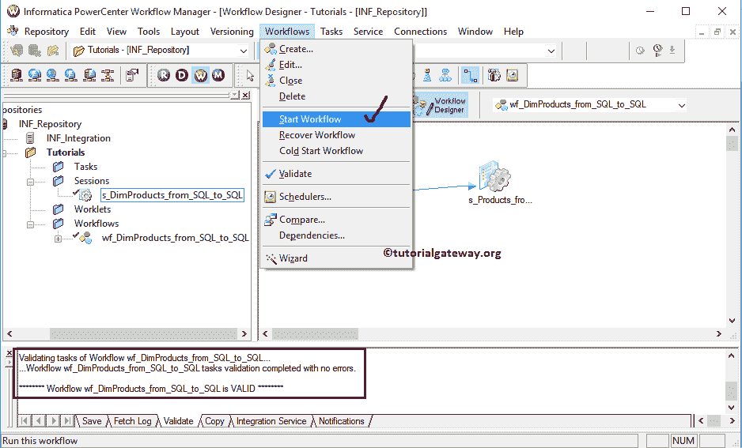

# Informatica 工作流

> 原文：<https://www.tutorialgateway.org/informatica-workflow/>

Informatica 工作流是一组指令，告诉 Informatica 集成服务如何运行一个或多个通过链接连接的任务。每个工作流都将从一个开始任务开始(默认情况下)。因此，当您启动工作流时，它将从开始任务开始执行，并一直持续到任务完成。Informatica PowerCenter 工作流管理器提供了两种创建方法。

*   手动创建Informatica 工作流
*   使用向导创建Informatica 工作流

在本文中，我们将通过一个示例向您展示如何手动创建 Informatica 工作流。要创建工作流，我们需要任务(会话或电子邮件)。在本例中，我们将使用已经创建的会话任务。

## 创建Informatica 工作流

在我们开始 Informatica 工作流演示之前，首先连接到 Informatica 存储库服务。为了连接存储库服务，我们必须提供[信息管理控制台](https://www.tutorialgateway.org/informatica-admin-console/)凭证。因此，请提供适当的用户名和密码，并点击连接按钮。

提示:请参考[Informatica 中的会话](https://www.tutorialgateway.org/session-in-informatica/)文章了解会话任务的创建，[可重用会话](https://www.tutorialgateway.org/reusable-session-in-informatica/)文章了解可重用 [Informatica](https://www.tutorialgateway.org/informatica/) 会话任务的创建

从下面的截图中，你可以观察到我们在任务开发者中。

要创建新的 Informatica 工作流，首先，我们必须转到工作流设计器选项卡。接下来，请导航到工作流菜单并选择创建选项。

提示:菜单栏中的工作流菜单只有在您处于工作流设计器部分时才可用。否则，它不会出现。

选择“创建”选项后，将打开一个名为“创建工作流”的新窗口。请提供唯一的名称、注释和您可以保留默认设置

注:在这里您还可以更改或删除现有的集成服务

一旦创建了 Informatica 工作流，就可以创建不可重用的会话。或者您可以使用已经创建的可重用会话。为了演示这两者，首先，我们拖动已经创建的可重用会话 s_DimProducts。请参考[Informatica](https://www.tutorialgateway.org/reusable-session-in-informatica/)文章中的[可重用会话，了解创建该会话所涉及的步骤。](https://www.tutorialgateway.org/reusable-session-in-informatica/)

接下来，我们删除了可重用会话并创建了新会话任务。请参考 Informatica 中的[会话，了解创建新会话所涉及的一系列步骤。](https://www.tutorialgateway.org/session-in-informatica/)

创建完会话任务后，我们已经链接了开始任务和会话任务。链接方式有两种:一是可以从工具栏中选择【链接任务】按钮，如下图

第二种方法，请到任务菜单栏，选择【链接任务】选项

从下面的截图中，您可以看到开始任务和会话任务之间的连接/链接。

一旦您在 Informatica 中完成了工作流的创建，我们必须在使用它之前验证任务。为此，请导航至Informatica 工作流菜单并选择验证选项。

从下面的截图中，可以看出我们的 Informatica 工作流程是有效的。现在，让我们通过导航到菜单并选择开始工作流选项来启动Informatica 工作流。

选择“启动工作流”选项后，将打开 PowerCenter 工作流监视器进行监视。从下面的截图中，您可以观察到我们的 Informatica 工作流执行时没有任何错误。

让我们打开 [SQL Server 管理工作室](https://www.tutorialgateway.org/sql-server-management-studio/)检查我们是否成功地将数据从 Adventure Works DW 传输到 Informatica 目标数据库。

