# 使用向导的信息工作流

> 原文：<https://www.tutorialgateway.org/informatica-workflow-using-wizard/>

在本文中，我们将通过一个例子向您展示如何使用向导创建 Informatica 工作流。请参考[信息工作流](https://www.tutorialgateway.org/informatica-workflow/)一文，了解手动创建[信息工作流](https://www.tutorialgateway.org/informatica/)所涉及的步骤

## 使用向导创建信息工作流

在开始使用向导创建 Informatica 工作流之前，首先使用 [Informatica 管理控制台](https://www.tutorialgateway.org/informatica-admin-console/)凭据连接到 Informatica 存储库服务。

要使用向导创建新的 Informatica 工作流，首先，我们必须转到工作流设计器选项卡。接下来，请导航到工作流菜单并选择向导选项。

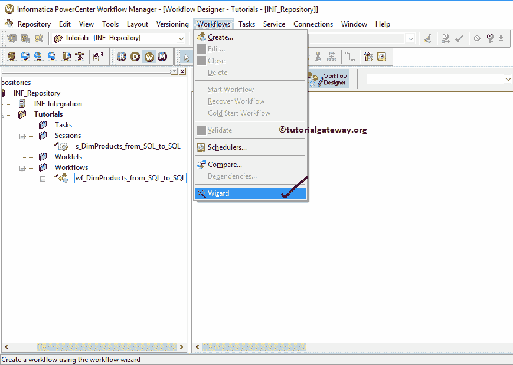

选择向导选项将打开一个名为工作流向导的新窗口。请提供唯一的名称、描述，并从下拉列表

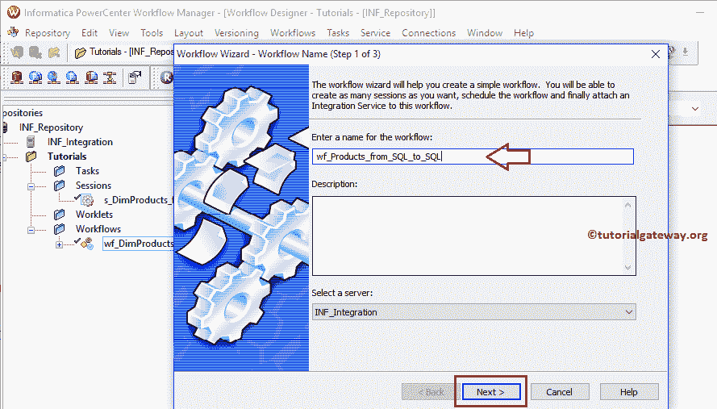

中选择集成服务

在步骤 2 中，我们必须从选择映射部分选择映射。

从下面的截图来看，我们只有一个映射。所以我们选择了它。选择映射后，单击>>按钮为所选映射创建会话

提示:请参考 [Informatica Mapping](https://www.tutorialgateway.org/informatica-mapping/) 文章，了解下面映射 m _ DimProducts _ from _ SQL _ to _ SQL

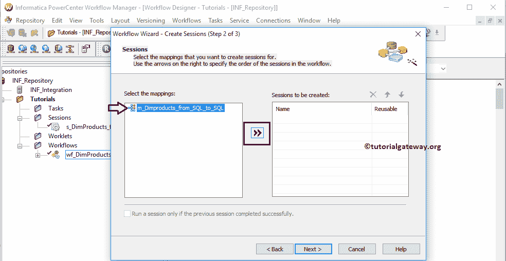

中的数据转换

单击>>按钮后，会自动创建会话任务。通过复选标记，可重用选项将使此会话成为可重用的会话任务。

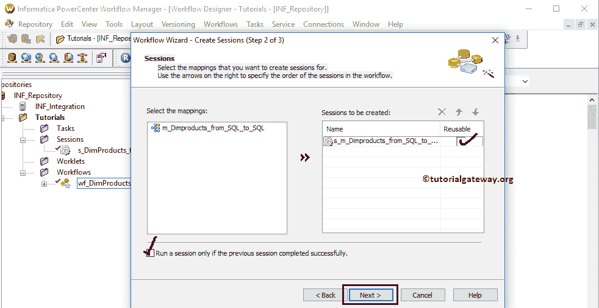

在步骤 2 中，我们必须安排工作流程。这里我们有三个运行选项:

*   按需运行:您必须按照您的要求启动工作流。
*   连续运行:工作流将连续运行。

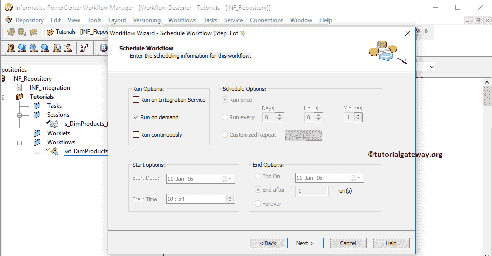

接下来，

在集成服务上运行:在这里，您可以选择安排工作流。例如，如果您想在每周一将数据从文本文件加载到 SQL 数据库，那么您可以将工作流安排在周一凌晨 1 点

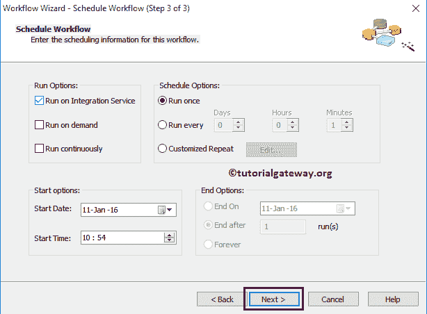

在我们点击完成按钮之前，检查一下细节。如果发现任何问题，请单击“上一步”按钮更改工作流程。

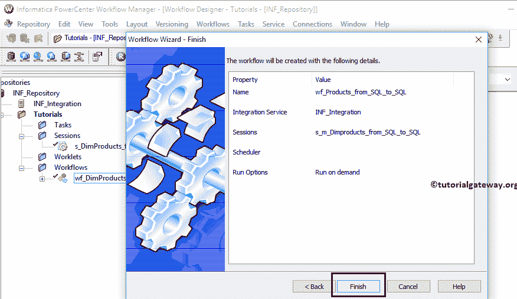

从下面的截图可以看到

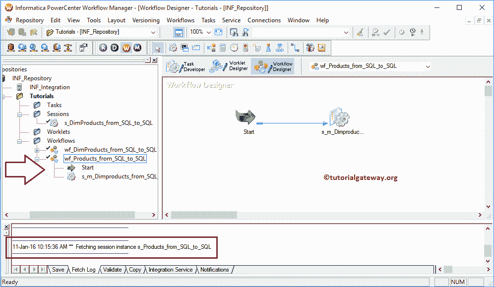

的新工作流程

使用向导创建完信息工作流后，我们必须验证任务。为此，导航至工作流菜单->验证选项。

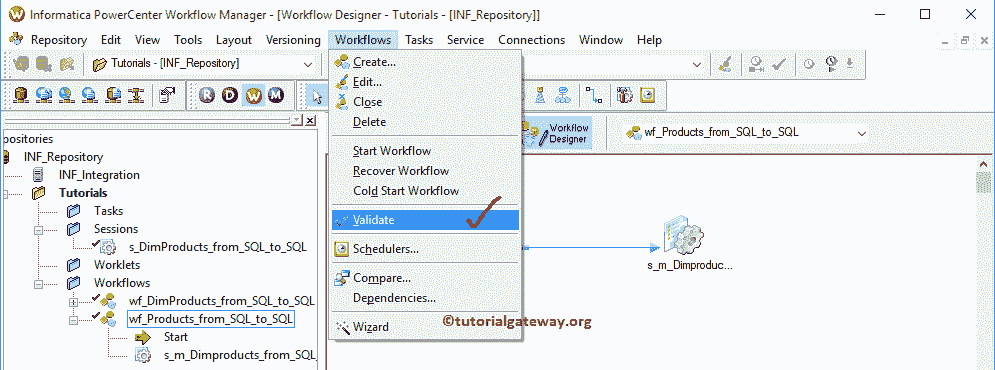

从下面的截图中，您可以看到我们的 Informatica 工作流是有效的。

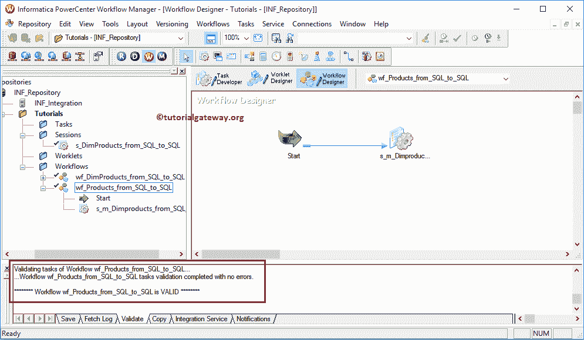

让我们通过选择启动工作流选项来启动信息工作流。

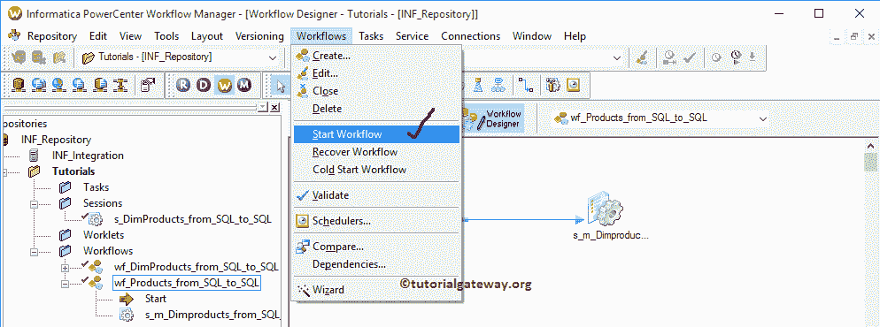

选择“启动工作流”选项后，Informatica PowerCenter 工作流监视器将打开以监视工作流。如您所见，工作流执行时没有任何错误。

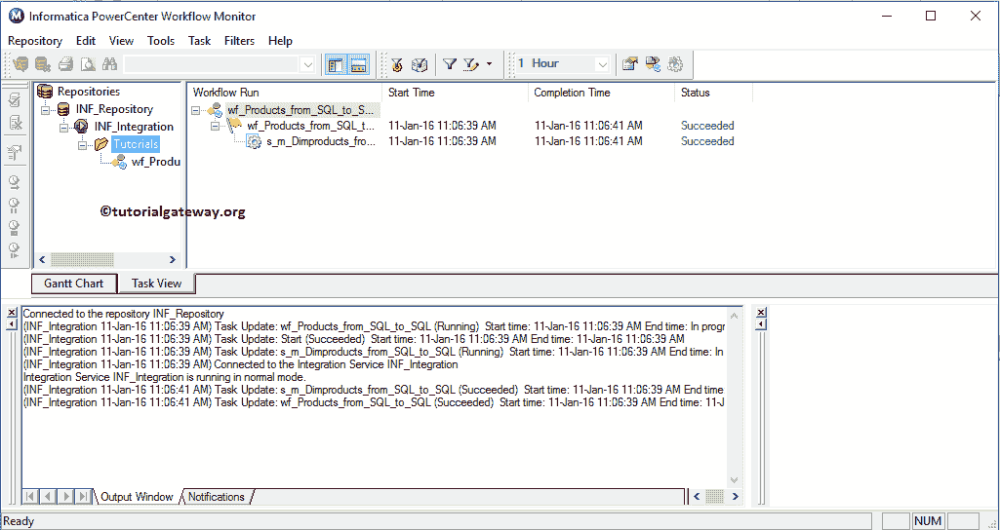

让我们打开 [SQL 管理工作室](https://www.tutorialgateway.org/sql/)来检查我们是否成功地将数据从 AdventureWorksDW 传输到目标 [SQL Server](https://www.tutorialgateway.org/sql/) 数据库。

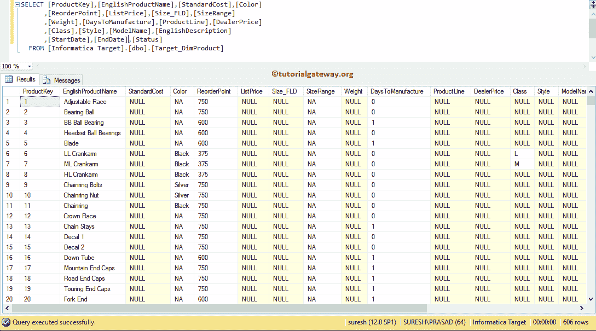