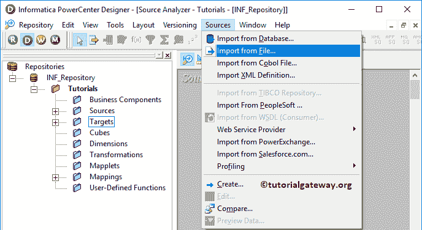
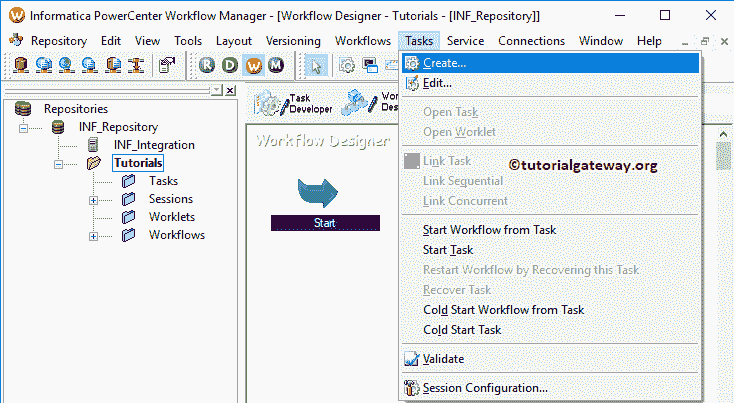

# Informatica 中的命令任务

> 原文：<https://www.tutorialgateway.org/command-task-in-informatica/>

Informatica 中的命令任务用于在工作流期间运行 Unix 或 Shell 命令。加载数据后，您可以使用此任务移动、复制或删除文件等。在本文中，我们将通过一个例子向您展示如何在 Informatica 中使用命令任务。

对于这个信息命令任务示例，我们将使用下面的显示文本文件数据(雇员表)。从下面的截图可以看到，Source 表有 15 条记录

目标表是员工文件。如你所见，这是一张空桌子

## 信息示例中的命令任务

在我们开始在 Informatica 中配置命令任务以将数据从平面文件加载到 [SQL Server](https://www.tutorialgateway.org/sql/) 之前。首先，让我连接[信息](https://www.tutorialgateway.org/informatica/)存储库服务。为此，我们必须提供[信息管理控制台](https://www.tutorialgateway.org/informatica-admin-console/)凭证。因此，请提供在[安装 Informatica](https://www.tutorialgateway.org/how-to-install-informatica/) 服务器时指定的适当用户名和密码。

### 步骤 1:为信息命令任务创建源定义

连接成功后，请导航至[源分析器](https://www.tutorialgateway.org/informatica-source-analyzer/)以定义您的源。如前所述，我们使用本地文件系统中的雇员表作为源定义。因此，请导航到“源”菜单并选择“从文件导入”..

选项T4】

选择“从文件导入”后..选项，将会打开一个名为“打开平面文件”的新窗口。请从本地文件系统中选择雇员. txt 文件，然后单击打开按钮。我建议您在下面的步骤中参考 Informatica 文章中的[平面文件源。](https://www.tutorialgateway.org/flat-file-source-in-informatica/)

从下面的截图可以观察到，可以在 Informatica

看到我们新创建的平面文件源

提示:在上一篇文章中，我们已经解释了导入文本文件的步骤。因此，请参考 Informatica 中的[平面文件源来理解。](https://www.tutorialgateway.org/flat-file-source-in-informatica/)

### 步骤 2:在信息中创建命令任务的目标定义

请导航至[目标设计器](https://www.tutorialgateway.org/target-designer-in-informatica/)以定义信息化命令任务目标。在这个例子中，我们使用现有的 SQL 表(雇员文件)作为我们的目标定义。可以参考[创建目标表](https://www.tutorialgateway.org/create-informatica-target-table-using-source-definition/)了解创建目标定义

的过程

### 步骤 3:在信息中为命令任务创建映射

要创建新映射，请导航到菜单栏中的映射菜单，并选择创建..选项。

选择“创建”后..选项，一个新的[映射](https://www.tutorialgateway.org/informatica-mapping/)名称窗口将会打开。让我提供 m_SQLEmp 作为映射名称，然后单击“确定”按钮。

将员工源定义从平面文件源文件夹拖放到映射设计器中。拖动源后，动力中心设计器会自动为您创建[源限定符转换](https://www.tutorialgateway.org/source-qualifier-transformation-in-informatica/)

接下来，将目标定义(员工文件)从目标文件夹拖放到映射设计器中。接下来，使用自动链接将源限定符与目标定义连接起来..选项。

在我们关闭映射之前，让我们保存映射，并通过转到映射菜单栏来验证映射，然后选择验证选项。

### 步骤 4:在信息中为命令任务创建工作流

在我们完成创建 Informatica 命令任务映射之后，我们必须为它创建工作流。PowerCenter 工作流管理器提供了两种创建工作流的方法。

*   [手动创建工作流](https://www.tutorialgateway.org/informatica-workflow/)
*   [使用向导创建工作流](https://www.tutorialgateway.org/informatica-workflow-using-wizard/)

在这个信息命令任务示例中，我们将手动创建工作流。为此，请导航至工作流菜单并选择创建选项。

它将打开“创建工作流”窗口。请提供唯一的名称(wf _ CommandEx)并保留默认设置。

一旦我们创建了工作流，下一步就是为我们的映射创建一个会话任务。

#### 步骤 4(a):在信息中为命令任务创建会话

Informatica 中有两种类型的会话:

*   [信息中不可重用的会话](https://www.tutorialgateway.org/session-in-informatica/)
*   [Informatica中的可重用会话](https://www.tutorialgateway.org/reusable-session-in-informatica/)

对于这个信息命令任务示例，我们创建了一个不可重用的会话。要创建不可重复使用的会话，请导航到任务菜单并选择创建选项。

请为此会话提供唯一的名称。在这里，我们将其命名为 s _ CommandEx。单击“创建”按钮后，将打开一个名为“映射”的新窗口。在这里，您必须选择要与此会话关联的映射，即 m _ CommandEx。

双击会话任务将打开编辑任务窗口。在映射选项卡中，我们必须配置源和目标连接。首先，让我们通过单击雇员文件来配置目标连接。

在连接中，点击关系类型旁边的箭头按钮，选择目标数据库(信息目标)

现在，我们必须配置源连接。请单击“来源”文件夹中的 SQ_Employee。

*   源文件目录:Informatica 将使用默认目录，但是您可以通过提供完整路径来更改目录。
*   来源文件名:它会自动检测。如果没有，请指定文件名和扩展名。

接下来，导航到工作流菜单并选择验证选项以验证信息命令任务工作流。

#### 步骤 4(b):在信息中创建一个命令任务

要创建信息命令任务，首先，转到任务开发人员选项卡。接下来，导航到任务菜单并选择创建选项。

选择“创建”选项后，将打开一个名为“创建任务”的新窗口。首先，选择命令任务，并为此任务提供唯一的名称，然后单击创建按钮。在这里，我们将其命名为 cmd_CopyFile。

点击创建按钮将为您创建一个命令任务

双击信息命令任务将打开以下窗口。在常规选项卡中，我们可以将命令任务重命名为更有意义的名称。请不要忘记提供任务的有效描述。

在属性选项卡中，有一个名为的属性:

*   如果此任务失败，则失败父项:请选中此选项。如果此命令任务失败，则工作流将失败。

在“命令”选项卡中，您必须提供将在此工作流中使用的命令。请点击新建按钮添加新命令

我们将该字段重命名为复制命令。接下来，点击箭头添加命令

它会打开一个空间来写你的命令。对于本例，我们使用复制命令将员工文件从源文件复制到目标文件

接下来，导航到工作流菜单并选择验证选项以验证工作流。

如果您观察工作流，首先，我们正在启动工作流。接下来，它将运行会话任务，将数据从文本文件加载到 SQL 表中。数据传输后，信息命令任务会将员工档案从来源复制到目标

现在，让我启动工作流。为此，请导航到“工作流”菜单并选择“启动工作流”选项。

让我们打开 [SQL Server 管理工作室](https://www.tutorialgateway.org/sql-server-management-studio/)，编写如下 [SQL](https://www.tutorialgateway.org/sql/) 查询。

现在，您可以在 Informatica 默认目标位置看到员工文件。

## 信息示例 2 中的命令任务

您也可以在信息会话任务中应用该功能，而不是创建单独的命令任务。让我从工作流中删除命令任务来演示相同的内容。

双击会话任务，并转到组件选项卡

*   会话前命令:该命令在会话前执行
*   会话后命令:该命令在会话完成后执行
*   会话后失败命令:如果会话任务失败，则执行该命令

在本例中，我们将创建一个必须在会话完成后(会话后)执行的命令。在类型下拉列表下，我们有三个选项。让我选择不可重用的命令

点击新建字段

接下来，点击箭头字段写一个命令

对于本例，我们使用移动命令将员工文件从源文件移动到目标文件

让我运行信息命令任务工作流，看看。如您所见，源文件夹

下没有员工

而目标文件夹中有这个员工档案

