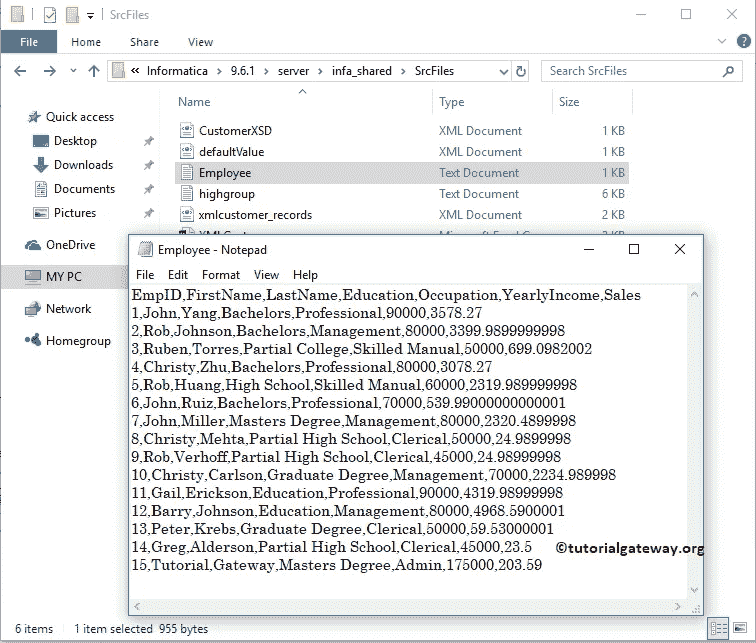
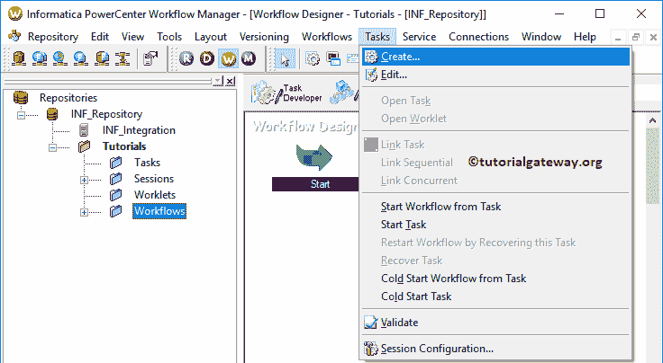

# Informatica 中的事件等待任务

> 原文：<https://www.tutorialgateway.org/event-wait-task-in-informatica/>

Informatica 中的事件等待任务将等待特定(或指定)事件的发生。您可以定义此事件等待任务应该等待的事件。

例如，您可以创建一个事件来检查员工源文件(文本或 CSV)在源位置是否可用。意思是，Informatica 事件等待任务会等待 Employee，一旦找到，任务就会成功，下一个任务就会执行。

对于这个Informatica 事件等待任务示例，我们将使用下面的显示文本文件数据(雇员表)。从下面的截图可以看到，Source 表有 15 条记录

目标表是员工文件。如你所见，这是一张空桌子

## Informatica示例中的事件等待任务

在我们开始在 Informatica 中配置事件等待任务以将数据从文本文件加载到 [SQL Server](https://www.tutorialgateway.org/sql/) 之前。首先，让我连接[信息](https://www.tutorialgateway.org/informatica/)存储库服务。

为此，我们必须提供[Informatica管理控制台](https://www.tutorialgateway.org/informatica-admin-console/)凭证。因此，请输入您在[安装 Informatica](https://www.tutorialgateway.org/how-to-install-informatica/) 服务器时给出的用户名和密码，并单击连接按钮。

### 步骤 1:在Informatica中为事件等待任务创建源定义

连接成功后，请导航至[源分析器](https://www.tutorialgateway.org/informatica-source-analyzer/)以定义您的源。如前所述，我们使用本地文件系统中的雇员表作为我们的源定义。

提示:在上一篇文章中，我们已经解释了导入文本文件的步骤。因此，请参考 Informatica 中的[平面文件源来理解。](https://www.tutorialgateway.org/flat-file-source-in-informatica/)

### 步骤 2:在Informatica中为事件等待任务创建目标定义

请导航至[目标设计器](https://www.tutorialgateway.org/target-designer-in-informatica/)定义目标。在这个例子中，我们使用现有的 SQL 表(雇员文件)作为我们的目标定义。可以参考[创建Informatica 目标表](https://www.tutorialgateway.org/create-informatica-target-table-using-source-definition/)了解创建目标定义

的过程

### 步骤 3:在 Informatica 中为事件等待任务创建映射

要创建新映射，请导航至菜单栏中的[映射](https://www.tutorialgateway.org/informatica-mapping/)菜单，并选择创建..选项。让我提供 m_EventWait 作为映射名称，然后单击“确定”按钮。

将员工源定义从平面文件源文件夹拖放到映射设计器中。它会自动为您创建[源限定符转换](https://www.tutorialgateway.org/source-qualifier-transformation-in-informatica/)

接下来，将目标定义(员工文件)从目标文件夹拖放到映射设计器中。接下来，使用自动链接将源限定符与目标定义连接起来..选项。

在我们关闭映射之前，让我们保存映射，并通过转到映射菜单栏来验证映射，然后选择验证选项。

### 步骤 4:在 Informatica 中为事件等待任务创建工作流

创建完Informatica 事件等待任务映射后，我们必须为其创建工作流。PowerCenter 工作流管理器提供了两种创建工作流的方法。

*   [手动创建工作流](https://www.tutorialgateway.org/informatica-workflow/)
*   [使用向导创建工作流](https://www.tutorialgateway.org/informatica-workflow-using-wizard/)

在此Informatica 事件等待任务示例中，我们将手动创建工作流。为此，请导航至工作流菜单并选择创建选项。

它会打开“创建工作流”窗口。请提供唯一的名称(wf_EventWait)并保留默认设置。

一旦我们创建了工作流，下一步就是为我们的映射创建一个会话任务。

#### 在Informatica中为事件等待任务创建会话

Informatica 中有两种类型的会话:

*   [Informatica中不可重用的会话](https://www.tutorialgateway.org/session-in-informatica/)
*   [Informatica 中的可重用会话](https://www.tutorialgateway.org/reusable-session-in-informatica/)

对于这个Informatica 事件等待任务示例，我们创建了一个不可重用的会话。要创建不可重复使用的会话，请导航到任务菜单并选择创建选项。

请为此会话提供唯一的名称。在这里，我们将其命名为 s_EventWait。单击“创建”按钮后，将打开一个名为“映射”的新窗口。选择要与此会话关联的映射，即 m_EventWait。

在映射选项卡中，我们必须配置源和目标连接。首先，让我们通过单击源文件夹中的 SQ_Employee 来配置源连接。

*   源文件目录:Informatica 将使用默认目录，但是您可以通过提供完整路径来更改目录。例如，D:\文件示例\
*   来源文件名:它会自动检测。如果没有，请指定文件名和扩展名。

现在我们必须配置目标连接。因此，首先，选择目标文件夹中的雇员文件。接下来，在连接中，点击关系类型旁边的箭头按钮，选择Informatica 目标

#### 在Informatica中创建事件等待任务

要创建事件等待任务，请导航到任务菜单并选择创建选项。

选择“创建”选项后，将打开一个名为“创建任务”的新窗口。

首先，从下拉列表中选择Informatica 事件等待任务。接下来，为此任务提供一个唯一的名称，并单击“创建”按钮来创建新的事件等待。在这里，我们将其命名为 WaitFor_TestFile。

双击事件等待任务将打开以下窗口。在常规选项卡中，我们可以将事件等待任务重命名为更有意义的名称。请不要忘记提供任务的有效描述。

如果此任务失败，则失败父项:请选中此选项。如果此Informatica 事件等待任务失败，则工作流将失败。

在Informatica 事件等待任务事件选项卡中，我们有两个选项:

*   预定义:如果选择此选项，则必须定义事件
*   用户定义:您必须选择现有事件

如您所见，如果您选择用户定义的事件，它将打开事件浏览器。因为 w 没有任何现有事件，所以它显示一个空窗口。

在本例中，我们选择了预定义的选项，并提供了雇员文本文件的路径。意思是，事件等待任务将等待一个员工文本文件(在该位置)，一旦找到，任务将成功

接下来，导航到工作流菜单并选择验证选项以验证工作流。如果您观察到Informatica 事件等待任务工作流，首先，我们正在启动工作流。接下来，它等待雇员文件(事件等待任务)，如果找到，会话任务将从文本文件加载数据到 SQL 表。

在开始运行工作流之前，让我从源位置删除雇员文本文件。

现在，让我启动Informatica 事件等待任务工作流。为此，请导航到“工作流”菜单并选择“启动工作流”选项。

正如您所看到的状态，工作流正在无限运行。

在位置添加员工文本文件后，工作流将会成功。

让我们打开 [SQL Server 管理工作室](https://www.tutorialgateway.org/sql-server-management-studio/)，编写如下 [SQL](https://www.tutorialgateway.org/sql/) 查询。

