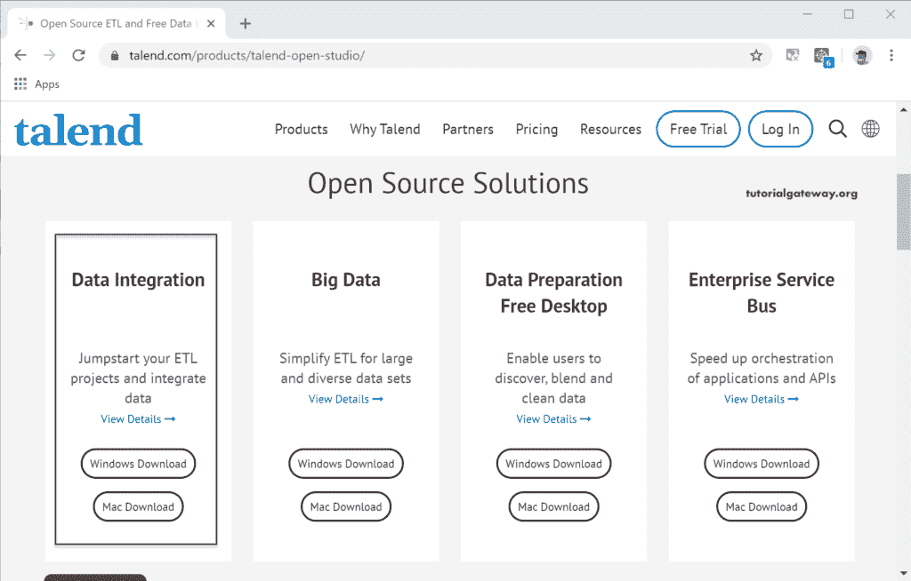

# 下载并安装 Talend

> 原文：<https://www.tutorialgateway.org/talend-download-and-install/>

在本节中，我们将解释下载和安装 Talend open studio 所需的步骤。

要下载 Talend，请到官网选择数据集成工具。根据设备的不同，您可以选择 talend 下载选项。我的在 Windows 中，所以我选择了 Talend Windows 下载选项。

[Talend](https://www.tutorialgateway.org/talend-tutorial/) 数据集成工具是一个开源的 ETL 工具。您可以使用这个工具来获得数据集成的实践经验或创建自己的项目。

默认情况下，Talend 数据集成工具下载在 zip 存档中。请使用任何软件解压文件。

让我打开解压后的文件夹，看看软件里面的文件。要开始使用该应用程序，请单击我在下图中标记的文件。

双击该应用程序后，将打开以下安装 Talend 映像。请点击我接受按钮。有些情况下会出现一些错误，这意味着您的机器中没有安装 Java。或者安装的 Java 版本不匹配(32 位和 64 位)。如果没有，请打开命令提示符并检查您安装的(如果有)Java，尝试从官方网站安装。

这是一个你可以创建新项目的页面。如您所见，有三种选择。

*   创建一个新项目:该选项将使用空文本框中给定的指定名称创建一个新项目。
*   重要演示项目:使用此安装选项导入由 Talend 提供的演示。
*   重要的现有项目:使用此选项导入已经创建的当前项目。

因为我安装了一个新的副本，所以我的机器上没有安装任何现有的副本。所以我选择了创建一个新项目选项，并指定了一个名为 TutorialGateway 的名称。“管理连接”按钮可帮助您管理连接选项。让我点击这个按钮向你展示可用的选项。

从下图中可以看到，您可以更改名称描述、用户电子邮件 ID 和工作区位置。默认情况下，Talend 将选择默认工作区来保存文件或项目文件。但是，您可以通过单击三点按钮来更改位置。“删除现有项目”按钮将帮助您删除现有的。现在，我们保留所有默认值，因此单击“确定”按钮。

请等待软件开发工具包组件加载完毕。

当您第一次打开 Talend open studio 时，它将快速浏览用户界面，以熟悉组件。

它是一个仓库

设计工作区

配置选项卡

调色板〔t0〕〔t1〕T2〕

默认情况下，安装 talend 后，它将向您显示一个示例演示作业。你也可以跑去看看结果。

