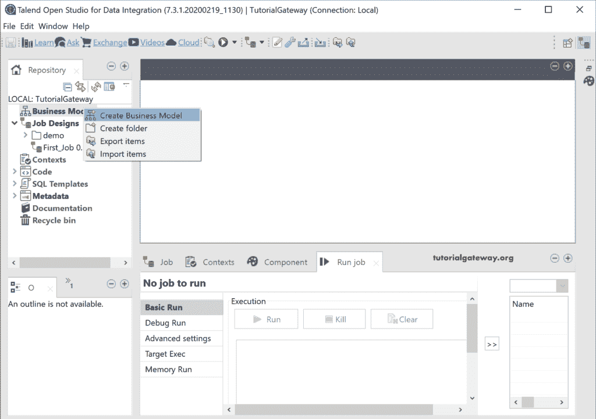
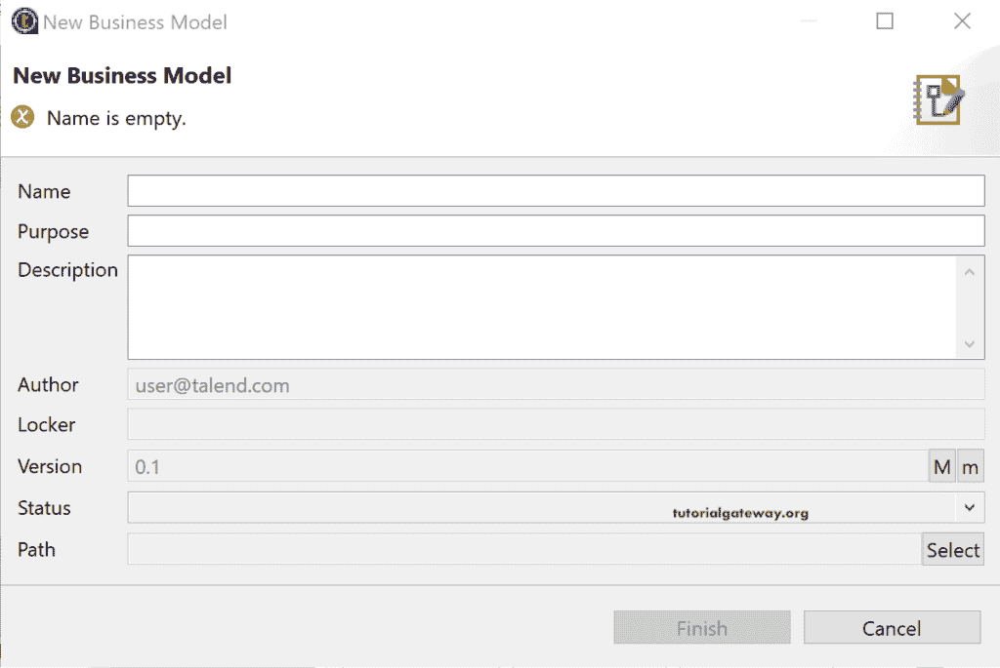
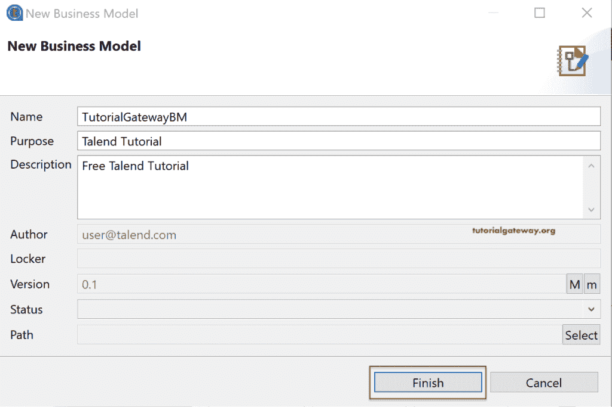
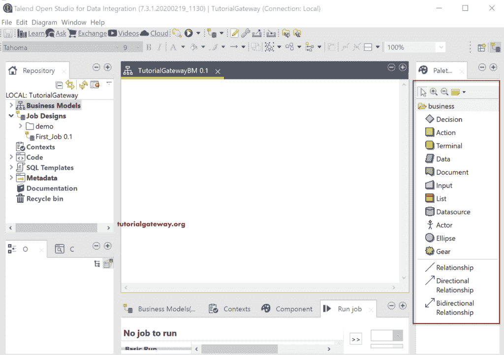
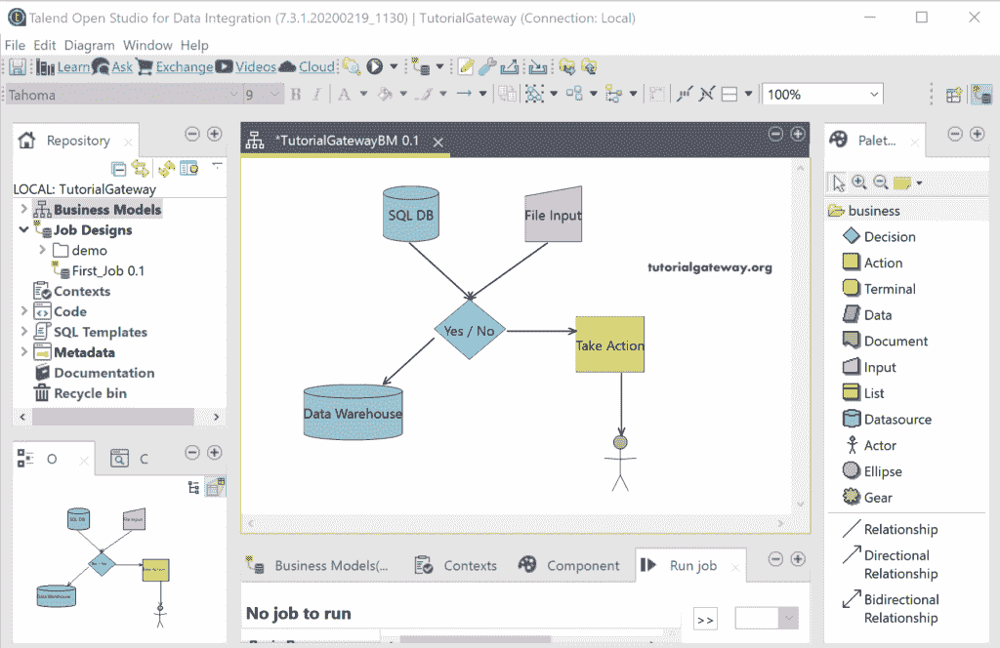
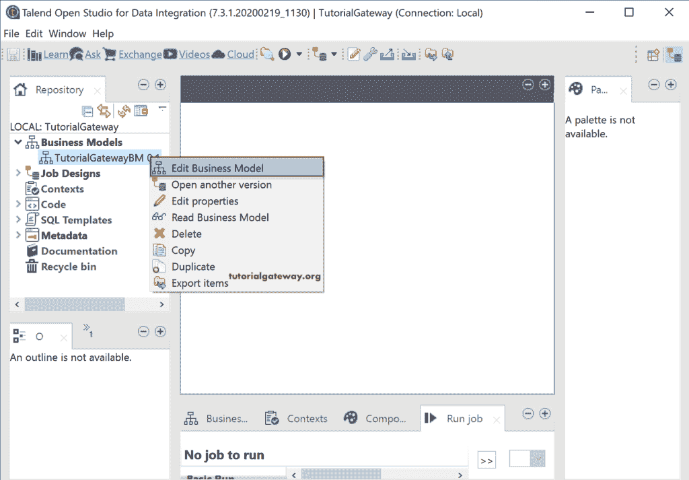
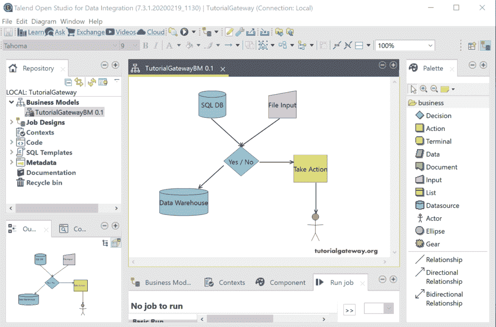
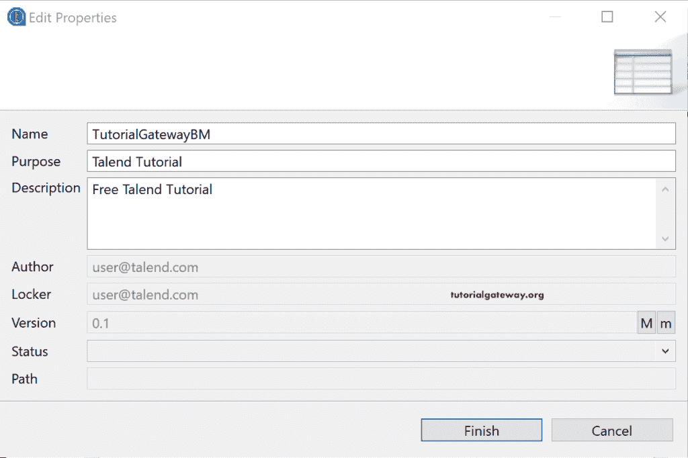

# 创建 Talend 业务模型

> 原文：<https://www.tutorialgateway.org/create-a-talend-business-model/>

Talend 业务模型是项目流(数据流)的图形表示，有助于员工理解项目的需求。一般来说，我们不会在 Talend 中创建业务模型，因为我们使用第三方工具来设计或解释业务流程。

要创建业务模型，右键单击存储库中的业务模型文件夹，并从上下文菜单中选择创建业务模型选项。或者您有一个现有的业务模型，您可以使用导入项目选项导入该模型。如果要导出创建的业务模型，可以使用“导出项目”选项进行导出。

## 创建 Talend 业务模型

如果我们选择创建业务模型选项， [Talend](https://www.tutorialgateway.org/talend-tutorial/) 将打开以下新业务模型窗口。

*   名称:指定业务模型的名称。
*   目的:创建此模型的目的。
*   描述:写一个商业模式的简要描述。

让我填充这三个文本框，然后单击“完成”按钮。

正如您从下面的截图中看到的，在调色板部分下有一个选项列表，可用于创建业务模型或业务流程。每个组件都显示了使用该图像的目的。

让我创建一个简单的 talend 业务模型，它接受来自 SQL 数据库和文件输入的数据。根据该决定，数据将流向数据仓库或参与者采取的进一步行动。

一旦您创建了一个业务模型，您就可以右键单击它来改变流程。下面的屏幕截图显示了上下文菜单中可用的选项。“编辑业务模型”选项有助于改变业务流程(添加或删除组件)。

Talend 业务模型是项目流(数据流)的图形表示，有助于员工理解项目的需求。

请选择“编辑属性”选项，使用以下窗口更改属性。

