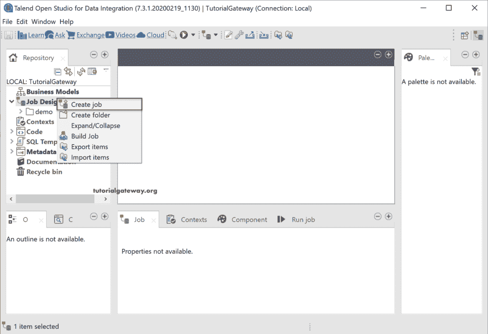
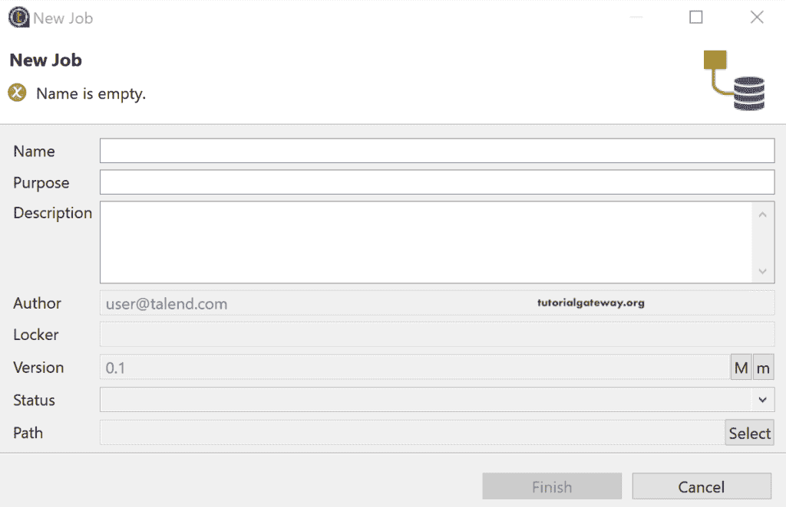
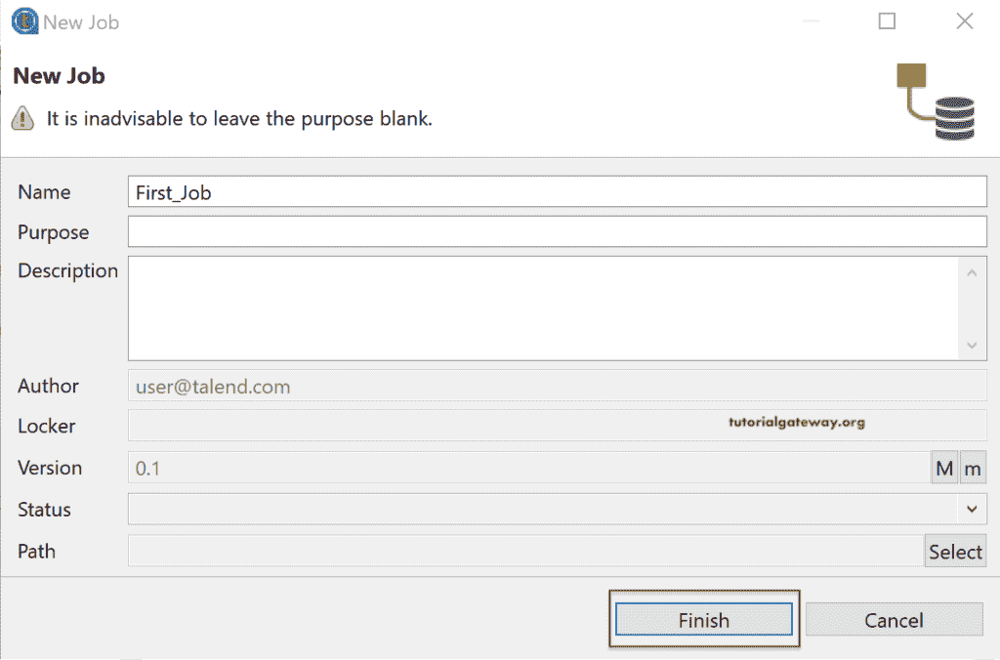
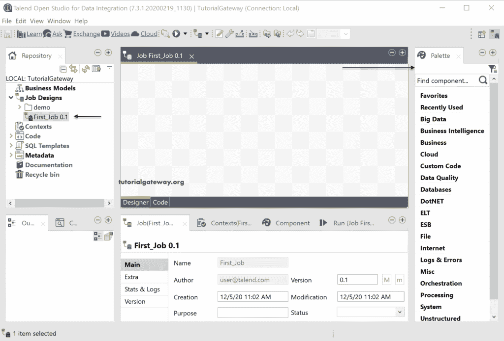
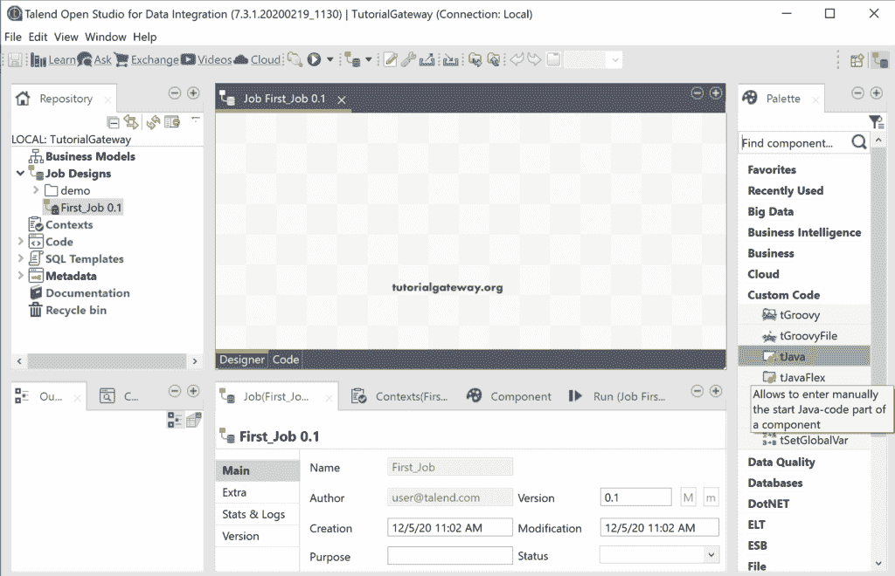
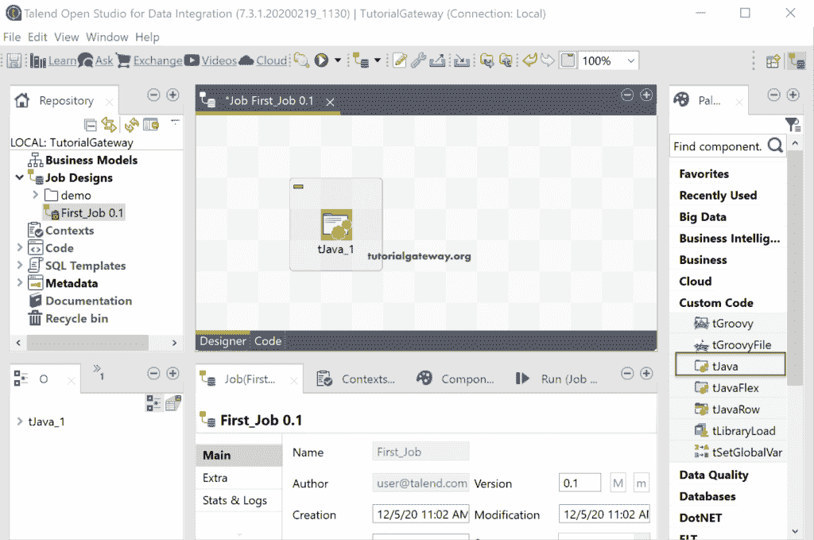
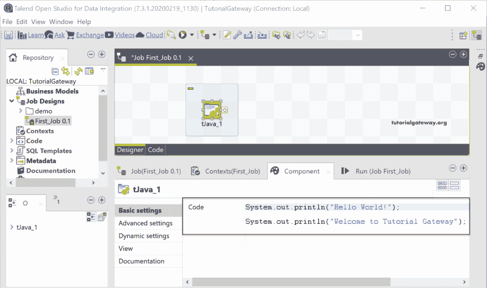
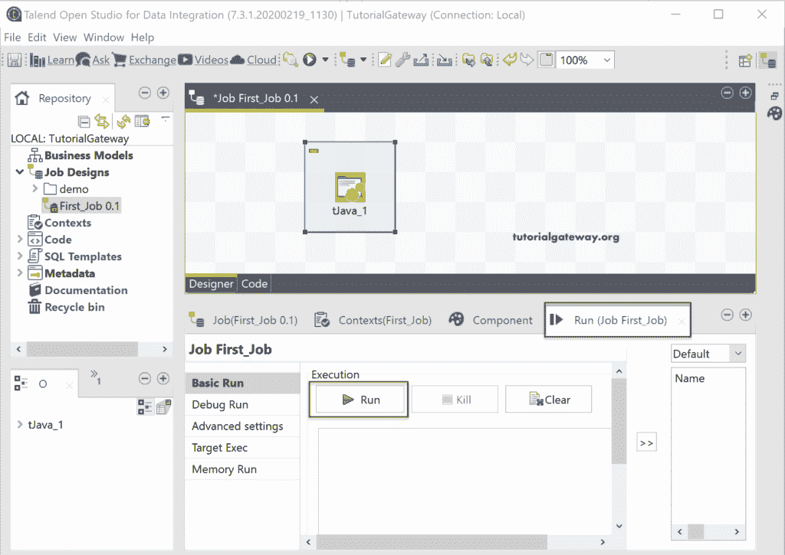
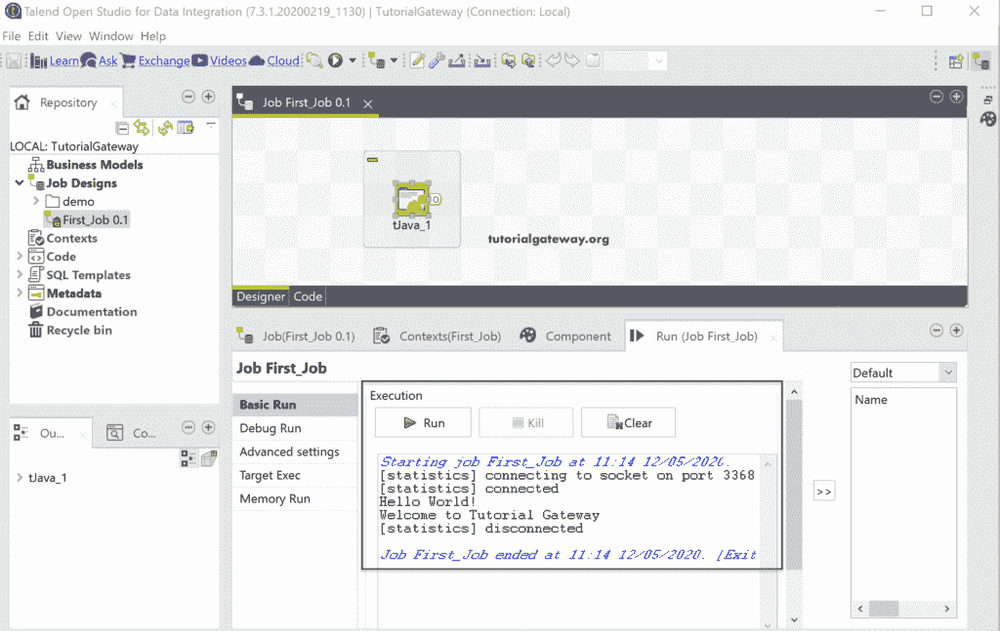

# 创建 Talend 作业

> 原文：<https://www.tutorialgateway.org/create-a-talend-job/>

Talend 作业是我们设计工作或执行转换的地方。创建 Talend 作业允许您使用或访问可用的 Talend 组件，如连接、转换(字段)和输出。因此，Talend Job 可以帮助您从不同的来源获取输入，执行一些操作(转换)，并将其存储在所需的输出中，这是一个完整的 ETL 操作。

## 如何创建 Talend 作业？

要创建 Talend 作业，请右键单击存储库中的作业设计文件夹，并从上下文菜单中选择创建作业选项。或者，如果要导出创建的作业，可以使用“导出项目”选项来完成。如果您有一个现有作业或预构建作业，您可以使用导入项目选项导入该作业。在这里，创建文件夹会创建一个新文件夹来帮助划分作业。



单击创建作业选项将打开以下新作业窗口。

*   名称:指定唯一的作业名称。
*   目的:设计或创建此 Talend 作业的目的。
*   描述:写一个工作功能的简短描述。



我们将名称命名为 First_Job，将目的和描述留空(不建议实时使用)。



现在，您可以在存储库作业设计部分看到我们新创建的作业。



为了演示 Talend 作业设计的完整过程，我们使用了一个名为 tJava 的简单自定义代码字段。



将 tJava 字段从托盘拖放到作业设计空间。在作业选项卡中，您可以看到作业名称、作者、创建和修改的日期和时间、版本等。上下文选项卡可用于或使用此 Talend 作业的本地和全局上下文。



“组件”选项卡是我们主要为任何转换或字段工作的选项卡。这里，我们使用一个简单的打印行语句来打印两条消息。请参考 [Java 教程](https://www.tutorialgateway.org/java-tutorial/)页面了解 Java。我们在下图中使用的代码是

```
System.out.println("Hello World!");

System.out.println("Welcome to Tutorial Gateway");
```



您可以通过单击运行选项卡中的运行按钮或单击工具栏中的播放按钮来运行此作业。



从下面的截图可以看到， [Talend](https://www.tutorialgateway.org/talend-tutorial/) 作业运行成功，也可以看到消息！。

