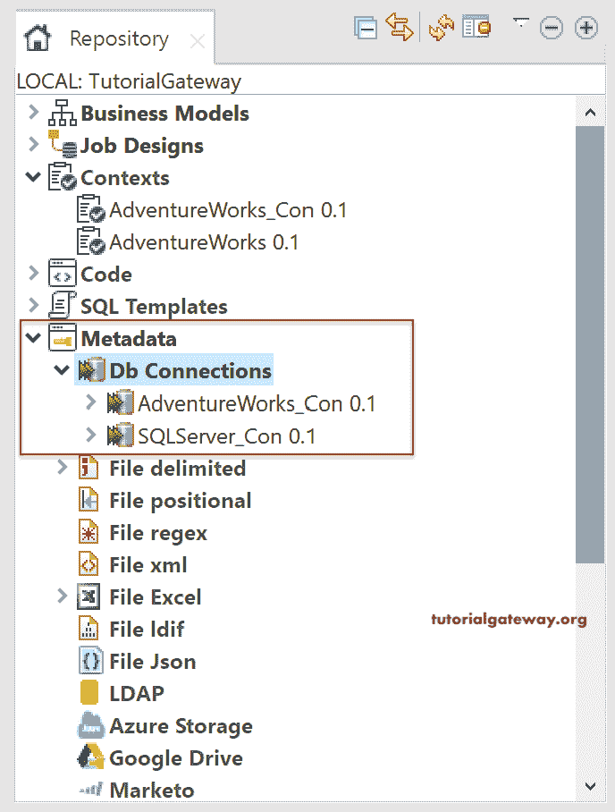
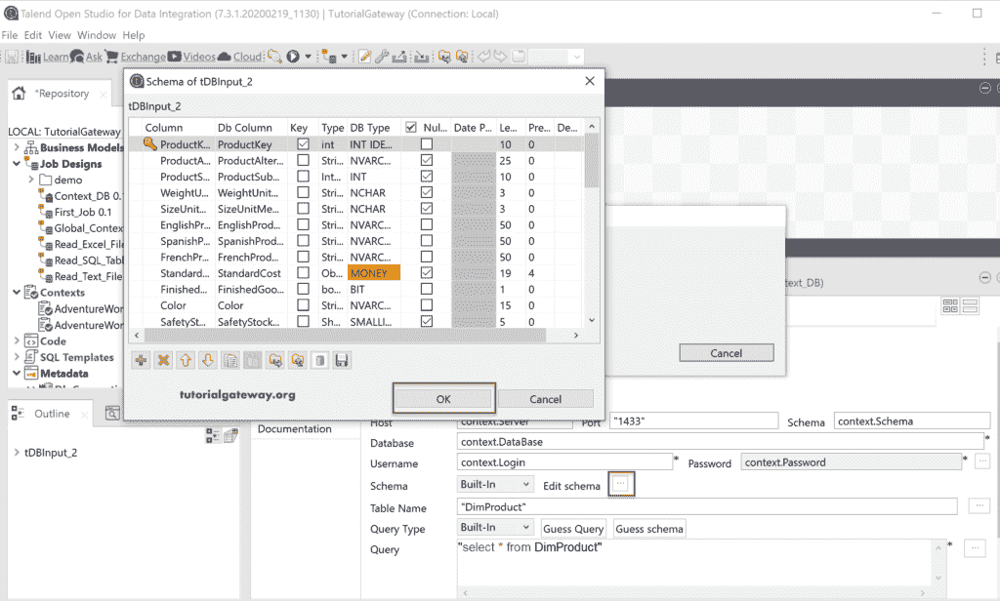

# 在 Talend 创建全局上下文分组

> 原文：<https://www.tutorialgateway.org/create-a-global-context-group-in-talend/>

本节通过多个示例展示了如何在 Talend 中创建全局上下文分组。Talend 上下文分组有两种类型:本地上下文分组和全局上下文分组。本地上下文分组属于我们创建的作业。但是，Talend 全局上下文分组可以在多个作业中使用。例如，您可以创建一个 Talend 上下文分组来存储所有数据库连接。然后，您可以在连接到该数据库所需的所有作业中使用它们。

Talend 全局上下文分组概念简单明了，而且最强大。在实时中，它在作业设计中起着重要的作用，因为文件路径、数据库连接等。，不同于开发和生产。因此，一旦您将 Talend 项目移动到生产环境中，您就必须在作业中更改这些值。这不是一个可行或明智的选择，如果您有全局上下文分组，那么您可以在这个地方进行更改，它将更新所有作业。

## 创建 Talend 全局上下文分组示例

要在 Talend 中创建全局上下文分组，请右键单击上下文文件夹，然后从上下文菜单中选择创建上下文分组。

单击“创建上下文分组”选项将打开以下窗口。请填写上下文分组名称、此上下文分组的用途以及上下文分组变量的简要描述。

此 [Talend](https://www.tutorialgateway.org/talend-tutorial/) 页面允许您添加上下文变量、类型及其值。

我们已经从下面的截图中添加了登录、密码、服务器( [SQL Server](https://www.tutorialgateway.org/sql/) 实例名)、数据库和数据库模式。这些变量有助于在 SQL Server 普拉萨德实例中建立与 AdventureWorks 2014 数据库的连接。

现在，您可以看到新创建的 Talend 全局上下文分组。右键单击它可以编辑或删除该组。

## 创建全局上下文分组的第二种方法

在 Talend 中还有另一种创建全局上下文分组的方法。创建连接时，可以将该设置导出为上下文分组。在这个例子中，我们向你展示了同样的东西。

首先，右键单击数据库连接，并从上下文菜单中选择创建连接。我们已经解释了[连接 Talend 到 SQL Server](https://www.tutorialgateway.org/connect-talend-to-sql-server/) 文章中的所有选项，所以请参考相同的内容。

“创建连接”选项将打开以下窗口。让我将名称指定为 AdventureWorks_Con，并保留剩余的空白，然后单击“下一步”按钮。

在第二页中，我们将填写连接 AdventureWorksDW 2014 所需的所有详细信息。

在单击“完成”按钮之前，单击“导出为上下文”按钮。此按钮在许多地方都可用，无论您单击哪里，它都将帮助您将所有值导出到上下文分组。

单击导出为上下文按钮将打开以下窗口。请选择创建新的存储库上下文以创建 Talend 全局上下文分组。您可以选择第二个选项来重用现有的选项。

请为此 Talend 上下文分组分配一个唯一的名称。

从下面的截图中，您可以看到 Talend 导入的所有上下文变量。在这里，您可以将默认上下文环境从默认更改为生产环境或其他环境，以指定此环境的设置。

单击“完成”按钮完成创建 Talend 全局上下文分组。

单击“完成”按钮创建数据库连接。

从下面的截图中，您可以看到我们在本文中创建的两个上下文分组以及新的 Db Connection。

### 在 Talend 作业中使用全局上下文分组

请拖放桌面并选择数据库作为微软服务器。下图显示了需要填充的选项。

接下来，转到上下文选项卡添加上下文变量或组。您在此选项卡中添加的任何内容都属于此作业，我们称之为本地上下文分组。这也是我们可以从存储库中添加 Talend 全局上下文分组的地方。因此，让我将全局上下文分组从存储库拖到这个选项卡。

从下图中，您可以看到连接到 Adventure Works 数据仓库所需的上下文变量。

请键入上下文，后跟一个点，然后单击控制+空格按钮来显示建议。我建议你给每个属性分配适当的值。如果仔细观察，我们选择了 DimProduct 作为表名，方法是键入该名称并写下 [select 语句](https://www.tutorialgateway.org/sql-select-statement/)来选择所有产品。接下来，我们单击猜测模式按钮来提取模式。

另一个选项是将模式从内置类型更改为存储库，并使用浏览按钮选择表名。

这里，我们使用的是内置模式，因此单击“浏览”打开以下窗口，检查该表中的模式或列。请使用此窗口根据您的要求更改列的位置。

让我添加一个增长，并使用表模型和运行 Talend 全局上下文分组作业。从下面，您可以看到表的输出。

