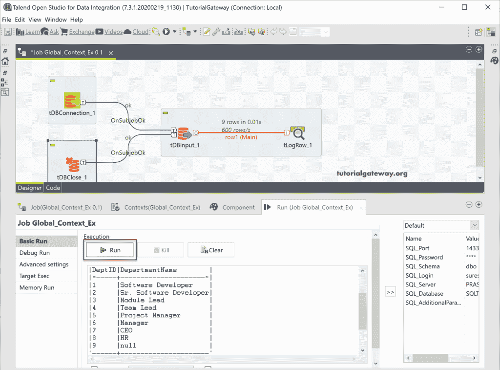

# 使用上下文分组将Talend连接到数据库

> 原文：<https://www.tutorialgateway.org/connect-talend-to-db-using-context-group/>

在本节中，我们将展示如何使用上下文分组以实用的方法将 Talend 连接到 Db 或 Database。使用上下文分组将 Talend 连接到数据库或数据库是最好的方法。因为，一旦移动了项目生产，就必须更改这些 Talend 上下文变量来连接生产数据库。

在我们开始将 Talend 连接到 DB 之前，让我向您展示可用上下文分组的列表。请参考[创建上下文分组](https://www.tutorialgateway.org/create-a-global-context-group-in-talend/)一文了解上下文分组。

## 使用上下文分组将数据库连接到数据库

请将 [Talend](https://www.tutorialgateway.org/talend-tutorial/) tDBConnection 从调色板拖放到作业设计中。

在“连接组件”选项卡中，请选择 Microsoft SQL Server 作为数据库类型，然后单击“应用”按钮。

接下来，将 SQLTEST_Con 上下文分组从存储库中拖放到上下文选项卡中。从下面的 Talend 截图中，您可以看到该全局上下文分组中的所有值。

请转到组件选项卡填写所有详细信息，以建立与 SQL 数据库的连接。请用上下文分组变量填充主机、数据库、用户名、密码和模式值。要访问每个上下文变量，必须使用 context.variable_name 或 type context。和 ctrl+空格。它将显示所有可行的上下文变量。

接下来，将 tDBClose、tDBInput 和 tLogRow 从调色板拖放到作业设计中。

右键单击 TDB 连接并选择触发器，然后选择在子作业上确定并将其加入 TDB 输入。这意味着一旦与 SQL Server 建立了连接，它将转到下一个子作业。

在我们连接 DBConnections 和 tDBInput 之前，您必须指定您正在使用的服务器。我的意思是，我们还没有选择数据库特定的 tDBInput，所以，首先，我们必须选择数据库类型。

您可以从下面的截图中看到，我们选择了数据库作为[微软 SQL Server](https://www.tutorialgateway.org/sql/) 。接下来，选中使用现有连接选项，并选择我们在 tDBConnection 字段中创建的 tDBConnection_2。

接下来，将 Talend 模式从内置更改为存储库，并单击浏览按钮选择模式或表。单击浏览按钮打开以下窗口，我们选择了部门表。

通常，它会为选定的表生成查询。如果没有，请单击猜测查询按钮。

接下来，用表模式连接 tDBInput 主行。

请转到 tDBClose 组件选项卡，选择 Microsoft SQL Server 作为数据库，并从组件列表中选择现有的连接名称。通常，我们使用 tDBCommit 组件，它具有相同的属性和一个紧密连接选项。tDBCommit 用于提交数据库中的更改，在这里，我们只是从表中读取记录或行。所以，tDBClose 会做这项工作，它也帮助我们引入了一个新的领域。

右键单击 TDB 连接并选择触发器，然后选择在子作业上确定并将其加入 TDB 输入。接下来，右键单击 tDBInput 并选择触发器，然后选择在子作业上确定，并将其加入 tDBClose 或 tDBCommit。

让我运行这个使用上下文分组作业将 Talend 连接到数据库或数据库，并查看。哦！我们得到一个错误，说服务器主机名为“SQLTEST”。主机名表示服务器名，即 Prasad 和 SQLTEST 是数据库名。我想我在给 tDBConnection 组件分配上下文变量时犯了一个错误。

从下面的截图中，您可以看到我们修复了所有问题。

现在，您可以从部门表中看到记录。

