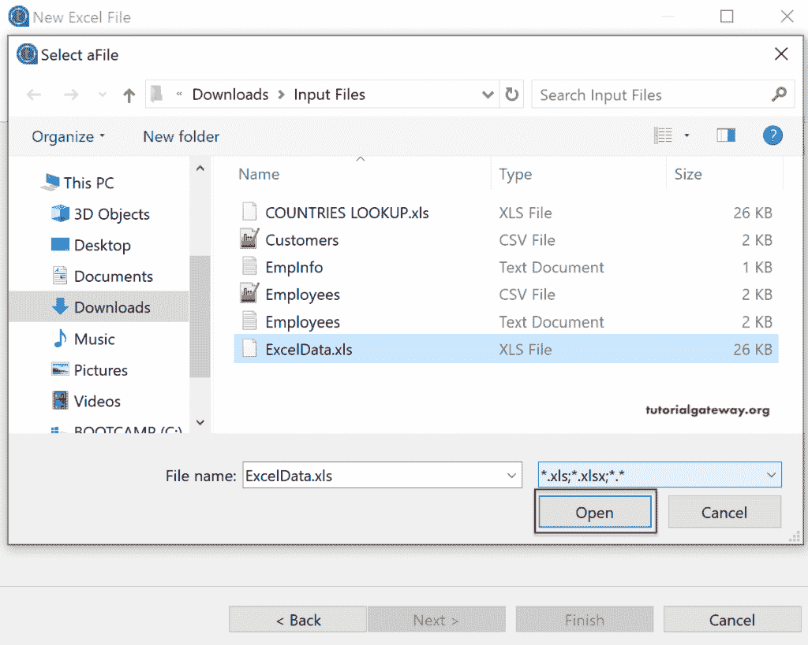

# 在 Talend 中读取 Excel 文件

> 原文：<https://www.tutorialgateway.org/read-excel-file-in-talend/>

在本节中，我们将通过一个例子展示如何在 Talend 中读取 Excel 文件。下面的 Talend 截图显示了您想要读取的 Excel 文件中的数据。

## 人才读取 excel 文件示例

要读取 Talend 中的 Excel 文件，必须在“文件 Excel”文件夹下创建元数据。为此，右键单击文件 Excel 将打开上下文菜单。请从中选择创建文件 Excel 选项或使用导出项目选项导出 Excel 元数据。

单击创建文件 Excel 选项，打开下面的新建 Excel 文件窗口。请填写文件名、创建目的以及文件内数据的简要描述。

在步骤 2 中，单击“浏览”按钮选择要加载到 Talend 中的 Excel 文件。请记住，如果您的数据或 excel 文件是 2007 格式，请勾选“读取 excel2007 文件格式(xlsx)

这里，我们选择的是 ExcelData.xls 文件。

选择所需的 Excel 文件后，您可以看到工作表数据和 Excel 文件中的可用工作表。在这里，你可以根据自己的要求选择床单。我们的 Excel 文件只有一张，所以我们选择了相同的。

在步骤 3 中，我们有很多选择。

*   文件设置:默认情况下，Talend 将选择编码；否则，从下拉列表中选择一个。如果您的 excel 文件有千位或十进制分隔符，请选中复选框并指定相同的分隔符。
*   要跳过的行:如果有任何要跳过或忽略的行，可以选择位置(页眉行或页脚行)，然后指定要跳过的行数。例如，如果标题中有列名，则必须跳过第一行(标题= 1)。如果您将存储详细信息等文件信息作为页脚，则选择页脚，并跳过这些行。
*   元数据列设置:指定元数据信息(列名)。请指定它是在第一列还是最后一列。
*   行数限制:如果您的文件有数百万条记录，并且您想将它们限制在 100，000 条，请使用此限制选项，并指定数量。

请选中将标题行设置为列名，然后单击刷新预览按钮。我们这样做是因为我们的第一列有列名。如果您注意到“要跳过的行”部分，它会自动选中“标题”选项并为其指定 1。

在步骤 4 中，为该 Excel 元数据分配唯一的名称。接下来，检查数据类型、长度和数据模式(如果有)，然后单击“完成”按钮。

现在，您可以在文件 Excel 文件夹下看到 Excel 元数据。

有两种方法可以在 Talend 作业中使用此 excel 数据。第一个是拖放 tFileInputExcel 并选择属性类型作为存储库。

如果属性类型是内置的，那么您必须手动选择 excel 文件。此过程用于在不创建元数据的情况下读取 Talend 中的 excel 文件。

理想的方法是使用我们之前创建的 [Talend](https://www.tutorialgateway.org/talend-tutorial/) 元数据。因此，将 Excel 文件夹中的 Excel 数据拖放到作业设计中。

它将打开以下窗口。如果您将此元数据用作输入，则选择 tFileInputExcel，要将其用作输出(目标文件)，请选择 tFileOutputExcel。

现在，您可以看到 tFileInputExcel 组件选项卡中的属性已经填充了元数据信息。

这里，我们想在 tLogRow 中显示 excel 文件输出。因此，从 Talend tFileInputExcel 中拖动 Main 行，并将其放到空白位置。它会自动打开一个文本框来输入字段名。在这里，我们输入了 tLog，它显示了所有可能的匹配。

在这里，我们选择了表预览。

让我们运行 Talend 读取 Excel 文件作业。

你可以看到结果。

请参考[将数据从 Excel 加载到数据库](https://www.tutorialgateway.org/load-excel-data-into-database-in-talend/)一文将此文件加载到数据库中。