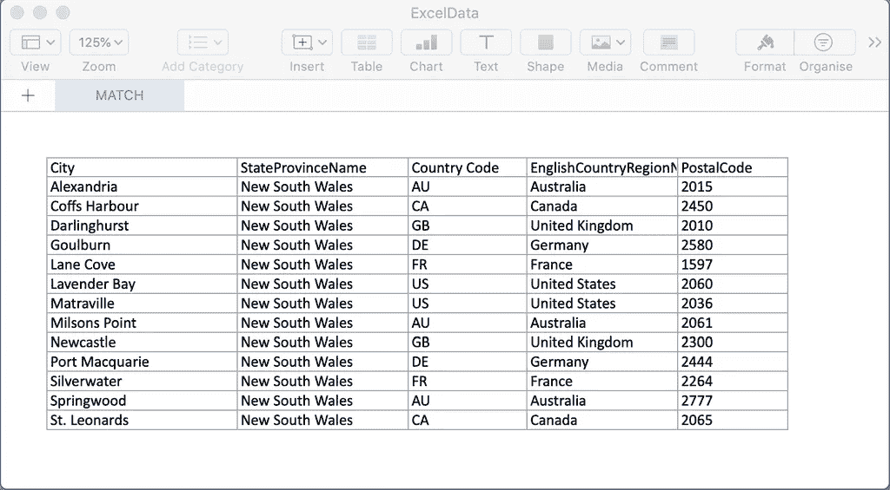
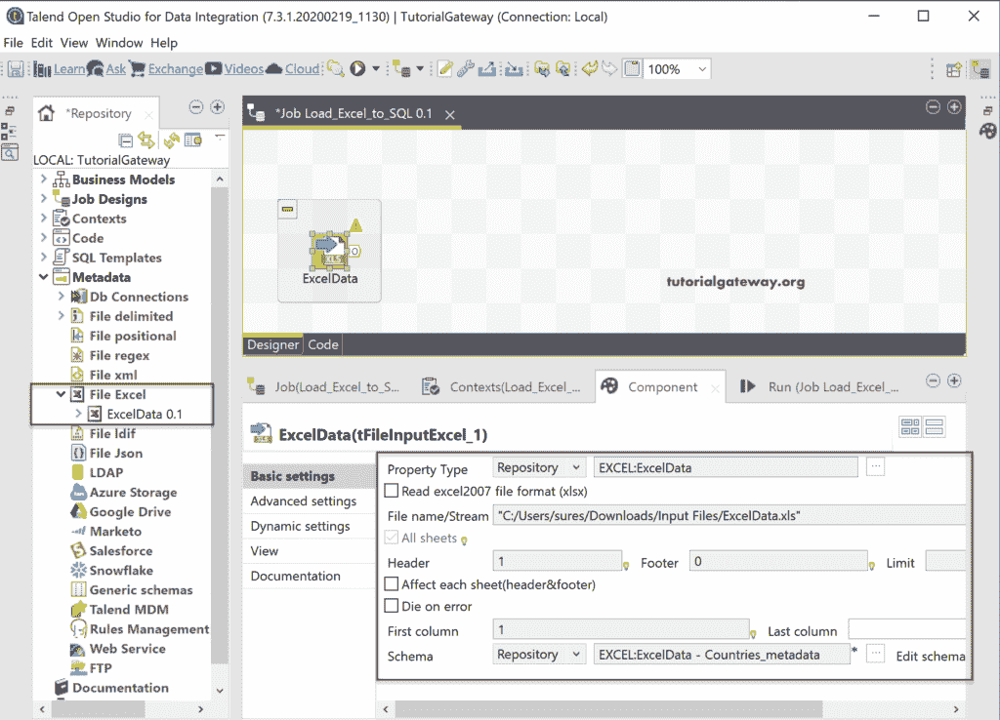
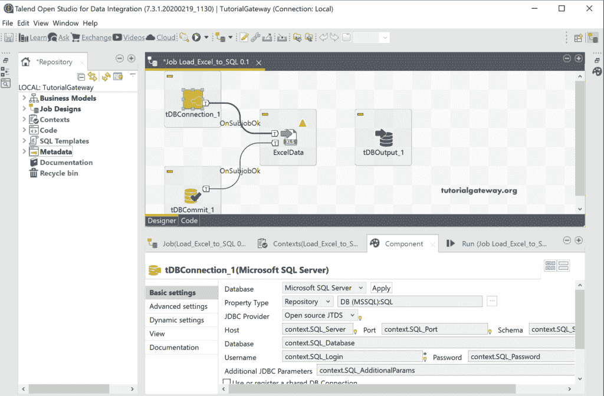
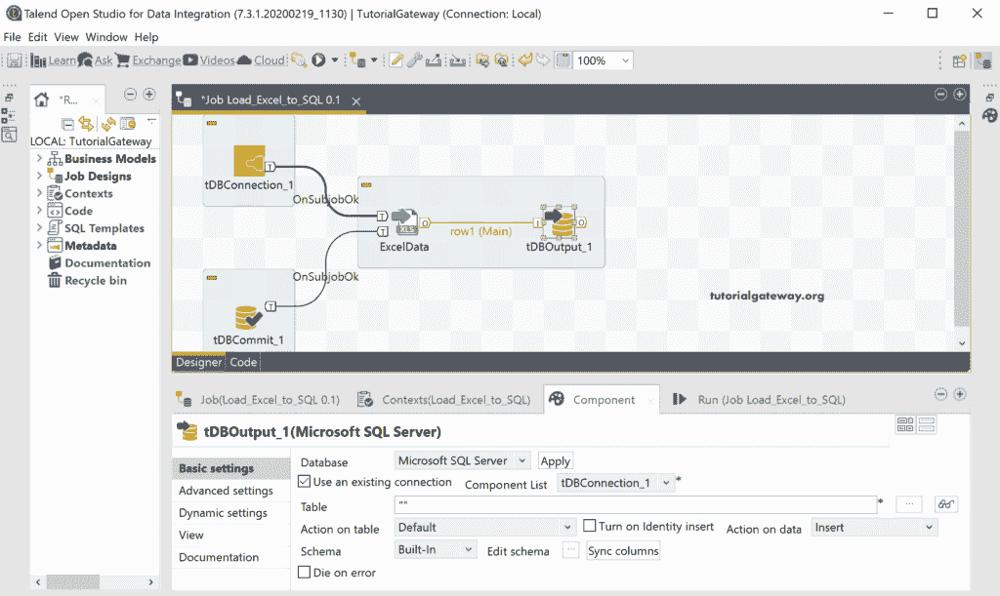
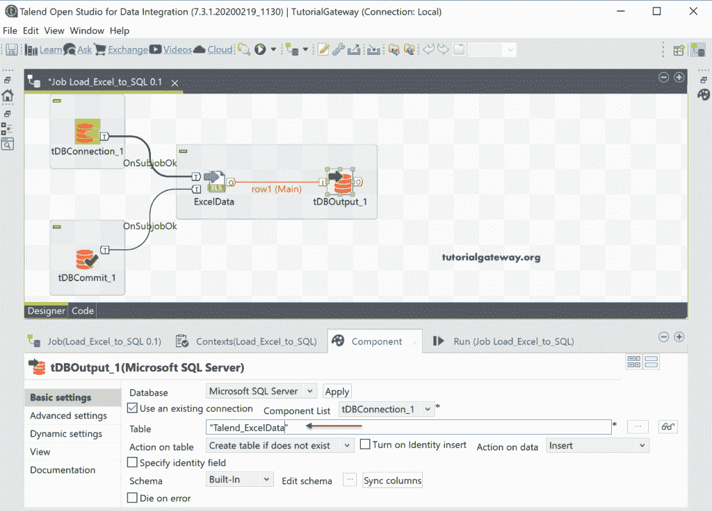
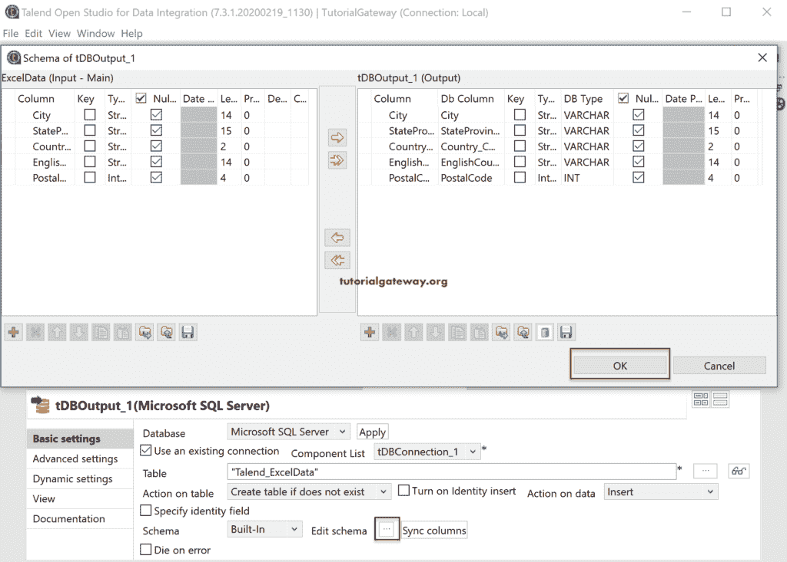
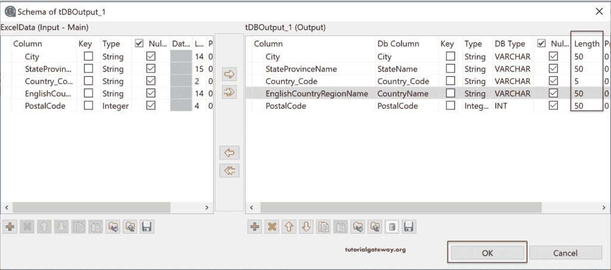
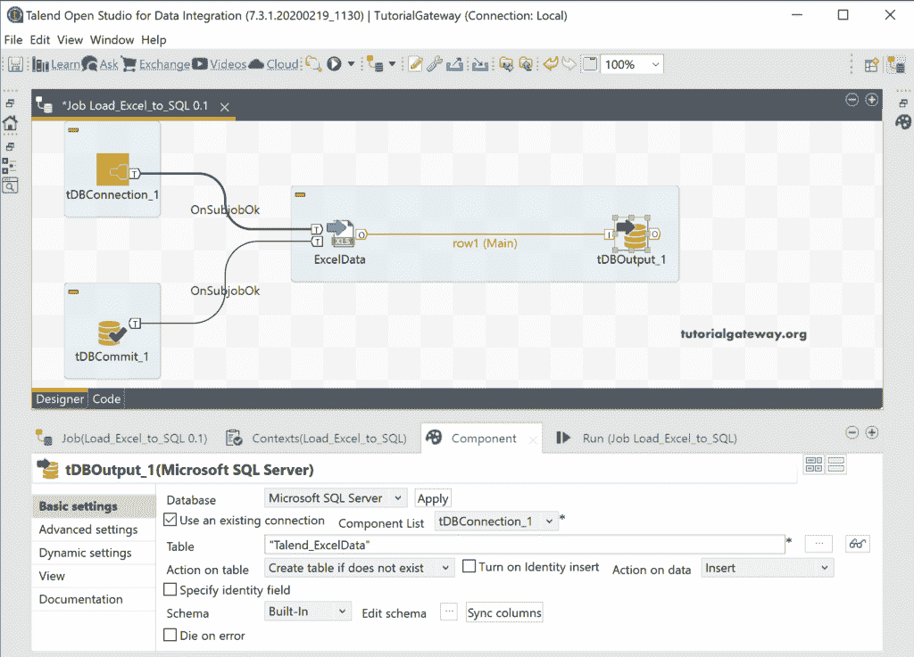
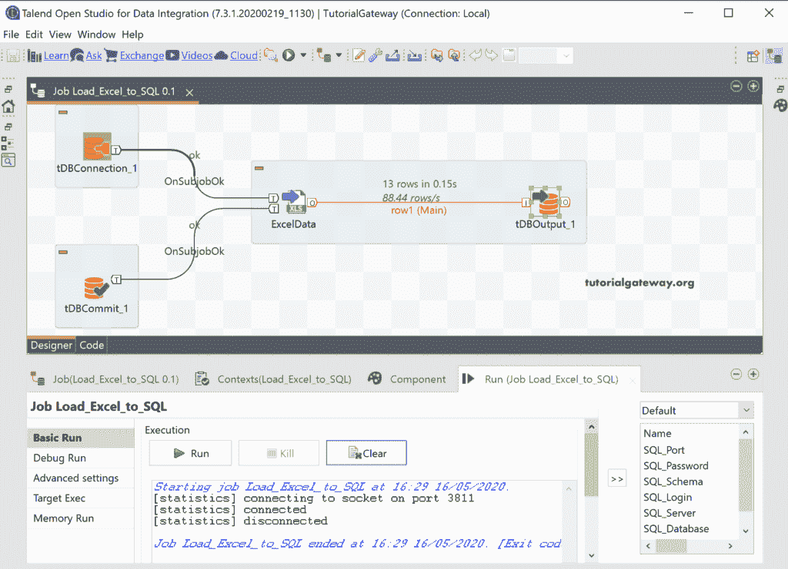
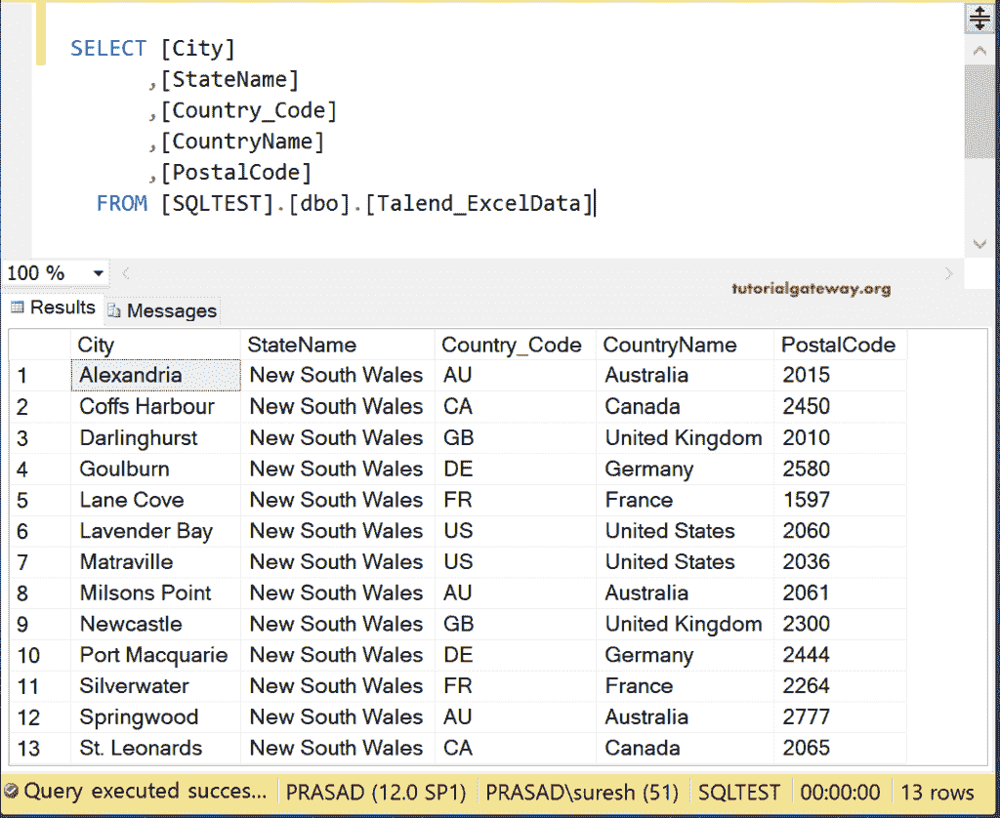

# 在 Talend 中将 Excel 数据加载到数据库

> 原文：<https://www.tutorialgateway.org/load-excel-data-into-database-in-talend/>

在本章中，我们将展示如何将 excel 数据加载到数据库表中。在 Talend 中，可以通过两种方式将 excel 文件加载到数据库表中。

*   拖放 tFileInputExcel 并浏览 Excel 文件，并为其创建一个架构。
*   创建元数据并使用现有的 Excel 元数据。

在这个例子中，我们使用已经存在的元数据作为 Excel 源。下图显示了 Excel 文件数据。

首先，将 Excel 数据从文件 Excel 文件夹拖放到 [Talend](https://www.tutorialgateway.org/talend-tutorial/) 作业设计中。

接下来，将 tDBOutput 从调色板拖放到设计空间。在这里，您还可以选择数据库特定输出。然而，为了显示通用选项，我们选择了 tDBOutput。

在“组件”选项卡中，您可以选择连接设置，也可以从存储库中选择连接。

首先，我们选择[微软 SQL Server](https://www.tutorialgateway.org/sql/) 作为数据库，点击应用按钮。接下来，将 ExcelData 行连接到 DBOutput。然后，我们使用现有的连接。

这里，我们使用 Talend_ExcelData 作为目标 SQL 表名。如果这个表不存在，我们就创建它。

通过单击“法令模式”按钮，请在运行作业之前检查输入和输出的模式。

我们改变了每一列的长度，以便它们能够适应通用输入。

在将 excel 数据加载到数据库之前，请检查所有 Talend 设置。

让我们来做这项工作。

让我打开 [SQL 管理工作室](https://www.tutorialgateway.org/sql-server-management-studio/)，检查 Talend 作业是否将 excel 数据加载到数据库中。

