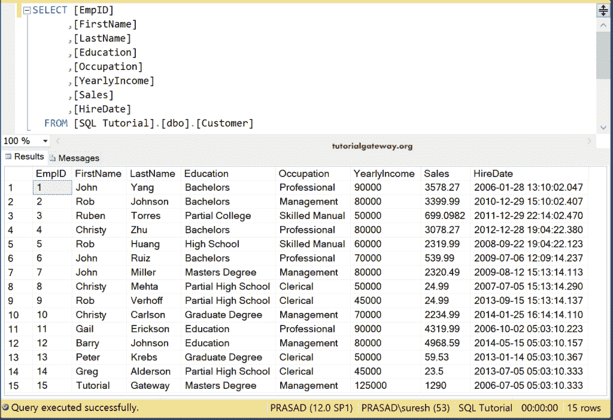

# 在 Talend 中将数据库表导出到 Excel

> 原文：<https://www.tutorialgateway.org/export-database-table-to-excel-in-talend/>

在本节中，我们将通过一个示例展示如何使用 tFileOutputExcel 将数据库表导出到 Talend 中的 Excel。对于这个 tFileOutputExcel 演示，我们使用的是 SQL Database 表，这个表里面的数据是

## Talend 将数据库表导出到 Excel 文件示例

从下面的 Talend 图像中，您可以看到我们建立了一个 [SQL](https://www.tutorialgateway.org/sql/) 连接，并使用 DBInput 选择了 Customer 表。

接下来，从调色板中拖放 tFileOutputExcel 输出字段。从工具提示中可以看到，Talend tFileOutputExcel 在微软 Excel 文件中逐行写入单元格。

请将数据库输入源连接到 tFileOutputExcel。下面的截图显示了 Talend tFileOutputExcel 组件选项卡中的可用选项列表，用于将数据库表导出到 Excel 文件。

*   写 excel2007 文件格式(xlsx)–它以 2007 格式写入输出。
*   包含标题:是否要包含标题名称？
*   追加现有文件:是否要将数据追加到现有文件中？
*   更改字体样式。
*   您希望通过选中旁边的框来自动调整一列或几列的大小吗？

默认情况下，tFileOutputExcel 字段选择默认位置和 out.xls 作为文件名。请单击浏览(…)按钮选择现有文件或创建新的 Excel 文件。这里，我们在输出文件目录中创建客户。

接下来，我们选择字体作为快递新。

并将所有列定义为自动调整大小选项。

你可以在下面的截图中看到我们为这个例子选择的所有选项。

接下来，点击编辑模式按钮，检查 [Talend](https://www.tutorialgateway.org/talend-tutorial/) tFileOutputExcel 模式。

让我运行 Talend tFileOutputExcel 作业，看看我们是否将数据库表导出到 Excel 文件。

您可以看到由 Talend tFileOutputExcel 作业生成的输出文件。

