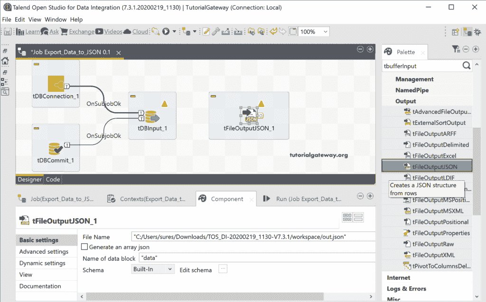
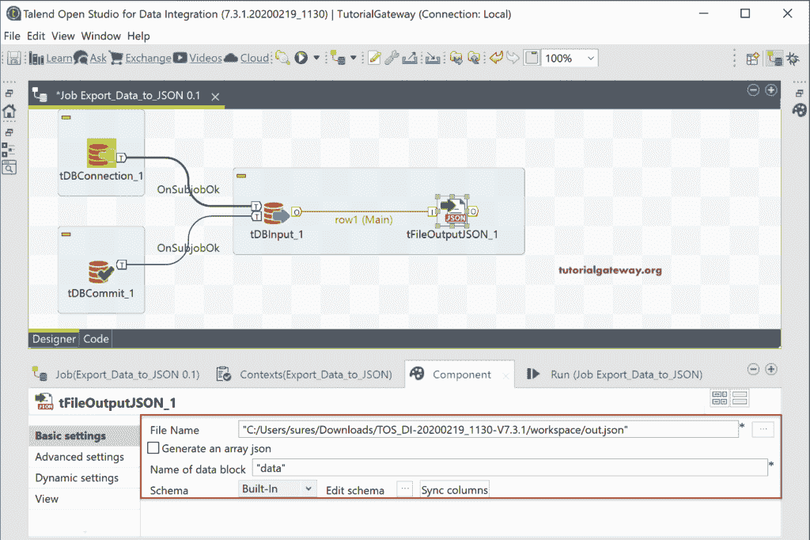
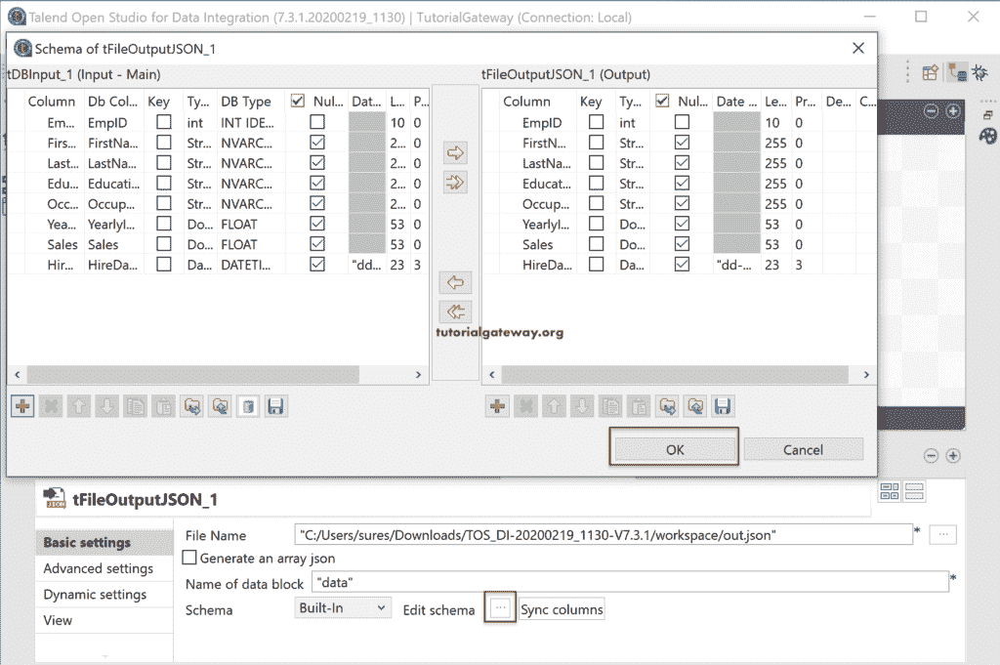
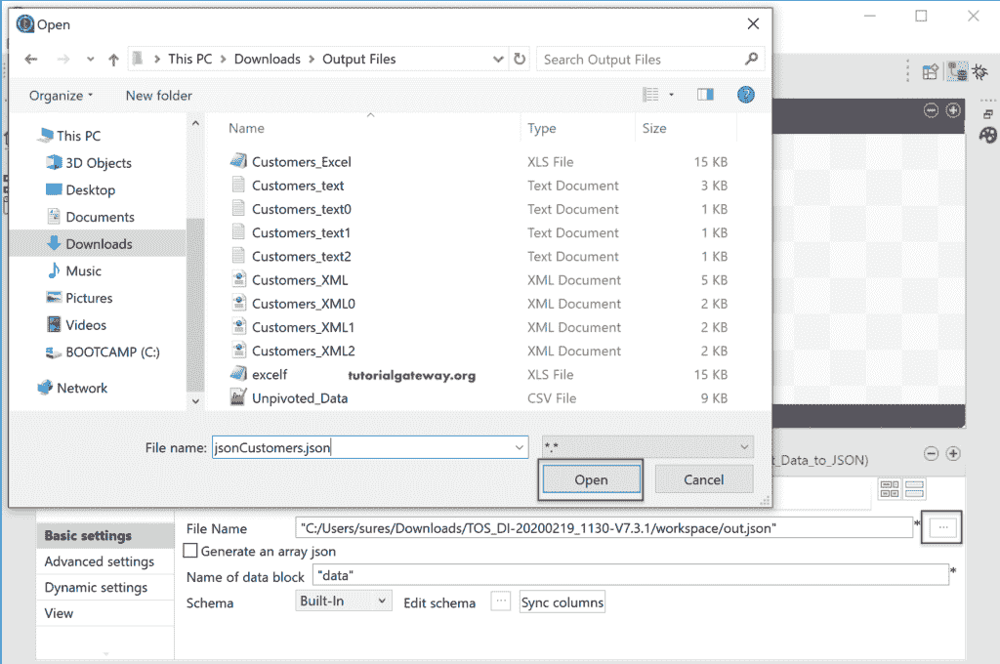
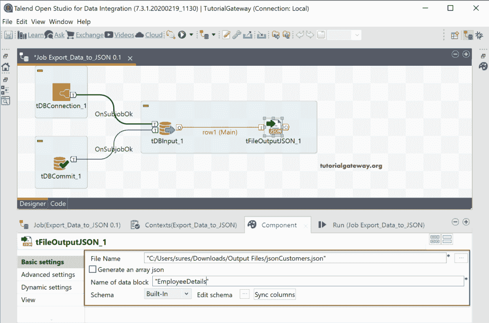
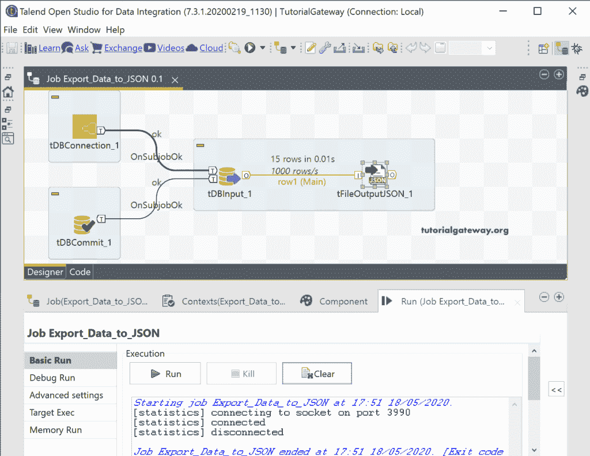
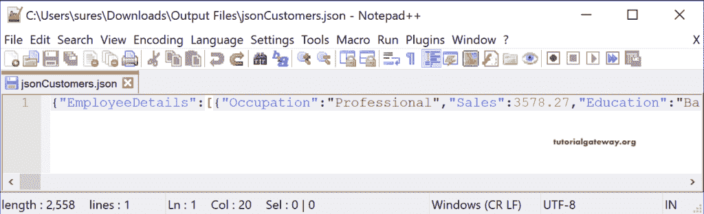
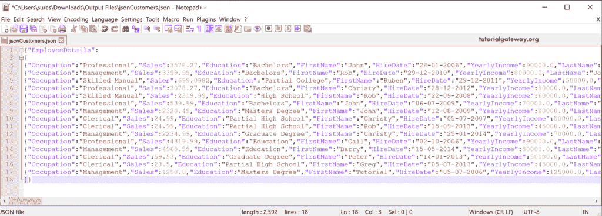

# 将数据库表导出到 Talend 中的 JSON

> 原文：<https://www.tutorialgateway.org/export-database-table-to-json-in-talend/>

在本节中，我们将通过一个示例展示如何使用 tFileOutputJSON 将数据库表导出到 Talend 中的 JSON。对于这个 Talend tFileOutputJSON 演示，我们使用的是 SQL Database 表，这个表里面的数据是

## Talend 将数据库表导出到 JSON 文件示例

从下图可以看到，我们建立了一个 [SQL](https://www.tutorialgateway.org/sql/) 连接。在 tDBInput 中，我们选择了客户表。

接下来，从调色板中拖放 tFileOutputJSON 输出字段。从工具提示中可以看到，Talend tFileOutputJSON 从行中创建了一个 JSON 结构。

请将数据库输入源连接到 tFileOutputJSON。下面的 tFileOutputJSON 图像显示了 Talend tFileOutputJSON 组件选项卡中可用于将数据库表导出到 excel 文件的选项列表。

请单击“编辑模式”按钮检查 tFileOutputJSON 模式。

默认情况下，tFileOutputJSON 输出字段的文件名选择默认位置，out.json 作为 JSON 文件名。请单击浏览(…)按钮选择现有的 JSON 文件或创建新的 JSON 文件。这里，我们在输出文件目录中创建 jsonCustomers.json。

让我检查所有的 [Talend](https://www.tutorialgateway.org/talend-tutorial/) tFileOutputJSON 属性。

让我运行这个 Talend 导出数据库表到 JSON 的作业。

下面的截图显示了输出。

让我展开文件以获得更好的视图。

