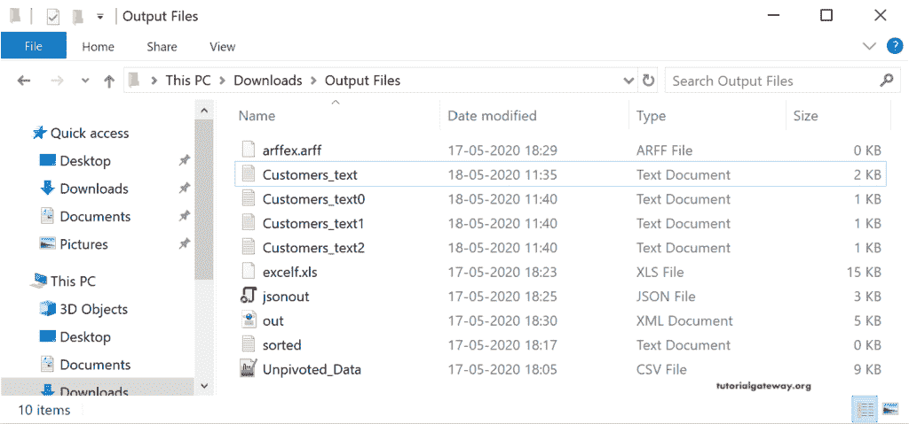

# 将数据库表导出到 Talend 中的文本文件

> 原文：<https://www.tutorialgateway.org/export-database-table-to-text-file-in-talend/>

在本节中，我们将通过一个示例向您展示如何使用 tFileOutputDelimited 将数据库表导出到 Talend 中的文本文件。对于这个 Talend tFileOutputDelimited 的演示，我们使用的是 SQL Database 表，这个表里面的数据是

## Talend 将数据库表导出到文本文件示例

从下面的 tFileOutputDelimited 作业截图中，您可以看到我们与 [SQL](https://www.tutorialgateway.org/sql/) 建立了连接，并使用 DBInput 选择了 Customer 表。

接下来，从调色板中拖放 tFileOutputDelimited 输出字段。从工具提示中可以看到，tFileOutputDelimited 用一个简单的分隔字段(即分隔符)逐行写入文件。

请将数据库输入源连接到 tFileOutputDelimited。在 Talend 文本输出字段组件中，我们有以下选项。

默认情况下，tFileOutputDelimited 字段选择默认位置和 out.csv 作为文件名。请单击浏览按钮(…)选择现有文本或 CSV 文件，或创建新的文本文件。在这里，我们在输出文件目录中创建客户。

接下来，单击“编辑模式”按钮检查 tFileOutputDelimited 模式。在这里，您可以根据自己的需求更改模式或列。大多数情况下，输入列(DBInput)将与 tFileOutputDelimited 同步。如果不是这样，请关闭模式窗口，然后单击同步列按钮。

接下来，我们选择了包含标题选项。

让我运行 Talend tFileOutputDelimited 作业，看看我们是否将数据库表导出为文本文件。

现在，您可以看到文本文件包含所有客户以及标题或列名。

请转到[Talend](https://www.tutorialgateway.org/talend-tutorial/)tfileoutputterminated 高级设置来更改高级选项。

出于演示目的，我们指定了千位分隔符和十进制分隔符。接下来，我们将输入行分成多个文本文件，每个文件最多有 5 行。它可以通过简单地检查服务器文件中的分割输出，并在每个输出文件选项中放置行数(5)。完成后，单击运行按钮。

现在，您可以看到三个名为 Customers_text 的文本文件(我们提供了默认值)，它添加了 0、1 和 2。

而文件里面的数据是

这一次，我们选择了追加选项，并删除了上一步的高级选项。这意味着，我们的 Customers_text 文件已经有 15 条记录，它必须追加另外 15 条记录。

你可以在下面的截图中看到同样的情况。

