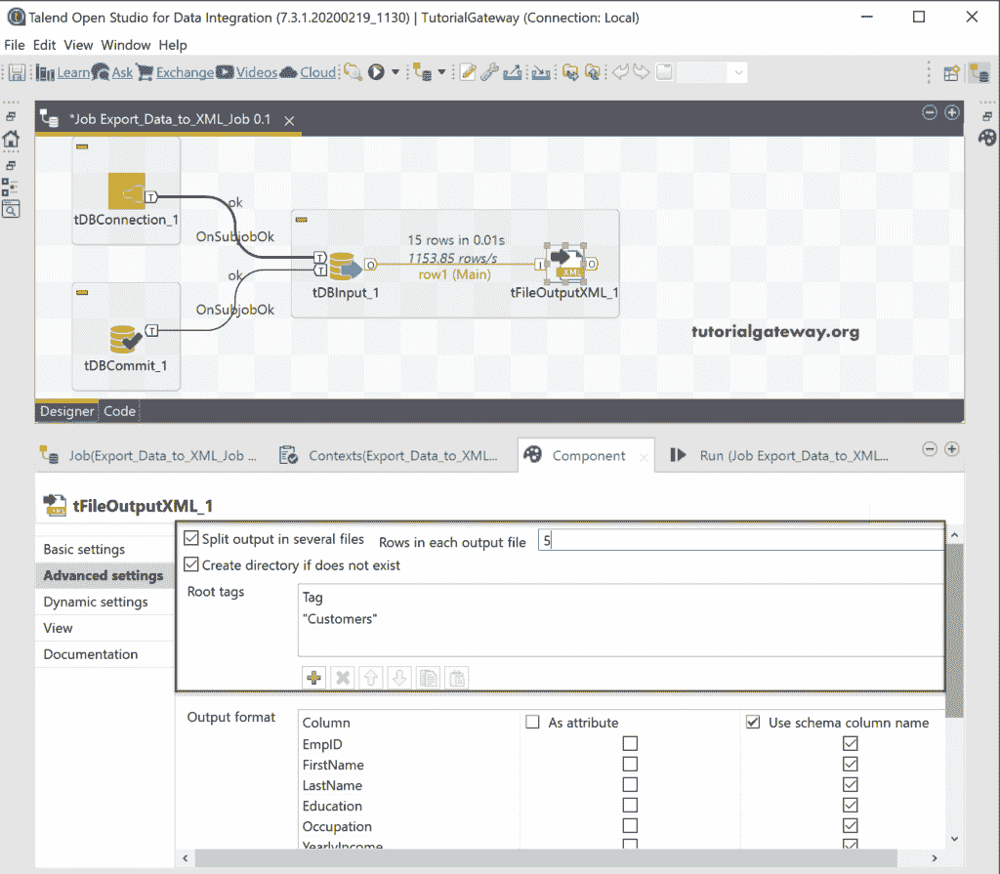

# 在 Talend 中将数据库表导出为 XML

> 原文：<https://www.tutorialgateway.org/export-database-table-to-xml-in-talend/>

在这一部分。我们通过一个例子向您展示了如何使用 tFileOutputXML 将数据库表导出到 Talend 中的 XML。对于这个 Talend 导出 db 表到 XML 的演示，我们使用的是 SQL Database 表，这个表里面的数据是

## 将数据库表导出到 XML 文件示例

从下面的截图中，我们可以看到我们用 SQL 建立了一个连接，然后使用数据库输入选择了客户表。

接下来，从调色板中拖放 tFileOutputXML 输出字段。从工具提示中可以看到，tFileOutputXML 通过将输入行分解为字段，从输入行创建了一个 XML 结构。

请将数据库输入源连接到 [Talend](https://www.tutorialgateway.org/talend-tutorial/) tFileOutputXML。在组件中，我们有以下选项。

接下来，单击“编辑模式”按钮检查 tFileOutputXML 模式。大多数情况下，输入列(DBInput)将与 tFileOutputXML 同步。如果不是这样，请关闭模式窗口，然后单击同步列按钮。

默认情况下，tFileOutputXML 字段选择默认位置，out.xml 作为文件名。请单击浏览(…)按钮选择现有文件或创建新的 XML 文件。这里，我们在输出文件目录中创建客户。

接下来，我们使用雇员列表作为行标签。这意味着每一行都以这个标签开始。

让我运行 Talend tFileOutputXML 作业，看看我们是否将数据库表导出到了 XML 文件。

您可以看到该 XML 文件包含所有客户，并且每行都以 EmployeesList 标记开始。在这里，我们也可以更改根标签。

请转到高级设置。它是我们可以更改列的模式、根标签默认名称等的地方。

出于演示目的，我们添加了客户作为根标签。接下来，我们将输入行分成多个文件，每个文件最多有 5 条记录。它可以通过简单地检查服务器文件中的拆分输出，并在每个输出文件选项中放置行数来实现。完成后，单击运行按钮。

现在，您可以看到三个名为 Customers_XML 的文件(我们提供了默认值)，它添加了 0、1 和 2。

让我打开第一个文件，向您展示根标签(已更改为 Customers)，它只有五条记录。

