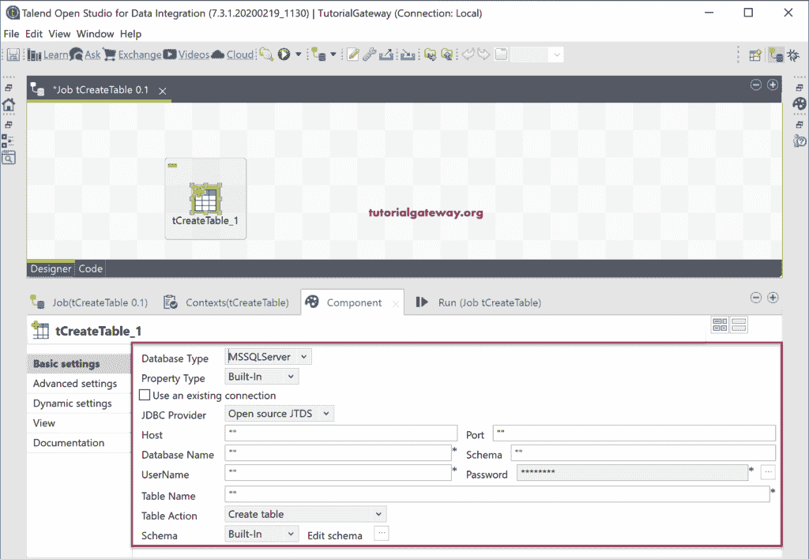

# 创建表格

> 原文：<https://www.tutorialgateway.org/talend-create-table/>

Talend tCreateTable 组件对于在数据库中创建表非常有用。在将输出加载到数据库之前，我们可以使用这个 Talend tCreateTable 创建一个表。

在这个 Talend 示例中，我们创建了一个将数据加载到这个新创建的 SQL Server 表中的作业。

## 创建数据库表示例

将 Talend tCreateTable 从调色板拖放到作业设计器中。

从下面的截图中，您可以看到默认情况下它指向的是 MySQL 数据库。这个 Talend Component 选项卡包含了连接 MySQL 数据库和创建表所需的所有属性。

让我选择微软 SQL 服务器作为数据库类型。

现在，您可以看到连接到 SQL Server 的选项。

我们刚刚复制了 tFilterRow 作业，并将所有组件粘贴到该作业中。建议大家参考 [Talend](https://www.tutorialgateway.org/talend-tutorial/) 中 [Talend tFilterRow](https://www.tutorialgateway.org/talend-filter-rows/) 的文章。

接下来，我们移除了 OnSubjectOk 触发器，并将其指向 tCreateTable，并将 tCreateTable 的 Main 行与 tDBInput 连接起来。这意味着一旦与数据库建立了连接，它将到达 tCreateTable，然后转到 tDBInput。

在“创建表组件”选项卡中，我们使用现有的连接，然后创建一个表名 a1234。这里，表操作选项与 tDBOutput 相同。所以，请参考[将数据从文本文件加载到数据库](https://www.tutorialgateway.org/talend-load-data-from-text-file-into-database/)一文。如果存在 Drop 表，我们将选择它并创建，这意味着如果 a1234 存在，它将删除该表；否则，它会创建一个 a1234 表。

请单击“编辑方案”按钮，为要创建的表创建方案或列名。从下面可以看到，我们创建了一个与我们在 tDBInput 中选择的 Customer 表相匹配的模式。

在 tDBOutput 中，我们将表名更改为 a1234，并将表上的操作更改为[截断表](https://www.tutorialgateway.org/sql-truncate-table/)。

让我运行这个创建数据库表的作业。

从下面的[管理工作室](https://www.tutorialgateway.org/sql-server-management-studio/)截图中，我们的工作已经创建了这个表，并在其中存储了过滤后的数据。在 [SQL](https://www.tutorialgateway.org/sql/) 表属性中，您也可以检查创建的日期和时间。

