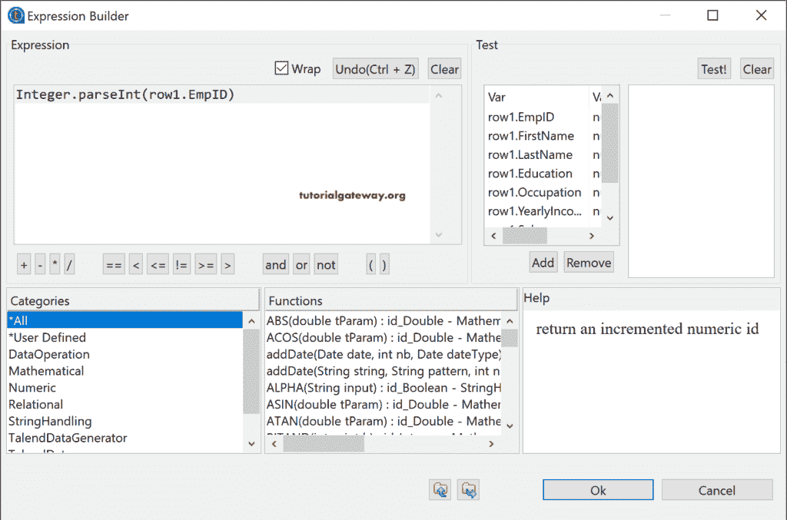

# Talend tMap 类型转换

> 原文：<https://www.tutorialgateway.org/talend-tmap-type-conversion/>

本文展示了如何使用 Talend tMap 来执行类型转换或更改数据类型。我们可以使用这个 Talend tMap 作为 tConvertType 的替代，根据需求更改列的数据类型。在实时中，我们主要以字符串格式获取数据，因此我们必须将它们更改为整数、双精度、日期等。

为了演示 Talend tMap 类型转换，我们使用了在 [tConvertType](https://www.tutorialgateway.org/talend-datatype-conversion/) 示例中使用的 Customer_text 文本文件。所以，让我使用 tFileInputDelimited，从文件系统中选择文本文件。

单击“编辑模式”按钮添加所有具有数据类型的列。或者，如果您有现有的元数据，请使用相同的元数据。不管怎样，你可以看到所有的列都是字符串类型的。

拖放 [Talend](https://www.tutorialgateway.org/talend-tutorial/) tMap，并将 [tFileInputDelimited](https://www.tutorialgateway.org/talend-load-data-from-text-file-into-database/) 主行连接到 tMap。

双击 tMap 打开下面的窗口。请点击+按钮添加新输出。让我将第 1 行的所有列添加到 Type_Conversion_Out(我们给这个输出起的名字)中。

我们的场景是，我们有一个预定义的表来存储这些记录。该表的整数类型为 EmpID，双倍收入，浮动类型为 Sales，日期格式为 HireDate。因此，为了满足相同的要求，我们将上面指定的列的数据类型更改为相同的。

让我运行这个 Talend tMap 类型转换作业，看看会发生什么。

从上面的 tMap 图像可以看出，它抛出了一个错误(类型不匹配)。

## Talend tMap 类型转换步骤

请点击 EmpID 旁边的浏览按钮将打开表达式生成器来编写表达式。请使用此表达式生成器或执行类型转换。

对于此列，我们必须将字符串类型更改为整数。所以，我们使用的是 parseInt 方法。如果你觉得写一个函数很有挑战性，按下 control + space 查看可能性。或者，在“类别”下，您可以找到所有内置函数。

单击确定按钮关闭窗口。

同样，我们使用 parseDouble 将字符串转换为 Double，使用 parseFloat 将字符串转换为 Float，使用 parseDate 将字符串值转换为 Date。请记住，对于 parseDate，请将列模式与日期格式匹配。

为了节省时间，我们使用了 tLogRow 来显示结果。从下图中，您可以看到 Talend tMap 类型转换结果。

