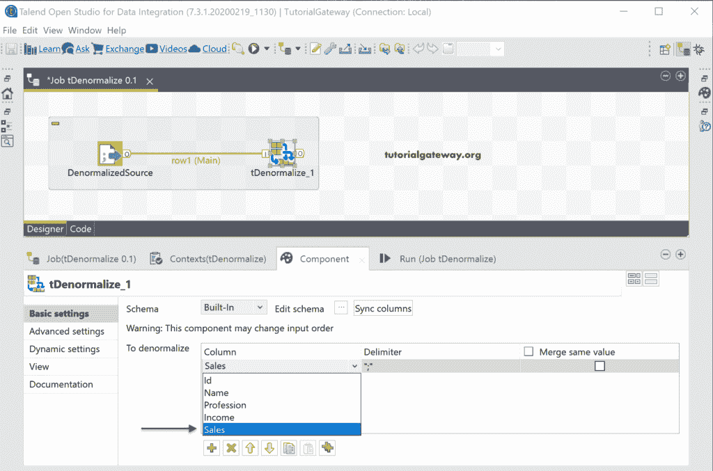
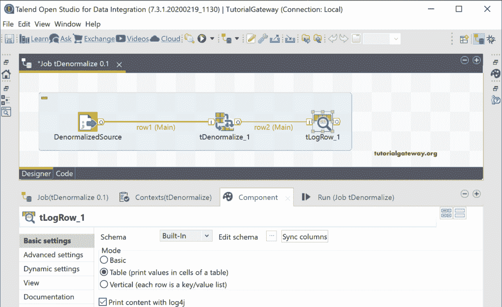
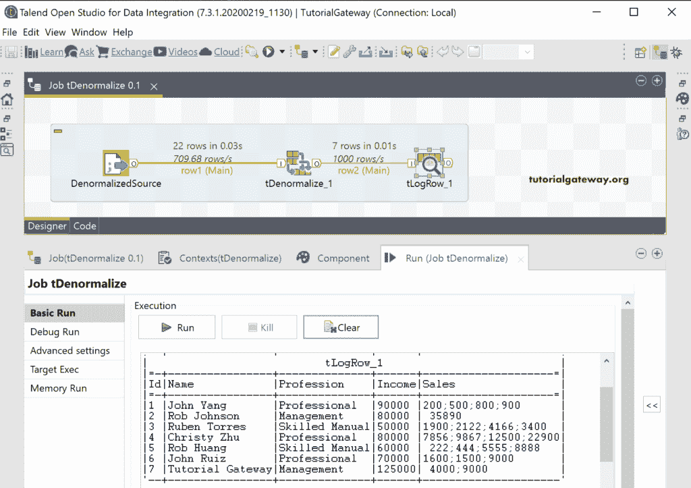
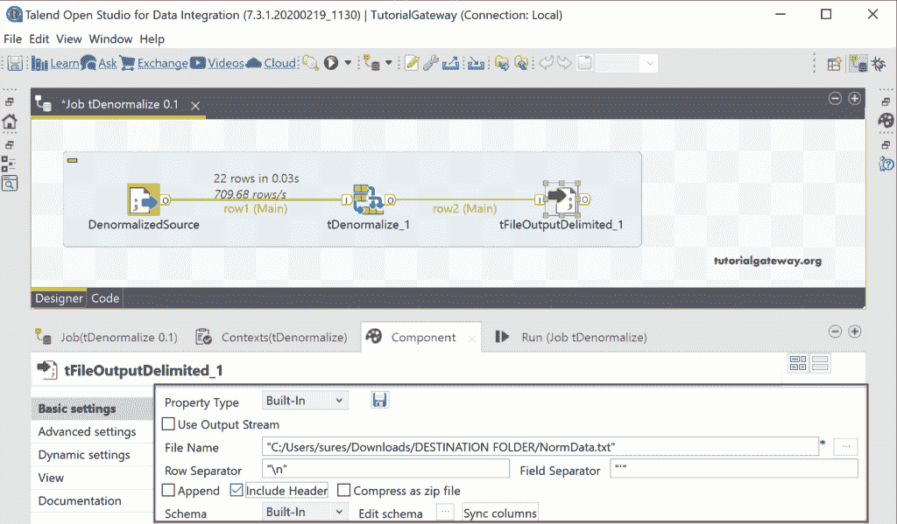
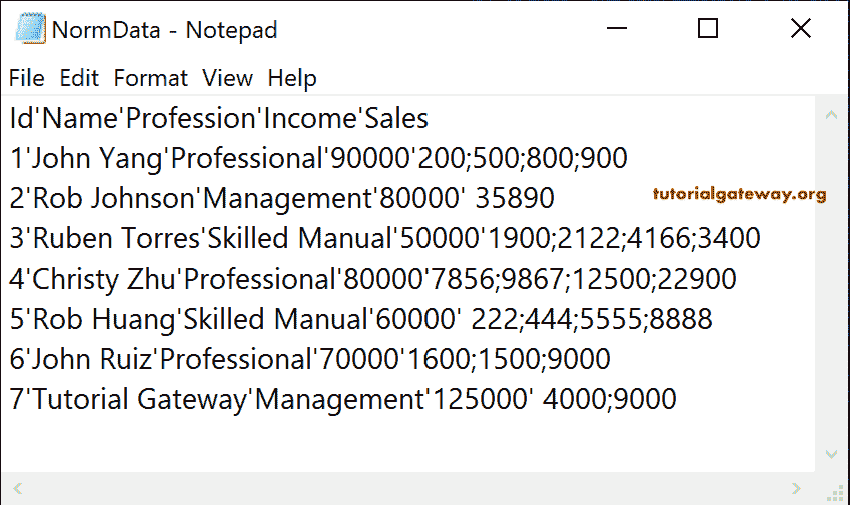

# Talend `tDenormalize`

> 原文：<https://www.tutorialgateway.org/talend-tdenormalize/>

我们可以使用这个 Talend `tDenormalize`来反规格化或展平列。为了演示 Talend `tDenormalize`，让我使用这个文本文件。如您所见，每个员工都有多个销售值，我们的工作是对该销售列进行反规范化。

## Talend `tDenormalize`示例

在我们开始创建 tDenormalize 作业之前，我们创建了非规范化的源文本文件元数据。我们使用这些反规格化的数据源元数据作为[规格化的](https://www.tutorialgateway.org/talend-tnormalize/)数据源。

让我使用该文件分隔的元数据作为 Talend 反规格化组件源。

接下来，将 tDenormalize 拖放到作业窗口中。

从下面的“添加组件”选项卡中可以看到，它有一个添加所需列的窗口。它是您想要反规范化的列，也是您想要使用的分隔符。请使用+按钮添加非规范化列。

请点击 [Talend](https://www.tutorialgateway.org/talend-tutorial/) 反规格化编辑模式按钮检查输入&输出列。

我们添加了 Sales 作为非规范化列，分号作为分隔符。

接下来，我们使用 tLogRow 来显示非规范化数据的结果。

让我们运行 Talend `tDenormalize`作业并查看结果。

让我们将这个 tDenormalize 输出保存在文本文件中，该文件包括标题和用“'”分隔的列。接下来，运行 Talend `tDenormalize`作业。

接下来，打开 NormData 文本文件向您显示结果。

