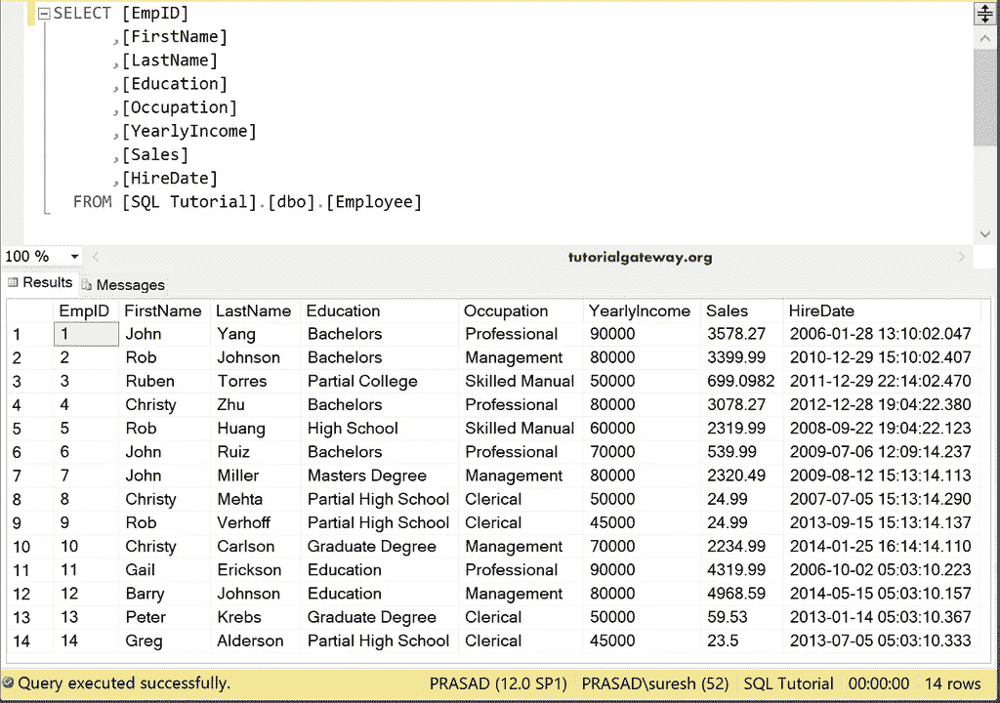
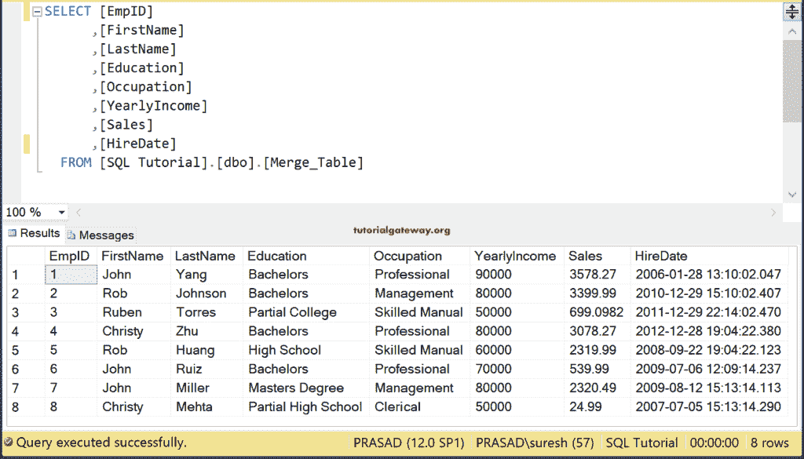
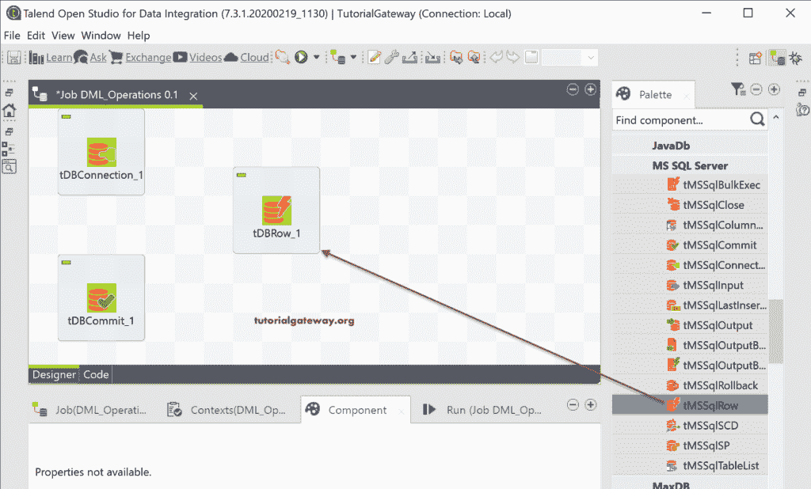
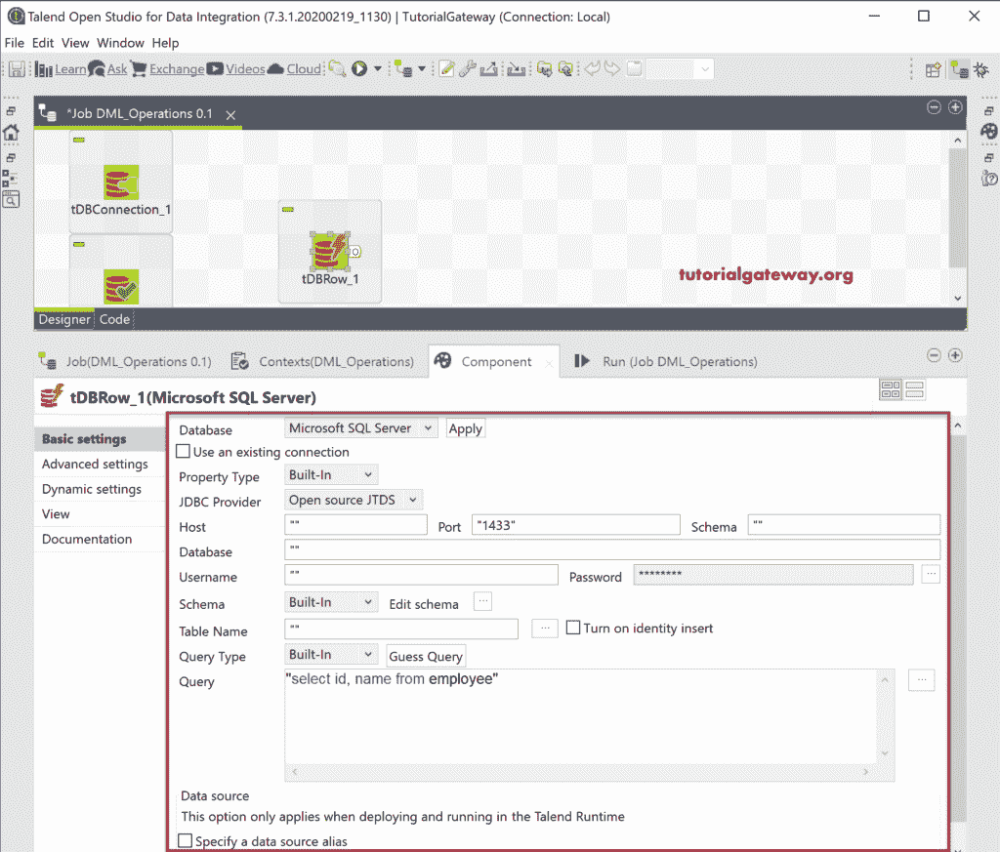
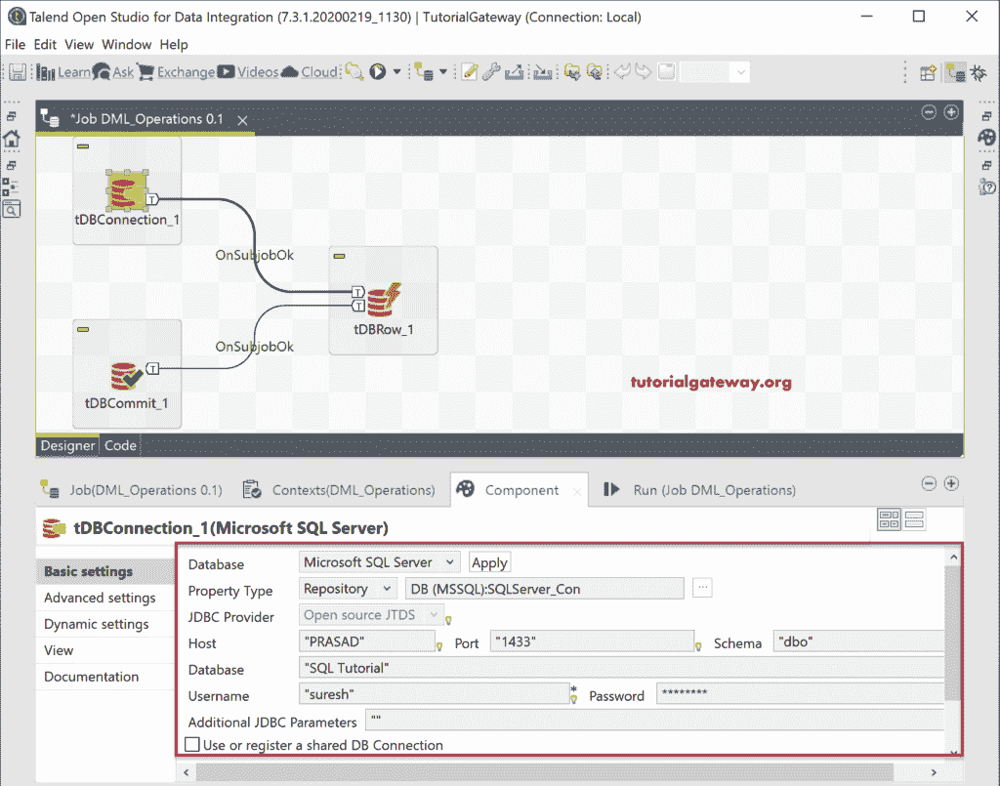
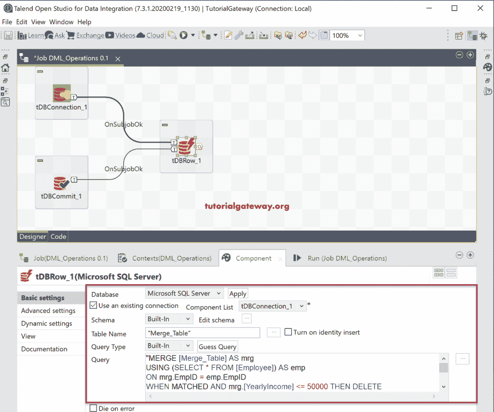
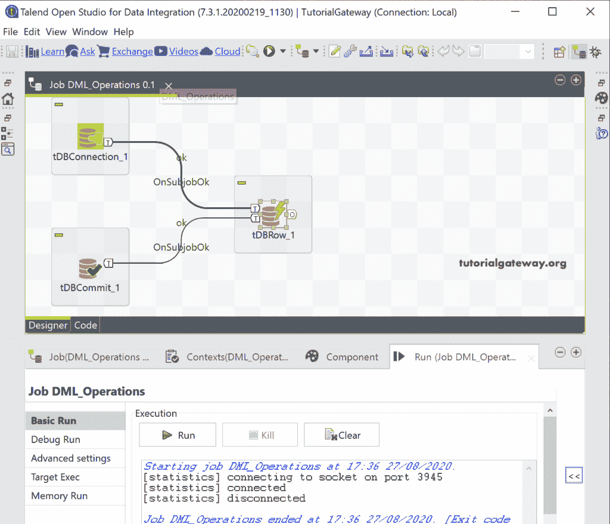
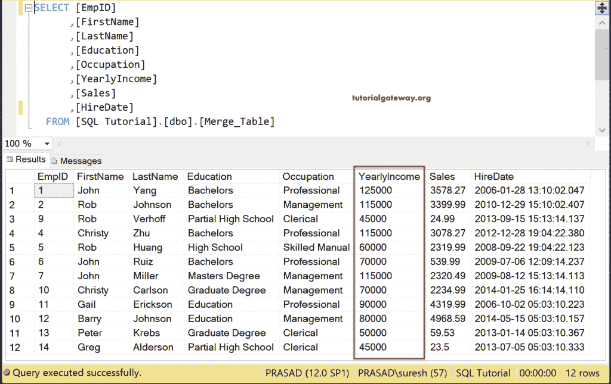

# 在 Talend 中执行查询

> 原文：<https://www.tutorialgateway.org/execute-sql-queries-in-talend/>

Talend tDBRow 组件帮助我们编写或执行 SQL 查询。我们可以使用这个 Talend tDBRow 来执行 DML 操作，或者执行任何不返回结果的 SQL 查询。

为了演示在 Talend 中执行 DML 语句或查询，我们使用了两个表。第一个是参考表。



我们使用上表，并在下表中编写 merge 语句。在合并语句中，我们执行插入、更新和删除操作。



## 执行 SQL 查询示例

我们使用 tDBConnection 来连接到 SQL Server。接下来，将浏览器从调色板拖放到作业设计器中。



在浏览器组件选项卡中，您可以看到可用的选项。它和 tDBInput 一样，但是我们必须使用查询窗口来编写我们自己的 [SQL](https://www.tutorialgateway.org/sql/) 查询。



我们使用在 [Talend](https://www.tutorialgateway.org/talend-tutorial/) tDBConnections 组件中创建的现有连接。



在这里，我们编写了 Merge 语句来执行 DML 操作。建议大家参考 [SQL Merge](https://www.tutorialgateway.org/sql-merge-statement/) 文章，了解这个查询的一切。我们使用了相同的表、相同的查询和数据中的一些变化来简化它。



```
"MERGE [Merge_Table] AS mrg
USING (SELECT * FROM [Employee]) AS emp
ON mrg.EmpID = emp.EmpID
WHEN MATCHED AND mrg.[YearlyIncome] <= 50000 THEN DELETE
WHEN MATCHED AND mrg.[YearlyIncome] >= 80000 THEN 
  UPDATE SET mrg.[YearlyIncome] = mrg.[YearlyIncome] + 35000
WHEN NOT MATCHED THEN
INSERT ([FirstName], [LastName], [Education]
      ,[Occupation]
      ,[YearlyIncome]
      ,[Sales]
      ,[HireDate])
VALUES(emp.[FirstName], emp.[LastName], emp.[Education]
      ,emp.[Occupation]
      ,emp.[YearlyIncome]
      ,emp.[Sales]
      ,emp.[HireDate]);"
```

让我们运行这个在 Talend 中执行 DML 查询的作业。



在[管理工作室](https://www.tutorialgateway.org/sql-server-management-studio/)内，可以看到结果。

