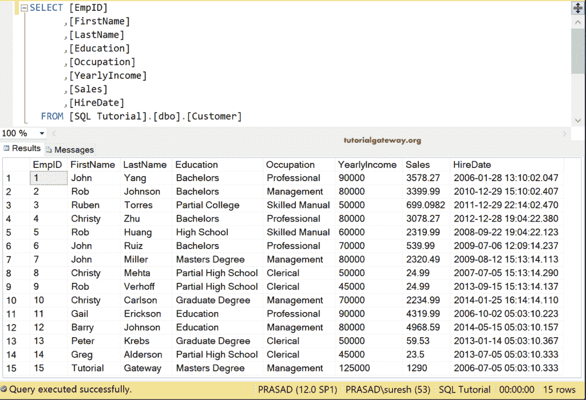
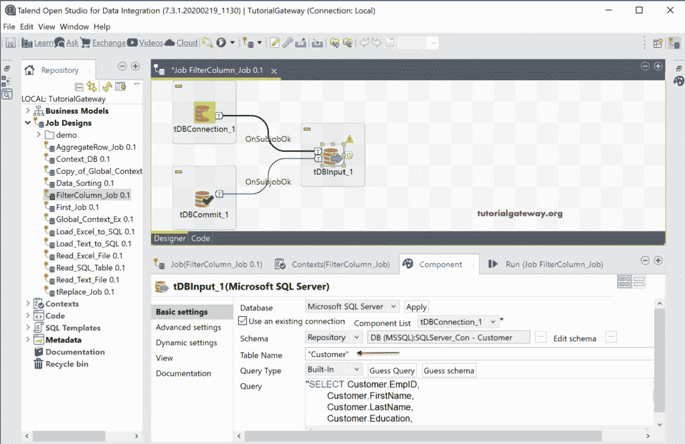
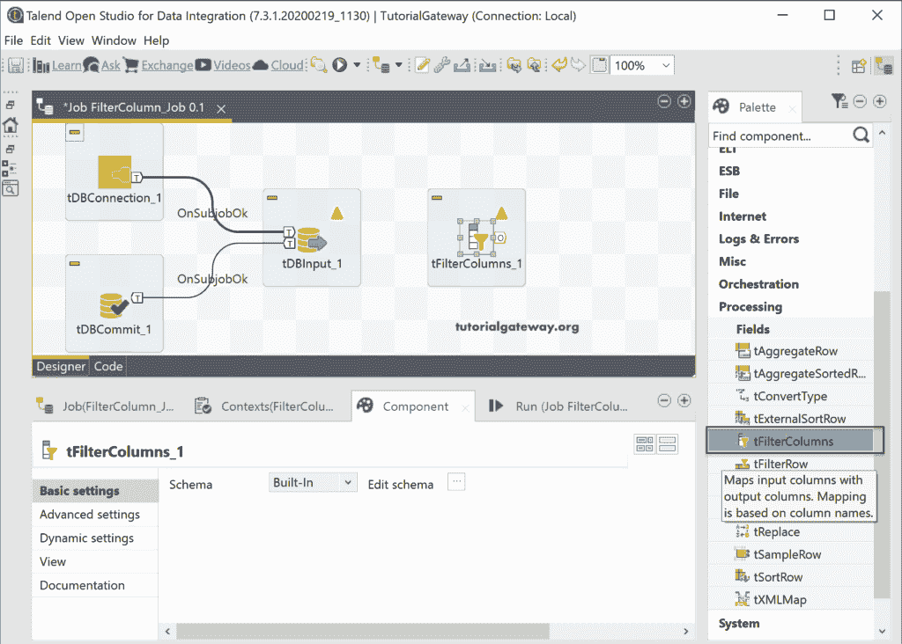
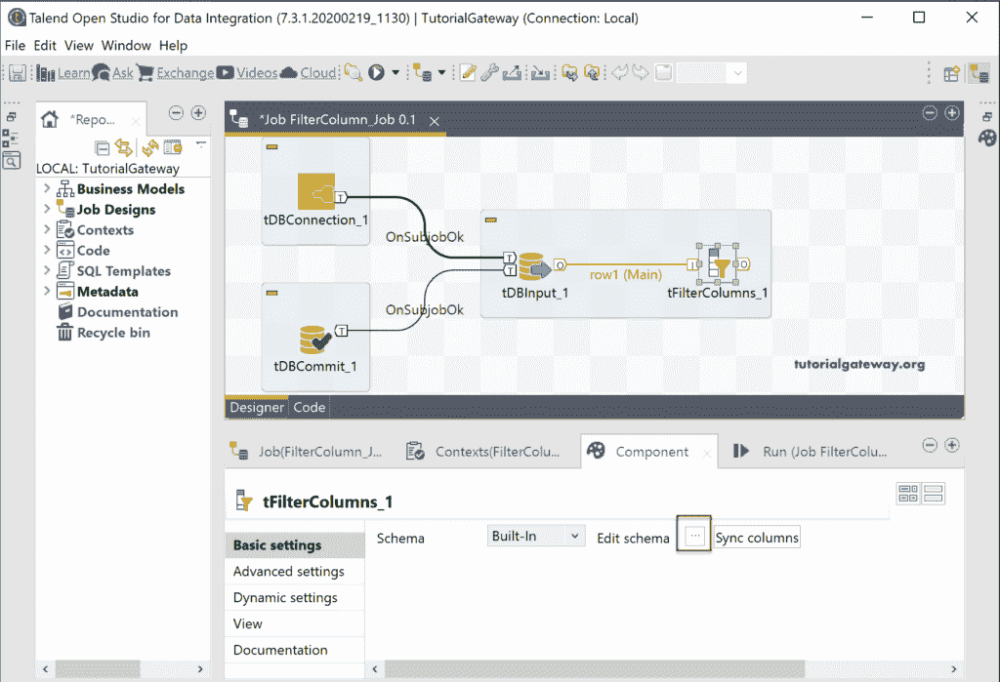
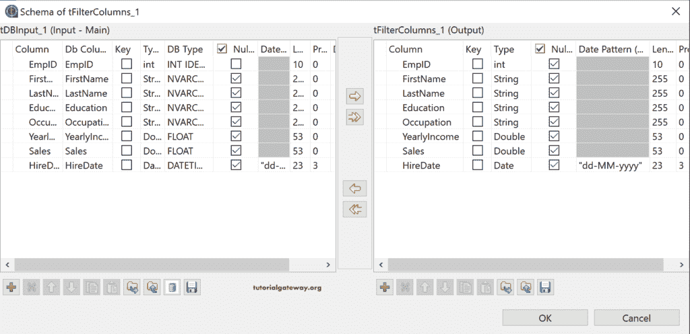
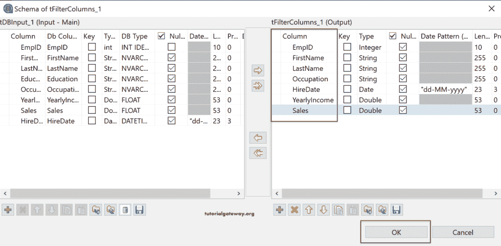
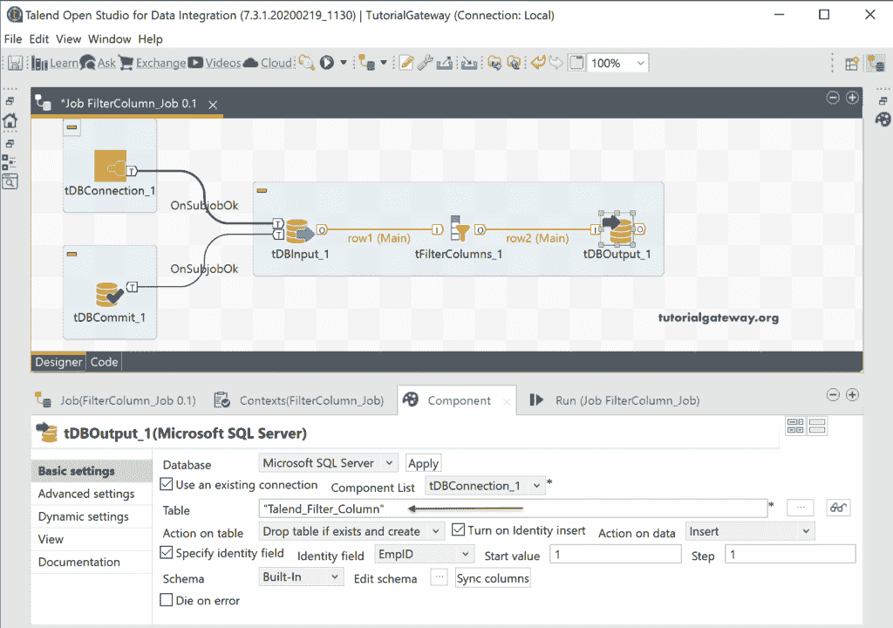
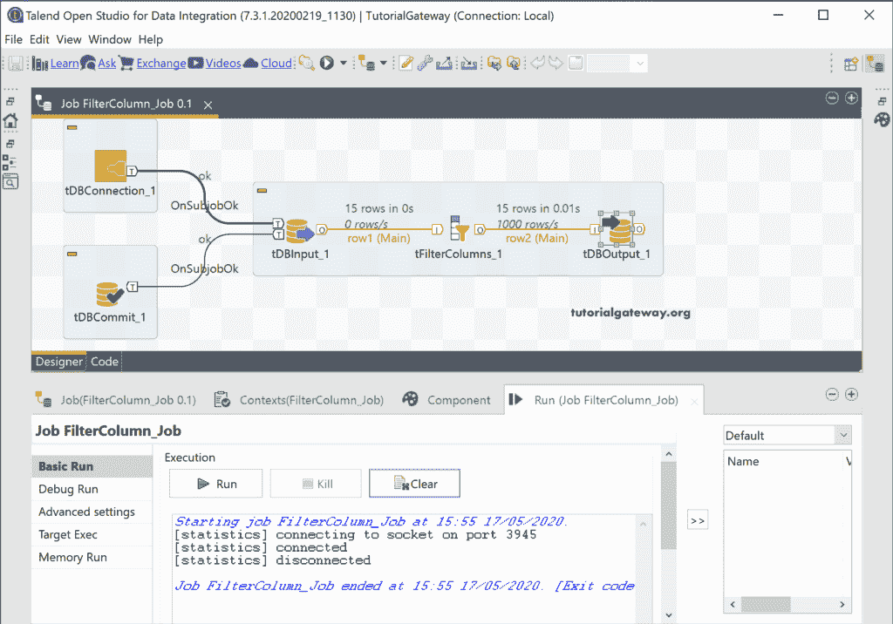
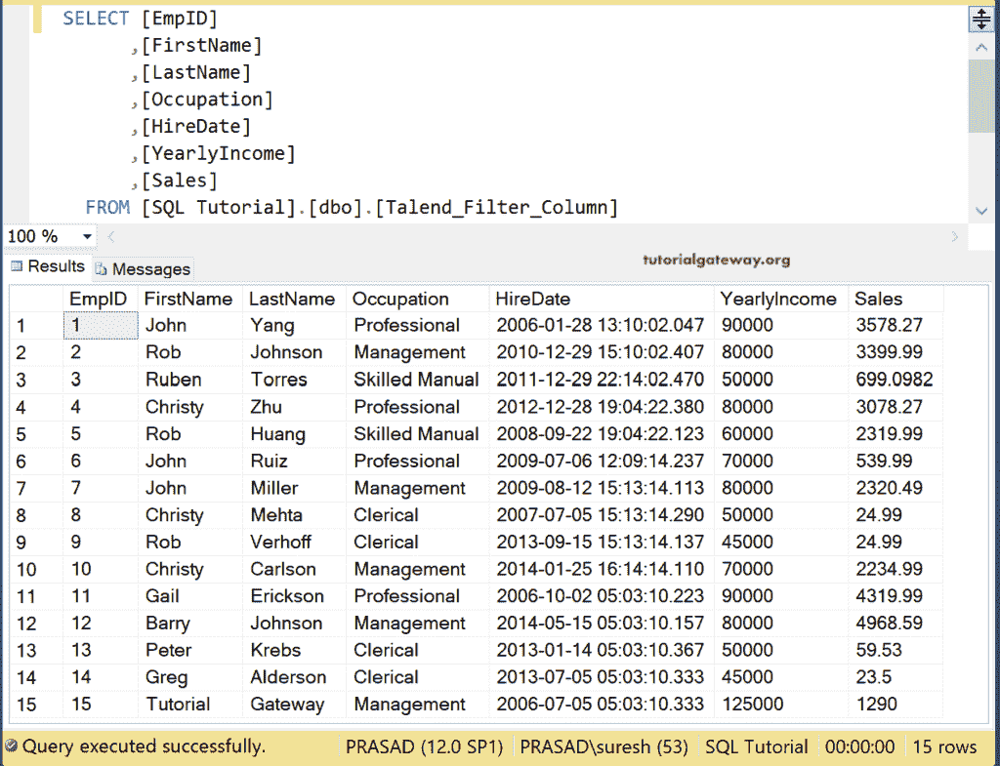

# Talend 过滤列

> 原文：<https://www.tutorialgateway.org/talend-filter-columns/>

Talend 过滤列组件可用于过滤源列值并提供输出。如果源数据中有 N 列，并且只需要几列，则可以使用此 Talend Filters Columns 字段。

为了演示 Talend 过滤列字段，我们使用了 SQL Server 数据库中的客户表。

## Talend 过滤列示例

首先，我们建立了与微软 SQL Server 的连接。接下来，我们使用 [Talend](https://www.tutorialgateway.org/talend-tutorial/) DBinput 来选择数据库中的客户表。

将 Talend 过滤列字段拖放到设计区域。从下面的截图中可以看到，Talend tfiltercolumns 将输入列映射到输出列。基于列名的映射。

请将数据库输入主行连接到 Talend 过滤列字段。从下面的 tfiltercolumns 图像中可以看到，在 filtercolumns 组件选项卡中没有什么可以做的。

单击“编辑模式”按钮检查输入和 tfiltercolumns 输出字段，并根据您的要求进行更改。

在这里，我们删除了教育专栏，并更改了雇佣日期的位置。

接下来，拖放 DBOutput 字段并使用现有的连接。如您所见，我们使用 Talend_Filter_Column 表作为目标。如果该表不存在，该作业将创建该表；否则，它将删除现有的并创建一个新表。

让我们运行 Talend tfiltercolumns 作业。

从下面的 [SQL](https://www.tutorialgateway.org/sql/) 查询中，您可以看到三个是无教育列，并且这些列的顺序已经按照我们在编辑模式窗口中指定的那样发生了变化。

