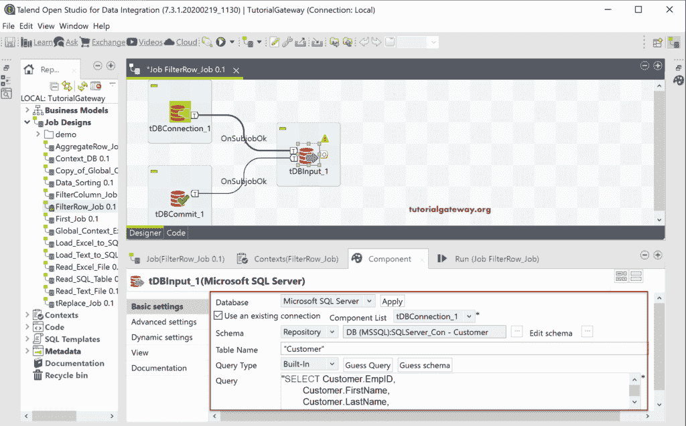

# Talend 过滤行

> 原文：<https://www.tutorialgateway.org/talend-filter-rows/>

Talend 过滤行或 tFilterRow 字段将根据给定的表达式过滤或限制输入行，并返回输出。我们可以使用此 Talend Filter Row 字段获取高于特定值的销售额，或者返回特定城市、州或国家的记录等。

在这个 Talend 过滤行示例中，我们在 SQL Server 数据库中使用了 Customer 表。下面的截图显示了该表中的数据。

## Talend 过滤行示例

首先，拖放数据库连接、数据库提交和数据库输入来建立到 SQL Server 的连接。接下来，我们从元数据中选择了客户表。

接下来，将 Talend tFilterRow 从调色板拖放到作业设计中。从下面的工具提示中可以看到，tFilterRow 通过评估列条件来过滤输入行。

请将数据库输入主行连接到 tFilterRow。大多数情况下，输入列将与过滤器同步。如果不是这样，请单击同步列按钮。

接下来，单击“编辑模式”按钮，根据您的要求检查或更改 tFIlterRow 模式。

在“组件”选项卡中，有两个选项可以执行过滤。一个是逻辑运算符，它有两个选项。默认情况下，“与”处于选中状态，但您可以更改为“逻辑或”。当我们只选择一列时，这没有关系。但是，如果我们选择两列，那么输出行必须同时满足这两个条件。

第二个是条件部分，这是我们选择列并执行操作的地方。

现在，我们保留默认的逻辑“与”，然后单击添加(加号)按钮。默认情况下，它会添加客户表中的第一列，即 EmpID。请使用下拉框选择所需的列，在这里，我们选择了职业。

在运算符下，我们有以下选项，如等于、不等于、大于、小于(小于)、大于或等于(大于或等于)、小于或等于(小于或等于)。我想我不必解释这些选项，因为你知道它们是做什么的！

出于 Talend 过滤行演示的目的，我们选择了不等于运算符，并将该值作为熟练手册。意思是[Talend](https://www.tutorialgateway.org/talend-tutorial/)t filterarrow 必须退回所有职业不等于熟练工的客户。

接下来，我们使用 DBOutput 将 Talend tFilterRow 输出保存在一个 [SQL](https://www.tutorialgateway.org/sql/) 数据库中。这里，我们将创建 Talend_FilterRow 表作为目标表。

让我们运行 Talend 过滤行作业。

让我打开[管理工作室](https://www.tutorialgateway.org/sql-server-management-studio/)查看结果。请记住，Talend tFilterRow 与 [SQL Where 子句](https://www.tutorialgateway.org/sql-where-clause/)相同。

这一次，我们使用两个字段并运行作业。这意味着 Talend tFilterRow 必须返回所有职业不等于熟练工且年收入大于 50000 的客户。

请检查 Talend 过滤行结果。

tFilterRow 组件选项卡有一个高级选项。使用该选项编写一个自定义的 [java](https://www.tutorialgateway.org/java-tutorial/) 代码来执行过滤器。

让我把[逻辑运算符](https://www.tutorialgateway.org/java-logical-operators/)从“与”改为“或”。这意味着 Talend 过滤行返回“职业”等于“管理”或“年收入”大于或等于 60000 的客户。

请检查 Talend tFilterRow 结果。

