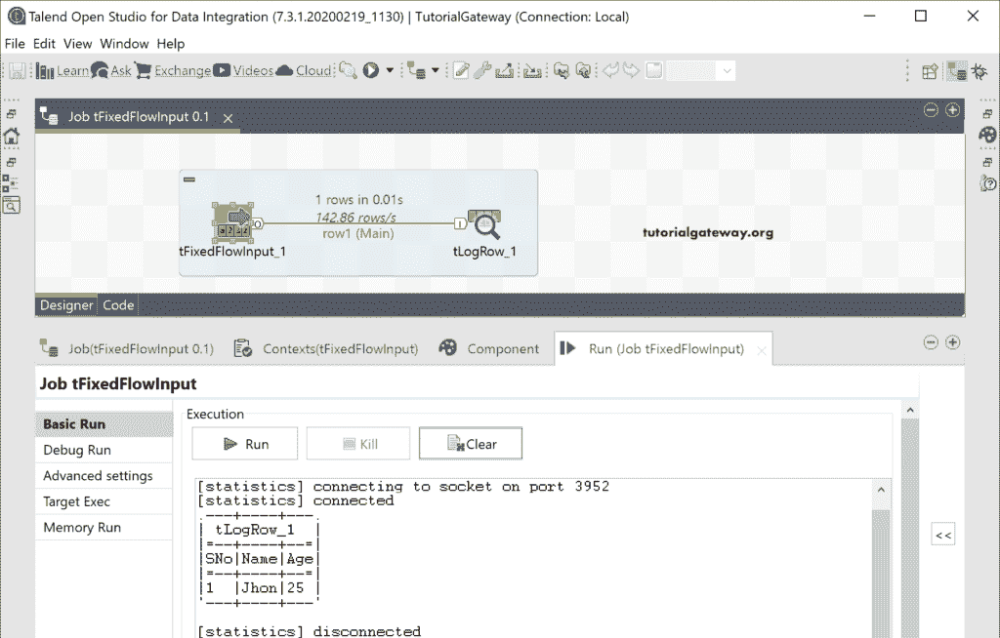

# Talend `tFixedFlowInput`

> 原文：<https://www.tutorialgateway.org/talend-tfixedflowinput/>

Talend tFixedFlowInput 组件从内部变量生成固定数量的行。在本节中，我们将向您展示如何使用该 Talend tFixedFlowInput 创建一个固定值表。

## Talend tFixedFlowInput 输入示例

将 tFixedFlowInput 输入组件拖放到作业设计中。

下面的截图显示了组件选项卡中的 tFixedFlowInput 属性。

1.  行数:请输入要生成的总行数。
2.  模式:它有三个选项，我们给你看每个 [Talend](https://www.tutorialgateway.org/talend-tutorial/) 选项的例子。

请单击“编辑模式”按钮，并在此 tFixedFlowInput 输入字段中添加所需的列。在这里，我们创建了三列 SNO，名字和年龄。

### 使用单一表

单击“编辑模式确定”按钮后，这些列将添加到“列”部分。在值下，您必须为每一列添加值。

为了演示 Talend tFixedFlowInput，我们添加了这些值。接下来，我们使用 tLogRow 来显示结果。

让我运行这个 tFixedFlowInput 作业。

### 使用内联表

此选项创建内联表。请使用此选项添加多行。因此，让我在前面创建的列中添加四条记录。

可以看到 Talend tFixedFlowInput 结果！

### 使用内嵌内容(分隔文件)

请使用此选项在一个文件中使用多条记录。您可以简单地将所有记录复制到内容部分，并指定行和字段分隔符。

在这里，我们更改了 Schema 并添加了五列来存储员工信息。接下来，我们添加了十条记录，它们的行由一个新的行分隔，字段由逗号分隔。

运行 Talend tFixedFlowInput 作业后，您可以看到结果。

