# 塔伦德·特鲁普

> 原文：<https://www.tutorialgateway.org/talend-tloop/>

Talend tLoop 与 For 循环或 While 循环相同。使用此 Talend tLoop 组件在给定次数内执行另一个组件或作业。本节涵盖了 Talend tLoop 的多个示例，以帮助您完全理解它。

## Talend tLoop 示例

将 Talend tLoop 组件拖放到作业设计器窗口。

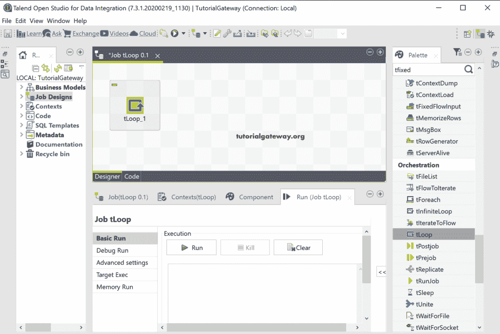

从下图可以看到，它有 For 循环和 While 循环选项。请根据您的要求进行选择，目前我们保持原样。接下来，它具有带默认值的“从”、“到”和“步骤”选项。它与(I = 1；我<= 10; i++) or for(i = 1; i <= 10; i+1)

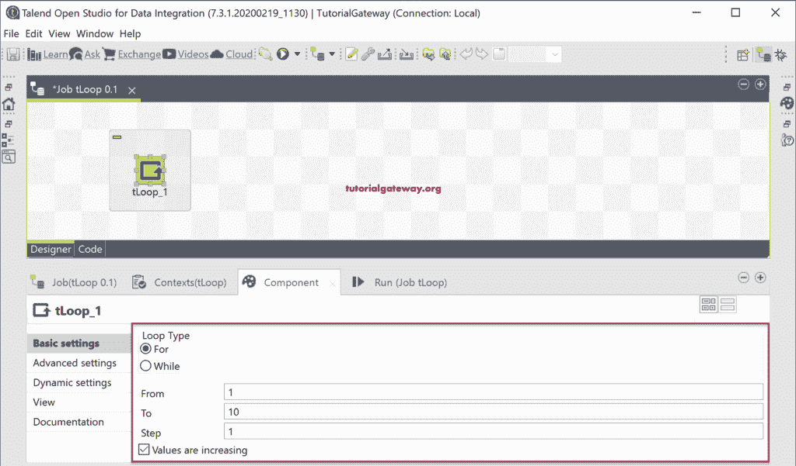

为了显示迭代值，我们使用了 [tJava](https://www.tutorialgateway.org/talend-tjava/) 组件。

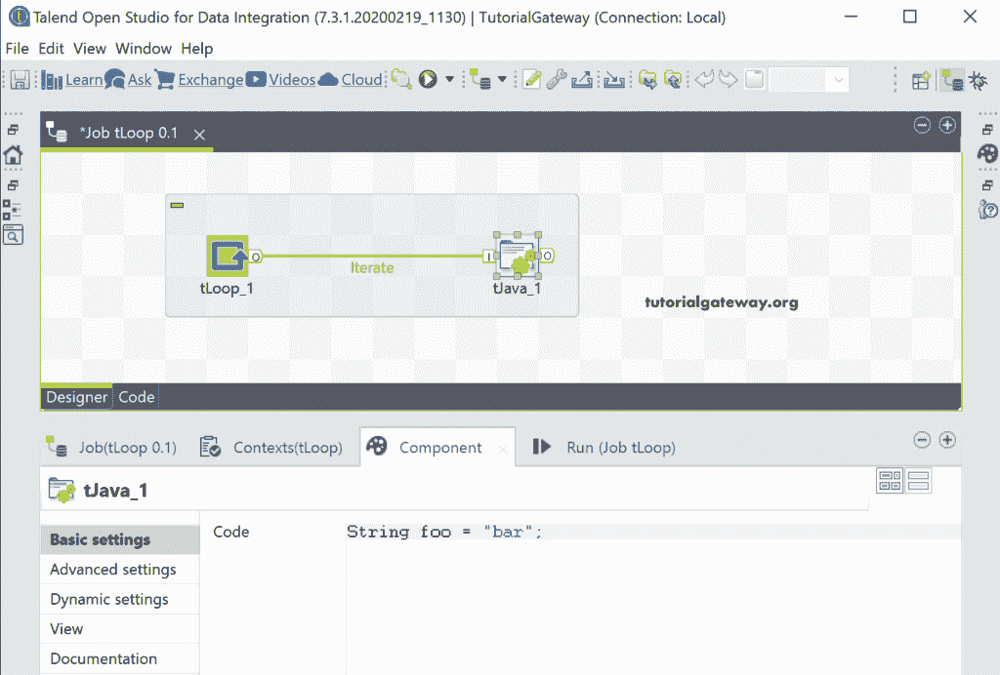

在 [Talend](https://www.tutorialgateway.org/talend-tutorial/) tJava 中，我们添加了 [Java](https://www.tutorialgateway.org/java-tutorial/) println 语句来打印迭代中的当前循环值。

```
System.out.print(((Integer)globalMap.get("tLoop_1_CURRENT_VALUE")));
System.out.print("\t Ieration No = " + ((Integer)globalMap.get("tLoop_1_CURRENT_VALUE")));
System.out.println();
```

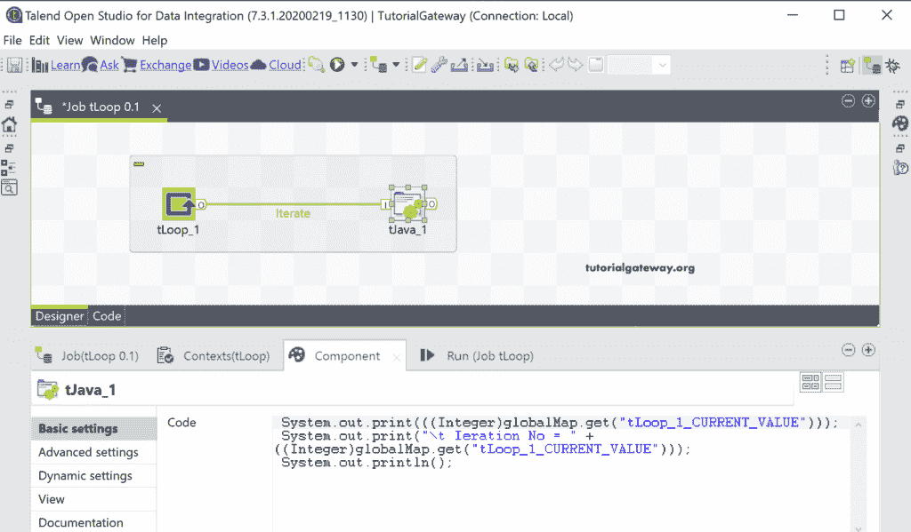

让我运行这个 Talend tLoop 作业并查看输出。如您所见，迭代从 1 开始，到 10 结束，增量为 1。

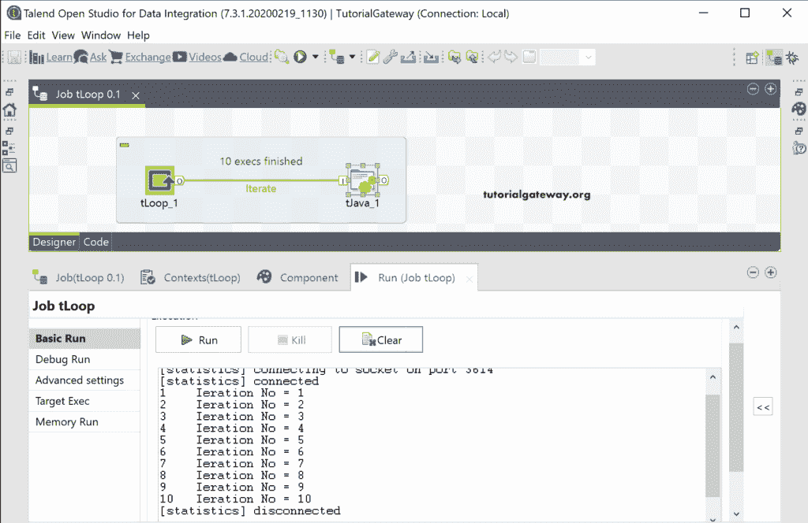

这一次，我们使用 tRowGenerator 为每次迭代生成随机行。为此，首先，我们将 For 循环最大值或值更改为 5。

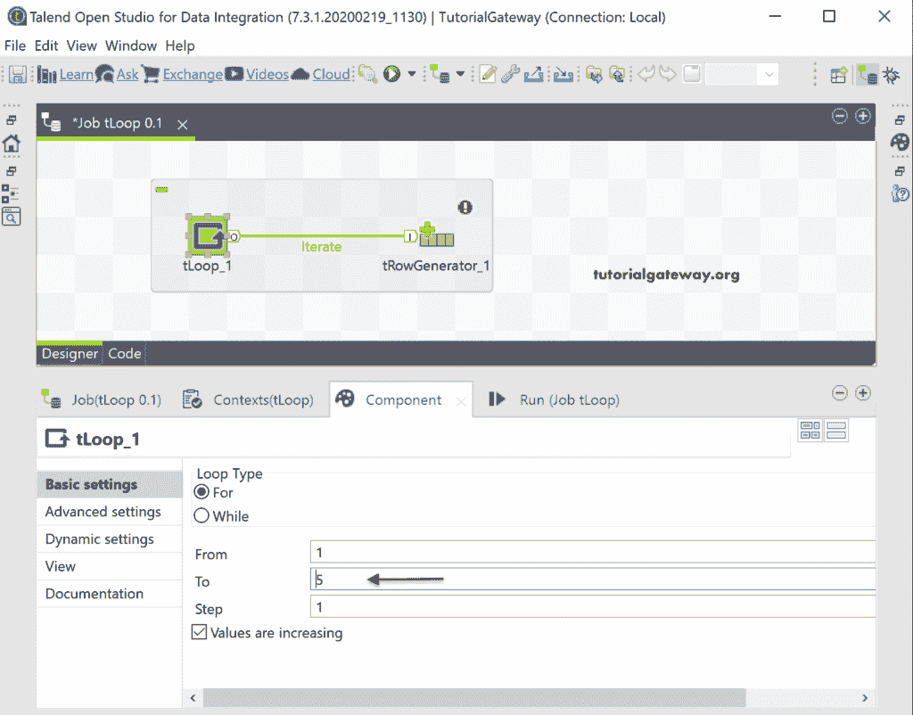

在 tRowGenerator 编辑器中，我们添加了四个不同的列。接下来，我们将行数更改为 2，这将生成两个随机行。

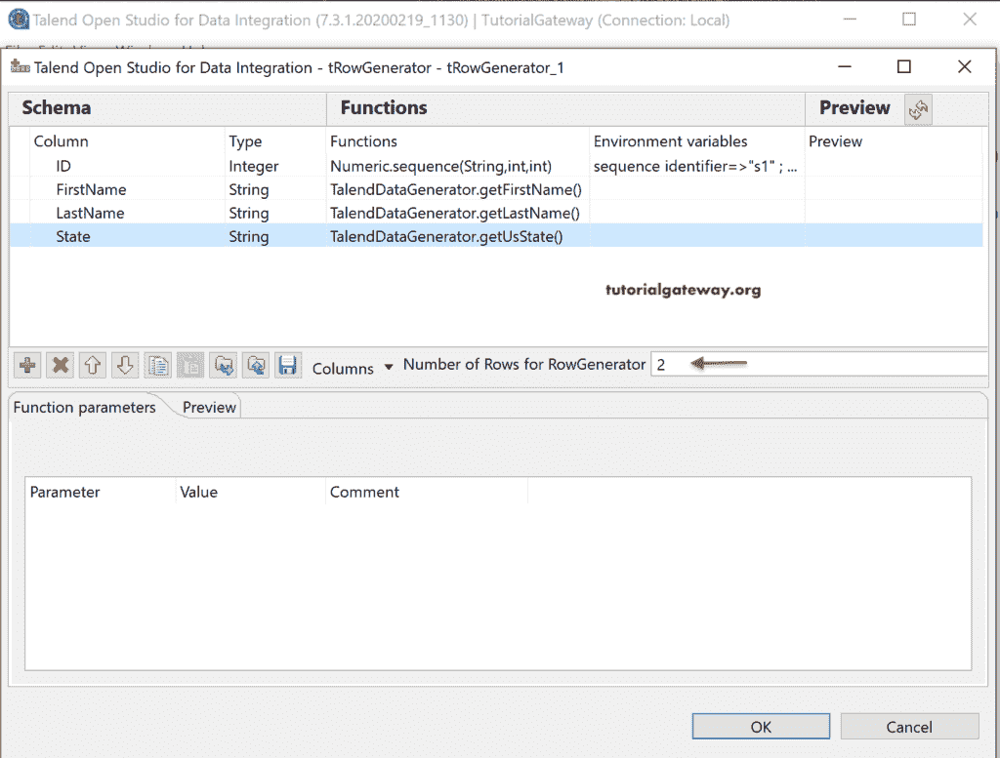

接下来，我们添加了 tLogRow 来显示结果。一般来说，tRowGenerator 必须生成两行四列。然而，我们使用 tLoop 来迭代 tRowGenerator。这意味着对于每个循环迭代， [tRowGenerator](https://www.tutorialgateway.org/talend-trowgenerator/) 必须生成两个随机行。因此，总记录将是 5 次迭代* 2 个随机行= 10。

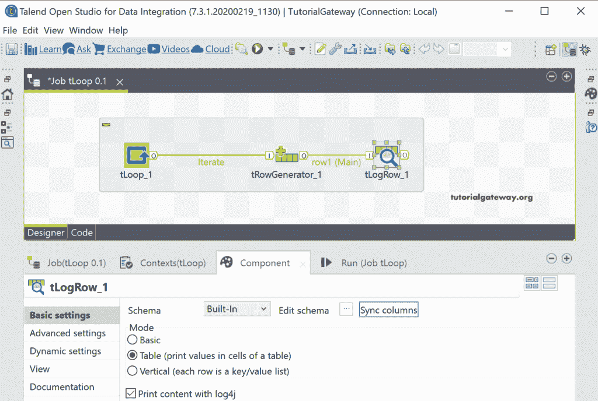

您可以看到 tLoop 输出。

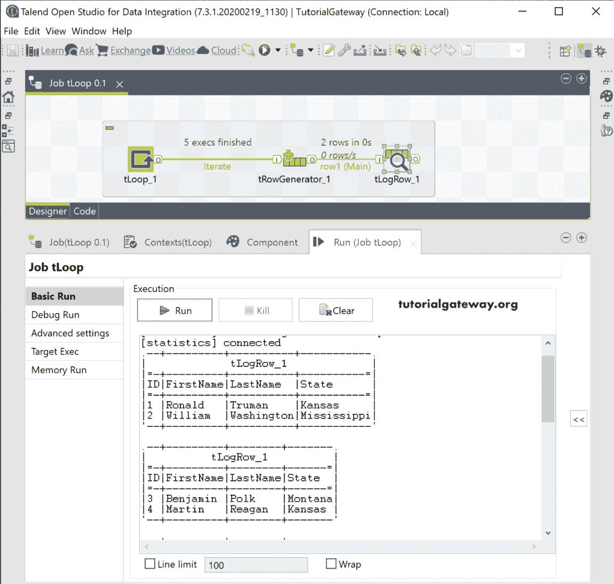

为了使这变得有趣，我们又添加了一行，其值是 tLoop 当前值。使用控制+空间获得建议。

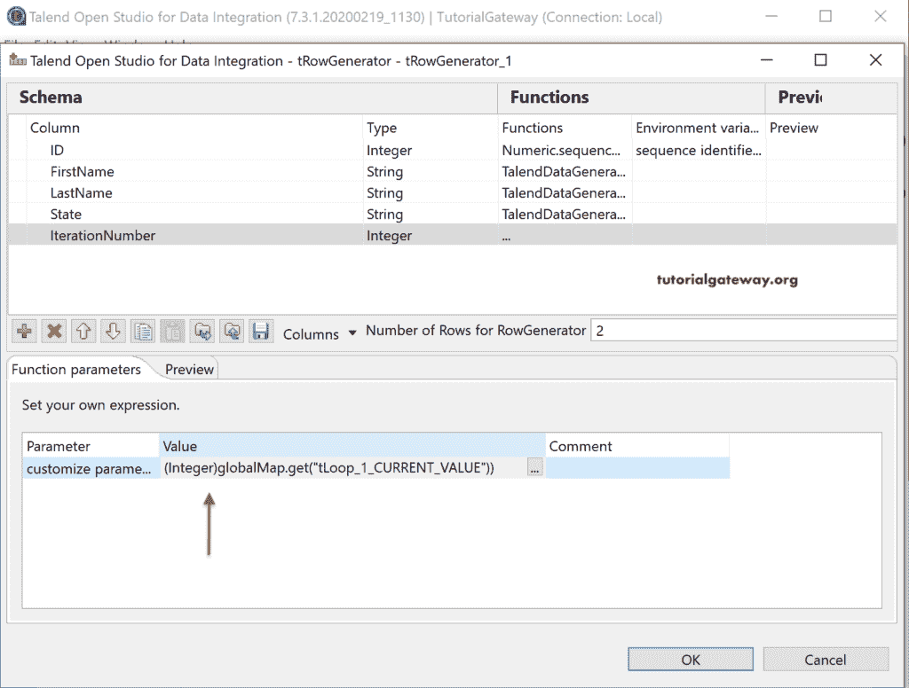

接下来，我们将 to 值更改为 3，以容纳单个屏幕截图中的所有结果。

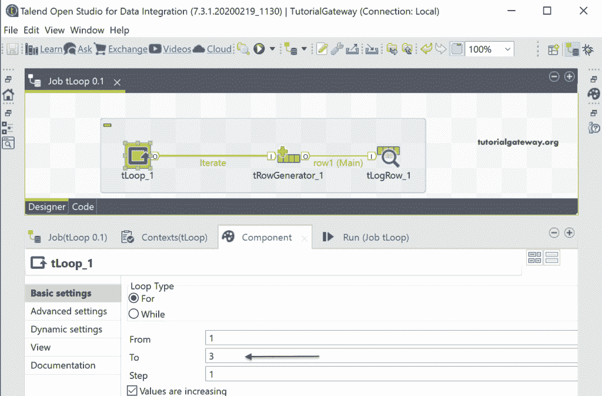

现在，您可以看到每次迭代随机生成的两行。

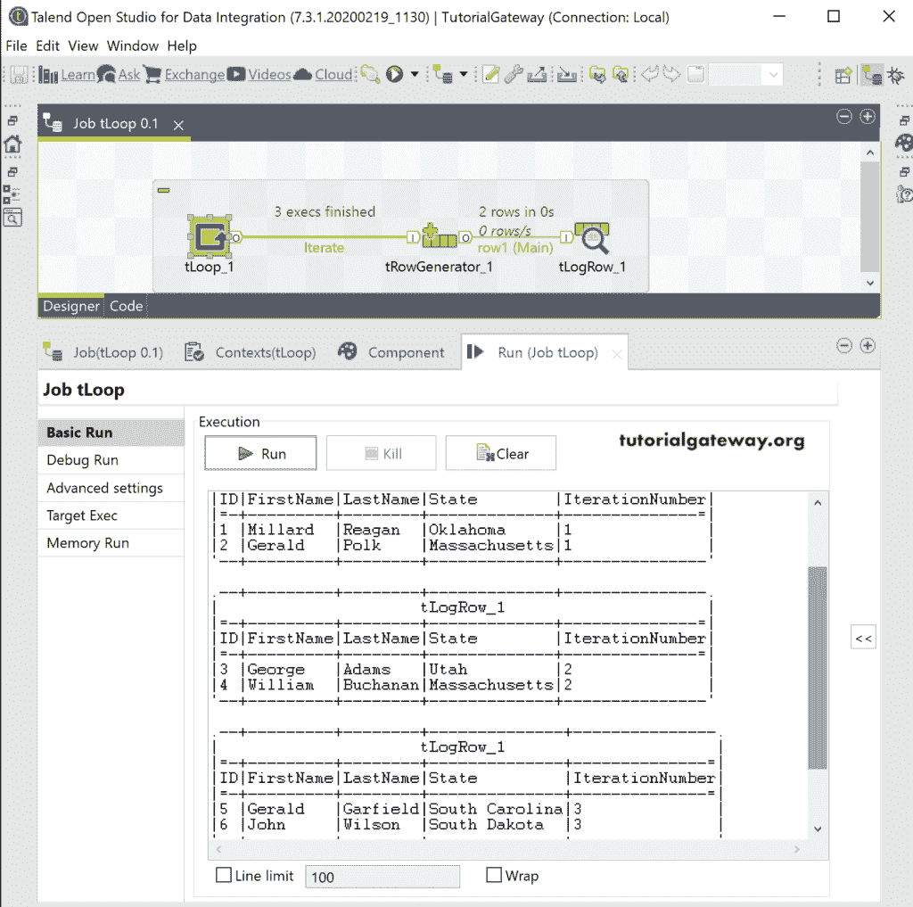