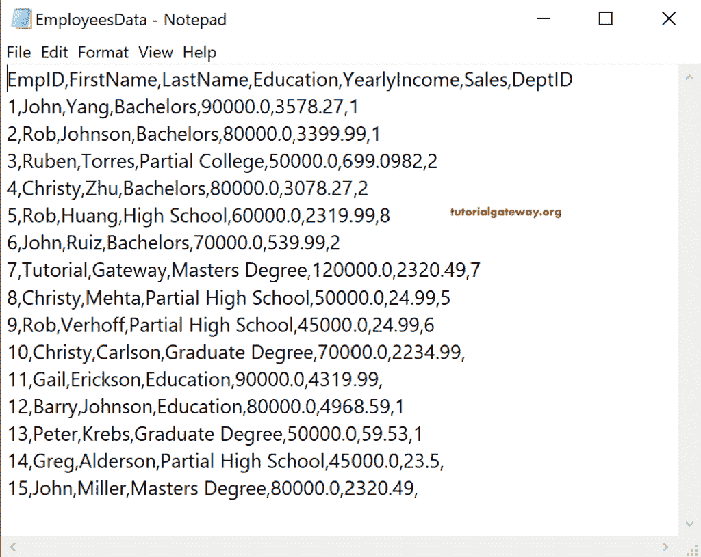
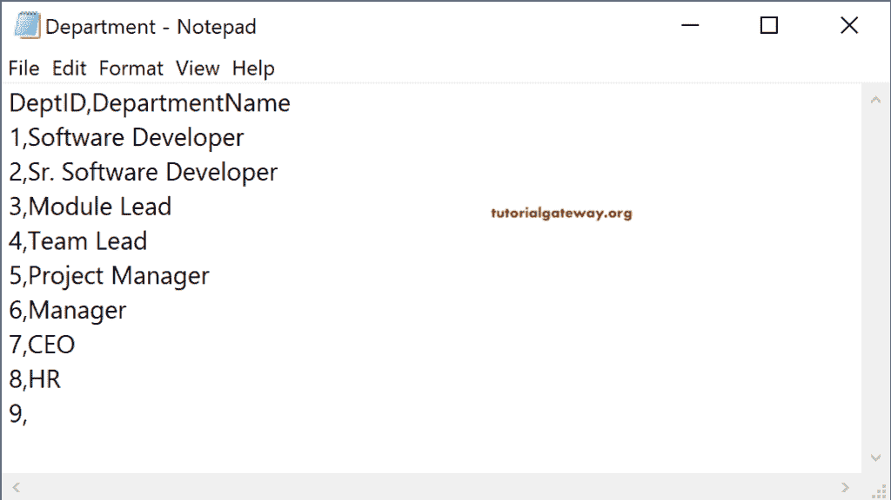
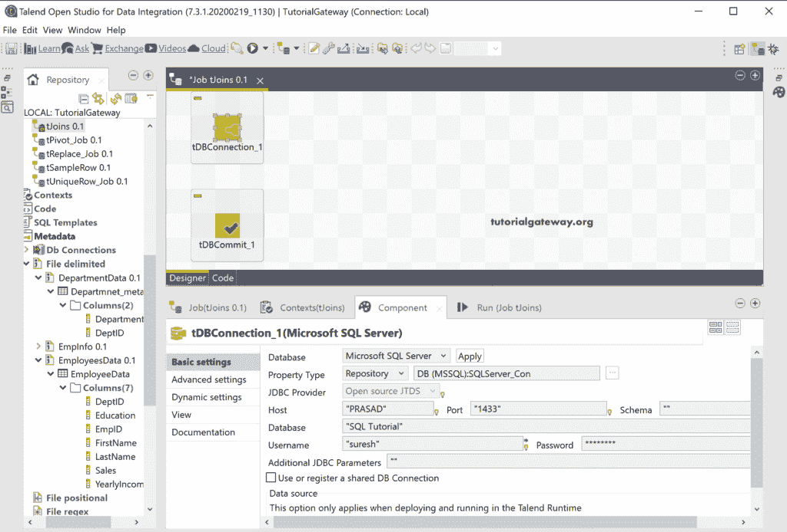
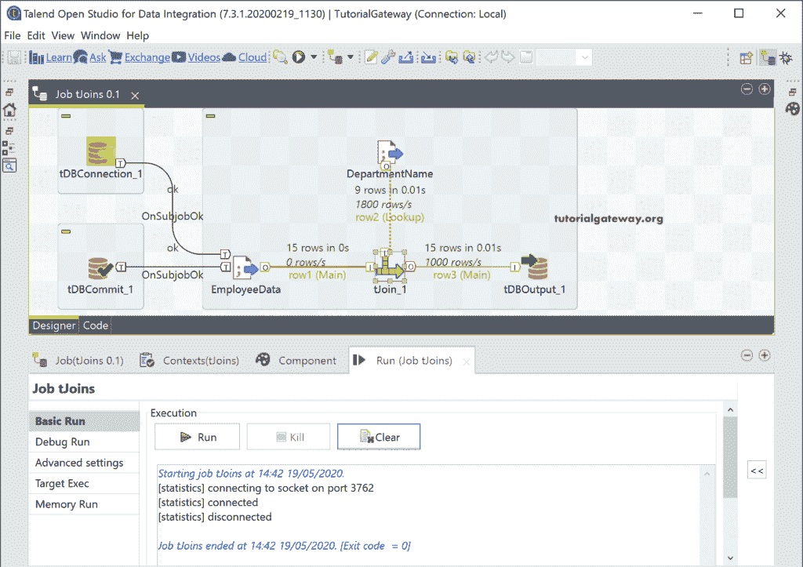

# 人才加入

> 原文：<https://www.tutorialgateway.org/talend-joins/>

Talend Joins 或 tJoin 字段可帮助您根据键属性执行联接或联接两个源，并返回输出。通常，Talend 联接执行左联接(默认)和内联接。但是，通过交换这两个表，我们也可以执行右连接。

*   内部连接:只返回两个表中匹配的记录。
*   左连接:返回左表或主表中的所有记录，并匹配右表或查找表中的记录。左连接是默认的塔端连接。
*   右连接:返回右表中的所有记录和左表中的匹配记录。

## Talend 联接示例

在这个例子中，我们使用雇员和部门数据来演示 Talend 连接。下面的截图显示了员工文本文件中的数据。

部门文本文件中的数据是

首先，拖放数据库连接来建立一个到 SQL 的连接，在这里我们保存 Talend tJoin 输出。接下来，tDBCommit 提交更改并关闭连接。

从下面的截图中可以看到，我们已经为上面的两个文本文件创建了元数据。因此，我们将这两种元数据拖放到作业设计中，并选择 tFileInputDelimited 作为组件。

接下来，拖放 [Talend](https://www.tutorialgateway.org/talend-tutorial/) tJoin 字段。从 tJoin 工具提示中可以看到，它在主数据流和查找流之间执行内部或外连接。

请将主行从员工数据连接到连接。接下来，用 tJoin 连接部门名称。您可以注意到，它显示了部门名称文件的第 2 行(查找)。因为 Talend 首先将连接的一个视为主表，第二个将是查找表。您可以通过将另一个表作为第一个表连接到 tJoin 来更改顺序。

“连接组件”选项卡有三个选项。

*   在输出中包含查阅列:请选中此选项以包含查阅表中的额外列。例如，在输出中添加查找表中的部门名称。
*   键定义:请选择输入键列和查找键列。在这里，您必须从查找表的主键和外键中选择公共列或主键。
*   内部连接(带有拒绝输出):默认情况下，Talend tJoin 执行左外连接。请选中此选项以执行内部连接。

接下来，单击“编辑模式”按钮，将主表和查找表中所需的列添加到 tJoin 输出中。

这里，我们添加了除部门数据之外的所有员工数据列。

接下来，我们从查找或部门表中添加了部门名称。

请使用加号按钮添加密钥定义。让我选择 DeptID，因为它是两个文本文件中的公共列。

您可以看到输入键和查找键属性。

到目前为止，我们还没有包括查找列。因此，请勾选“在输出中包含查找列”选项。它将打开一个新的部分来选择输出列和查找列。

*   输出列:请从 tJoin 输出中选择列名。
*   查阅列:请从查阅表或部门表中选择列名。

请为两者选择部门名称。

这里，我们将 Talend tJoin 输出保存在一个 [SQL](https://www.tutorialgateway.org/sql/) 数据库中。因此，使用 DBOutput，它使用现有的连接。接下来，我们将创建一个新表 Talend_Joins(如果不存在的话)作为目标表。

让我们运行 Talend Joins 作业。

让我打开[管理工作室](https://www.tutorialgateway.org/sql-server-management-studio/)查看 Talend 左外连接结果。

### Talend 内部连接

请选择“终止连接”字段，并选择“内部连接拒绝行”以在“增长”中显示被拒绝的行。

接下来，请勾选内部连接(拒绝输出)选项。

运行 Talend 联接作业后，您可以看到四个内部联接被拒绝的行。

在 [SQL](https://www.tutorialgateway.org/sql/) 查询中，可以看到 Talend [内部连接](https://www.tutorialgateway.org/sql-inner-join/)输出。

### 右端连接

从技术上讲，塔尔端没有右连接。但是，通过更改查找表和主表，我们可以实现这个目标。因此，让我通过右键单击第 2 行(查找)将 DepartmentName 表设置为 main，并选择将此连接设置为 Main 选项。

接下来，您必须在列映射中添加查找表(我指的是雇员表)中的字段。

让我来做这个塔尔端右加入的工作。

塔尔端右连接的结果是

