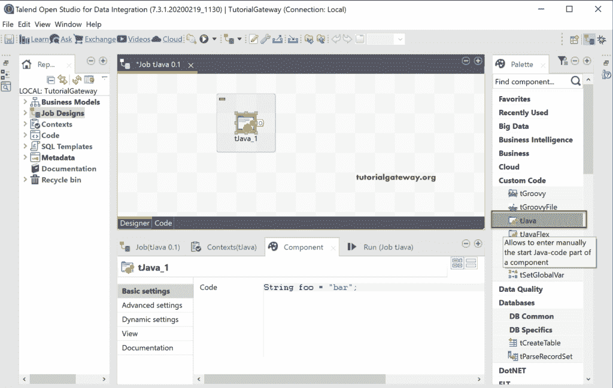

# 会说话的女孩

> 原文：<https://www.tutorialgateway.org/talend-tjava/>

Talend tJava 组件允许我们编写自己的定制 Java 代码。在这个例子中，我们使用这个 Talend tJava 组件并编写一个简单的打印行 Java 语句。

## Talend tJava 示例

将 Talend tJava 组件从调色板拖放到作业设计中。从组件选项卡中可以看到，它有默认的 java 代码，该代码声明了一个字符串变量并为其分配了 bar。



让我编写一个简单的带有欢迎消息的 println 语句，并运行 Talend Java 作业。


从下面的截图，可以看到消息。


### tJava 示例 2

在本例中，我们使用的是之前创建的[复制](https://www.tutorialgateway.org/talend-replicate/)作业。我们使用子作业中的 OnSubjectOk 触发器，并将其连接到 tJava。

在 [Talend](https://www.tutorialgateway.org/talend-tutorial/) tJava 组件代码中，我们正在打印

*   从 tDBInput 传递的总行数。
*   执行字符串替换后，插入到环行表中的行数。
*   执行聚合后插入到聚合行表中的总行数。


为了得到这些结果，我们在 [Java](https://www.tutorialgateway.org/java-tutorial/) 代码中使用了全局变量 NB_LINE(获取传递的行数或行数)。

```
String x = "Total Input Rows = ";
x = x + globalMap.get("tDBInput_1_NB_LINE");
System.out.println(x);

String y = "Total Rows inserted in Talend_Replace Tabel = ";
y = y + globalMap.get("tDBOutput_1_NB_LINE");
System.out.println(y);

String z = "Total Rows inserted in Aggregate Row Tabel = ";
z = z + globalMap.get("tDBOutput_2_NB_LINE");
System.out.println(z);

String r = "Total Rejected Rows by Aggregate Row = ";
r = r + globalMap.get("tDBOutput_2_NB_LINE_REJECTED");
System.out.println(r);
```

一旦运行了 Talend Java 作业，就可以看到输出。

