# 会说话的女孩

> 原文：<https://www.tutorialgateway.org/talend-tjavarow/>

Talend tJavaRow 组件接受输入行，并生成输出行。我们可以使用这个 Talend tJavaRow 来编写一个定制的 Java 代码来执行任何转换。一般来说，来自 Java 背景的人使用这个 tJavaRow 来完成任何事情。

在这个例子中，我们使用这个 Talend tJavaRow 组件来编写一个执行字符串对话和数学运算的 Java 代码。

## Talend tJavaRow 示例

首先用 tDBConnection、tDBCommit、tDBInput 建立 SQL 连接，选择 Customer 表。

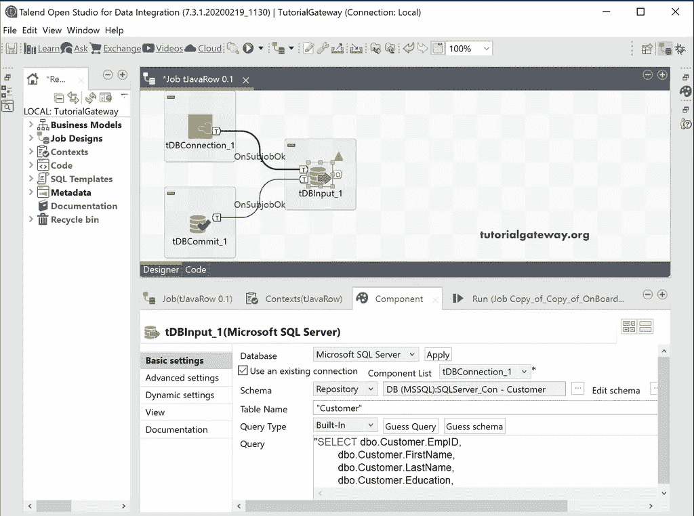

接下来，将 Talend tJavaRow 组件从调色板拖到作业设计中。从工具提示中，tjavaRow 允许我们手动输入组件的主要 Java 代码部分。

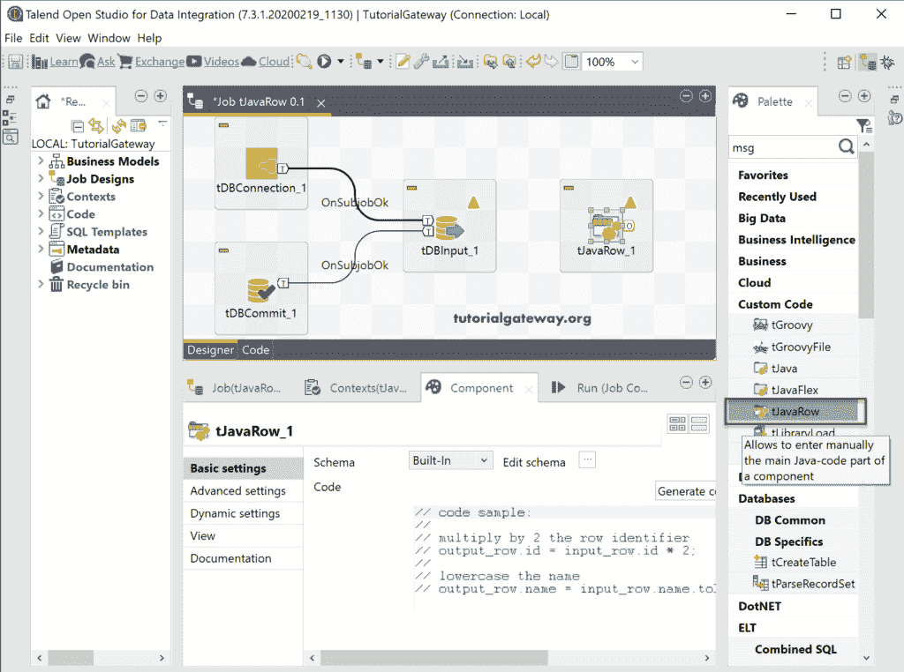

在组件选项卡中，它包含带有一些代码示例和模式选项的 java 代码部分。请使用“编辑模式”按钮检查模式。

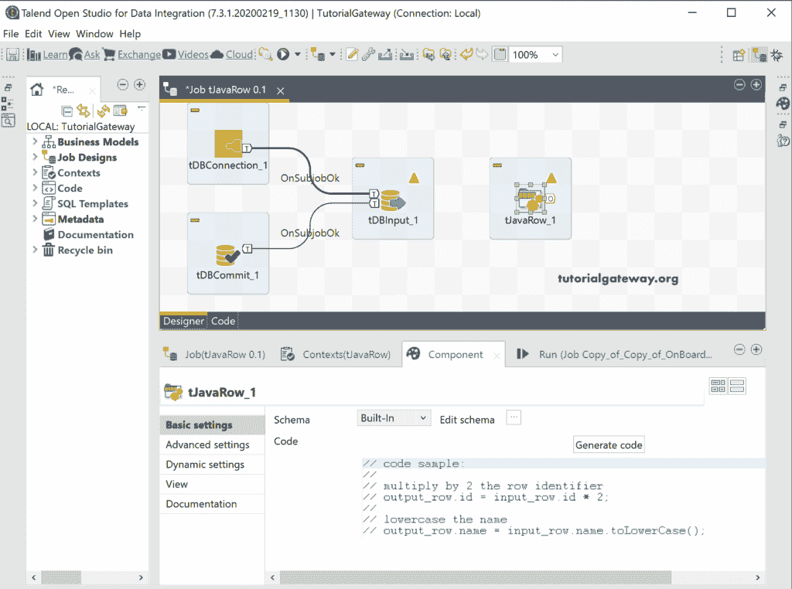

单击生成代码按钮将生成以下代码。它将输出行(tJavaRow 输出)值分配给 input_row(来自 tDBInput 的值)。这意味着，下面的代码将读取所有记录并分配给 tJavaRow。

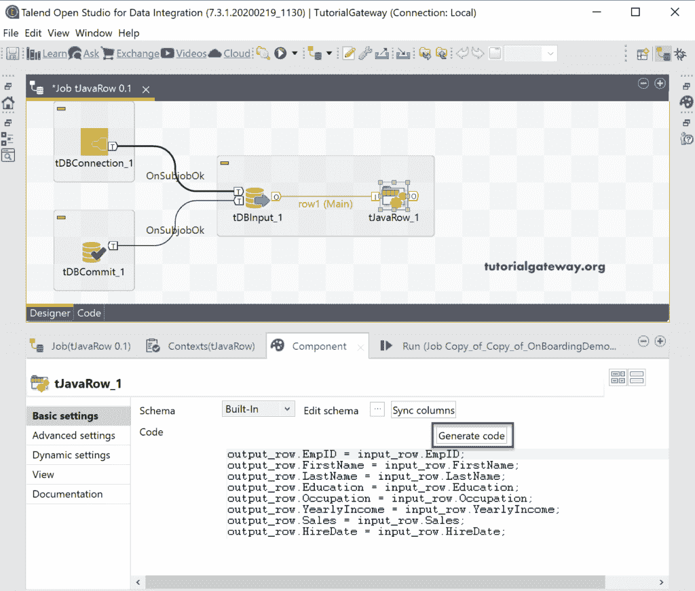

让我给 tJavaRow 分配一个 tLogRow 来检查记录是否到来。从下面的截图，可以看到结果。

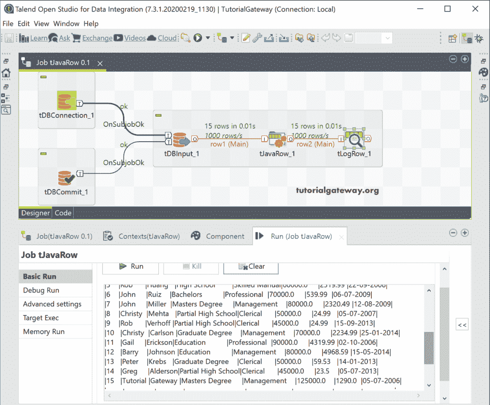

让我通过单击“组件”选项卡中的“编辑模式”按钮，向 tJavaRow 输出中再添加几列。

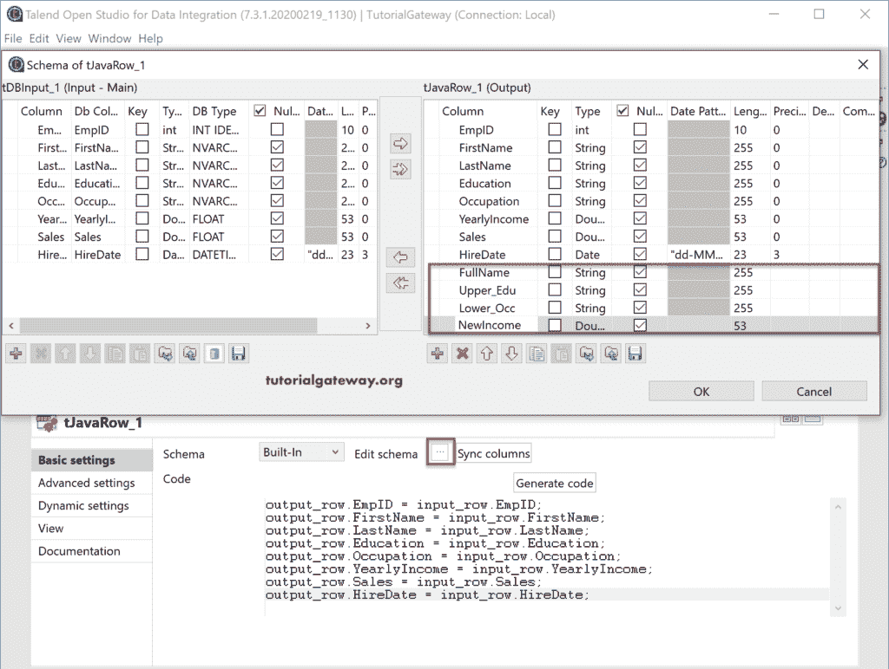

从下面的代码可以看出:

*   全名:名和姓的连接，中间有一个空格。
*   Upper_Edu =我们使用[Talend](https://www.tutorialgateway.org/talend-tutorial/)to ppercase()函数将“教育”列转换为大写。
*   Lower_Occ =我们使用 Talend toLowerCase()函数将占领列转换为小写。
*   新收入:在这里，我们在现有收入的基础上增加了 15%的奖金。

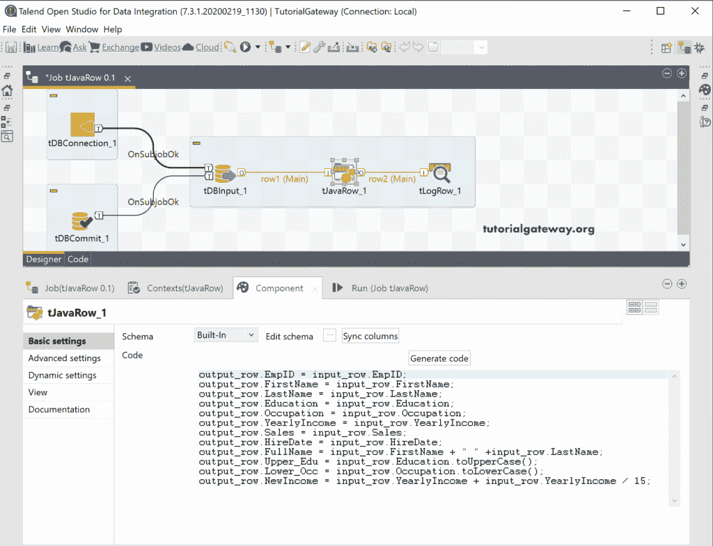

我们在上面使用的 [Java](https://www.tutorialgateway.org/java-tutorial/) 代码是

```
output_row.EmpID = input_row.EmpID;
output_row.FirstName = input_row.FirstName;
output_row.LastName = input_row.LastName;
output_row.Education = input_row.Education;
output_row.Occupation = input_row.Occupation;
output_row.YearlyIncome = input_row.YearlyIncome;
output_row.Sales = input_row.Sales;
output_row.HireDate = input_row.HireDate;
output_row.FullName = input_row.FirstName + " " +input_row.LastName;
output_row.Upper_Edu = input_row.Education.toUpperCase();
output_row.Lower_Occ = input_row.Occupation.toLowerCase();
output_row.NewIncome = input_row.YearlyIncome + input_row.YearlyIncome / 15;
```

请运行 tJavaRow 作业以查看以下结果。

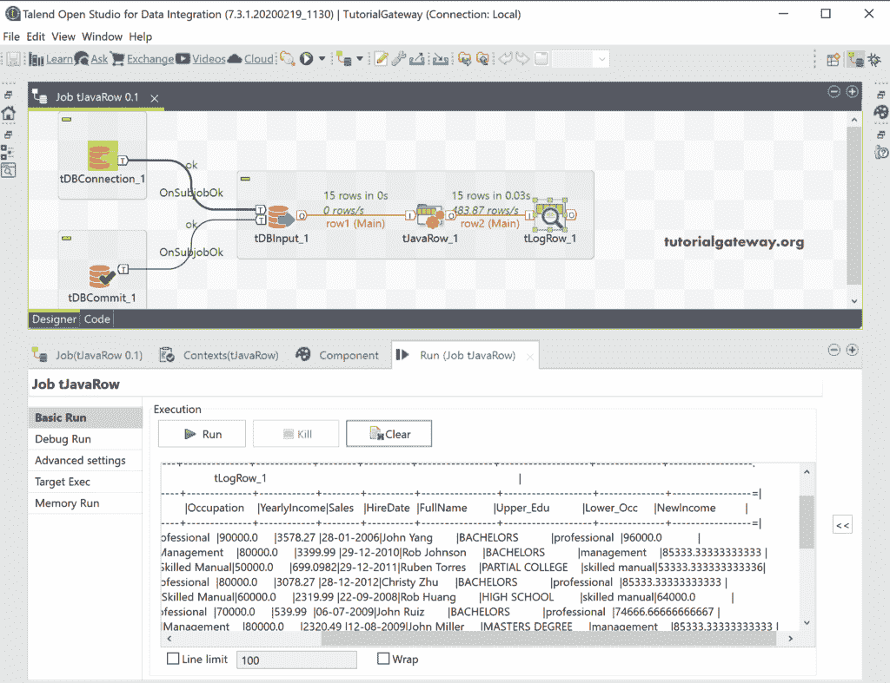

让我用 tDBOutput 替换 tLogRow，将结果保存在一个 Talend_JavaRow 中。

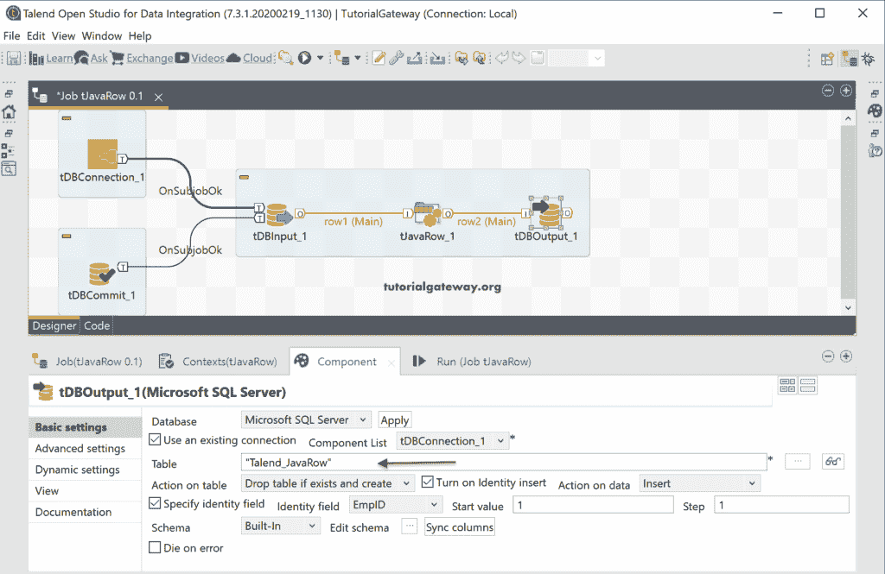

让我们运行 Talend tJavaRow 作业。

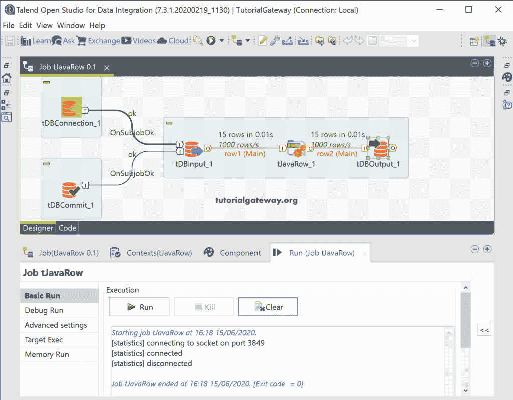

请打开[管理工作室](https://www.tutorialgateway.org/sql-server-management-studio/)查看 [SQL](https://www.tutorialgateway.org/sql/) 表中的结果。

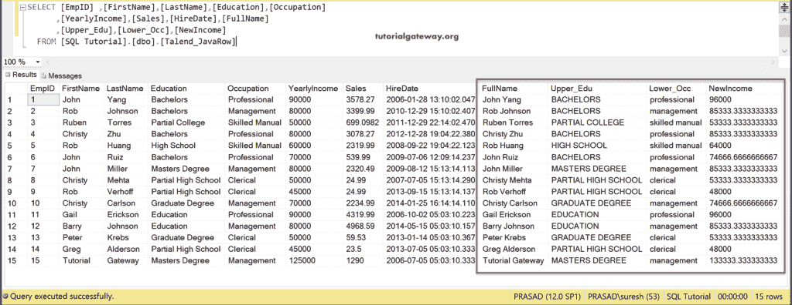