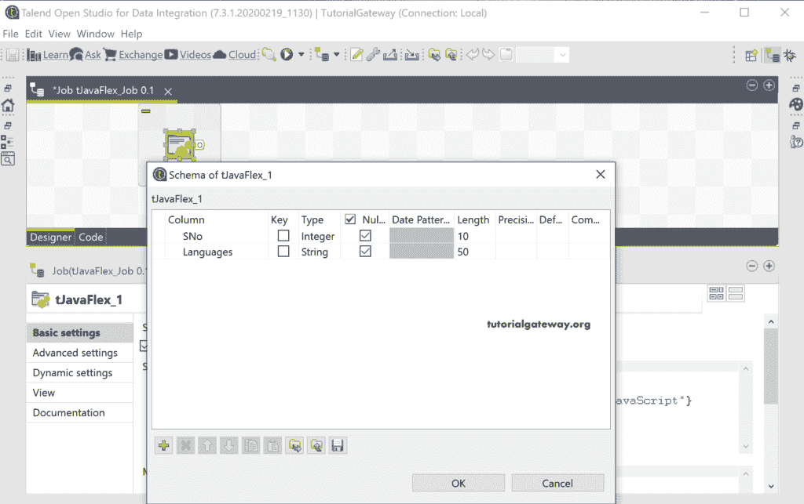

# 会说话的小偷

> 原文：<https://www.tutorialgateway.org/talend-tjavaflex/>

Talend tJavaFlex 组件提供了一个代码编辑器来编写您自己的个性化或定制的 Java 代码。我们可以使用这个 Talend tJavaFlex 将 Java 代码集成到 Talend 作业工作流中。

在本节中，我们使用一个简单的 Java 程序来显示 tLogRow 中的数组。首先，将 tJavaFlex 组件拖放到作业设计中。


从组件选项卡截图中可以看到，它有三个部分。您可以使用这些开始代码、主代码和结束代码部分来划分 Java 代码或程序。


首先，让我点击编辑模式按钮，添加整数类型的 SNo 和字符串类型的语言列。



出于 [Talend](https://www.tutorialgateway.org/talend-tutorial/) 演示的目的，我们声明了一个不同编程语言的字符串数组。在这里，我们还使用了 println 语句来打印一个简单的开始消息。您可能会注意到，我们使用了 tLogRow 来显示输出。

接下来，我们使用 [for 循环](https://www.tutorialgateway.org/java-for-loop/)来迭代[数组](https://www.tutorialgateway.org/java-array/)，并将值分配给我们在早期模式中创建的两个新列。

在结束代码部分，我们使用了另一个 println 语句来打印结束消息。


我们使用的 [Java](https://www.tutorialgateway.org/java-tutorial/) 代码是

```
// start part of your Java code
System.out.println("-----Java Code Start Point-----");
String [] arr = {"C", "C++", "C#", "Java", "Python", "JavaScript"}

// here is the main part of the component,
// a piece of code executed in the row
// loop
for(i = 0; i < arr.length; i++)
{
row1.SNo = i;
row1.Languages = arr[i];

// end of the component, outside/closing the loop
}
System.out.println("-----Java Code Start Point-----");
```

让我运行这个 Talend tJavaFlex 作业。


让我向您展示另一个 Talend tJavaFlex 组件的例子。首先，让我更改模式并添加整数类型的 Array_a、Array_b 和 Sum_of_aAndb 列。

接下来，我们声明了整数类型的 2 [二维数组](https://www.tutorialgateway.org/two-dimensional-array-in-java/)。在 for 循环中，我们将这些值分配给两个数组 Array_a 和 Array_b。接下来，我们还执行这两个数组之和的算术运算，并将这些值分配给 sum 数组。


Java 代码

```
// start part of your Java code
System.out.println("-----Java Code Start Point-----");
int[][] a = { {15, 25, 35}, {45, 55, 65} };
int[][] b = {{12, 22, 32}, {55, 25, 85} };
int rows, columns;

// here is the main part of the component,
// a piece of code executed in the row
// loop
for(rows = 0; rows < a.length; rows++) {
	for(columns = 0; columns < a[0].length; columns++) { 
		row1.Array_a = a[rows][columns];
		row1.Array_b = b[rows][columns];
		row1.Sum_of_aAndb = a[rows][columns] + b[rows][columns];

// end of the component, outside/closing the loop
	}			
}
System.out.println("-----Java Code Start Point-----");
```

您可以看到 tJavaFlex 输出。

