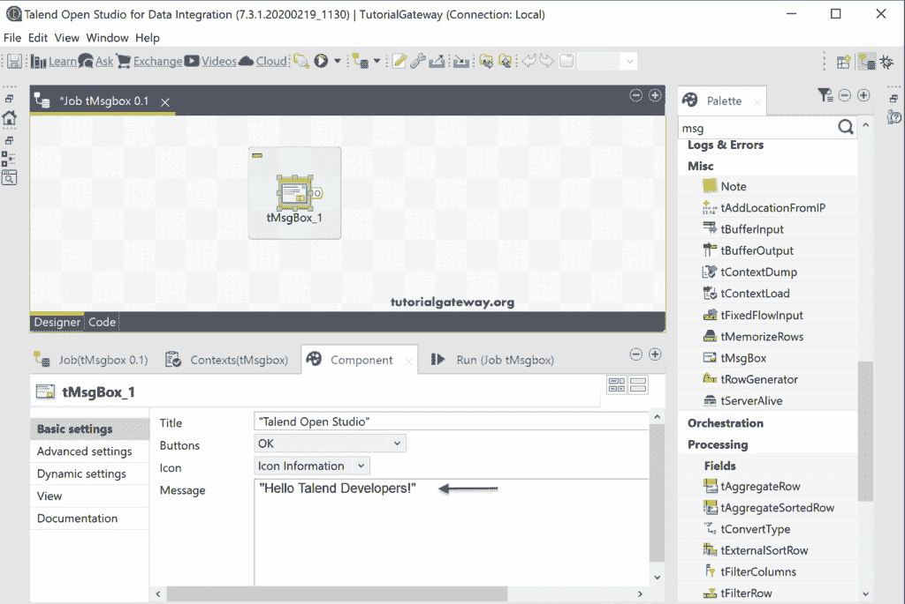

# 塔兰特 tMsgBox

> 原文：<https://www.tutorialgateway.org/talend-tmsgbox/>

Talend tMsgBox 组件帮助您显示弹出消息框。您可以在作业组件之间使用此 Talend 消息框来做出决定。在这个例子中，我们使用这个 Talend tMsgBox 组件来显示一个简单的消息和总记录。

## Talend tMsgBox 示例

将 Talend tMsgBox 组件从调色板拖放到作业设计中。从 tMsgBox 组件选项卡中可以看到，它有默认的消息框标题、按钮、图标类型和 Hello World 消息。

以下是可用按钮的列表。请按你的要求使用。

图标是

在这里，我们更改了默认消息并运行了 Talend 消息框作业。

从下图中，您可以看到消息框。

### Talend 消息框示例 2

为了演示这一点，我们使用了 tFilerRow 作业。接下来，我们将组件正常触发从 tDBInout 和 tDBOutput 连接到 tMsgBox。

对于第一个消息框，我们显示从 tDBInput 到 tFilterRow 的输入记录总数。

我们显示的是在第二个消息框应用了筛选器行组件后插入到目标表中的记录总数。

让我运行这个 Talend tMsgBox 作业。下图显示了 tDBInput 组件正常后显示的第一个消息框。

tDBOutput 组件后的第二个 [Talend](https://www.tutorialgateway.org/talend-tutorial/) 消息框正常。

