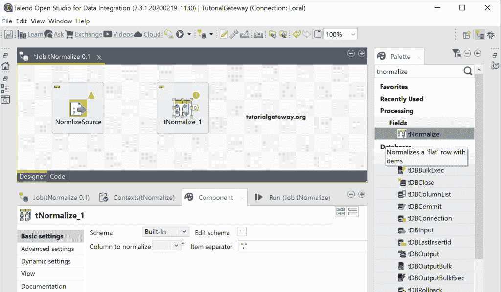

# Talend 规范化

> 原文：<https://www.tutorialgateway.org/talend-tnormalize/>

Talend tNormalize 有助于规范化非规范化数据，以便我们可以使用该清理数据进行进一步的操作。这个 Talend tNormalize 组件用于规范化源数据，就像我们在数据库规范化中所做的那样。

为了演示 Talend tNormalize，我们使用了下面显示的文本文件。正如您所注意到的，“销售”列有多个用分号分隔的条目。

## Talend 规范化示例

在开始创建作业之前，我们为规范化源文件创建了以文件分隔的元数据。我们使用这个元数据作为源。

让我使用相同的[文件分隔元数据](https://www.tutorialgateway.org/talend-load-data-from-text-file-into-database/)作为 Talend 规范化组件的源。

接下来，将 tNormalize 拖放到作业窗口中。

从下面的“规范化组件”选项卡中可以看到，它有两个选项

*   要规范化的列:请选择要展开或规范化的列。
*   项目分隔符:请键入分隔该规范化列内内容的项目。

请单击“编辑模式”按钮，检查模式或输入和输出列。

这里，我们选择“销售”列作为规范化列。

接下来，我们使用分号作为项目分隔符。

为了显示标准化数据的结果，我们使用了 tLogRow。

让我运行[Talend](https://www.tutorialgateway.org/talend-tutorial/)t 正式化作业并查看结果。

我们希望将 tNormalize 输出存储在文本文件中，以将其用作[tdnormalize](https://www.tutorialgateway.org/talend-tdenormalize/)源。这里，我们将结果保存在一个文本文件中，包括标题和用逗号分隔的列。接下来，运行 Talend tNormalize 作业。

在文件系统中，让我打开文本文件向您显示结果。

