# Talend 透视列

> 原文：<https://www.tutorialgateway.org/talend-pivot-columns/>

Talend 透视列或 tpivottocolumns 分隔字段，用于根据“按列分组”和“与”聚合函数透视给定的列。但是，Talend 透视列将输出写入文件(而不是任何数据库)。所以，要使用这个 Talend 透视数据，你必须使用另一个 [tFileInputDelimited](https://www.tutorialgateway.org/read-text-file-in-talend/) 并选择这个输出文件。

在这个数据透视表示例中，我们使用了 SQL 数据库中的数据透视表源表。下面的 Talend 屏幕截图显示了 Pivot 源表中的数据。

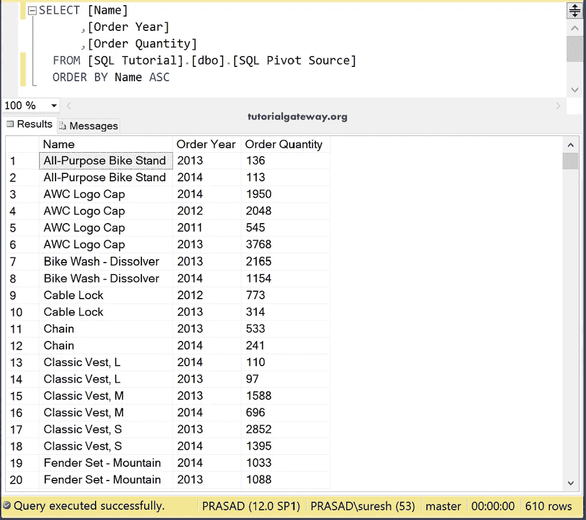

## 倾斜枢轴列示例

首先，拖放 DBInput、DBConnection、tDBCommit，从元数据中选择 [SQL](https://www.tutorialgateway.org/sql/) 透视源表。

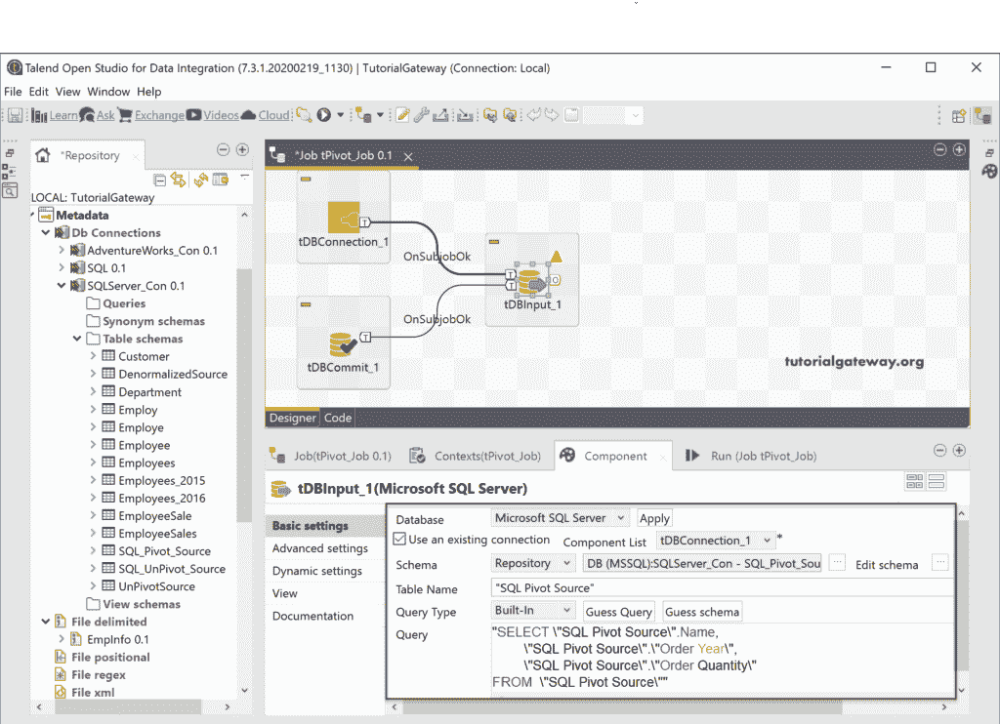

接下来，将[Talend](https://www.tutorialgateway.org/talend-tutorial/)tpivottocolumns 分隔字段从调色板拖动到作业设计。

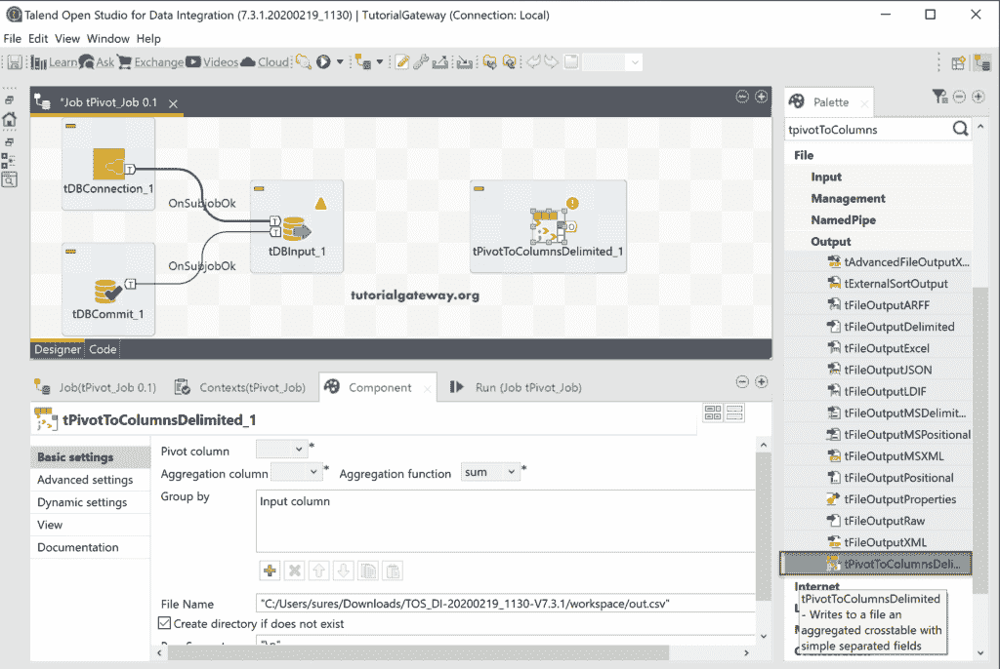

请将 DBInput 主行连接到 tPivotToColumnsDelimited。

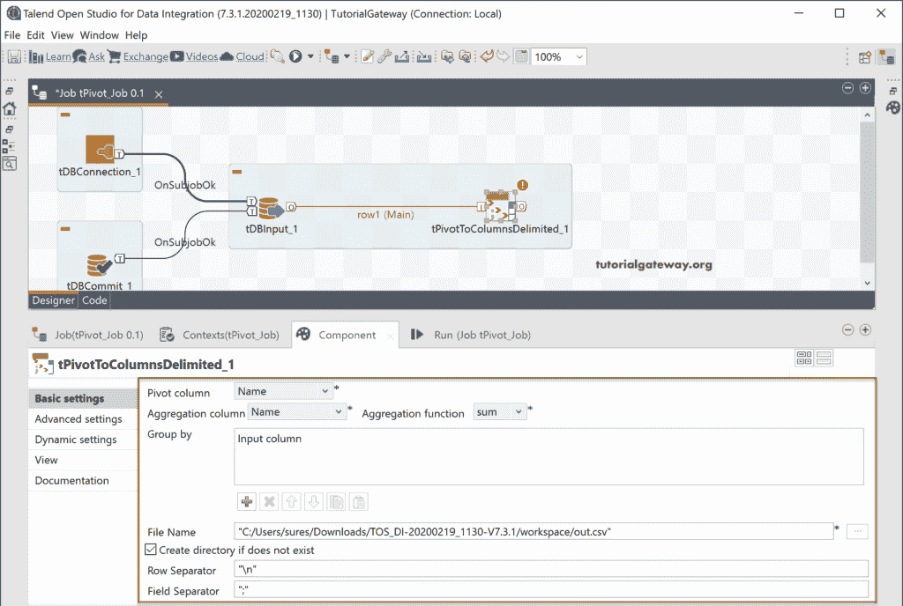

*   透视列:请选择要透视的列。该列值将转换为多个列。
*   汇总列:请选择要汇总的列。聚合将基于列的[组进行。](https://www.tutorialgateway.org/sql-group-by-clause/)
*   聚合函数:根据您的需求，从有价值的函数列表中选择聚合函数。
*   分组依据:请添加要用于分组的输入列。
*   文件名:请选择要存储此 Talend 透视列输出的文件。
*   行分隔符:请选择您的行分隔符。例如，新行、制表符、分号等。
*   字段分隔符:请添加列分隔符。

让我选择 Order_Year 作为轴心列。

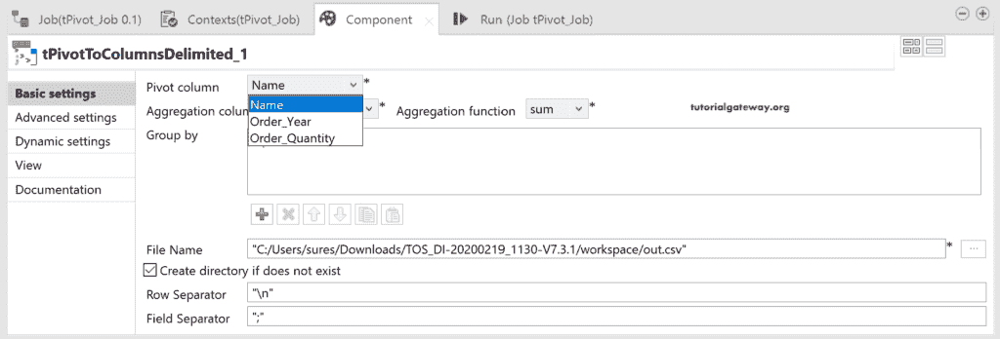

接下来，我们选择订单数量作为聚合列，选择总和作为[聚合函数](https://www.tutorialgateway.org/sql-aggregate-functions/)。

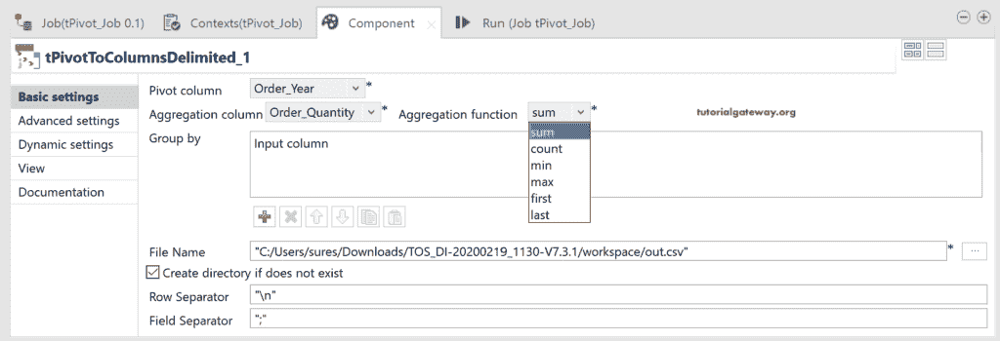

接下来，我们将名称添加为“按列分组”。

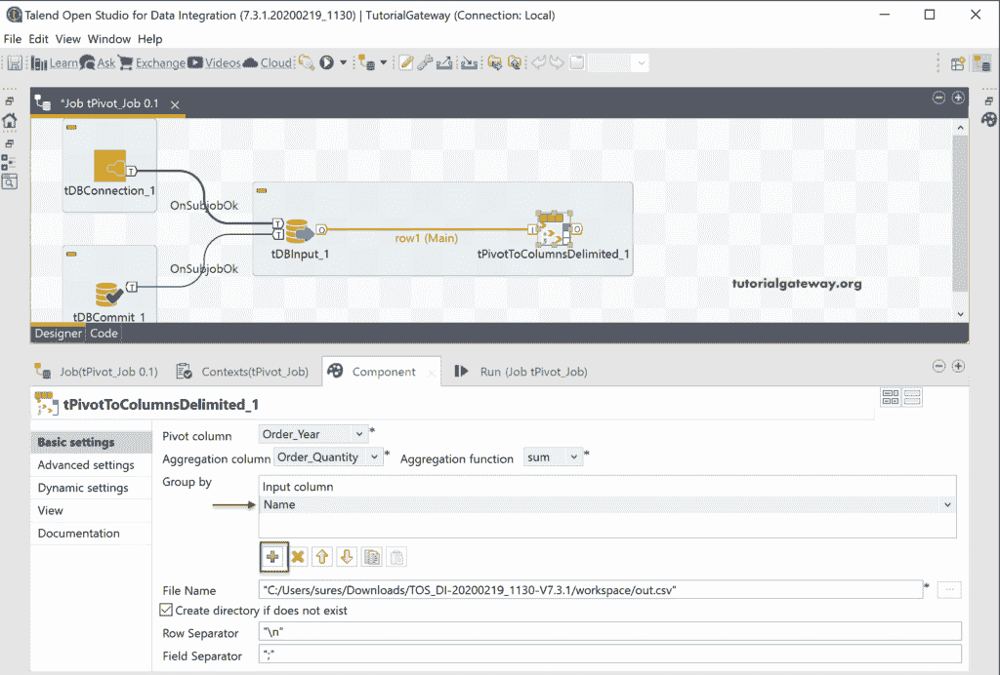

默认情况下，Talend 透视列选择默认 CSV 文件作为输出。这里，我们使用浏览按钮选择(创建)Unpivoted _ Dara.csv 文件。

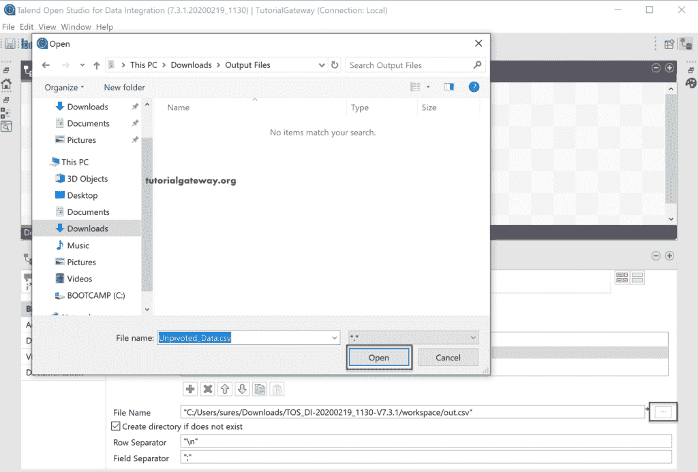

接下来，我们将字段分隔符更改为逗号。

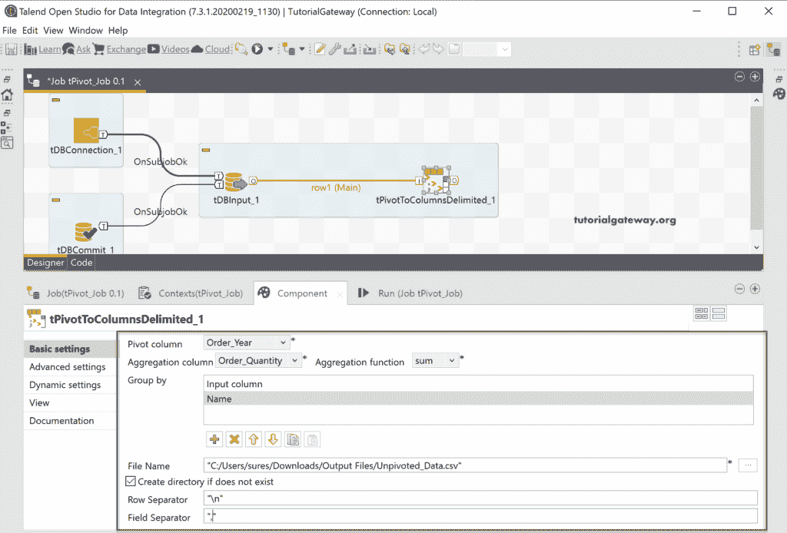

在“纵向透视列高级”设置中，您可以使用高级分隔符，如千位分隔符、十进制分隔符和一些 CSV 选项。这些在所有[文件输出](https://www.tutorialgateway.org/export-database-table-to-text-file-in-talend/)中都很常见。

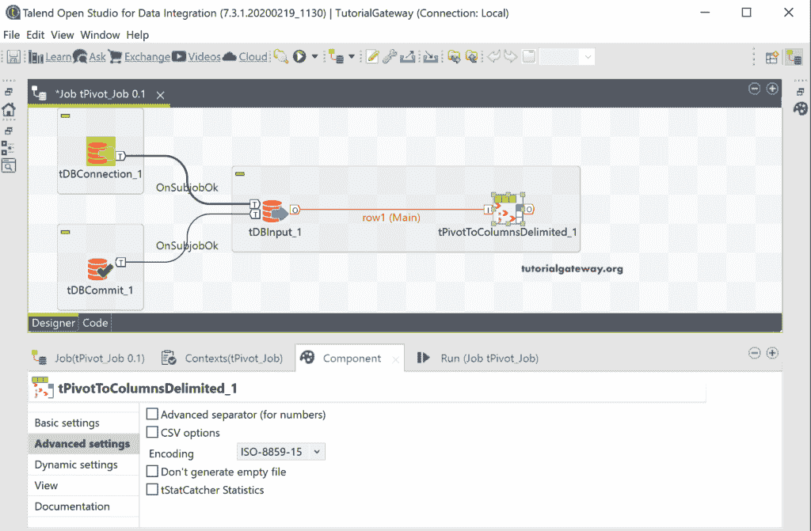

让我们运行 Talend 透视列作业。

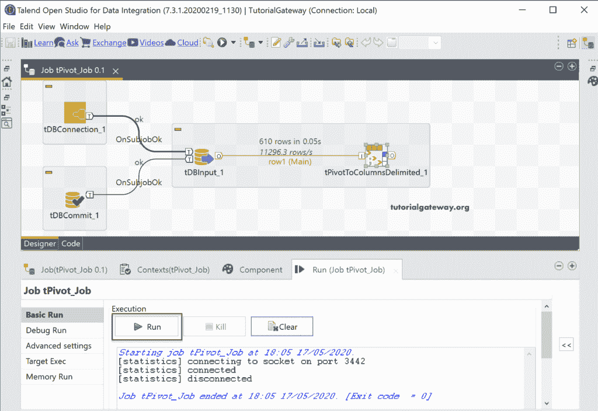

您可以在 CSV 输出文件中看到结果。

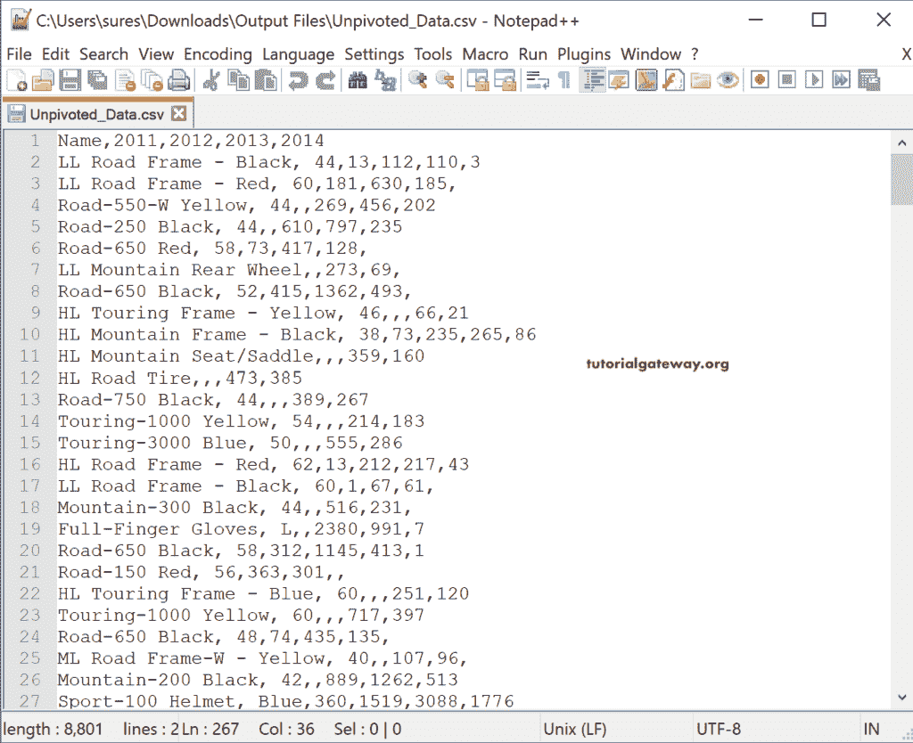

让我打开[管理工作室](https://www.tutorialgateway.org/sql-server-management-studio/)写一个 [SQL Pivot](https://www.tutorialgateway.org/sql-pivot/) 查询比较结果，两者是一样的。

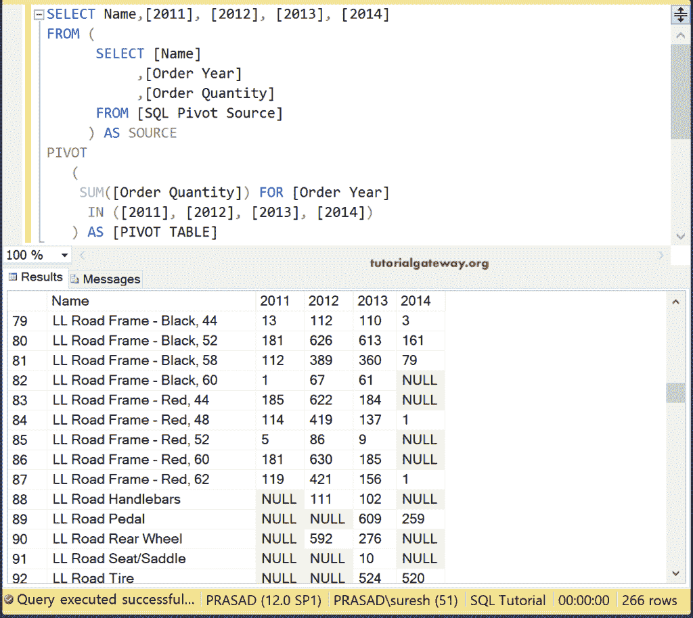