# 结束父子作业

> 原文：<https://www.tutorialgateway.org/talend-parent-child-job/>

本节通过一个示例介绍创建 Talend 父子作业的步骤。它还帮助您了解我们如何使用上下文变量将值从 Talend 父作业传递到子作业。当我们想要在 Talend 父作业中使用子作业 ETL 时，我们可以使用 tRunJob。

## Talend 父子作业示例

为了演示 Talend 父子作业，我们使用下面的 Emp 信息文本文件。

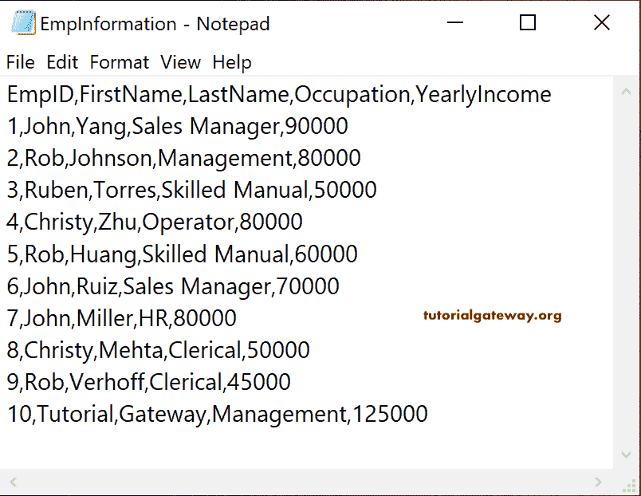

### 创建 Talend 子作业

首先，我们创建了一个子作业，并将其命名为 Child_Job。接下来，我们使用 [Talend](https://www.tutorialgateway.org/talend-tutorial/) tJava 组件打印一条简单的消息。

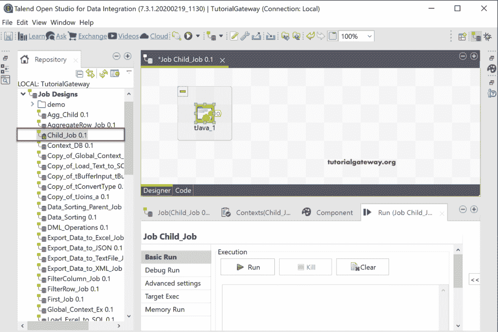

上面的文本文件有五列，我们希望使用子作业打印除 Emp ID 之外的所有列值。

一般来说，我们不会从父作业到子作业获取值。为了提供同样的效果，我们需要上下文变量。让我在这个子作业中添加四个上下文来容纳这些文本文件列。

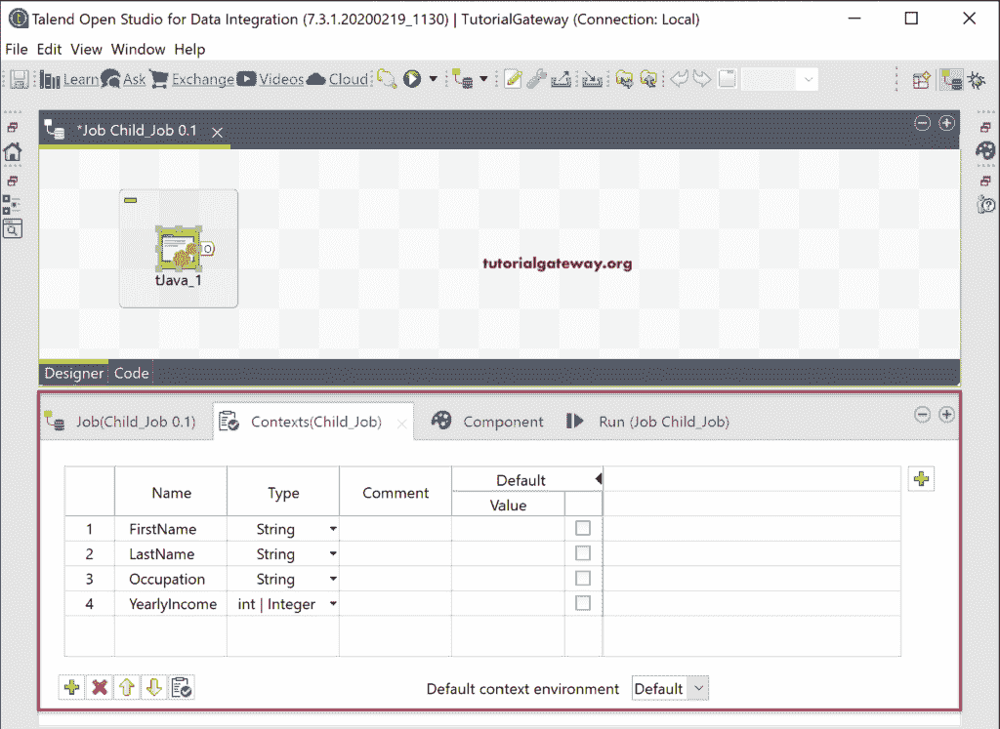

在 [tJava](https://www.tutorialgateway.org/talend-tjava/) 组件选项卡中，我们添加了以下 [Java](https://www.tutorialgateway.org/java-tutorial/) 代码。

```
System.out.println(
StringHandling.UPCASE(context.FirstName + " " + context.LastName) +
" Working as a " + context.Occupation + " earning " + context.YearlyIncome + " Monthly!"
);
```

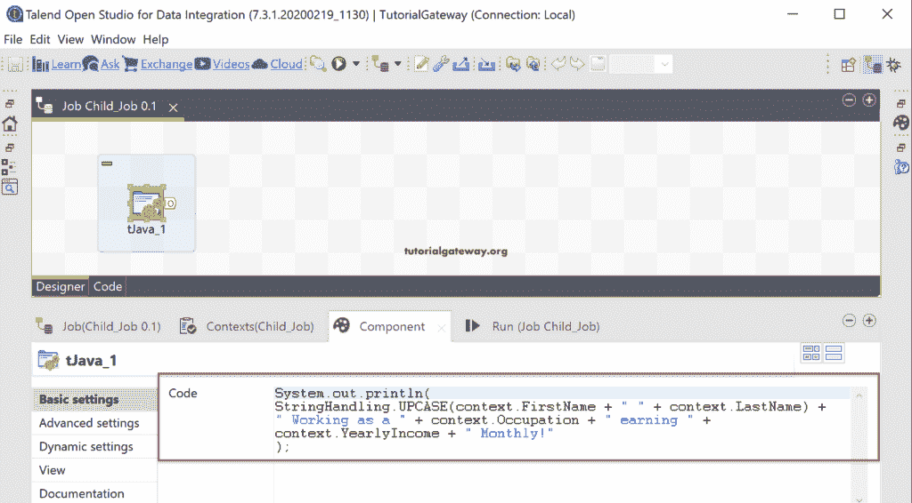

上面的代码将连接名字和姓氏。然后 UPCASE 函数将名称转换为大写。

### 创建 Talend 父作业

如您所见，我们创建了另一个名为 Parent_Job 的作业，并将 tFileInputDelimited 添加到[以将文本文件数据加载到 Talend](https://www.tutorialgateway.org/talend-load-data-from-text-file-into-database/) 中。

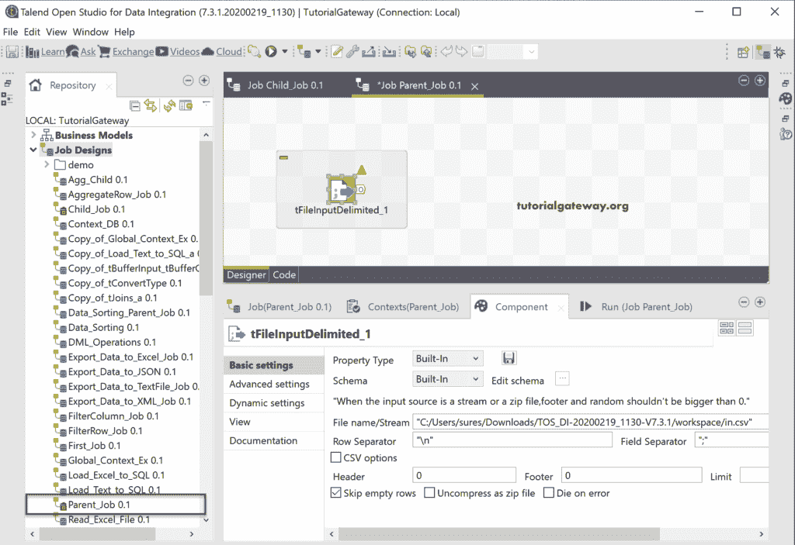

我们使用浏览按钮选择文件名，并将字段分隔符改为逗号。

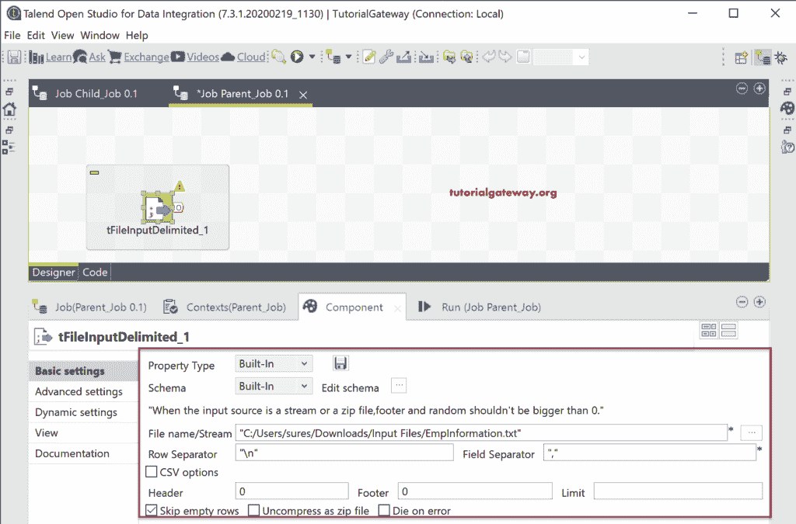

请单击编辑模式，并添加列名和长度。

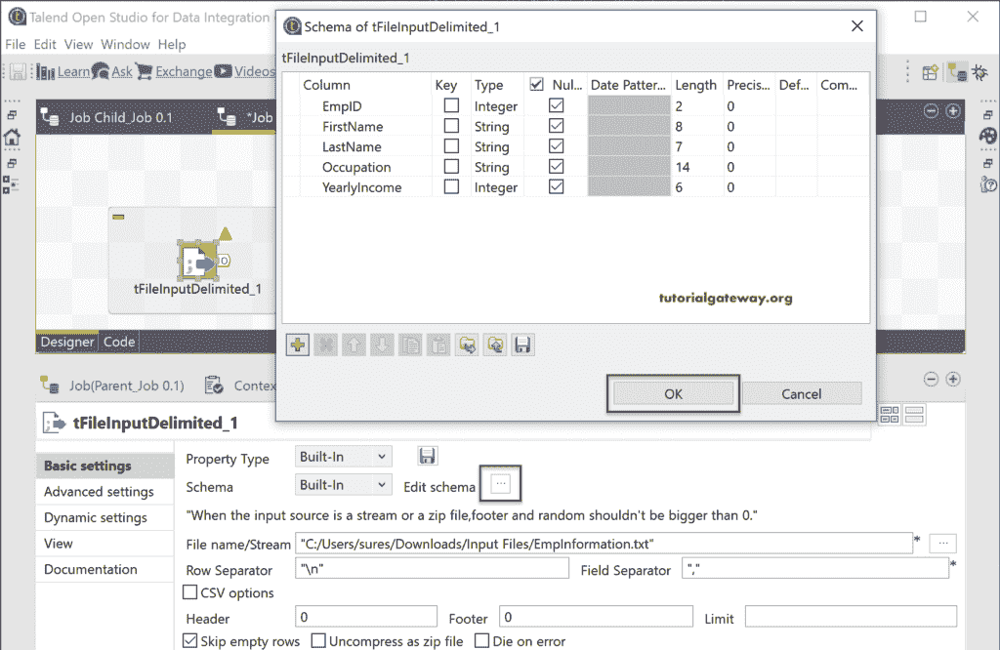

接下来，我们添加了 tFlowToIterate 来迭代文本文件中的行，然后，添加了 tRunJob。这意味着对于文本文件中的每一行，tFlowToIterate 都有助于迭代 tRunjob 并显示 print 语句。

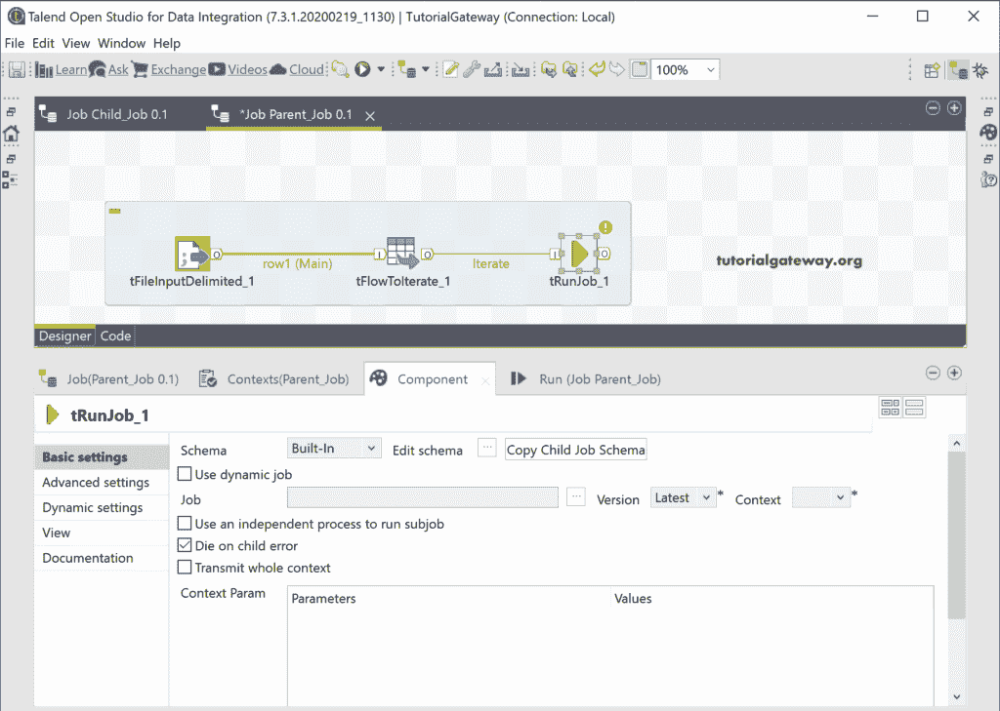

在集群作业组件选项卡中，我们选择了子作业。

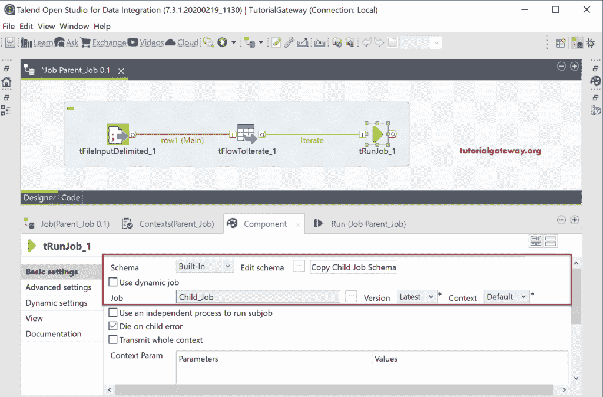

在上下文参数中，使用添加按钮添加子作业的上下文参数，即名字。如果您没有任何上下文变量，那么我们就不能将父作业中的任何值传递给子作业。

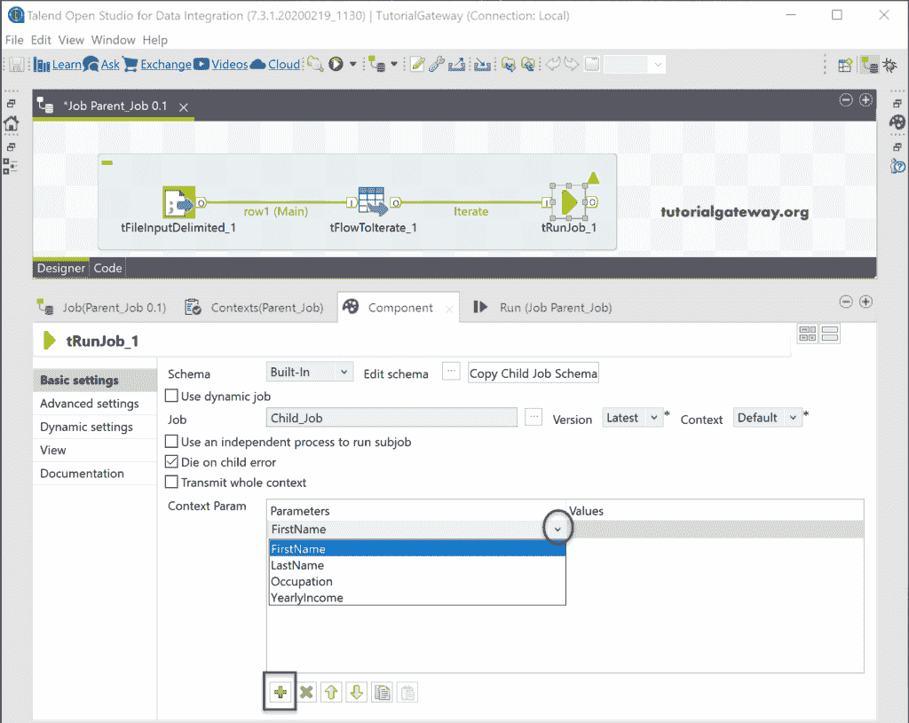

接下来，我们将 Main 行的名字分配给这个上下文参数。

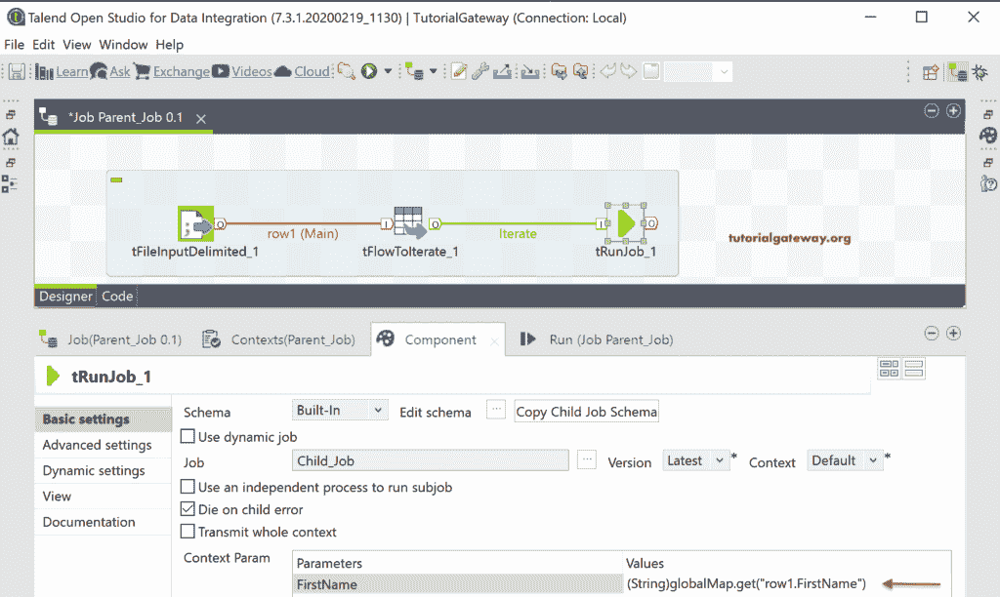

同样，为剩余的上下文参数赋值。

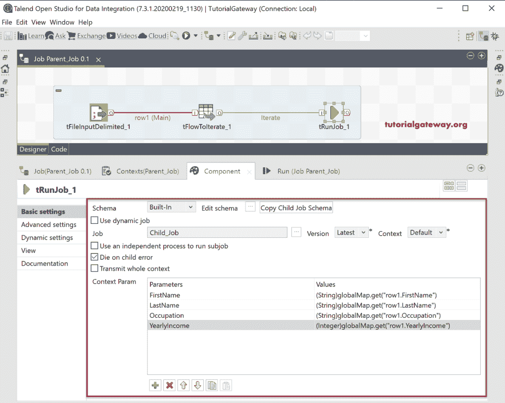

一旦点击此 Talend 父子作业的运行按钮，您就可以看到结果。如果看到执行流程，[trunk job](https://www.tutorialgateway.org/talend-trunjob/)已经执行了十次，因为 Employee 表中有十行。

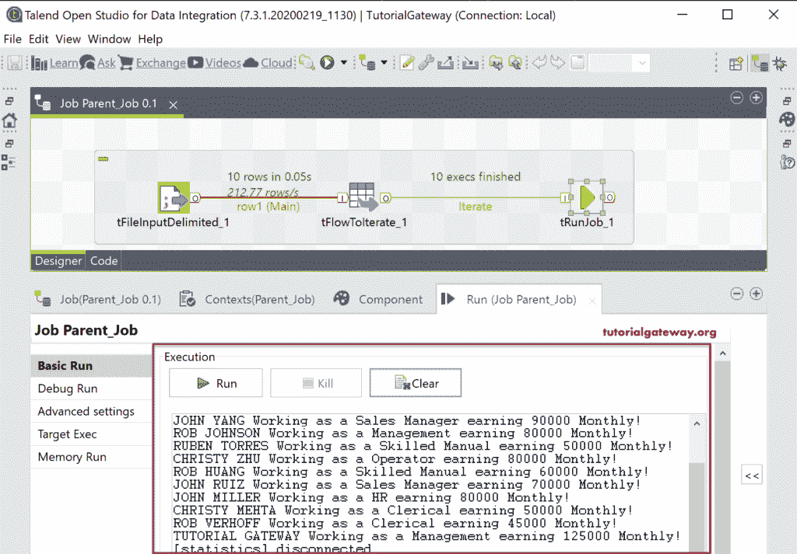