# Talend 替换数据

> 原文：<https://www.tutorialgateway.org/talend-replace-data/>

“替换数据”或“替换”字段用于替换输入行中的整个单词或单词的一部分，并返回输出。我们可以使用这个 Talend Replace 数据字段来更改错误类型的数据等。在这个 Talend Replace 数据示例中，我们使用了 Customer 表。

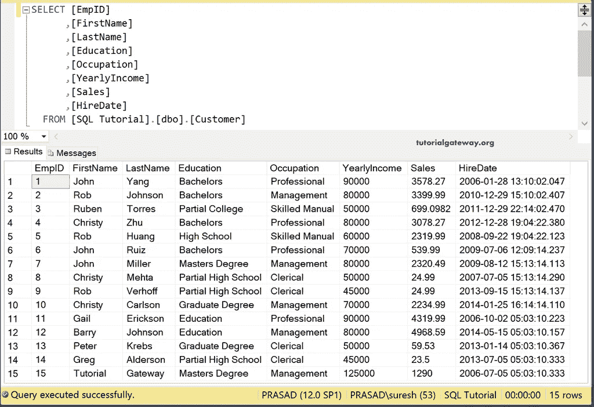

## Talend 替换或钻孔示例

首先，拖放数据库连接、数据库提交和数据库输入来建立一个 SQL Server 连接。接下来，我们从元数据中选择了客户表。

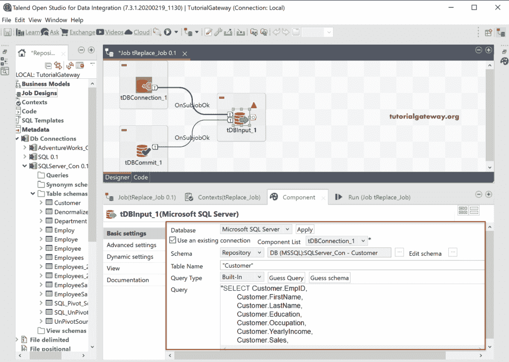

接下来，将 Talend tRepalce 从调色板拖到作业设计。从下面的工具提示中可以看到，tReplace 用另一个替换了和表达式。

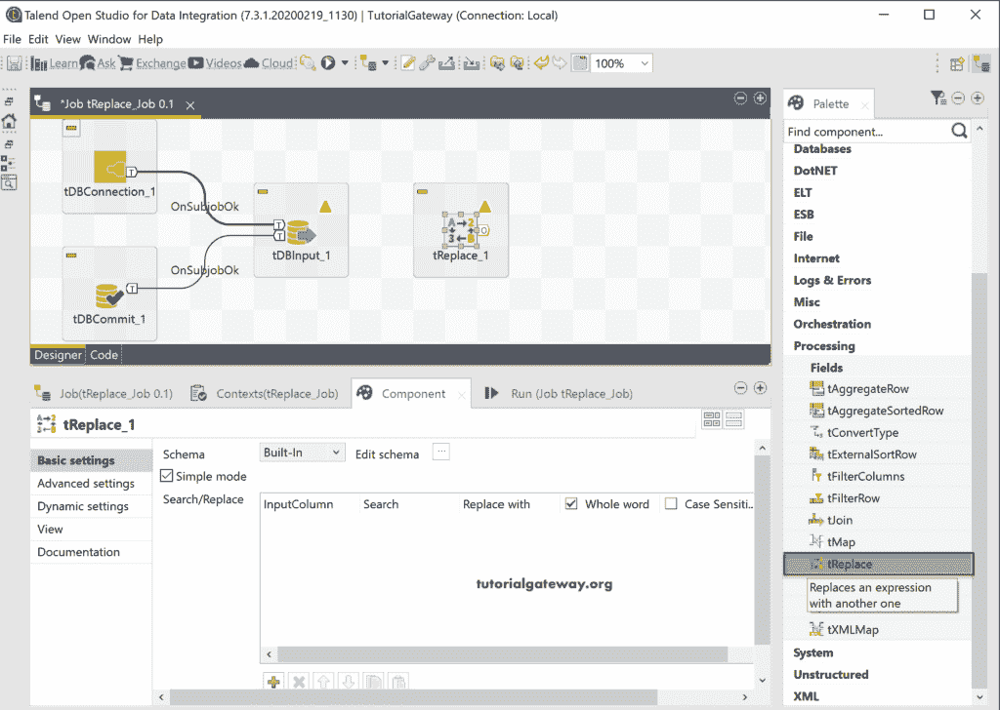

请将数据库输入主行连接到环行。大多数情况下，输入列将与特雷普蕾丝同步。如果不是这样，请单击同步列按钮。

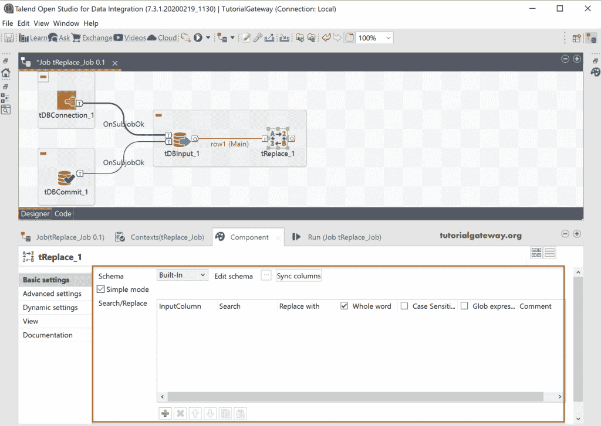

在组件选项卡中，有一个简单模式和一个高级模式。您可以使用高级模式编写正则表达式。在搜索/替换部分，我们有

*   输入列:请选择要用于搜索和替换的列。
*   搜索:请在栏内提供您要搜索的搜索词。
*   替换为:在本节中写出替换术语。
*   全词:如果你想表演整个词或词的一部分。
*   区分大小写:是否希望在区分大小写的情况下实现搜索。

在我们执行任何操作之前，单击“编辑模式”按钮，根据您的要求检查或更改特雷普蕾丝模式。

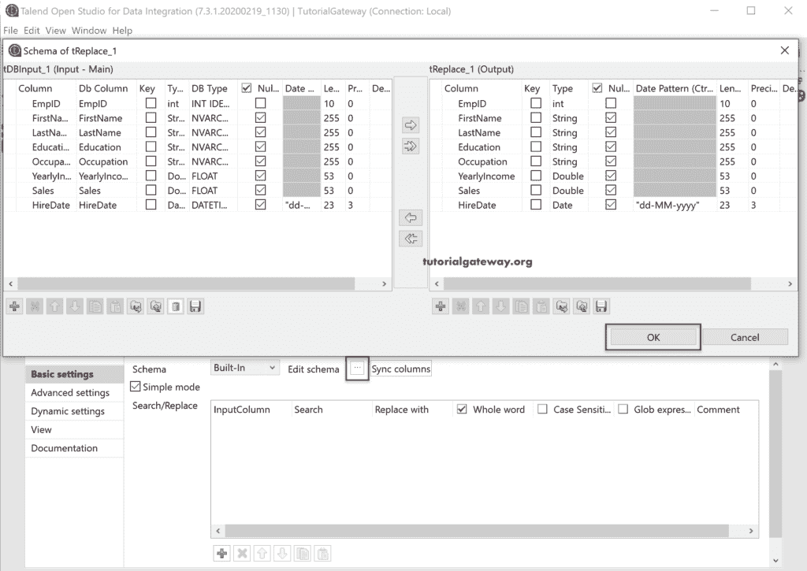

接下来，点击添加(加号)按钮。默认情况下，它会添加第一列，即 EmpID 和默认值文本。

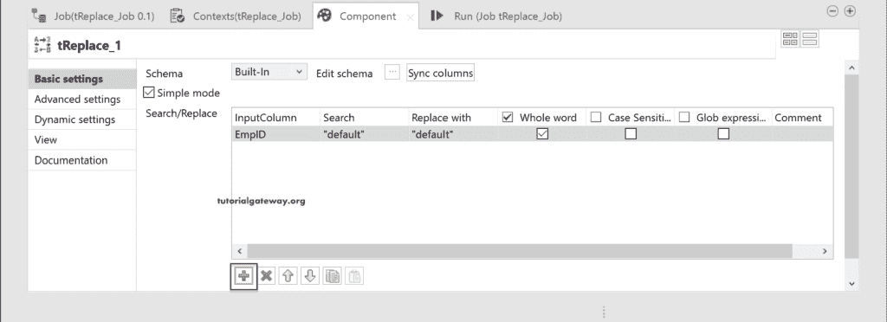

请使用下拉框选择所需的列。在这里，我们选择了列为教育，搜索词为教育，替换为科技。

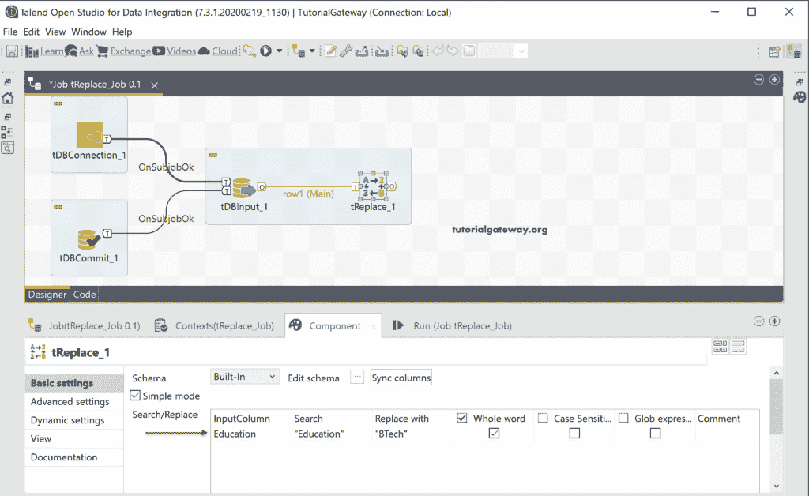

完成环钻组件配置后，我们使用数据库输出将塔端环钻位置输出保存在 [SQL](https://www.tutorialgateway.org/sql/) 数据库中。这里，我们将创建 Talend _ repalce 表作为目标表。

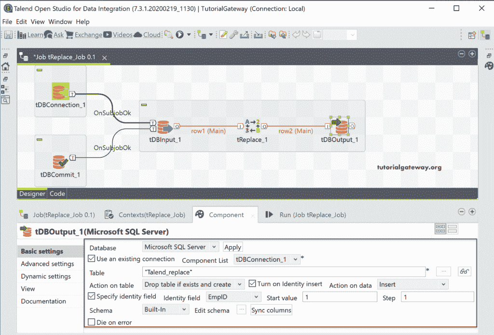

让我们运行 Talend 替换数据作业。

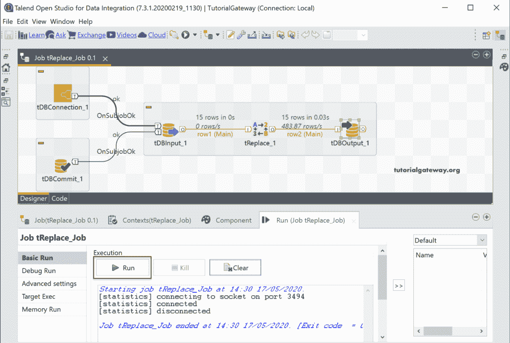

让我打开[管理工作室](https://www.tutorialgateway.org/sql-server-management-studio/)查看 Talend 套料结果。

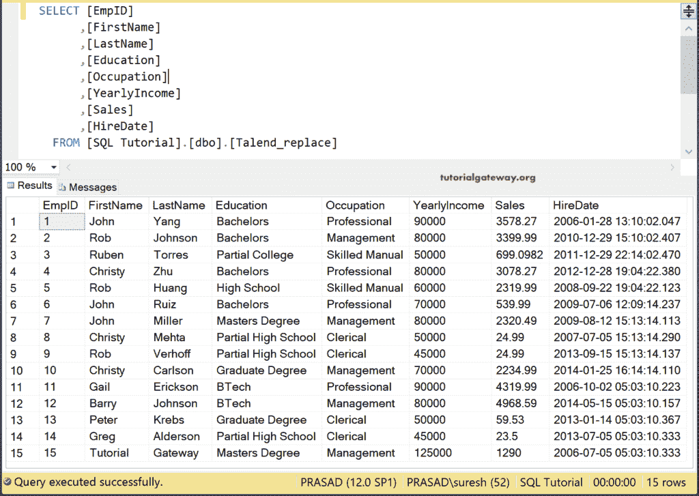

这一次，我们将使用另外两个字段并运行该作业。这意味着 Talend tRepalce 必须将“职业”字段中的 Pro 部分(而不是完整的单词)替换为 ABCD，并将“名字”列中的 John 替换为 Suresh。

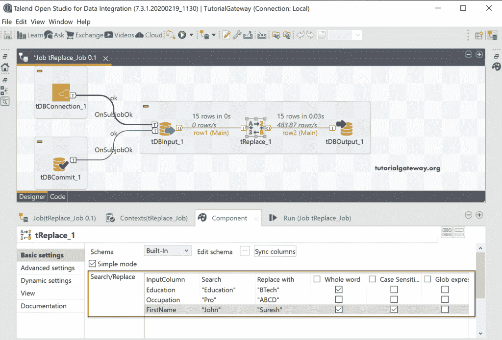

请检查 Talend 钻孔结果。

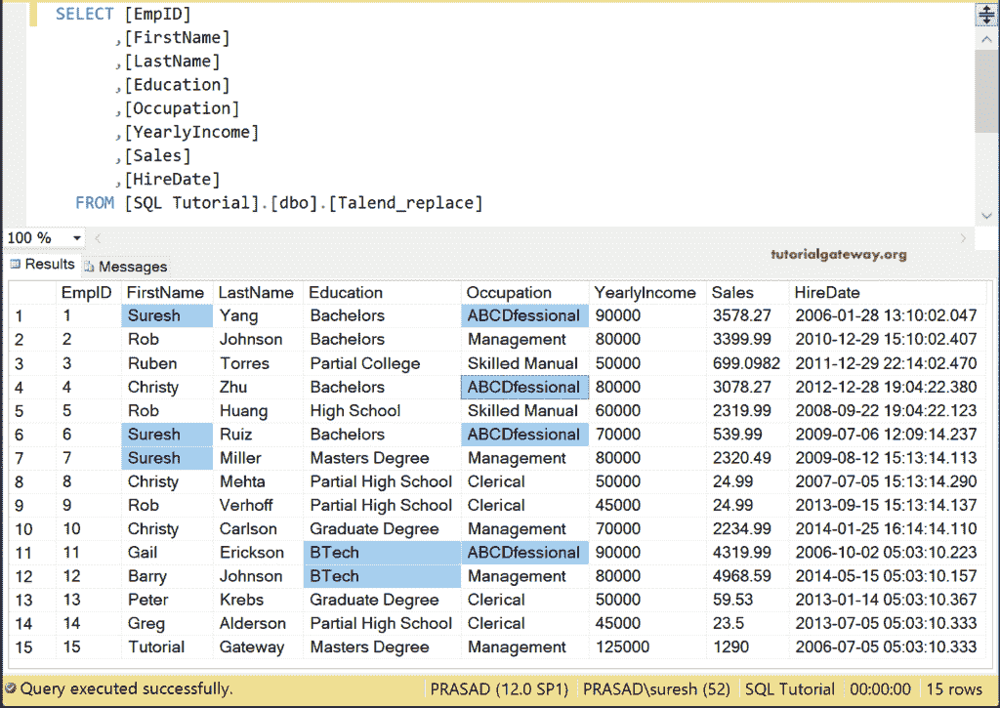

让我选择 [Talend](https://www.tutorialgateway.org/talend-tutorial/) 替换字段高级模式。如您所见，在这里，我们可以使用 regexp 模式来搜索字符串。

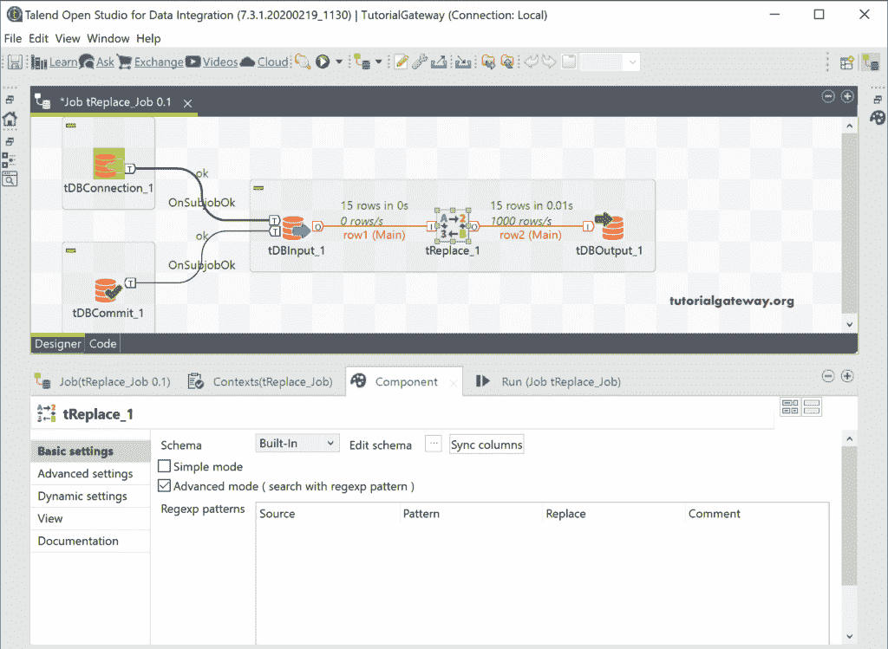