# Talend 复制

> 原文：<https://www.tutorialgateway.org/talend-replicate/>

“复制”或“复制”字段用于将输入源数据复制或复制到多个副本中。这样我们就可以对每个副本执行不同的操作。例如，如果我们有按国家/地区列出的销售数据，您可以制作一份拷贝，在一份拷贝上执行聚合，并在另一份拷贝上应用筛选器。

在本例中，我们使用这个 Talend Replicate 转换来创建源表的两个副本，并执行字符串替换和数值聚合。

## Talend 复制示例

为了演示相同的内容，我们使用了我们的 [SQL](https://www.tutorialgateway.org/sql/) 数据库中的客户表。从下面的 [Talend](https://www.tutorialgateway.org/talend-tutorial/) 截图，可以看到连接细节和我使用的表格。我建议您参考连接 Talend 到 SQL 文章来了解这些设置。

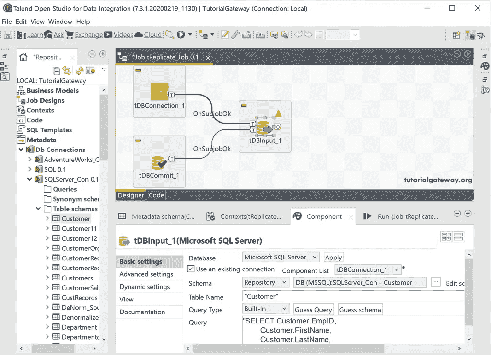

接下来，将特雷普里斯字段从托盘拖放到设计窗口。

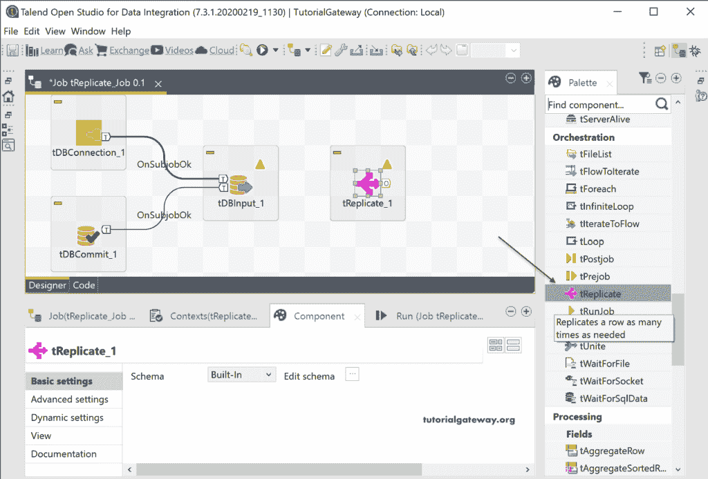

请将数据库输入主行连接到 Talend 复制字段。从下图中可以看出，在复制组件选项卡中没有什么可以做的。

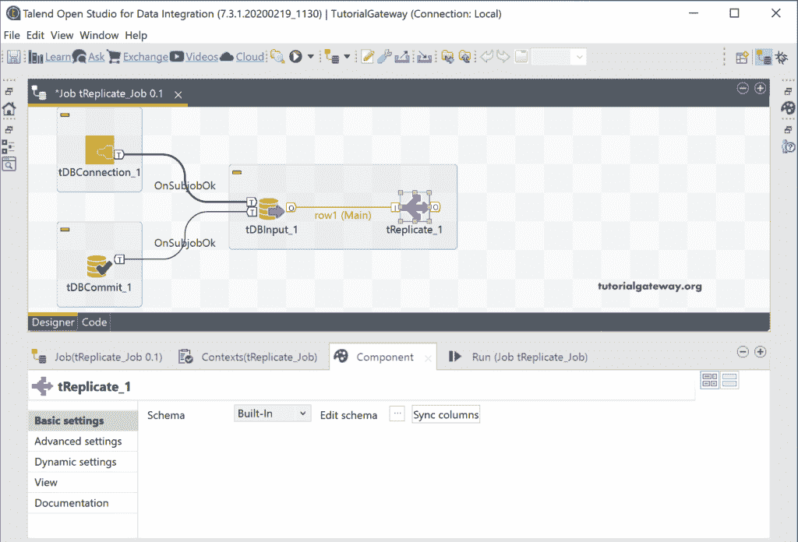

点击编辑模式按钮将打开以下窗口。在这里，您可以检查输入和输出字段，并根据您的要求进行更改。对我们来说，这是完美的，所以我们保持现状，点击 ok 按钮。

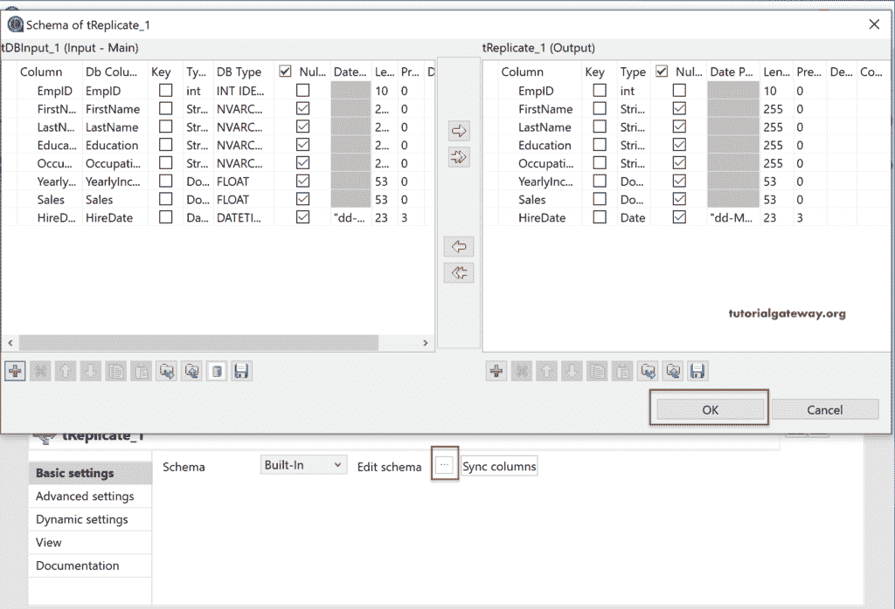

接下来，我们添加了特雷普赖斯文件，并将特雷普赖斯主输出连接到替换文件。接下来，我们将教育替换为技术，将职业列值管理替换为管理。请参考 Talend Replace 文章了解这一点。

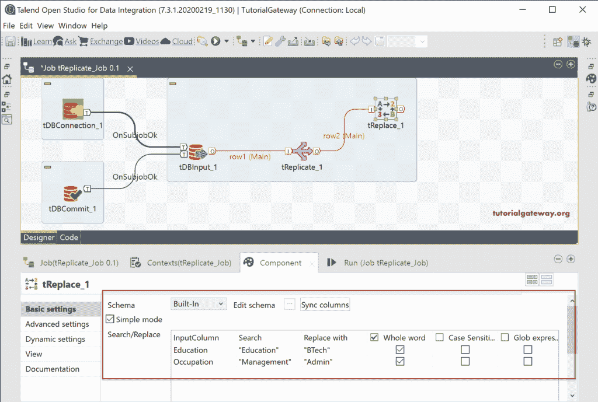

当您右键单击 Talend 复制字段时，它再次显示主行选项，这对于任何其他字段都是不可能的。因为所有字段都有一个主行，复制是为了复制数据或制作副本。

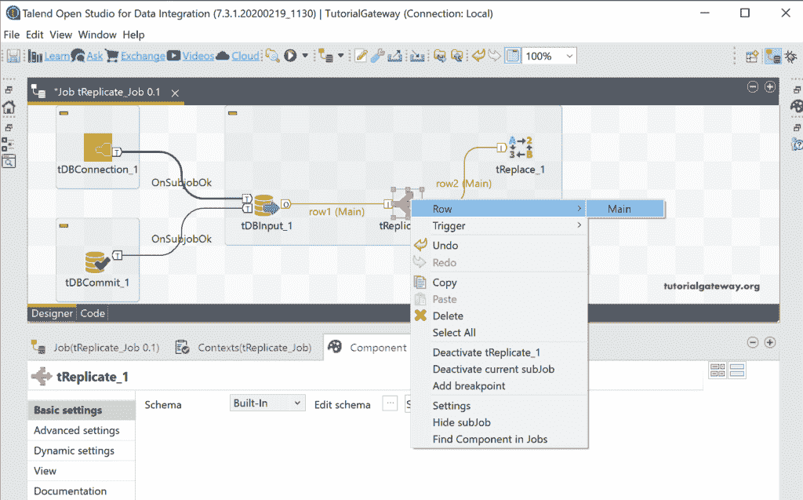

在这里，我们将主行附加到标记聚合字段，该字段将执行聚合。正如您从下面看到的，我们按教育程度、职业对客户进行分组，并计算年收入、销售额之和。请参考 Talend 聚合文章。

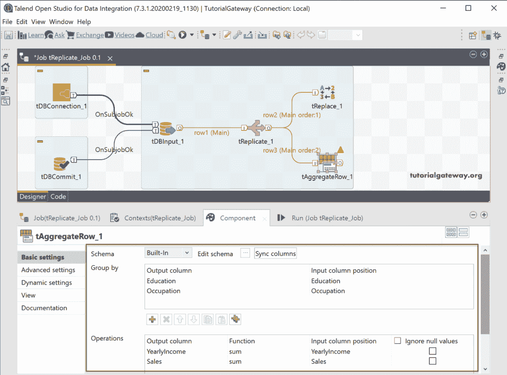

接下来，我们使用了两个与 SQL 数据库连接的 tDBOutput 字段。对于数据替换，我们正在创建一个新表 Replciate _ Replace。

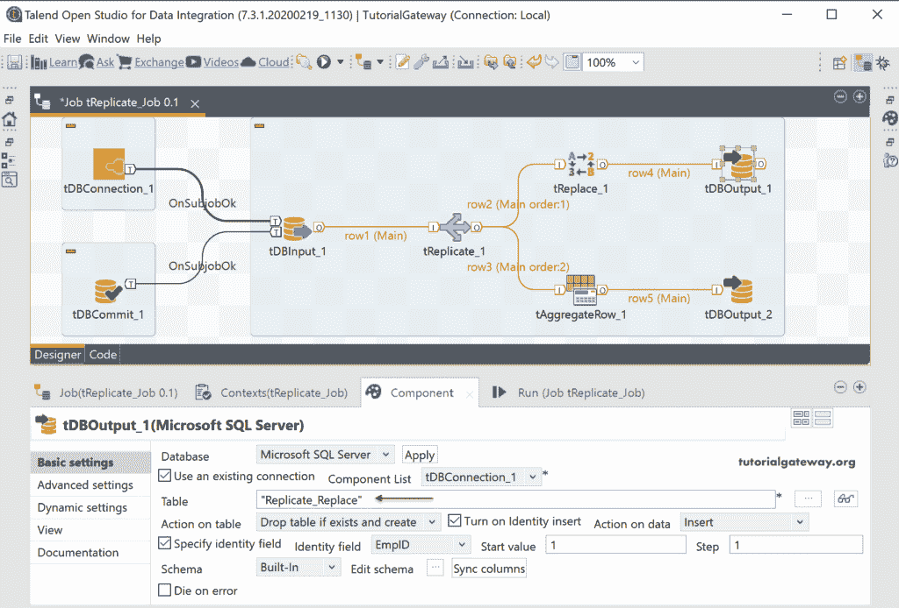

对于聚合数据，我们正在创建一个新表 Replciate _ AggregateRow。

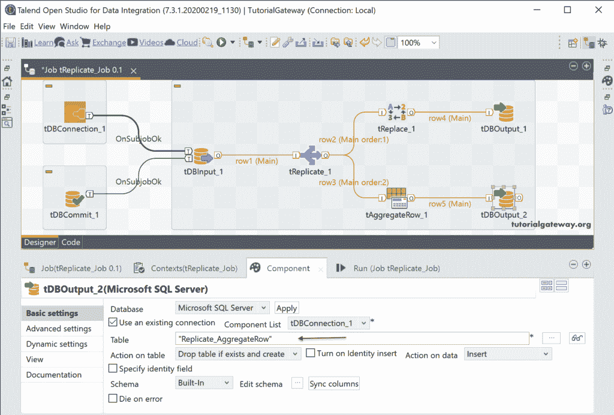

让我们跑去看看。

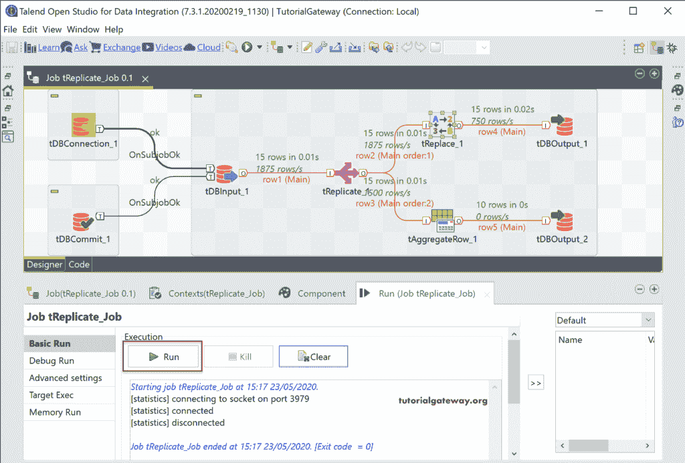

从上面的截图中，您可以看到，特雷普西特向“替换”和“标记分类”字段传递了 15 行，这意味着它正在创建一个新的客户副本。在 SQL Server 中，让我们看到替换数据。

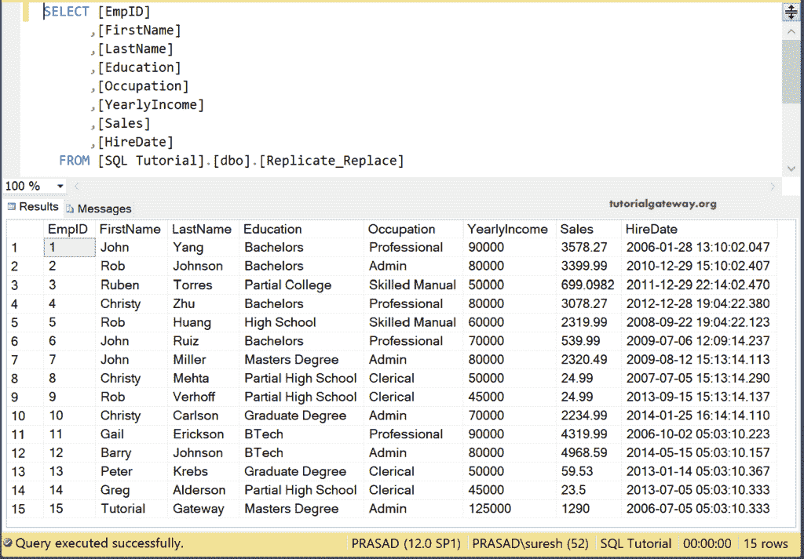

而汇总的数据是

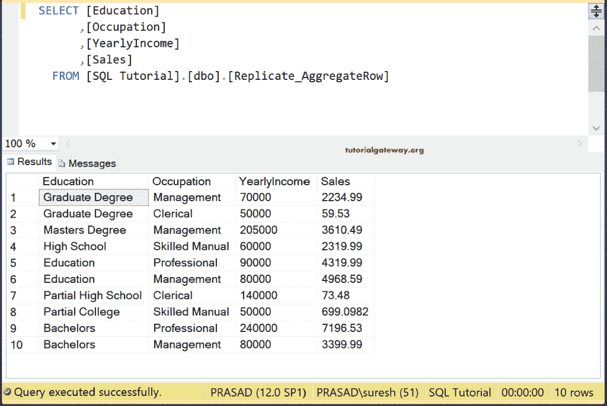