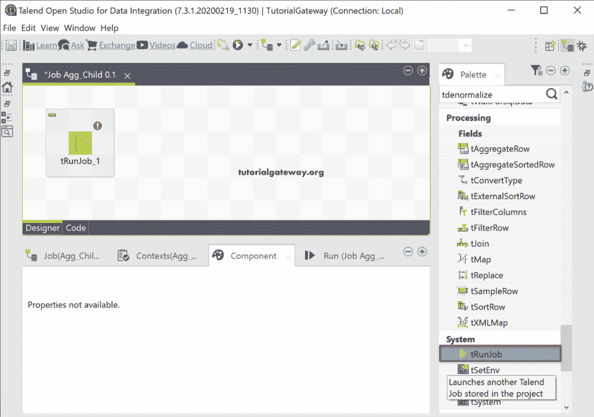
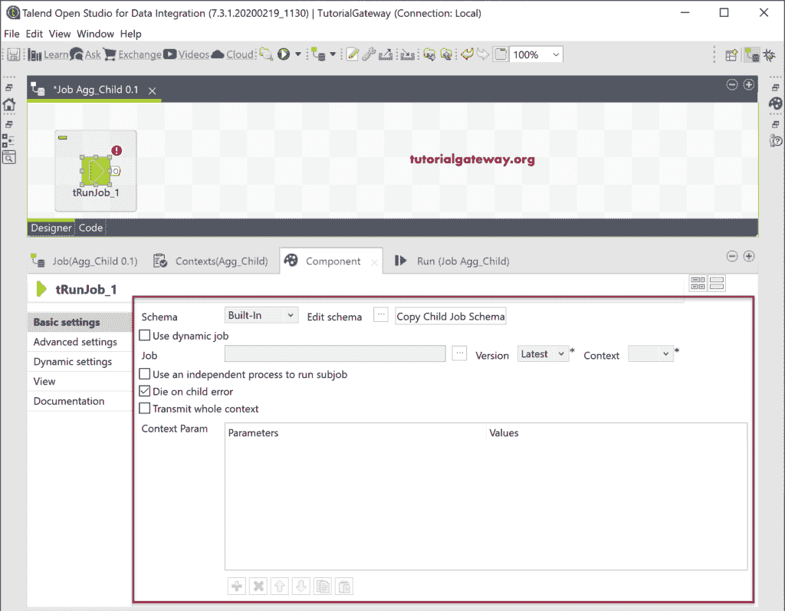

# 会说话的卡车

> 原文：<https://www.tutorialgateway.org/talend-trunjob/>

在这篇 Talend 文章中，我们使用这个 Talend tRunJob 组件来演示父子作业。此示例帮助您理解 tBufferOutput，以及如何从父作业到子作业读取数据。

为了演示 Talend tRunJob，我们使用前面创建的 tSortRow 示例。在这里，我们使用 tDBInput 选择客户表，并使用 tSortRow 按照如下所示的顺序对记录进行排序。我们不是将输出保存在表中，而是使用 tBufferOutput 来缓冲数据。

为了显示数据，让我将 tLogRow 连接到 [tBufferOutput](https://www.tutorialgateway.org/talend-tbufferinput-and-tbufferoutput/) 并运行 Talend tRunJob。

## 创建 Talend 父作业

我们创建了另一个作业，然后将 Talend tRunJob 组件添加到设计器窗口中。

下面的截图显示了可用的选项。

请单击浏览作业(…)按钮来选择以前设计的作业。这里，我们选择了数据排序父作业。

首先，单击复制子作业模式，将选定作业中的列添加或加载到当前作业中。接下来，单击“编辑模式”检查并添加/删除不需要的列。

请根据您的需要更改版本。接下来，添加上下文参数(如果有)。

在这里，我们添加了标签聚合器，并将其连接到 Talend 集群作业。一般来说，[标记集合排序器](https://www.tutorialgateway.org/talend-aggregate-sorted-row/)需要排序的数据，我们的子作业使用[排序器](https://www.tutorialgateway.org/talend-sort-row-data/)组件对这些行进行排序。在标签聚合器中，我们按职业对列进行分组，并执行一些聚合。

让我添加 tLogRow，向您展示聚合输出。

请运行 Talend tRunJob 查看结果。

