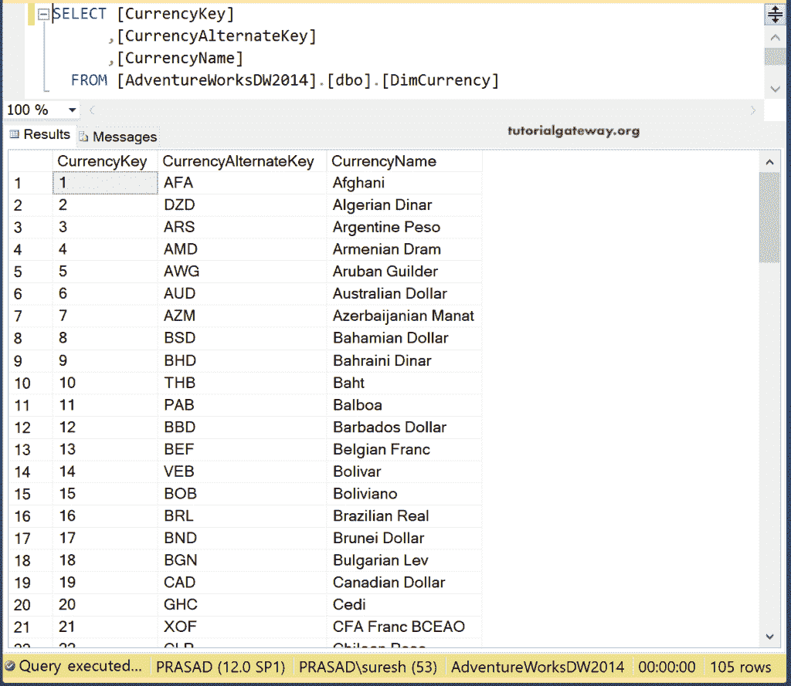
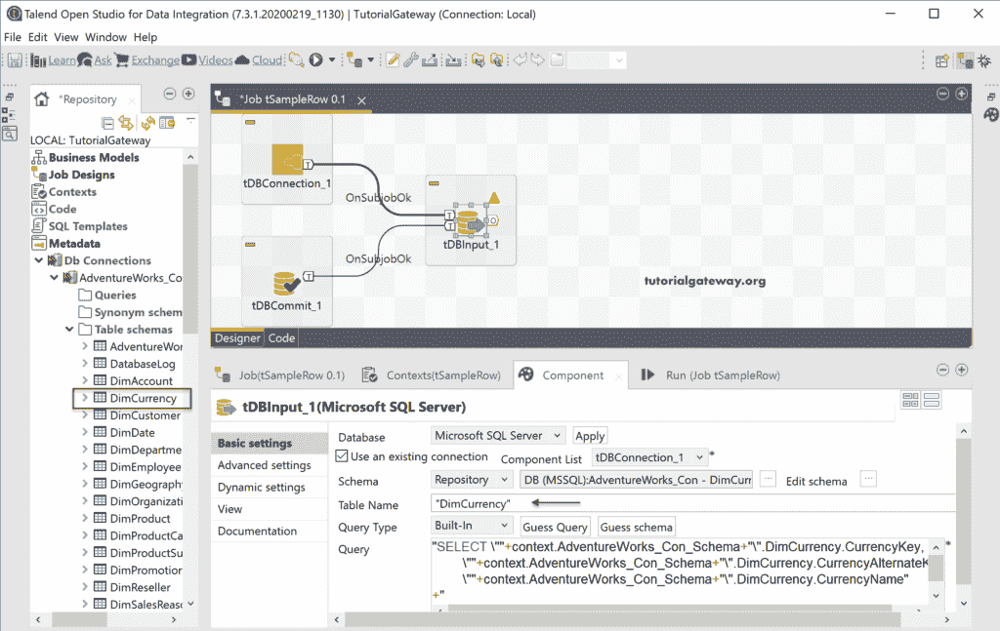
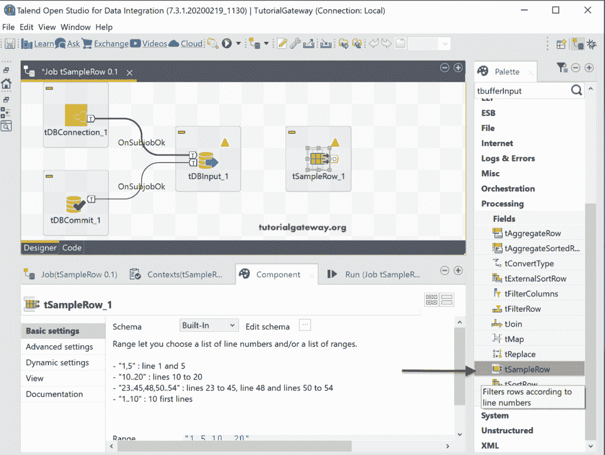
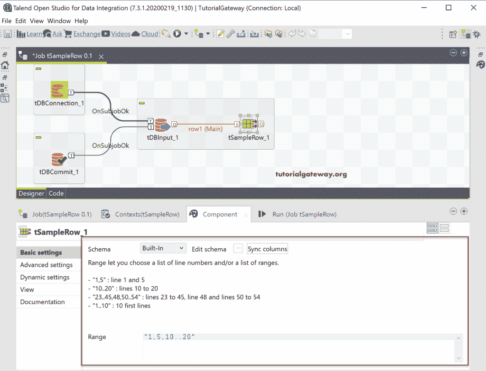
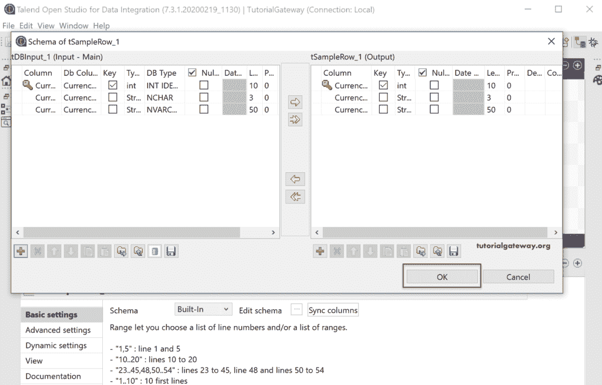
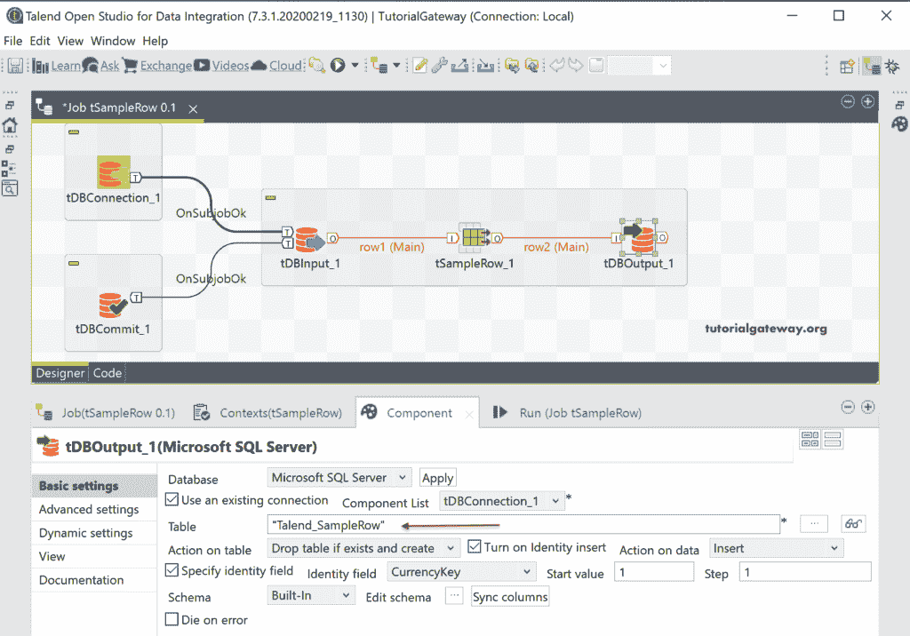
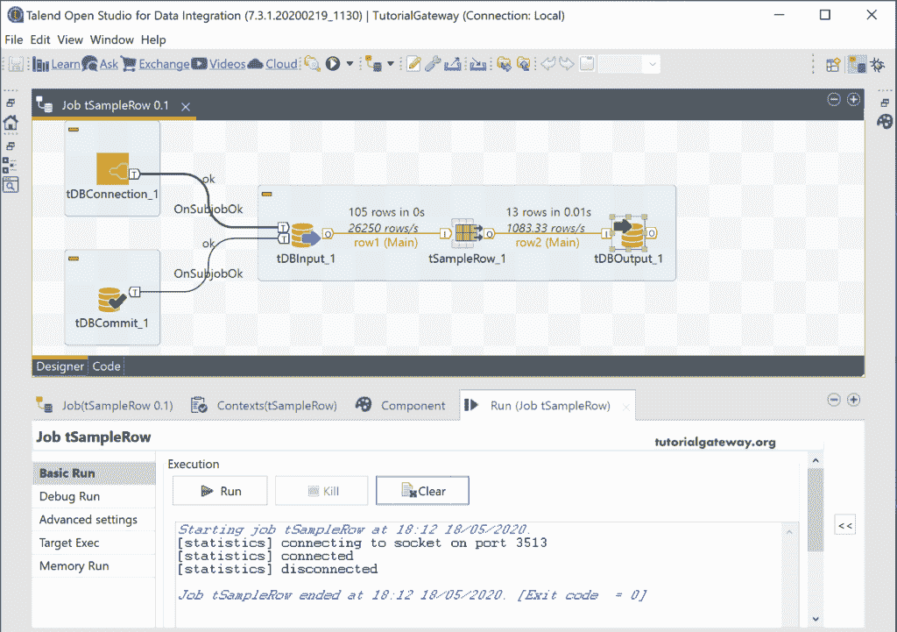
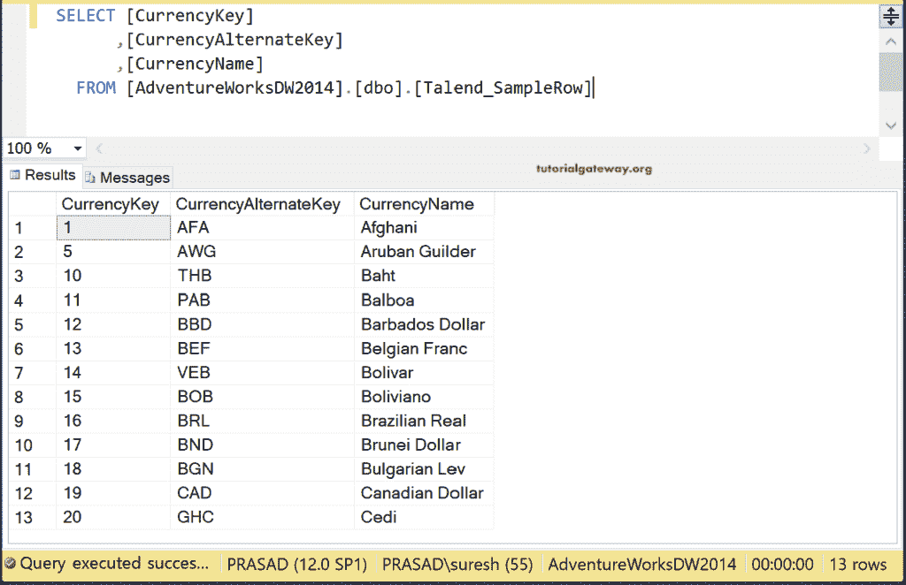
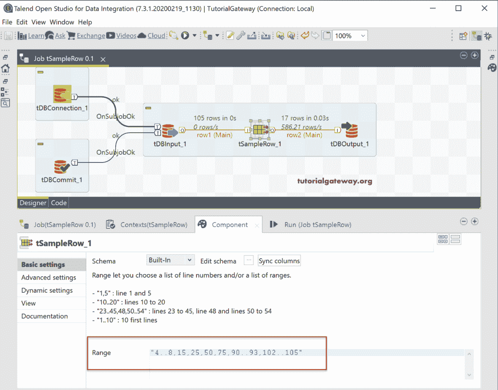
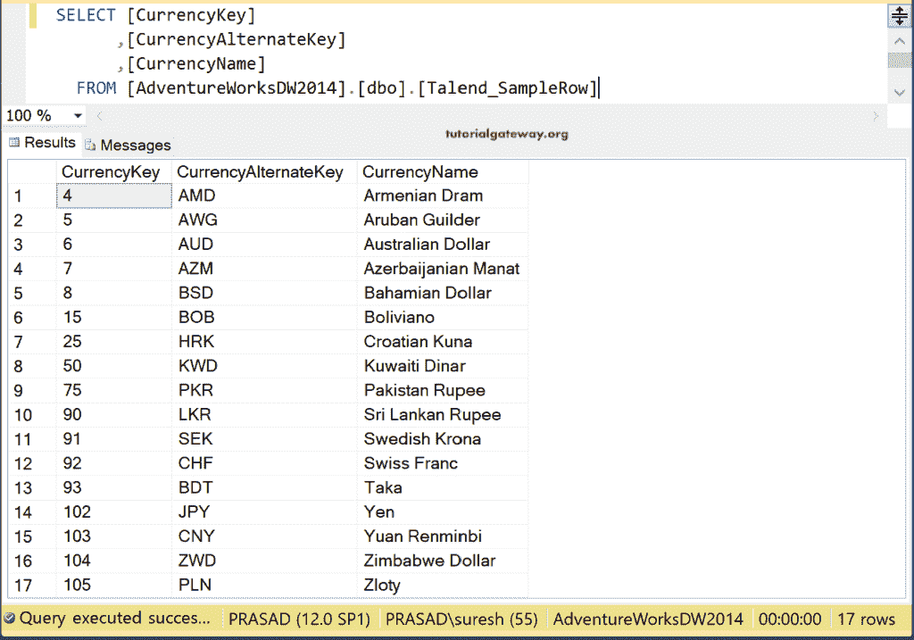

# Talend 样本行

> 原文：<https://www.tutorialgateway.org/talend-sample-row/>

Talend 样本行或 tSampleRow 接受输入，从中选择行的范围，并返回输出。

在这个 Talend 示例行中，我们使用的是 SQL AdventureWorks DW 数据库中的 DimCurrency 表。

## 堆积样本行示例

首先，我们建立了与 [SQL Server](https://www.tutorialgateway.org/sql/) 的连接。接下来，使用数据库输入选择数据库中的货币表。

将样本行字段从 palatte 拖放到作业设计窗口。

在“目录组件”选项卡中，您可以看到带有示例的范围。让我解释这些例子。

*   “1，5”-它从输入中返回第 1 行和第 5 行(DimCurrency 表)。
*   "10..20”-它只返回第 10 行到第 20 行的记录或行。
*   "23..45, 48, 50..54”-它返回从 23 到 45 的记录、第 48 条记录和从 50 到 54 的行。

[Talend](https://www.tutorialgateway.org/talend-tutorial/) 样本行具有示例范围值“1，5，10..20".这意味着 tSampleRow 将选择第 1 行、第 5 行以及 10 到 20 行。现在，我们保留这些默认范围值。

在我们执行任何操作之前，让我通过单击“编辑模式”按钮向您展示模式。根据你的需要改变记录，对我来说没有必要改变任何东西。

接下来，拖放 DBOutput 字段并使用现有的连接。如您所见，我们使用 Talend_SampleRow 表作为目标。如果表不存在，则此 Talend 示例行作业将创建该表。否则，它将删除现有的并创建一个新表。

让我们运行 Talend tSampleRow 作业。

我来开[管理工作室](https://www.tutorialgateway.org/sql-server-management-studio/)。从下面的查询中，您可以看到记录 1、5 和从 10 到 20。

出于演示目的，我们将默认范围值更改为“4..8, 15, 25, 50, 75, 90..93, 102..105".它意味着第 4 行到第 8 行，第 15 行，第 25 行，第 50 行，第 75 行，第 90 行到第 93 行，以及第 102 行到第 105 行的记录。

您可以从下图中查看相同的内容。

