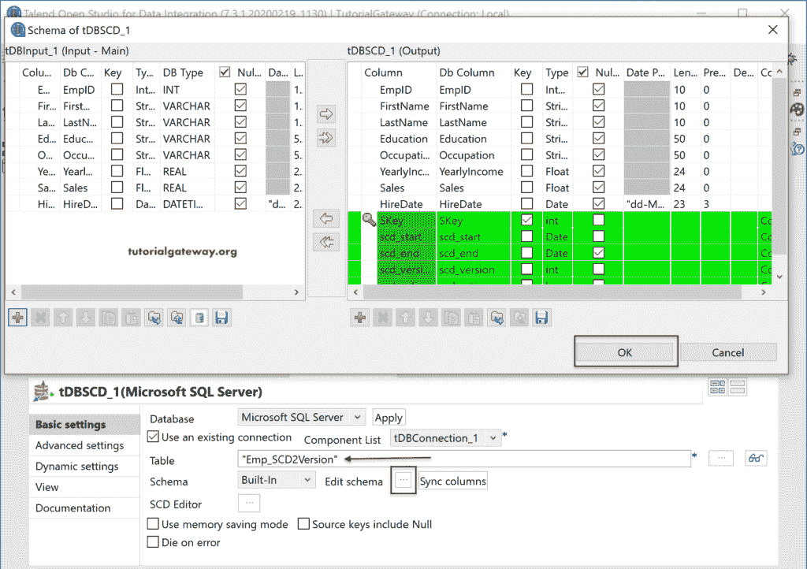

# 人才 scd

> 原文：<https://www.tutorialgateway.org/talend-scd/>

Talend SCD，也称为缓慢变化维度，可以通过 tDBSCD 字段来完成。我们可以使用 Talend SCD 来跟踪对表所做的更改，或者保留表数据的历史记录。

为了演示 Talend SCD，我们使用了从 [tUnite](https://www.tutorialgateway.org/talend-unite/) 作业中获得的下表。

注:我们还创建了一些表来存储数据库中的 [Talend](https://www.tutorialgateway.org/talend-tutorial/) SCD 输出。对于所有的表，基本结构与源[表](https://www.tutorialgateway.org/sql-create-table/)相同，并增加了几个额外的列，如 SKey (int)、scd_version(int)、scd_active(int)、scd_start(date)和 scd_end(date)列。

## Talend SCD 或 tDBSCD 示例

首先，将调色板中的连接、命令和输出拖放到作业设计空间。接下来，我们从存储库模式中选择了 Talend_Unite 表。请参考[连接 Talend 到 SQ](https://www.tutorialgateway.org/connect-talend-to-db-using-context-group/) L 文章。

请将 tDBSCD 从数据库公共文件夹拖放到作业设计中。还有一个数据库特定的，你可以使用它。

请选择您正在使用的数据库。在这里，我们选择[微软 SQL Server](https://www.tutorialgateway.org/sql/) 并点击应用按钮。

接下来，用 Talend tDBSCD 连接 tDBInput。从下面的截图中，您可以看到必须在组件选项卡中填写的字段。如果您有现有的连接，请使用相同的，否则，请手动或使用[上下文分组](https://www.tutorialgateway.org/create-a-global-context-group-in-talend/)填写所有这些详细信息。

这里，我们使用的是我们在 tDBConnections 字段中建立的现有连接。因此，我们从组件列表中选择了 tDBConnection _ 1。

接下来，点击 SCD 编辑器按钮将打开以下 Talend 窗口。所有可用的列都放在“未使用”部分。

### Talend SCD 类型 1 示例

Talend SCD 类型 1 或缓变维度类型 1 不保留历史记录。

源键:请将键列或主键列放在此部分。

代理键:如果您有任何代表代理键的数字列，请使用那个。在这里，我们创建了一个新的列名 SKey，它的值将是

*   输入字段:任何输入列
*   自动递增:该值将自动递增。
*   套路:也可以用套路。
*   表最大值+ 1:表最大值加 1。

让我为这种 Talend SCD 类型 1 选择最后一个选项。

接下来，拖放要跟踪更改的列。在本例中，我们希望跟踪所有列的更改，因此我们在类型 1 字段部分添加了所有列名。

到目前为止，我们还没有指定要保存历史记录或 SCD 类型 1 结果的目标表。因此，请单击“浏览”按钮并从窗口中选择表。这里，我们选择了之前创建的 Emp_SCD1 表。

单击编辑模式按钮检查字段。这里，SKey 是我们使用的代理键。

让我们运行 Talend SCD 类型 1 作业。

让我打开[管理工作室](https://www.tutorialgateway.org/sql-server-management-studio/)打开 SQL Emp_SCD1 表查看结果。

从上图中可以看到，它将 Talend_Unite (TU)表中的记录与 Skey 列一起转储到这个表中。

让我更改一下 TU [表](https://www.tutorialgateway.org/sql-update-statement/)的几个值，然后运行 Talend SCD 类型 1 作业。

从下面的截图，可以看到变化。

如果您不想保留数据历史记录，请使用 SCD 类型 1。

### Talend SCD 型示例

“渐变维度类型 2”或“渐变维度类型 2”会保留更改的历史记录。保留历史记录意味着它将保持旧行不变，并添加一个带有新值的额外行。为了找出新旧值之间的差异，它添加了两个名为 scd_start 和 scd_end date 的附加列。

*   scd_start:默认情况下，它指定作业的开始时间或记录的第一个条目的日期。
*   scd_end:对于第一个条目，该值将为空。每当对此行进行更改时，该值将更新当前日期。接下来，将创建一个新行，当前日期为 scd_start，空日期为 scd_end。

请单击“确定”按钮完成 Talend SCD 类型 2 设置。

让我从存储库中更改或选择 Emp_SCD2 表。接下来，单击“编辑模式”按钮，查看由 SCD 类型 2 创建的额外列。

让我运行 Talend SCD 类型 2 作业并查看结果。在这里，您可以看到额外的列，其中 scd_end 为空。

在这里，我们正在改变教育价值和收入价值。接下来，运行 Talend SCD 类型 2 作业。

现在，您可以看到两个具有更新值的新行。请注意，这两个原始行的 scd_end 日期已更新为当前日期。意思是，EmpID 3 从 scd_start 到 scd_end 的年收入为 50000，2020-05-29 更新为 111111。请记住，我们同时做了所有这些，所以您可能不会注意到日期差异。但是，如果您允许一天或更改输入日期格式以包含时间，则可以看到更改。

在 Talend SCD 类型 2 中，我们还有两个版本控制选项。他们是

*   版本(scd_version):它将整数值 1 赋给 n，其中 1 =第一个插入的行，2 =该行的第一次更改，3 =第二次更改，等等。
*   活动(scd_active):它为活动行或最新行分配一个，为前一行或旧行分配 0。

您可以根据需要使用其中一个或两个。在这里，我们两者都在使用，所以我们检查了版本和活动。

接下来，我们从存储库中选择了一个新的 Emp_SCD2Version 表。请单击“编辑”模式，查看 SCD 类型 2 版本控制添加的新列。单击确定，然后运行 Talend SCD2 版本控制作业。

下面的截图显示了我们主要获得的数据。

我们把 EmpID 的名字改为 Suresh，把 EmpID 的第八职业改为 Support。接下来，运行 Talend SCD Type 2 版本作业。

从下面的截图，可以看到输出。这里，新行的版本号为 2，旧行的 scd_active 变为 0，新行变为 1。通过查看版本，您可以了解该值在一段时间内更改的次数。通过查看 scd_active，哪个是最新的。

让我向您展示当我们再次更改 EmpID 5 行时会发生什么。(学历=学位)。

参见，SCD 类型 2 增加了一行，版本号为 3，scd_active 为 1。

### Talend SCD 类型 3 示例

Talend SCD 类型 3 或缓慢变化维度类型 3 保留了最近两次变化的历史。我指的是当前值和上一个值。

为了保留历史记录，我们必须将必填字段拖到类型 3 字段部分。

通过拖动字段，Talend 将创建当前(实际列)和以前的值。为了演示 Talend SCD 类型 3，我们使用了职业、销售和年收入列。

接下来，我们从存储库中选择了一个新的 Emp_SCD3 表。请单击“编辑”模式，查看 SCD 类型 3 添加的新列 SKey。请运行 Talend SCD3 作业。

而 Talend SCD 型的结果是

在这里，我们对这三列进行了一些更改，如下所示。接下来，运行 Talend SCD 类型 3 作业。

结果显示原始列中的新记录、前一个 _ 职业列中的前一个值等。

在上面的 Talend SCD 示例中，我们只对 SCD 类型 3 使用了几列。为此，我们将剩余的列保留在“未使用”部分。要获取这些列，请将它们放在类型 0 字段中。此部分下的所有列保持不变。

为了容纳所有的列，我们选择了另一个名为 Emp_SCD3AllColumns 的表。您也可以检查模式。

让我为所有列

运行这个 Talend SCD 类型 3

让我们对原始表进行一些更改，并运行 SCD 类型 3 作业。如果您注意到，我们还更改了姓氏和教育栏目。

现在，您可以看到表中的所有列。请注意，“姓氏”和“学历”列的值保持不变。

