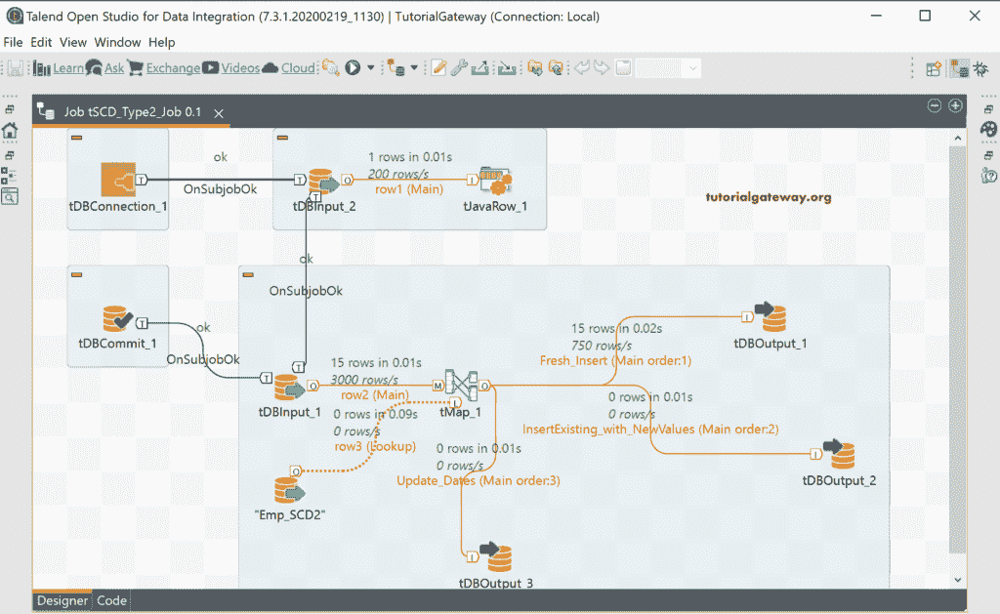

# Talend SCD 类型 2 手册

> 原文：<https://www.tutorialgateway.org/talend-scd-type-2-manual/>

在本节中，我们将向您展示如何手动设计 Talend SCD 类型 2 或渐变尺寸。这是一个人可能面临的重要面试问题之一。

对于本 Talend SCD 类型 2 手动演示，我们使用了与之前相同的源表和目标表。请参考 Talend SCD 示例文章。

以下是手动执行 Talend SCD 类型 2 所需的步骤列表。

*   我们需要密钥或代理密钥。每当一个新记录插入到一个表中，SKey 必须递增。因此，我们需要目标表中的最高或最大 SKey 值。
*   我们必须在 Emp_SCD2 表中插入新记录。
*   接下来，将新记录与现有表记录进行比较，以检查它是否执行了新的插入或更新。所以，我们需要进行查找。
*   每次更新旧值后，我们都必须用相同的 EmpID 和新的 SKey 值重新插入新记录。
*   接下来，我们必须用当前日期更新旧记录的 scd_end 日期。

## Talend SCD 型手动示例

首先，我们使用一个 tDBInput 并编写了 SQL Select 语句查询来获取最大代理键值。这里，我们使用 [ISNULL 函数](https://www.tutorialgateway.org/sql-isnull/)将 NULL 返回值替换为零。当您将第一条记录插入到表中时，从 Emp_SCD2 中选择最大值(SKey)将返回空值。为了防止这种情况，我们使用了 ISNULL 和 [MAX 功能](https://www.tutorialgateway.org/sql-max-function/)。

单击编辑模式并添加以下整数类型的列。因为上面 [select 语句](https://www.tutorialgateway.org/sql-select-statement/)的返回值是单个值。

让我创建一个[上下文变量](https://www.tutorialgateway.org/create-a-global-context-group-in-talend/)来存储最大 SKey 值。这样，我们可以在这个作业的任何组件中使用这个上下文变量。我建议您添加默认值为零，这是我们后来做的。

接下来，我们添加了 [tJavaRow](https://www.tutorialgateway.org/talend-tjavarow/) 组件，并将输入行值分配给上下文变量。这里是我们在 [Talend](https://www.tutorialgateway.org/talend-tutorial/) 上下文变量中存储最大代理键值的地方。

关于主题 Ok 触发器，让我再添加一个 [tDBInput](https://www.tutorialgateway.org/export-database-table-to-text-file-in-talend/) 。该组件是实际的输入源表。

拖放 tMap 并将 tDBInput_1 主行连接到 tMap。接下来，添加 tDBOutput 以将记录插入或加载到目标表中。将 tMap 与 [tDBOuput](https://www.tutorialgateway.org/talend-load-data-from-text-file-into-database/) 连接时，它会要求您为该输出分配一个名称。这里，我们给出了 Fresh_Insert 作为名称。

让我将 tDBOuput 设置保留为默认值，因为我们稍后会更改它们。

双击 tMap 打开属性窗口。请点击汽车地图！按钮来映射列。

scd_start 表示当前时间或记录插入时间。所以，让我使用 Talend getCurrentDate 函数来获取当前日期。

scd_end 日期可能会因组织而异。对于 Talend SCD 型手动演示目的，我们使用 31-12-2999。请不要忘记使用 Talend parseDate 函数来解析字符串或将字符串转换为日期数据类型。

在 Talend Numeric 部分下有一个序列方法，用于在指定的步骤中插入从 1 到 N 的序列号，与 SQL 自动递增相同。我们希望从最大代理键插入序列号，以便放置上下文。作为第二个论点。

我们忘记在 Select 语句中添加一个，所以，让我们添加相同的语句。选择最大值(SKey)给你最大值，序列将从最大值开始，但它必须从下一个值开始。请记住，您也可以更改序列功能代码来添加一个数字。

让我将操作更改为插入并检查模式。接下来，我们将运行此 Talend SCD 类型 2 手动作业来检查是否插入了新记录。

在 [SQL 管理工作室](https://www.tutorialgateway.org/sql-server-management-studio/)中，可以看到带有代理键、scd_start 和结束日期的记录。

到目前为止，我们正在执行一个简单的插入。为了了解它是新记录还是具有新值的旧记录，我们需要执行查找。因此，让我将 Emp_SCD2 表作为查找表添加到 tMap 组件中。我的意思是，我们正在实现一个[连接](https://www.tutorialgateway.org/talend-tmap-joins/)。

双击 tMap，添加 EmpID 作为常用键列。接下来，将连接模型更改为内部连接，并将模型与唯一数学匹配。借此，我们可以识别新旧记录。

单击自定义图标，并将捕获查找内部连接选项从假更改为真。它将捕获内部连接失败记录，以便我们可以将它们传递给另一个输出。

让我添加另一个连接到 Emp_SCD2 表的 tDBOutput，并将 tMap 输出名称指定为插入现有的新列。

在 tMap 属性中，我们使用自动映射来连接所有的列。接下来，我们将 scd_start 更改为当前日期，scd_end 更改为 2999，SKey 更改为顺序值。一切都与新鲜插入选项相同。

请点击表达式并添加以下表达式。这里，equals 方法将旧收入值与新收入值进行比较。！意味着如果两者不相等，则执行此插入。

检查 tDBOutput 的所有选项，并运行 Talend SCD 类型 2 手动作业。在运行此作业之前，我们将 EmpID 3 的收入更改为 666666。

您可以看到它已经插入了收入更新的新记录。

但是，我们必须更新旧记录的 scd_end 日期。为此，我们又添加了一个指向 Emp_SCD2 表的 tDBOutput。接下来，我们将其连接到 tMap，并指定 Update _ Dates 作为输出名称。

在 tMap 中，将密钥和 EmpID 的 scd_end 日期更改为当前日期。请不要忘记添加以下表达式来检查哪个记录被更改，哪个记录被替换。

请使用“编辑架构”按钮更改数据部分以更新和检查列。

我们完成了 Talend SCD 第 2 类手动标题创建。让我截断 Emp_SCD2 表，恢复 Talend_Unite 表的默认值。从下面的 Talend SCD 类型 2 截图中，您可以看到新插入表中的 15 条记录。

在 [SQL 表](https://www.tutorialgateway.org/sql-create-table/)中可以看到同样的情况。

让我将 EmpID 15 的收入更改为 999999 并运行该工作。您可以看到插入了新值的一条记录，并且发生了一次更新。

在 [SQL](https://www.tutorialgateway.org/sql/) 管理工作室内，可以看到有更新日期的新记录和旧记录。

到目前为止，我们正在进行一个列更改。但是，您可以使用逻辑或||来捕获多个更改。为了证明这一点，我们使用了销售列。请更改 Update _ dates 和 Insert Exsiting _ with _ NewValues 的表达式。

让我更改一个记录的销售值和另一个记录的收入值，并运行 Talend SCD 类型 2 手动作业。

请看输出。

