# Talend 联合

> 原文：<https://www.tutorialgateway.org/talend-unite/>

Talend 联合组件帮助您合并或合并来自不同文件或不同来源的数据，并生成一个输出。Talend 联合字段在实时方面非常有用。例如，如果我们从不同的商店获取销售数据，并且我们希望将这些数据组合并存储在数据库中。

在这个例子中，我们组合了三个包含客户数据的文本文件。下面的截图将向您展示这些文本文件中的数据。

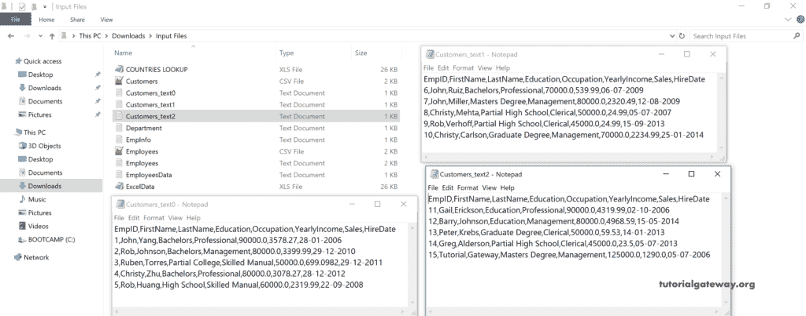

从下面的 [Talend](https://www.tutorialgateway.org/talend-tutorial/) 截图中可以看到，我们已经为上面显示的所有文本文件创建了元数据。

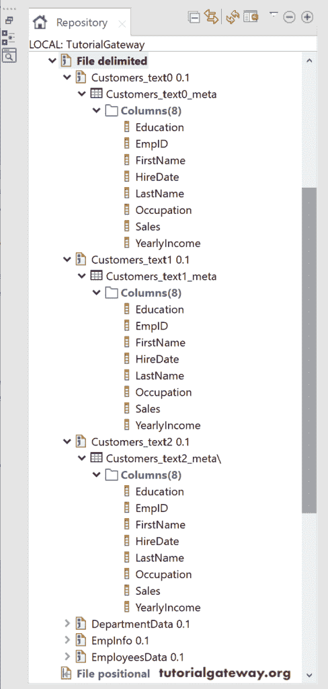

## 合并或合并示例

让我将这三个客户文本文件元数据拖放到设计窗口中，并选择文件输入分隔符作为组件。

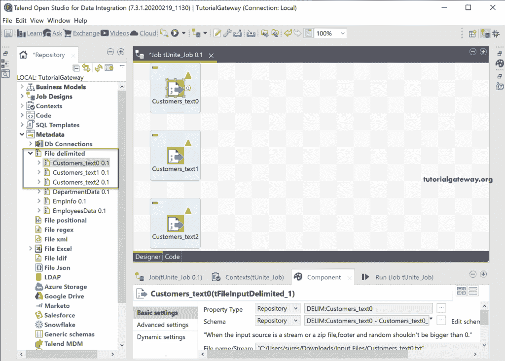

接下来，将 tunite 组件拖放到设计空间中。您可以从下面的截图中看到工具提示，tunite 将输入合并到同一个输出中。

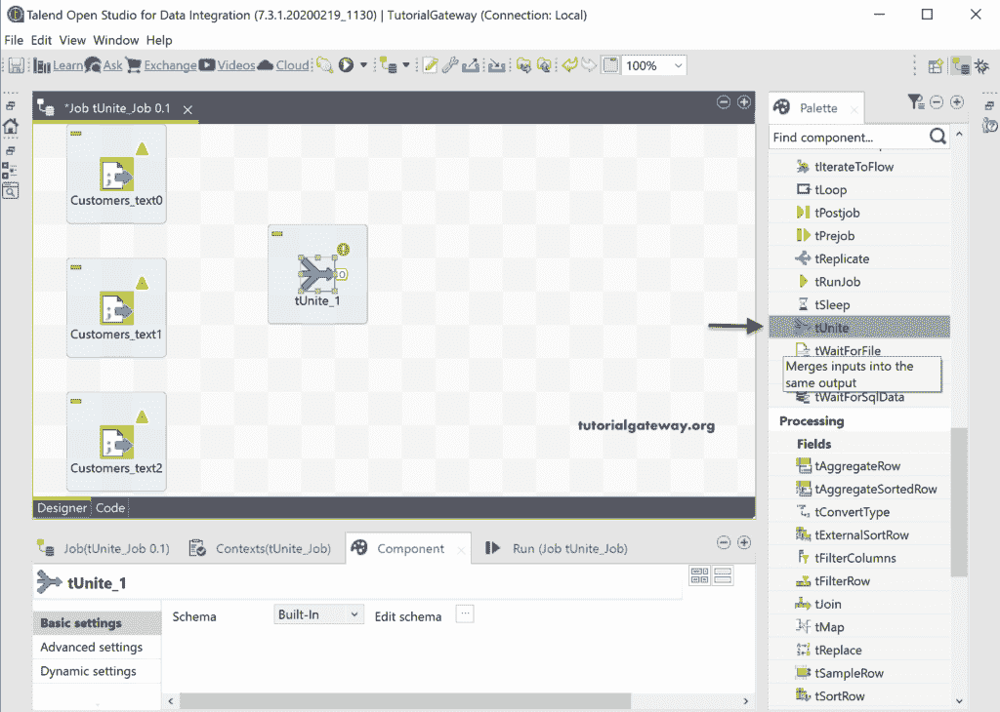

让我将三个文本文件的主要输出行连接到 Talend tunite 组件。您可以从下面看到合并顺序 1、2 和 3。这完全取决于你连接到塔伦联合能量场的方式。但是，您可以通过将所需的文件输出作为第一个连接来更改合并顺序。

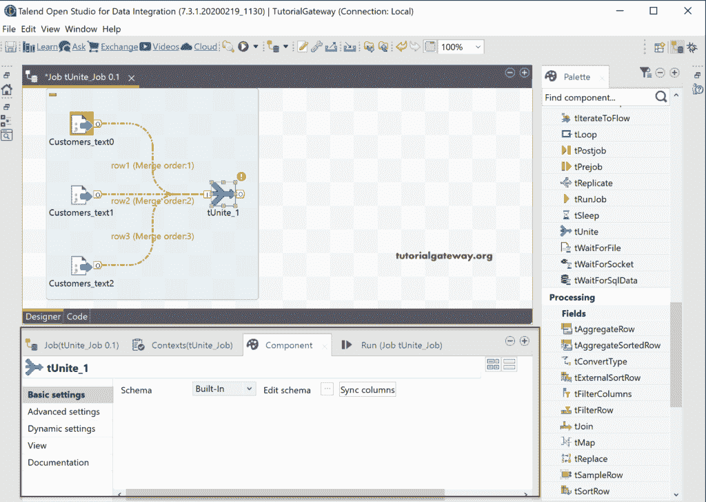

在 components 表(tunite 字段)中，除了编辑模式之外，没有什么可以做的。大多数情况下，Talend 会同步输入字段中的列。如果不是这样，请单击同步列按钮。

接下来，点击我们在图像中标记的按钮。它将打开以下模式编辑器窗口，您可以在其中更改列的顺序或删除特定的列。或者，您可以更改输入列的长度或精度。在窗口的左侧，您可以看到代表三个输入文件的三个选项卡。您可以点击每个选项卡查看组件及其顺序等。完成更改后，请单击“确定”按钮。

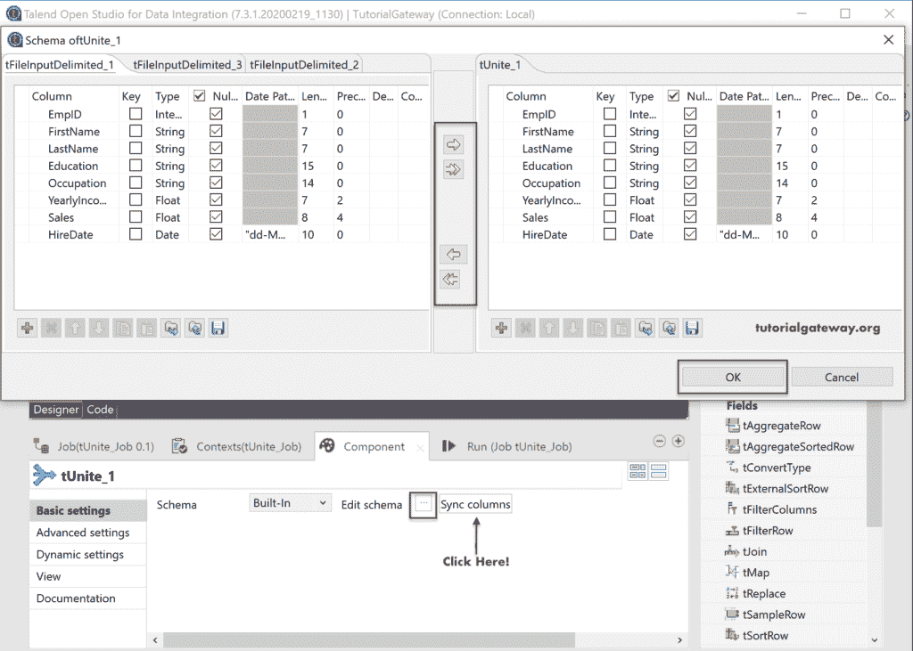

让我使用 tLogRow 来显示 Talend Unite 字段输出。

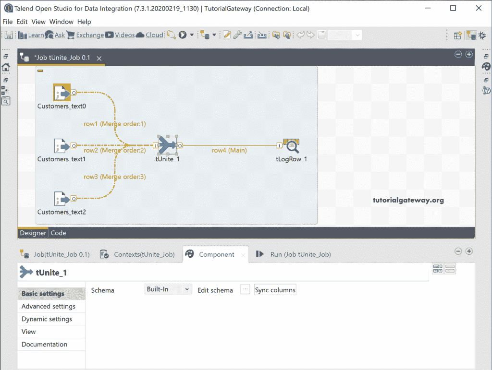

单击运行按钮后，您可以看到输出或增长输出数据。

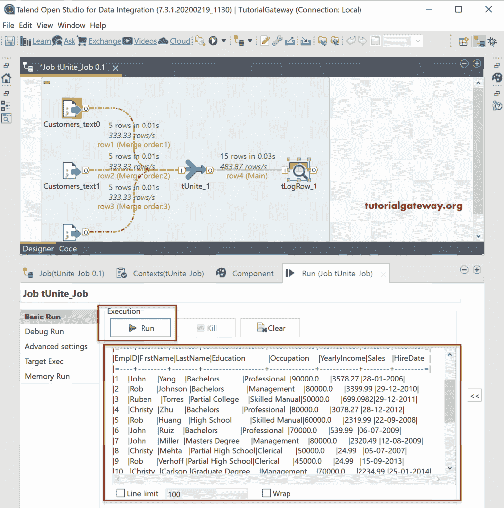

我想我会把 tUnite 输出放在一个数据库表中。为此，我们使用了 Talend_Unite 表和表上的 Action 作为 Drop 表(如果存在的话)并创建了选项。如果您有任何疑问，或者当您正在使用现有的表时，请单击“编辑模式”按钮并检查输入和输出模式。在这里，我们创建了一个新表，所以我们不必看到模式。

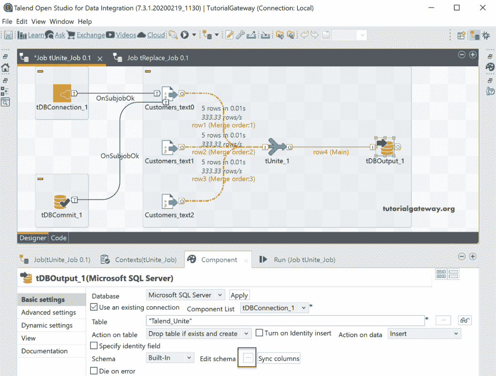

让我们运行 Talend 联合作业并查看

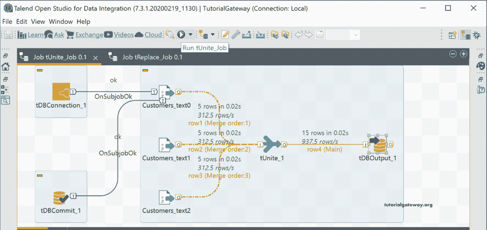

嗯！没有错误。我来打开 [SQL 管理工作室](https://www.tutorialgateway.org/sql-server-management-studio/)查看一下 Talend Unite 表里面的数据。

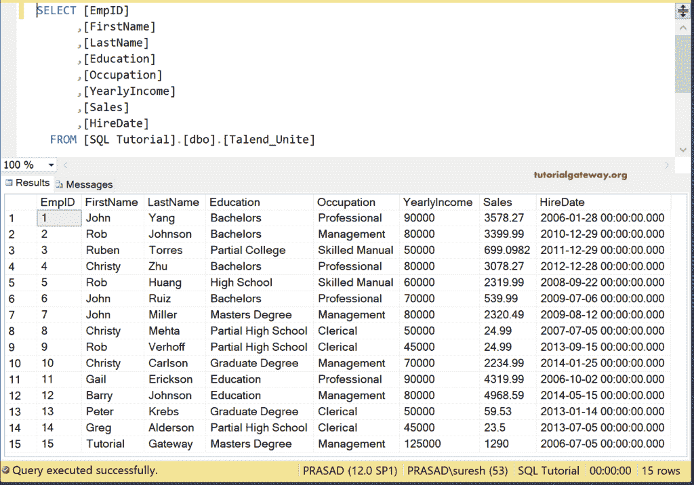