# Talend 唯一行

> 原文：<https://www.tutorialgateway.org/talend-unique-row/>

“结束唯一行”或“结束”字段将删除重复行或返回不同的唯一行作为输出。如果我们的源有重复的内容，我们可以使用此 Talend 唯一行字段。

在这个 Talend Unique 行示例中，我们使用了 SQL Server 数据库中可用的 Cutomer 表。下面的截图显示了该表中的数据。

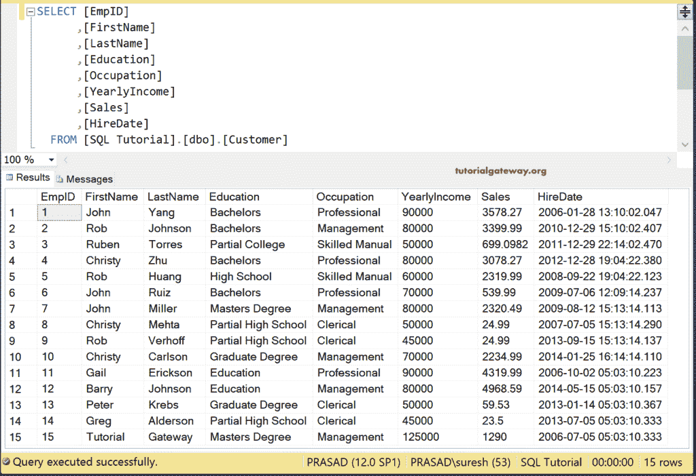

## Talend 唯一行示例

首先，拖放数据库连接、数据库提交和数据库输入，以建立与 SQL Server 的[数据库连接。接下来，我们从元数据中选择了客户表。](https://www.tutorialgateway.org/talend-tutorial/)

[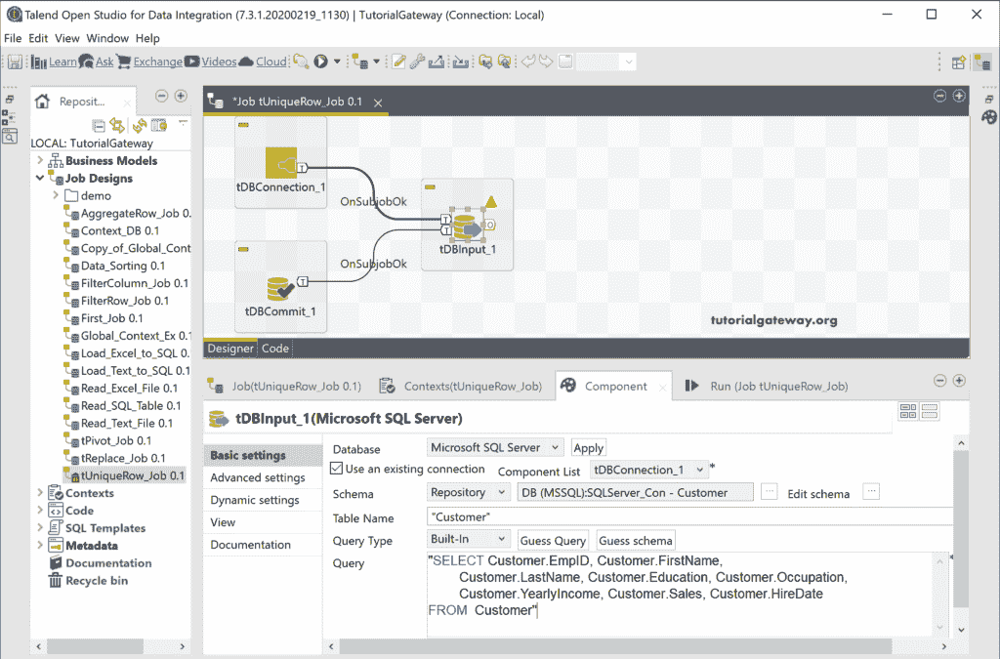](https://www.tutorialgateway.org/talend-tutorial/)

接下来，将 Talend tUniqueRow 从调色板拖放到作业设计中。从下面的工具提示中可以看到，tUniqueRow 基于模式的键集创建了一个独特的数据流。

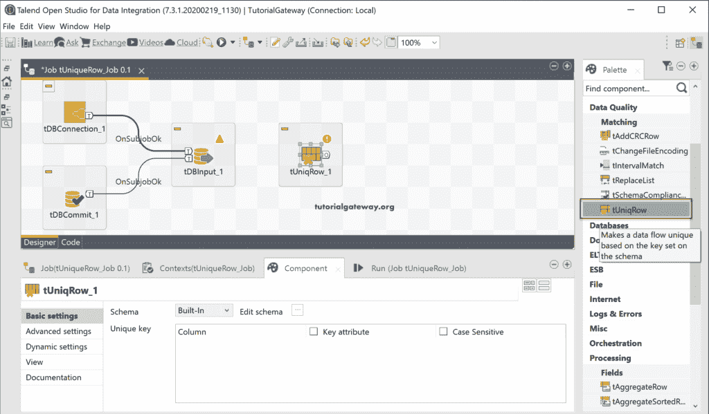

请将数据库输入主行连接到 tUniqueRow。有时，输入列会与 tUniqueRow 同步。如果不是这样，请单击同步列按钮。

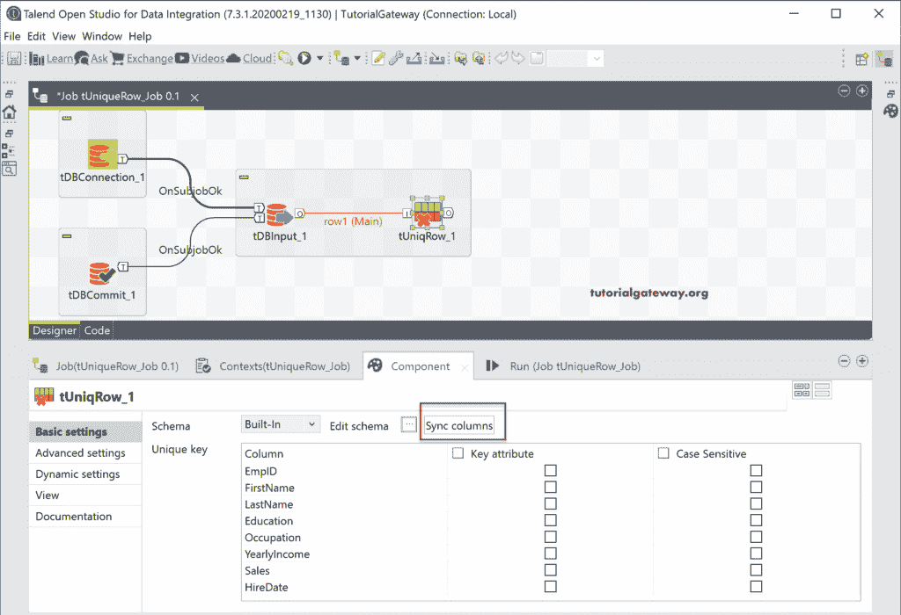

接下来，单击“编辑模式”按钮，根据您的要求检查或更改模式。

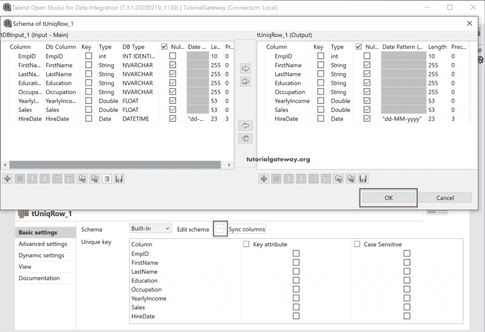

在组件选项卡下，有一个唯一键部分。这是我们通过检查键属性来指定字段或列是唯一的地方。如果你想选择区分大小写，那么勾选这个选项。

出于演示目的，让我将“教育”列选为“关键”属性。这意味着 Talend 唯一行将从客户表中返回不同的教育列。

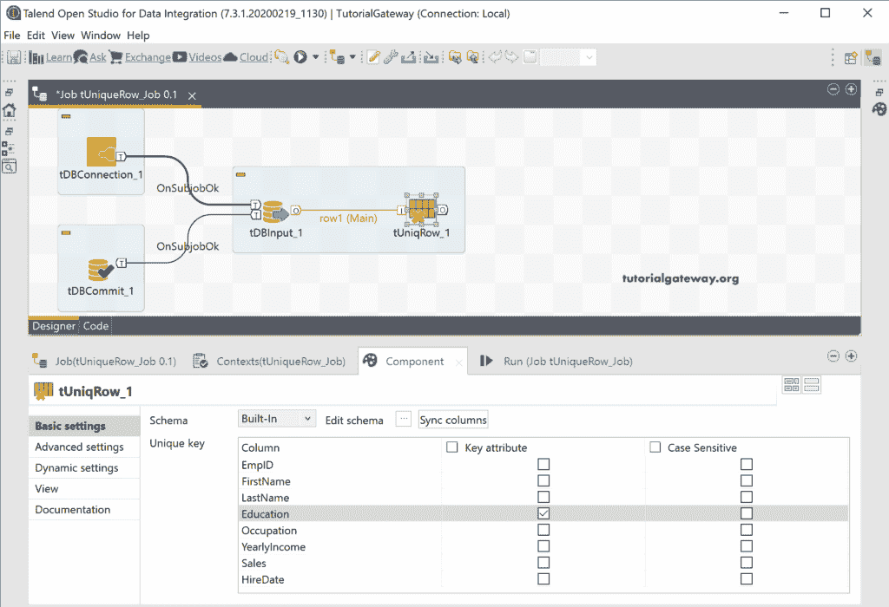

接下来，我们将使用数据库输出来存储或保存数据库中的数据库输出。如您所见，我们正在创建或使用 Talend_tUniqueRow 表作为目标表。

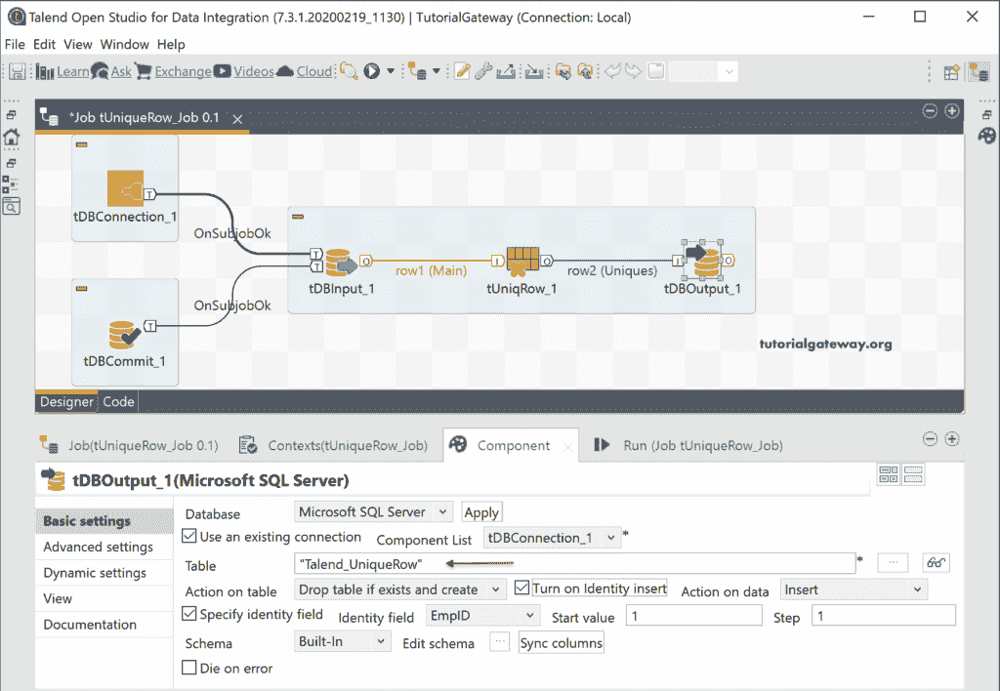

让我们跑去看看。从下图中，您可以看到，Talend 唯一行字段只传递了 15 条记录中的 7 条记录。

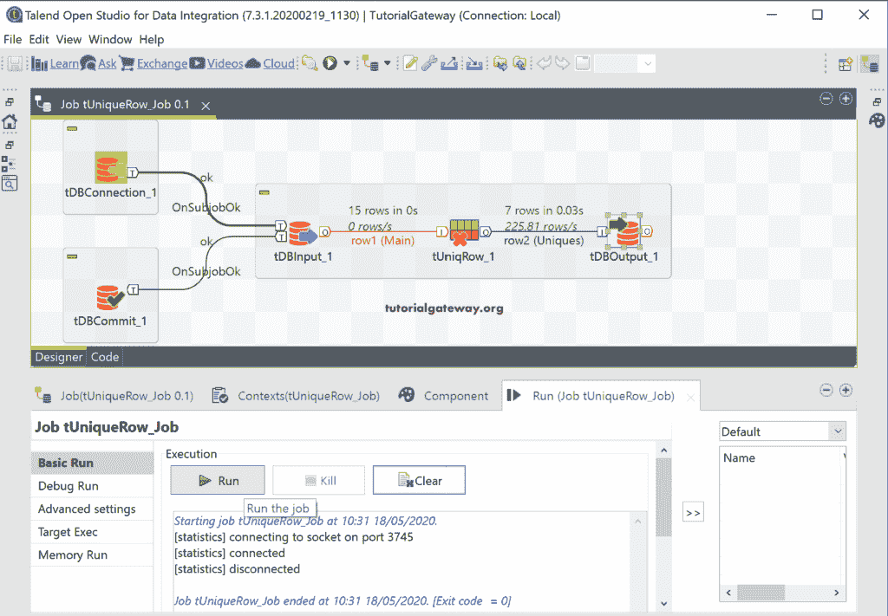

请打开[管理工作室](https://www.tutorialgateway.org/sql-server-management-studio/)并检查 tUniqueRow 输出。

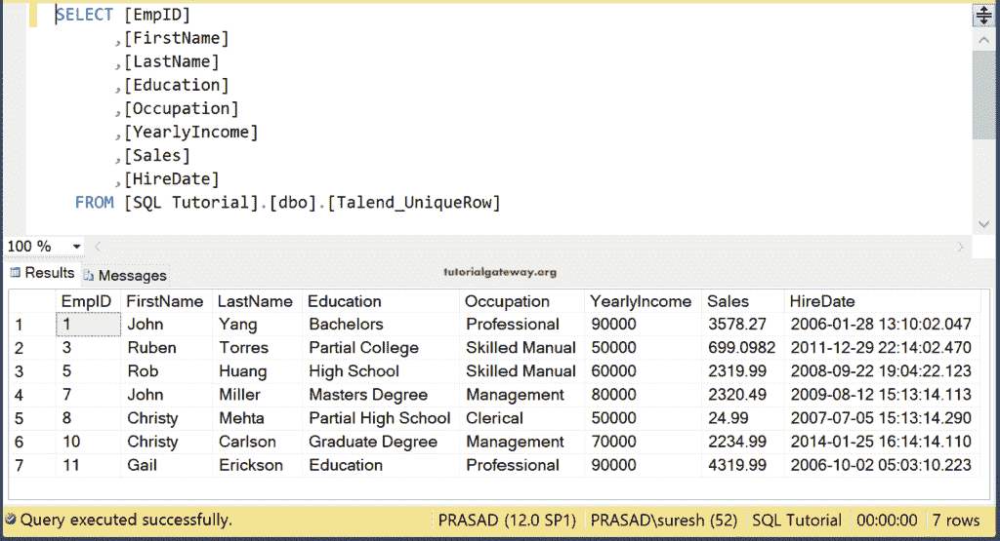

“唯一行”字段不会限制您选择单个字段作为关键属性。您可以选择任意多个关键字段。例如，我们选择了两个栏目教育和职业，并运行该工作。这意味着突尼斯回归独特的教育和职业。

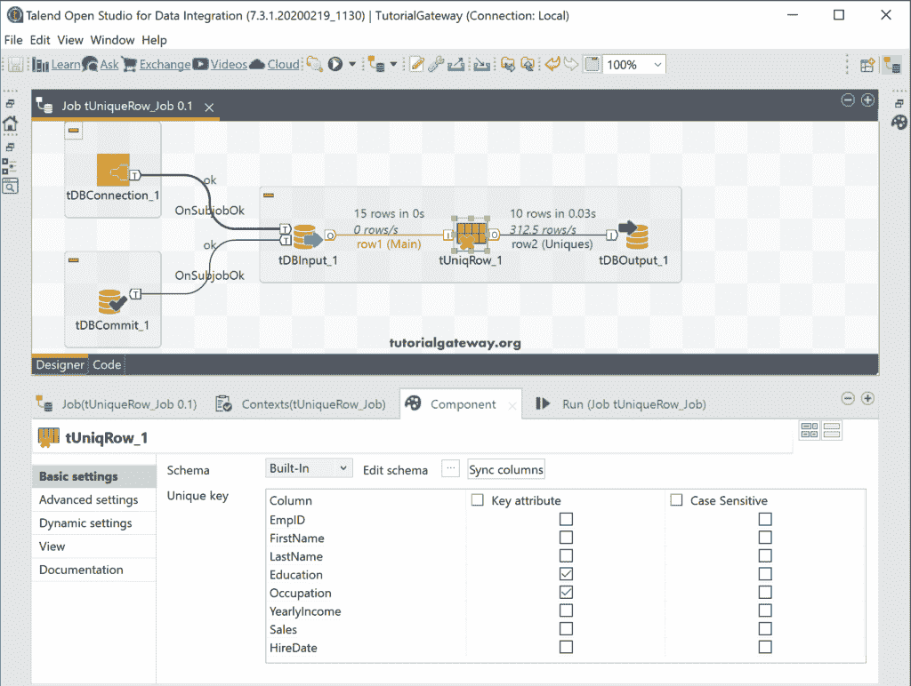

可以在 [SQL](https://www.tutorialgateway.org/sql/) 中看到 Talend tUniqueRow 输出。

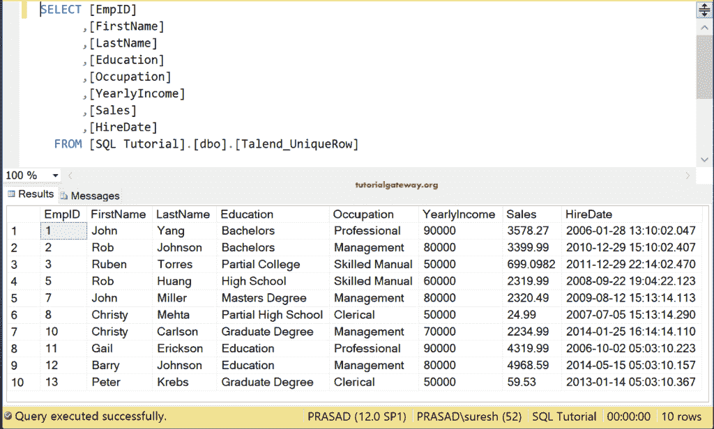