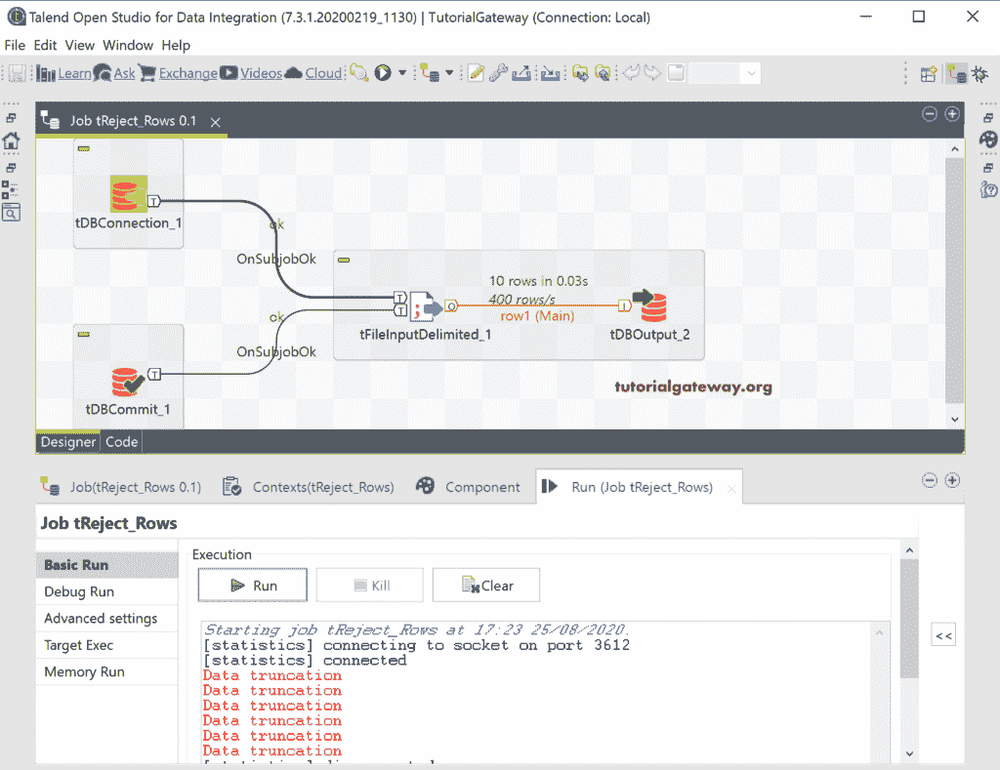
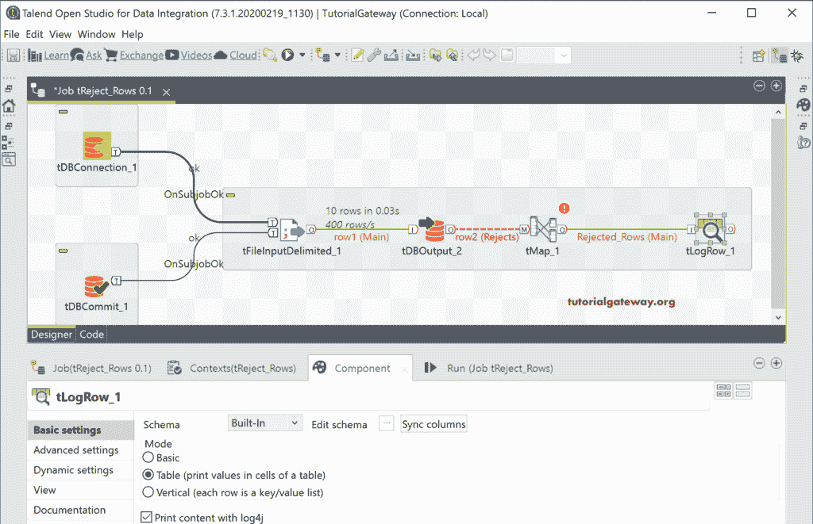

# Talend 拒绝的行

> 原文：<https://www.tutorialgateway.org/talend-rejected-rows/>

在本节中，我们将讨论 Talend 拒绝的行或将失败的记录捕获到表或文本文件中。捕获运行 Talend 作业时失败或被拒绝的行至关重要。我们可以使用该日志来检查和清理数据，以便采取进一步的行动。

在我们之前的所有文章中，我们总是向您展示如何将成功处理的数据加载到表或文本文件中。我们从未向您透露关于 Talend 被拒绝的行或错误日志，我们在此介绍它们！。

为了演示 Talend 拒绝的行，我们使用了下面的文本文件。

## 堆积被拒绝的行示例

我们使用 tDBConnection 和 tDBCommit 来建立和关闭与 [SQL](https://www.tutorialgateway.org/sql/) 数据库的连接。接下来，我们使用 tFileDelimitedInput 将上述文本文件加载到 [Talend](https://www.tutorialgateway.org/talend-tutorial/) 中。请单击编辑模式添加列名或使用现有的文件分隔模式(如果有)。

在这里，我们使用 tLogRow 并运行这个作业来查看文本文件中的数据。

我们删除了/用 tDBOutput 替换了 tLogRow，因为我们想将这个文本文件加载到数据库表中。接下来，我们使用现有的连接并放置表名。

单击编辑模式查看或更改输出列。如果您注意到 DBOutput 列的长度，它们会短得多，以容纳文本文件数据。如果你正在[创建一个表](https://www.tutorialgateway.org/sql-create-table/)，那么你可以改变长度来存储所有的数据。然而，当我们使用一个现有的表时，我们没有改变表结构的选项，并认为这是我们的场景。

一旦运行了“拒绝的行”作业，您可以看到六次数据截断消息。

让我打开[管理工作室](https://www.tutorialgateway.org/sql-server-management-studio/)，可以看到它有四条记录，都符合数据长度。

一直以来，我们都是从上下文菜单中选择行主选项。但是，我们有另一个选项，即行拒绝，这是我们捕获 Talend 拒绝行的地方。

接下来，我们使用 tMap 来处理那些被拒绝的行。

然后，我们使用 tLogRow 以表格式显示那些被拒绝的行。

让我打开 tMap 编辑器。

我们将 tDBOutput 中的所有行都添加到了 tMap 中。如果您观察，它有两个额外的列错误代码(错误号)和错误消息。

运行此 Talend `tMap`作业后，您可以看到所有被拒绝的行以及错误代码和相应的错误消息。

我们使用[tfiledelimiteedoutput](https://www.tutorialgateway.org/export-database-table-to-text-file-in-talend/)将这些被拒绝的行保存在一个文本文件中。这里，我们使用逗号作为列分隔符。

现在，您可以在文本文件中看到所有被 Talend 拒绝的行、错误代码和错误消息。

在某些情况下，我们必须将所有 Talend 作业中被拒绝的行保存在一个文件或表中。在这种情况下，我们必须对所有的表(具有不同的列)使用相同的模式。在这种情况下，我们使用单个列保存特定表的所有信息(列)，第二列保存错误代码，最后一列保存错误消息。

让我打开 tMap 来连接一个表中的所有列，并编写以下表达式。这意味着字符串类型的 EmpID 存储所有的雇员信息，每一列用|符号分隔。

我们将这些记录存储在上面指定的文本文件中。因此，让我改变模式，从系统中删除现有的文本文件。

现在您可以看到我们的文件有三列，EmpID 列有所有的 Employee 表列。

