# Talend 读取动态文件结构

> 原文：<https://www.tutorialgateway.org/talend-read-dynamic-file-structure/>

文本文件中的数据是不可预测的。有一天，我们可能会得到 10 列，第二天 12 列，其他日子列的顺序完全不同，等等。如果我们的源文件有一个动态结构或 Muti 结构，我们可以使用 Talend tFileInputMSDelimited 组件来处理它。

为了演示仅限于读取动态文件结构的 Talend tFileInputMSDelimited，我们使用下面的文件。

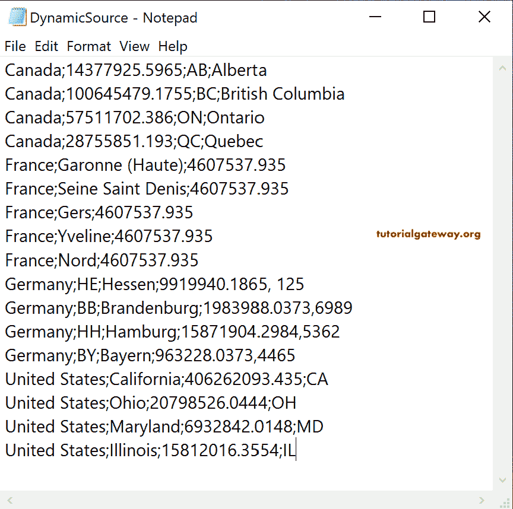

从上图可以看到，加拿大有四列，法国有三列，各个国家列的顺序都不一样。

## 人才读取动态文件结构示例

首先，拖放 Talend tFileInputMSDelimited 来读取多结构或动态文件结构。

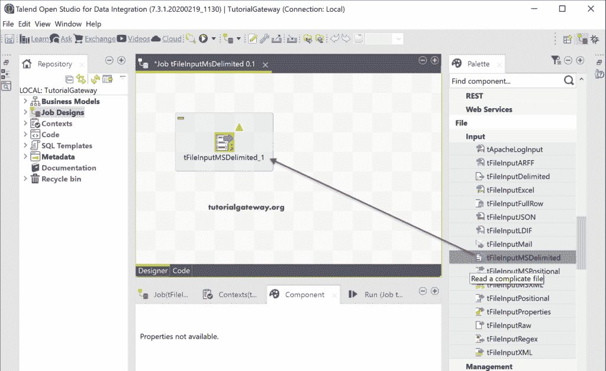

单击多模式编辑器按钮。

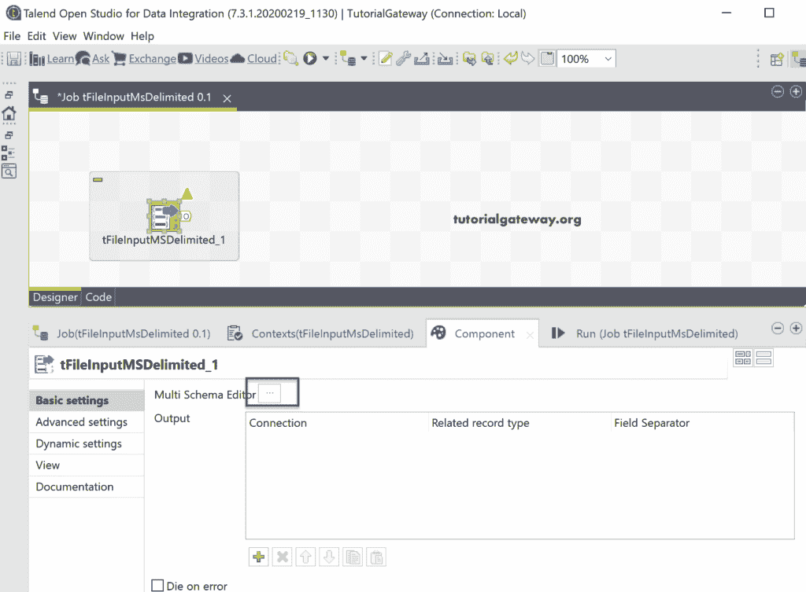

这是我们必须根据字段分隔符获取结构的地方。大多数组件与 tFileInputDelimited 相同。

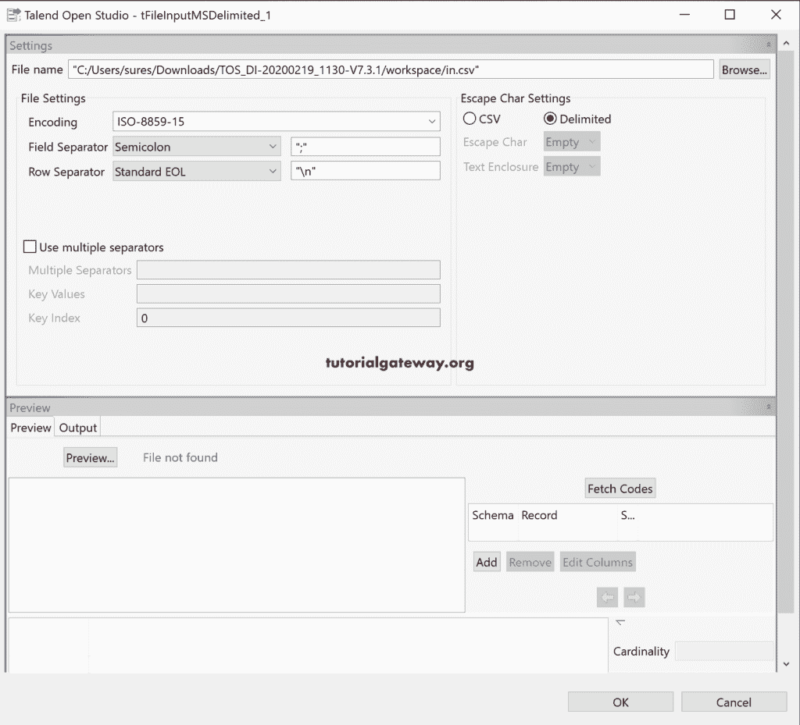

请单击浏览按钮，从文件系统中选择动态源文本文件。

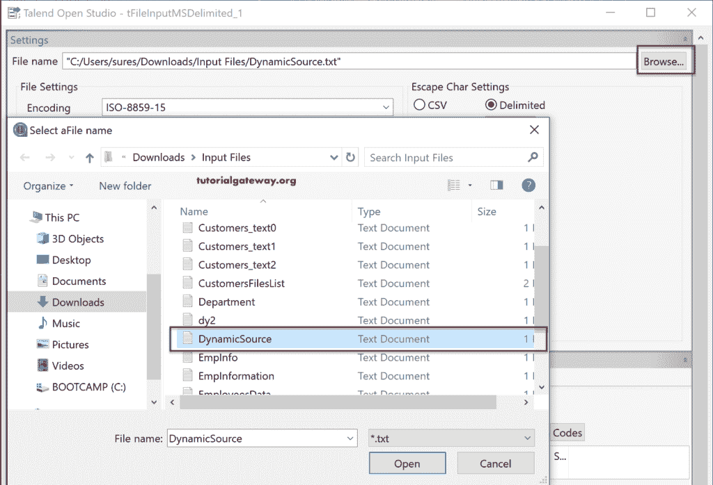

接下来，根据需要更改字段分隔符，并单击预览按钮查看数据预览。

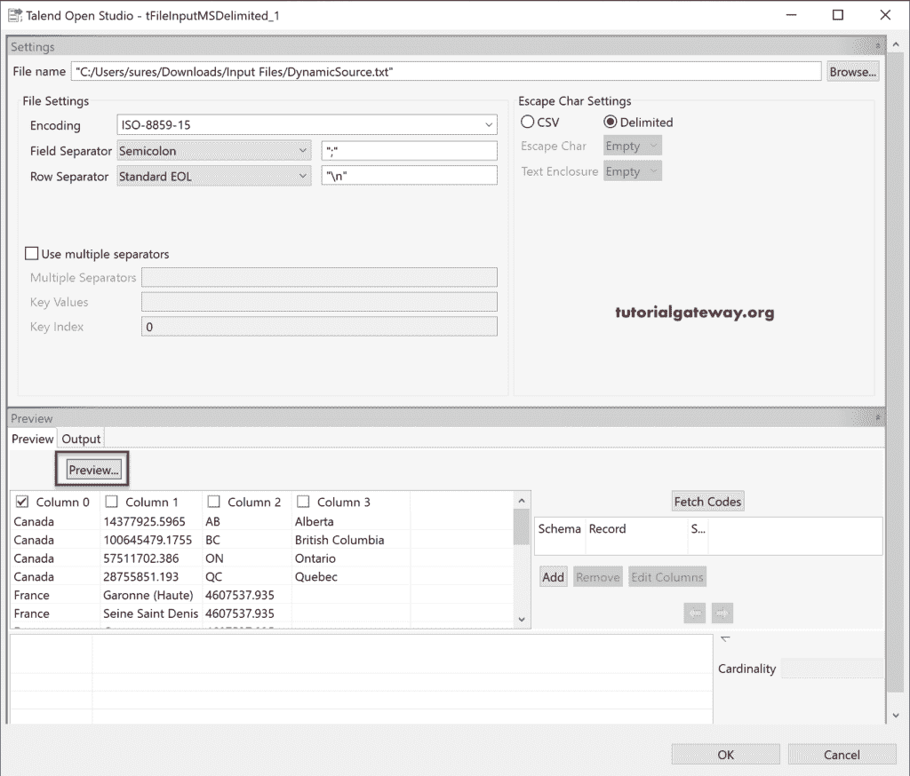

请选择或勾选“常用”列，或者按列分组来获取代码。默认情况下，它将选择列；否则，您可以选择所需的列。接下来，单击获取代码按钮。

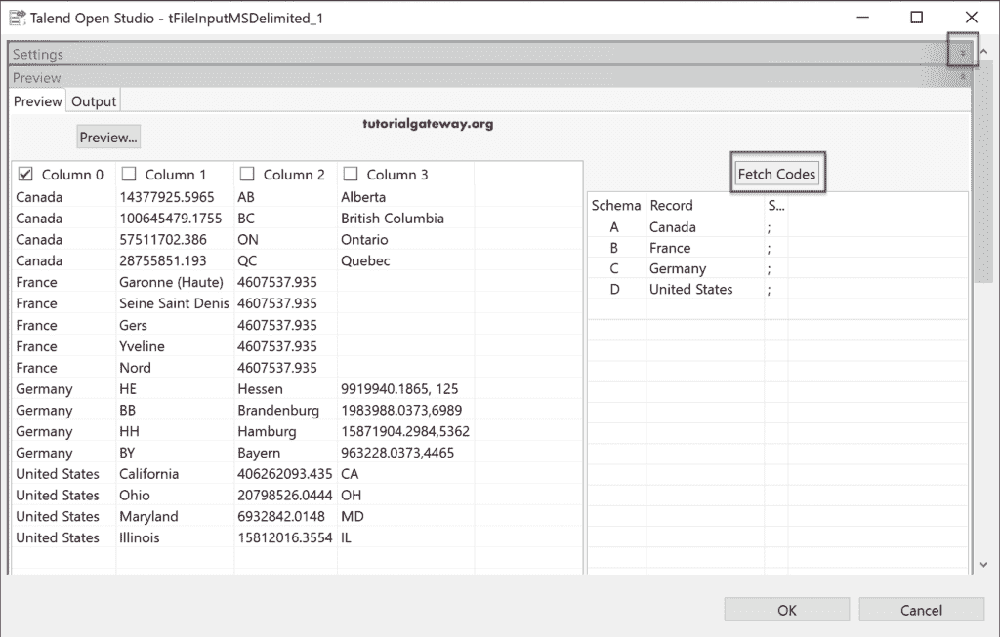

如果文本文件中有多个分隔符来分隔列，请选中使用多个分隔符选项，并将它们放在下面的文本框中。

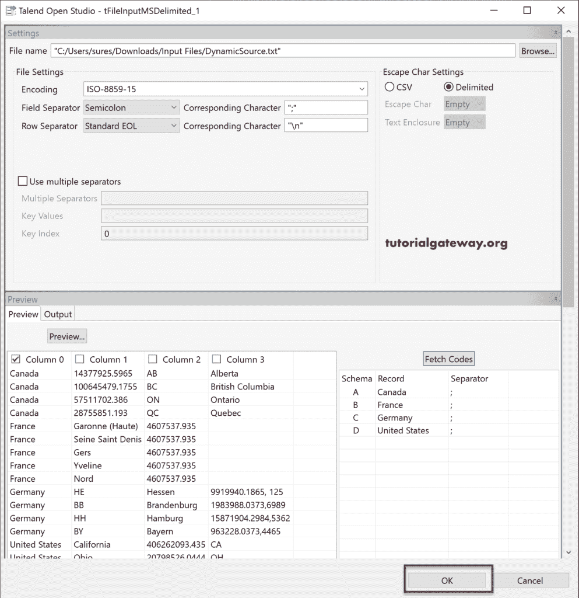

现在，您可以在输出列下看到所有的连接。

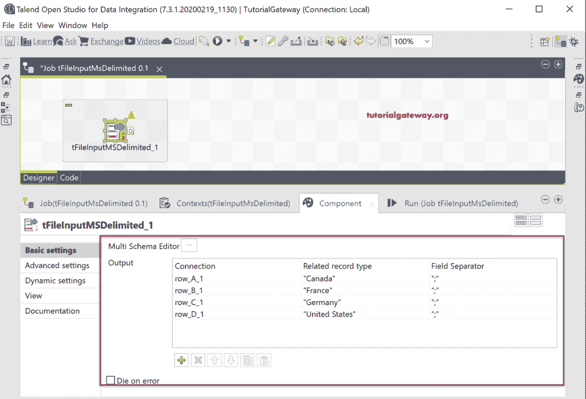

一旦右键单击[Talend](https://www.tutorialgateway.org/talend-tutorial/)tFileInputMSDelimited 并选择“行”选项，您就可以看到所有输出。对于 Talend Read 动态文件结构示例，我们将每个输出分配给带有表预览的 tLogRow。

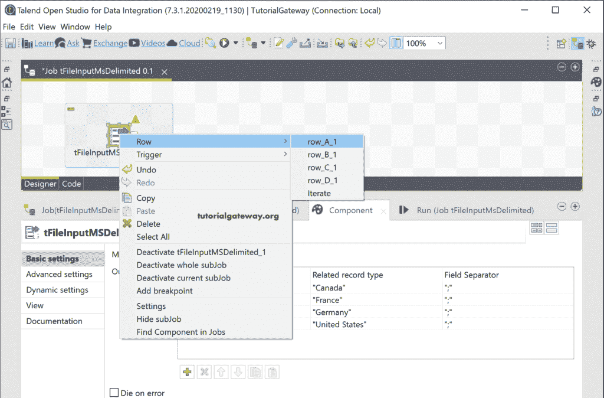

请运行 Talend 读取多结构文件以查看输出。

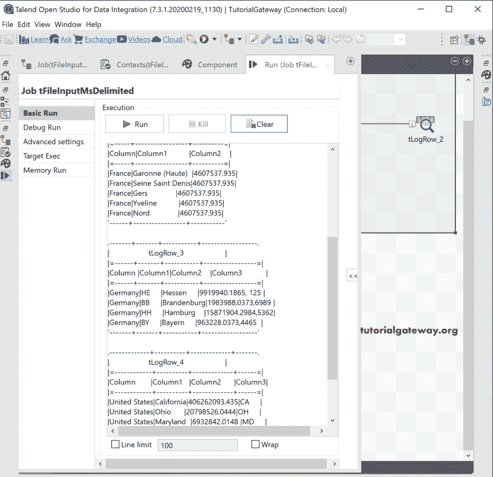

您也可以根据需求更改列名。