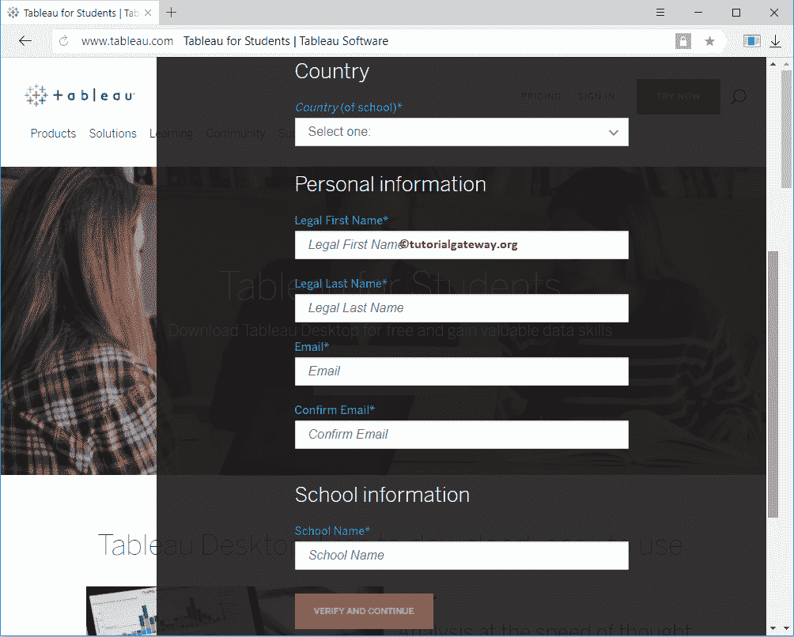

# 下载并安装 Tableau

> 原文：<https://www.tutorialgateway.org/download-and-install-tableau/>

在本文中，我们将通过截图向您展示如何下载和安装 Tableau 桌面(无论版本如何)。安装 Tableau 桌面包括以下步骤。因此，请按照我们下面提到的步骤操作

## 下载和安装 Tableau 桌面的步骤

以下是下载和安装 Tableau 桌面所涉及的步骤。对于苹果用户来说也是如此。

### 下载 Tableau 桌面

该公司提供 14 天的试用版。你可以用同样的方法，自己练习。下载 [Tableau](https://www.tutorialgateway.org/tableau/) 桌面，首先点击此链接[官方链接](https://www.tableau.com/products/trial)进入官网。

下面的截图将显示官方网站的下载页面。请提供有效的电子邮件号下载桌面

如果你是学生(持有有效学生证)，那么你可以下载学生表，执照有效期为一年。为学生下载，点击此链接[学生链接](https://www.tableau.com/academic/students)，将显示下载页面。请点击免费获取按钮

单击此按钮将向您显示以下表单。请填写您的详细信息，然后上传您的身份证。接下来，给团队一些时间来核实你的细节。一旦您的身份得到确认，团队就会向您发送有效期为一年的许可证密钥。

### 安装 Tableau 桌面

要安装 Tableau 桌面，请将您的文件系统导航到我们之前下载的软件。接下来，点击应用程序。

单击应用程序后，将打开如下所示的窗口。这是安全警告，如果你有任何安全措施，它可能会上诉，否则，跳到下一步

安装 Tableau 桌面的第一页是欢迎页面。请勾选“我已阅读并接受许可协议条款”选项，然后单击“安装”按钮

等到 Tableau 桌面安装完成。之后，请等到注册窗口打开。在这里你必须登记你的详细资料。

如果您有许可证密钥，请单击上面截图中的激活超链接(上图中的蓝色链接)。单击链接将打开以下窗口以提供许可证密钥，然后单击激活。

安装完成

后自动打开