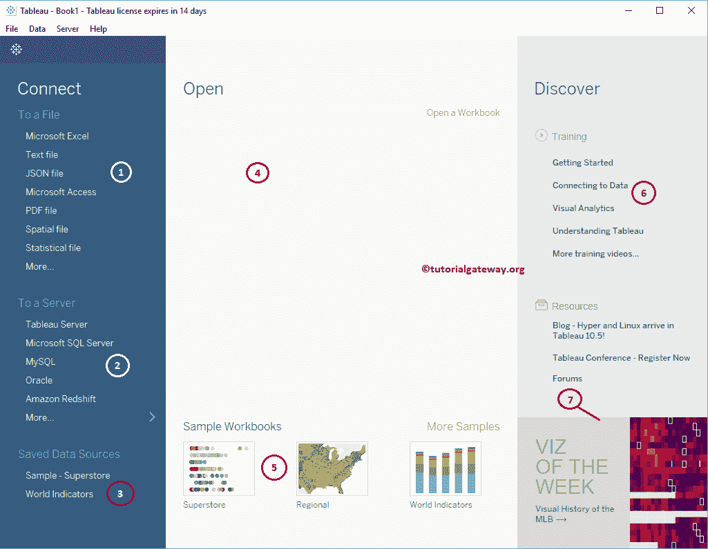
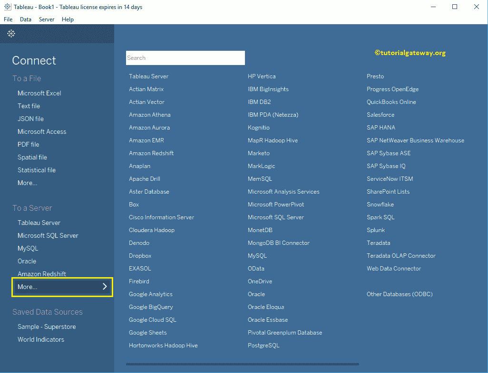
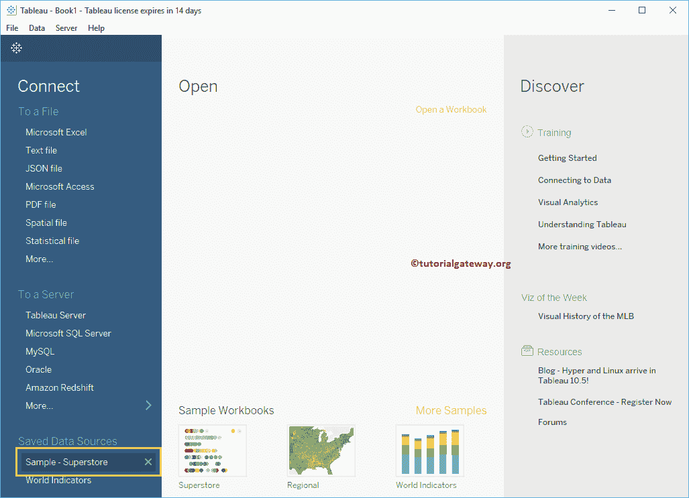
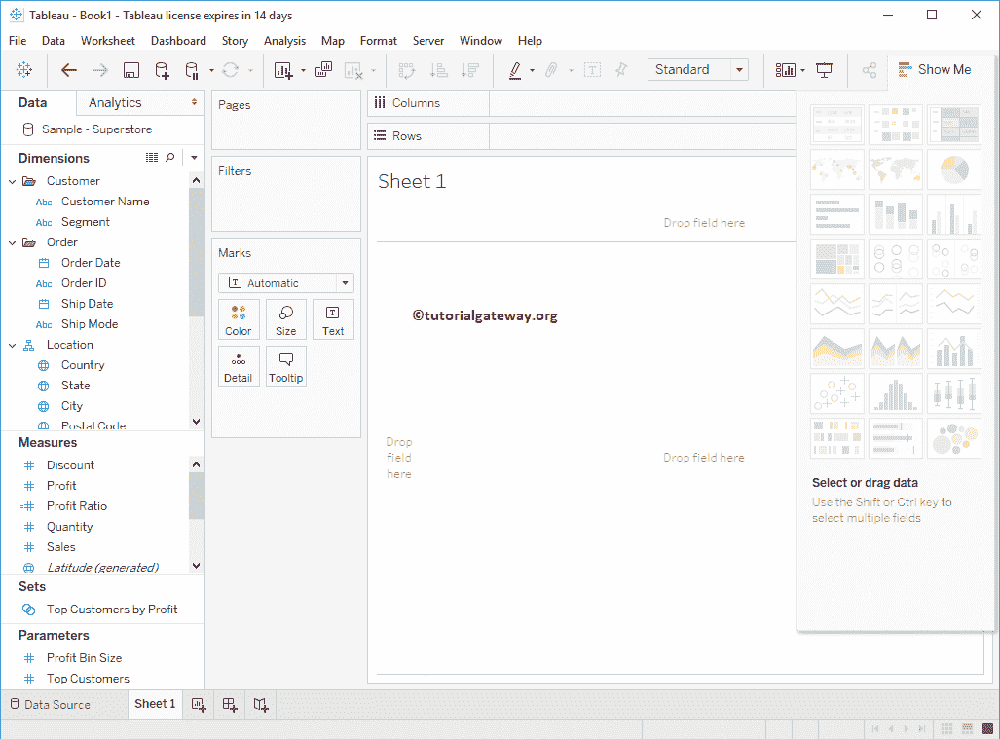
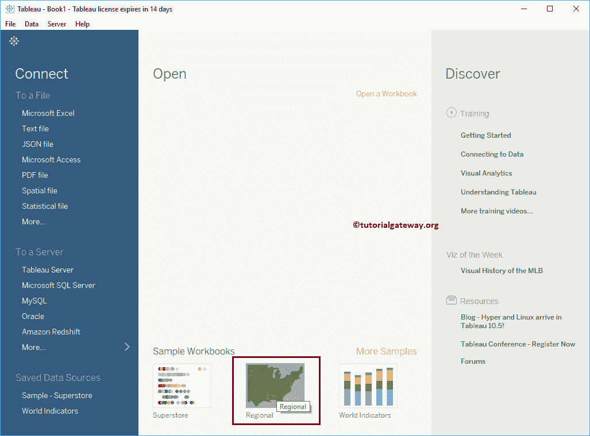
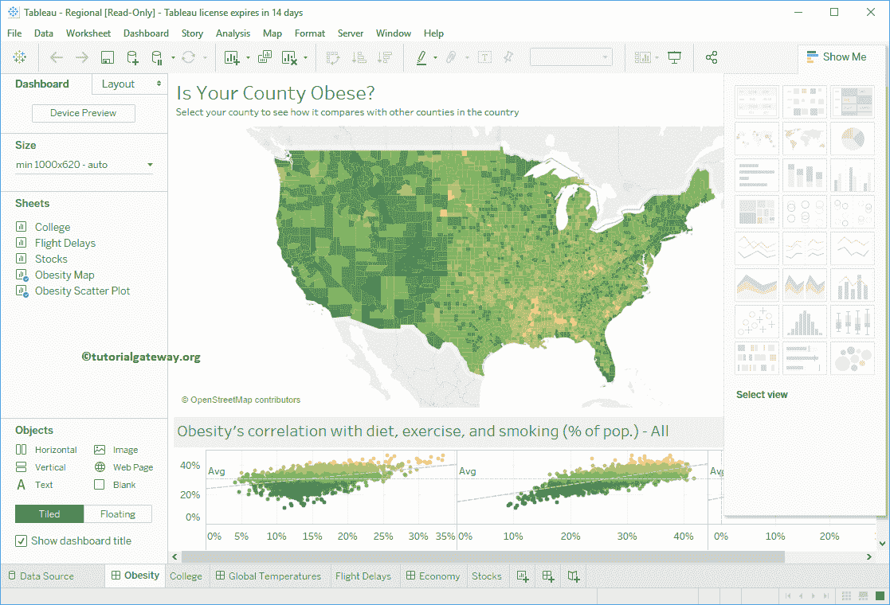
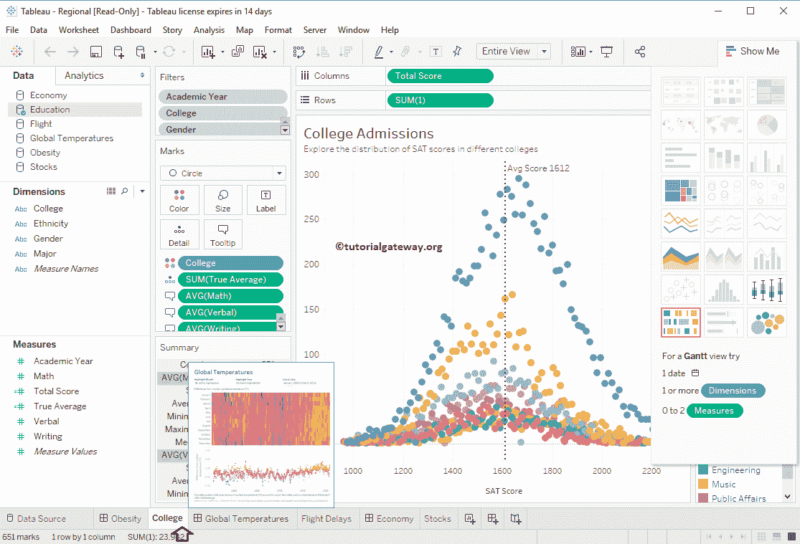
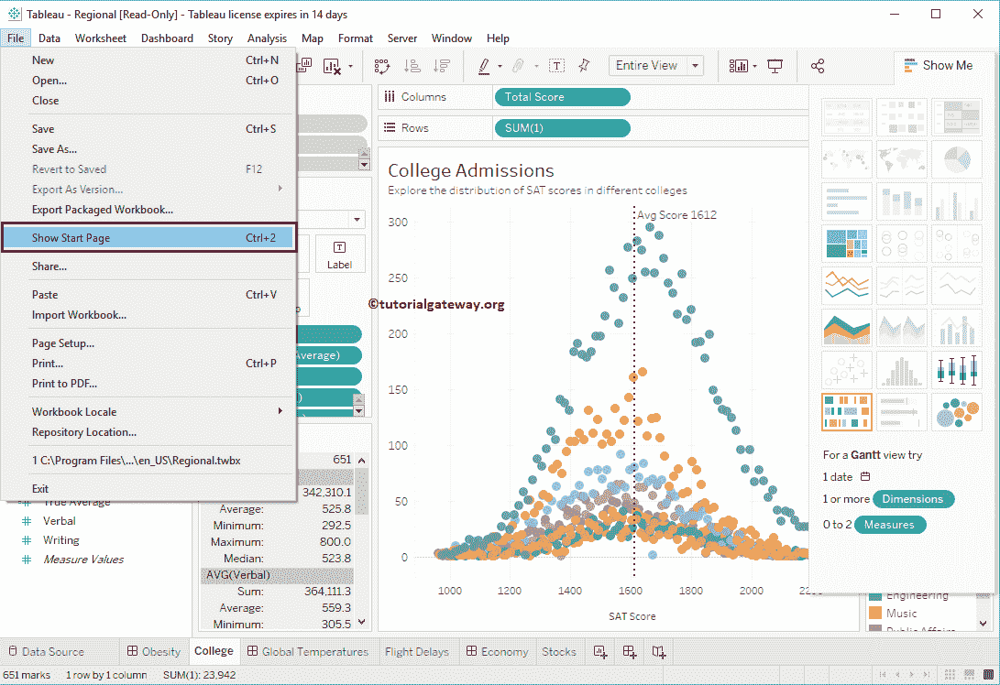
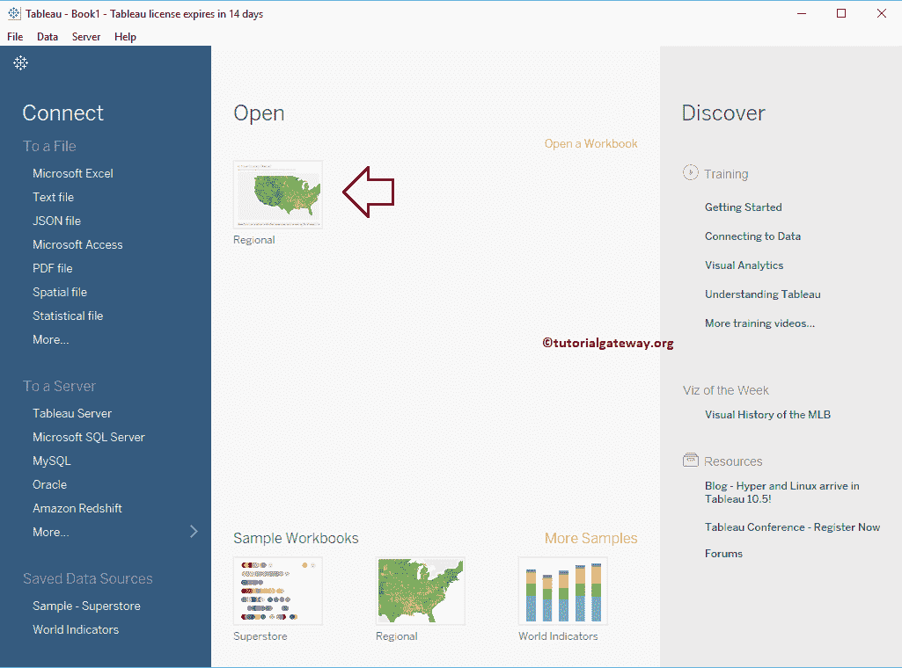

# Tableau 起始页

> 原文：<https://www.tutorialgateway.org/tableau-start-page/>

在本文中，我们将向您展示 Tableau 起始页。Tableau 中的起始页是连接或提取报告数据的中心位置，并打开最近使用过的工作簿。

## 起始页

如果你还没有启动 Tableau，双击 Tableau 桌面打开。一旦打开，它看起来像下面的截图。

从下面的截图中，您可以看到我们将起始页分为 7 个部分。

1.  连接到文件:此部分帮助您连接到文件，或者允许您从文件中提取数据，如 [Excel](https://www.tutorialgateway.org/connecting-to-excel-files-in-tableau/) 、[文本](https://www.tutorialgateway.org/connecting-to-text-file-in-tableau/)文件、pdf、空间文件等。
2.  连接到服务器:该部分帮助您连接到 [Tableau](https://www.tutorialgateway.org/tableau/) 服务器，或者允许您从服务器提取数据，如 [MySQL](https://www.tutorialgateway.org/mysql-tutorial/) 、 [SQL Server](https://www.tutorialgateway.org/connecting-tableau-to-sql-server/) 、Tableau 服务器等。
3.  已保存的数据源:所有现有的或已保存的数据源将显示在此部分下。
4.  打开:最近使用的工作簿将显示在此部分下。目前，我们没有任何用过的工作簿。
5.  示例工作簿:这些是将随 [Tableau 桌面](https://www.tutorialgateway.org/download-and-install-tableau/)安装一起提供的示例工作簿。
6.  培训和资源:有用的博客和一些视频的链接。
7.  资源:由 Tableau 社区生成的内容。

如果“连接到服务器”部分下没有您的服务器，请单击“更多”..超链接。它将向您显示所有支持服务器的列表。

对于这个例子，让我选择示例-超级商店数据源。

选择数据源将打开一个新工作表来创建报告。在这里，您可以看到该数据源中可用的度量和维度。

让我打开区域工作簿，向您展示可用的图表。

选择区域工作簿将向您显示该工作簿中可用的工作表。

您可以使用它们来理解可以从 Tableau 桌面制作的图表。

如果您想在任何时间点转到起始页，请转到“文件”菜单并选择“显示起始页”。

选择“显示起始页”将打开 Tableau 起始页，现在您可以在“打开”部分下看到区域工作簿。因为我们最近使用了这个工作簿。

