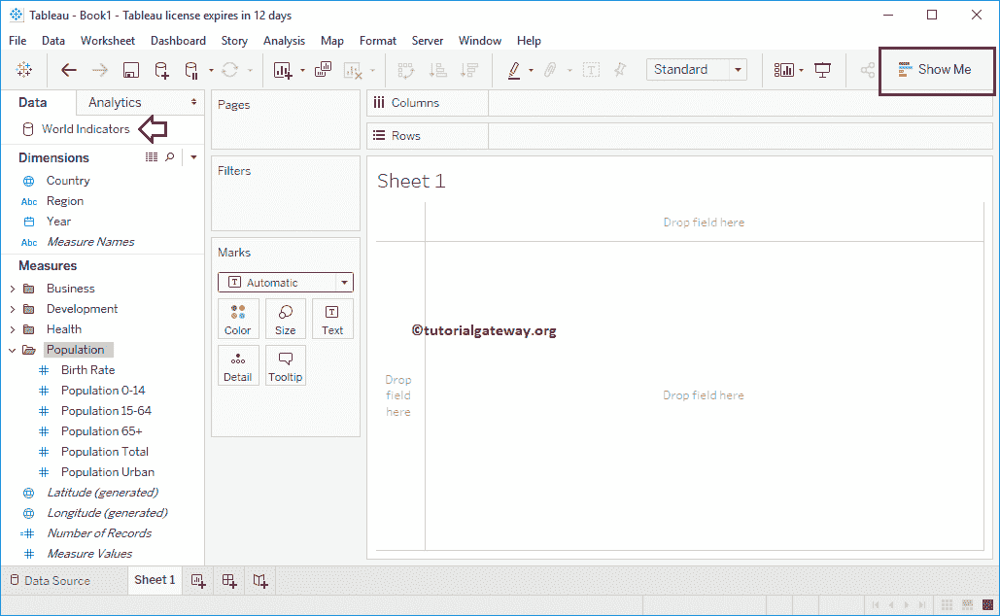
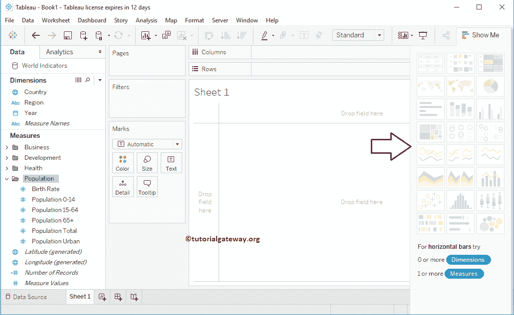
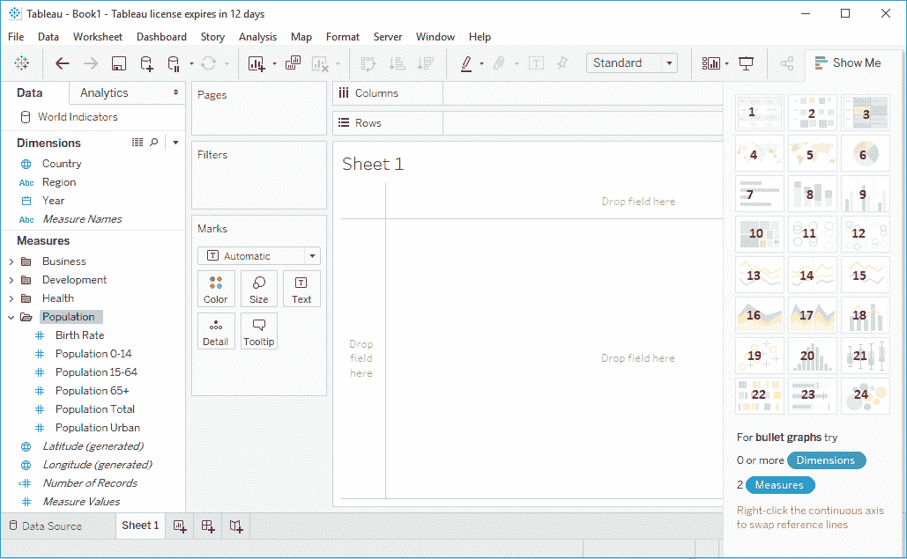
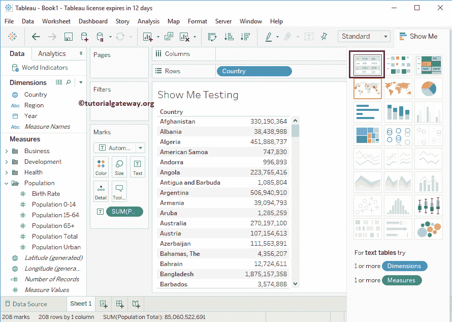

# Tableau 演示

> 原文：<https://www.tutorialgateway.org/tableau-show-me/>

“演示”窗口包含 Tableau 中最常用的图表。您可以使用这些图表中的任何一个来查看数据。单击工具栏上的“演示”打开此窗口，如下所示。

## Tableau 演示窗口

点击“演示”选项卡将打开以下窗口

以下是“演示”窗口中可用的图表列表。

1.  [文本标签](https://www.tutorialgateway.org/tableau-text-label/)
2.  [热图](https://www.tutorialgateway.org/tableau-heat-map/)
3.  [突出显示表](https://www.tutorialgateway.org/highlight-table-in-tableau/)
4.  [符号图](https://www.tutorialgateway.org/how-to-create-a-map-in-tableau/)
5.  [地图](https://www.tutorialgateway.org/maps-in-tableau/)
6.  [饼图](https://www.tutorialgateway.org/pie-chart-in-tableau/)
7.  [横条](https://www.tutorialgateway.org/bar-chart-in-tableau/)
8.  [堆叠杆](https://www.tutorialgateway.org/stacked-bar-chart-in-tableau/)
9.  [并排杆](https://www.tutorialgateway.org/grouped-bar-chart-in-tableau/)
10.  [树形图](https://www.tutorialgateway.org/tableau-treemap/)
11.  [圆形视图](https://www.tutorialgateway.org/circle-views-in-tableau/)
12.  [并排圆形视图](https://www.tutorialgateway.org/circle-views-in-tableau/)
13.  [折线图](https://www.tutorialgateway.org/tableau-line-chart/)
14.  [离散线](https://www.tutorialgateway.org/tableau-line-chart/)
15.  [双线](https://www.tutorialgateway.org/dual-lines-chart-in-tableau/)
16.  [区域图](https://www.tutorialgateway.org/tableau-area-chart/)
17.  [离散区域](https://www.tutorialgateway.org/tableau-area-chart/)
18.  [双重组合](https://www.tutorialgateway.org/tableau-dual-combination-chart/)
19.  [散点图](https://www.tutorialgateway.org/tableau-scatter-plot/)
20.  [直方图](https://www.tutorialgateway.org/tableau-histogram/)
21.  [方块和触须图](https://www.tutorialgateway.org/tableau-box-plot/)
22.  [甘特图](https://www.tutorialgateway.org/gantt-chart-in-tableau/)
23.  [靶心图](https://www.tutorialgateway.org/tableau-bullet-graph/)
24.  [气泡图](https://www.tutorialgateway.org/tableau-bubble-chart/)

### 使用表演示创建表

出于演示目的，我们将“国家”字段从“测量区域”拖到“T0”行字段，“总人口”拖到“列”字段。接下来，我们从展示中选择了[文本标签](https://www.tutorialgateway.org/tableau-text-label/)。从下面的截图中可以看到，Tableau 已经创建了 Table 报告。

