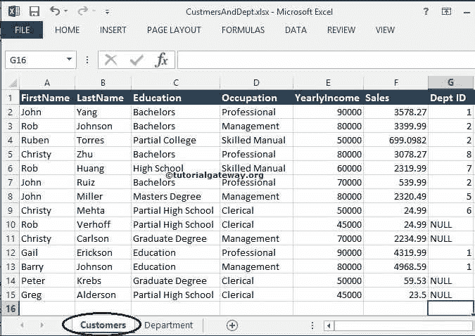
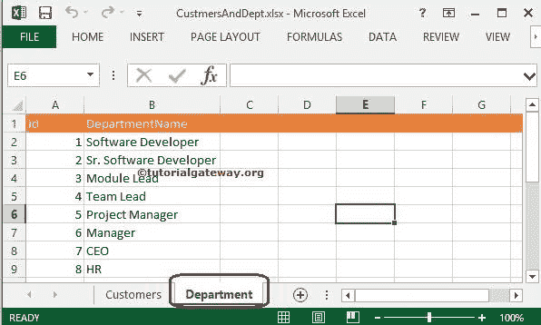
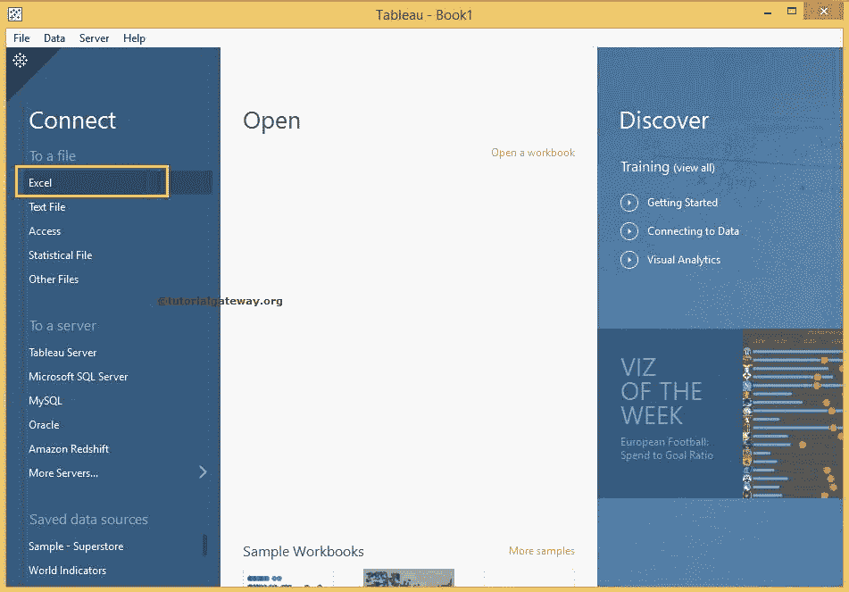
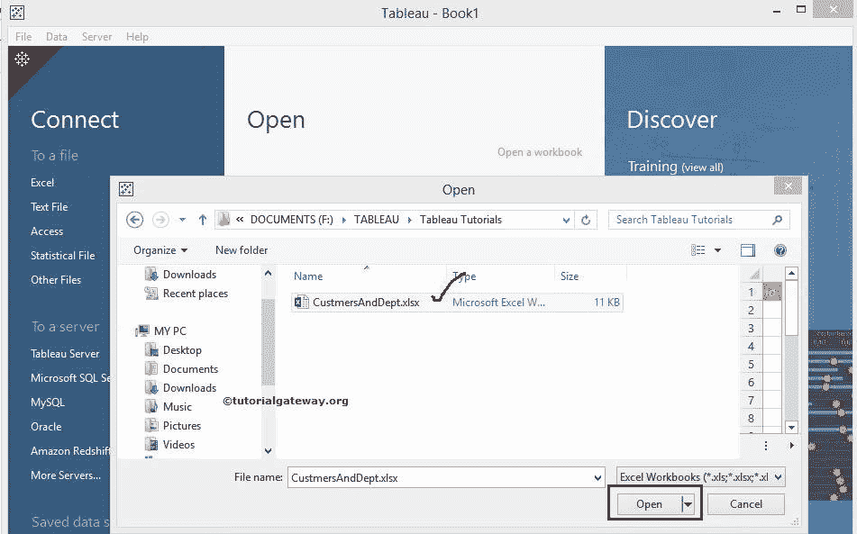
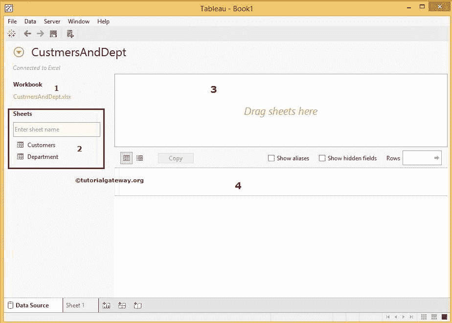
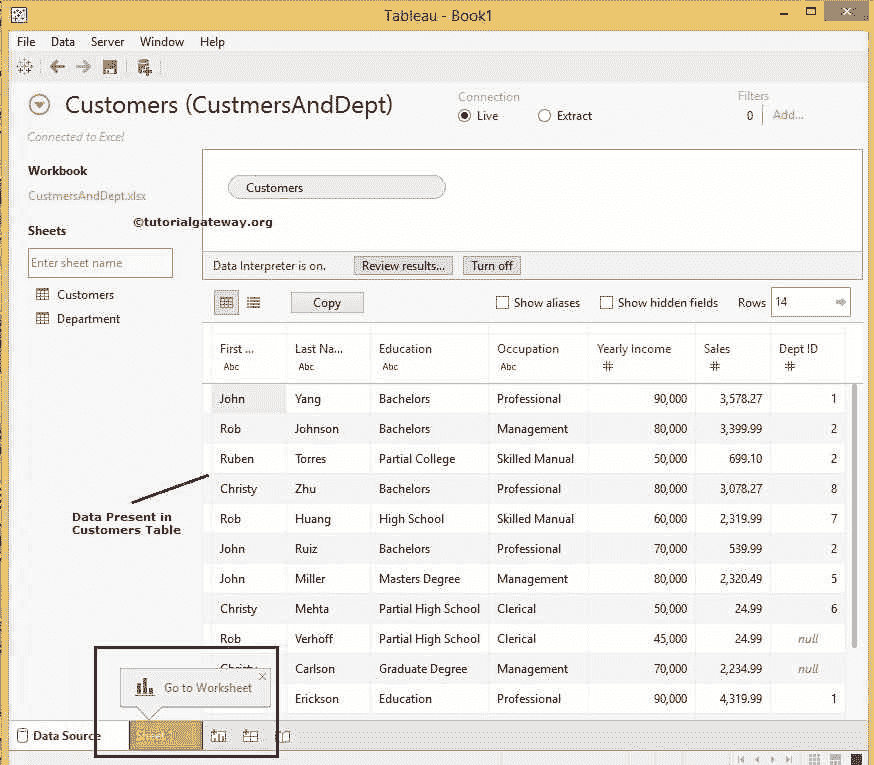
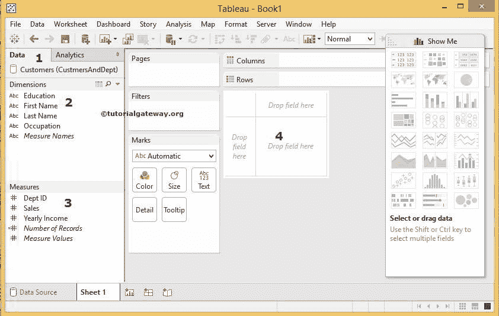

# 连接到表格中的 Excel 文件

> 原文：<https://www.tutorialgateway.org/connecting-to-excel-files-in-tableau/>

本章介绍如何将 Tableau 连接到 Microsoft Excel 文件。此外，还举例说明了如何使用 excel 表格作为 Tableau 数据源。

## 在 Tableau 中连接到 Excel 文件的步骤

在开始之前，让我们看看 Excel 文件中的数据。如果我们看到下面的截图，它只是一个常规。xlsx 文件包含两张纸或两张桌子。下面的截图将显示客户表

中的数据

下面的截图显示了部门表

中的数据

接下来，双击 [Tableau 桌面](https://www.tutorialgateway.org/download-and-install-power-bi-desktop/)打开。打开后，如下图所示

首先，在连接部分，请选择 Excel 选项将[表格](https://www.tutorialgateway.org/tableau/)连接到 Excel 文件

一旦选择了 Excel 选项，将会打开一个新窗口，从我们的文件系统中选择 Excel 文件。现在，我们正在选择 CustomersAndDept.xlsx 文件，如下所示

一旦我们完成，下面的截图就会出现。在开始创建报告之前，请了解以下选项

1.  工作簿:我们从文件系统中选择的 Excel 文件。
2.  工作表:此部分显示 Excel 源中的工作表或表格。我们有两张表，所以它显示这两张表(客户和部门)。我们在这部分有搜索栏，对于大量的纸张来说很方便。例如，如果我们有 30 或 40 张纸，用它来搜索特定的表格
3.  将表格拖至此处:我们必须将表格从表格拖至此部分。Tableau 将只使用该区域中的表格。它类似于数据集。
4.  此区域显示了我们数据集中的数据

注意:CustomersAndDept 是表分配的默认数据源名称(Excel 文件名)。请将此默认名称更改为更有意义的唯一名称

我们可以通过多种方式将图纸添加到区域 3。顾名思义，我们可以将客户表从工作表区域拖到第三个区域，或者双击所需的表将自动添加

提示: [Tableau](https://www.tutorialgateway.org/tableau/) 允许我们使用连接添加多个表

一旦我们拖动了客户表，预览区域将显示该表中的数据。如果您观察下面的截图，会出现一条消息，显示数据解释器已打开

数据解释器:如果 Tableau 发现我们选择的工作表中任何一列数据的格式都难以分析，Tableau 会弹出一条消息，要求我们打开数据解释器。通过打开数据解释器，我们可以将数据

规范化

完成后，单击表 1 选项卡设计报告。

1.  数据:这将显示当前连接的数据源列表。此时我们只有“一个”；否则，它会显示所有可用的数据源。
2.  维度:包含字符串数据的列将放在维度部分下
3.  度量:包含数字数据或度量值的列将放在度量部分下
4.  这是我们通过拖动度量和维度来设计 Tableau 报告的区域

从上面的截图中，我们只看到了客户表中的数据，尽管我们的 Excel 文件中有客户和部门表。如果要添加部门表，请单击顶部的后退按钮，将部门表与客户表连接起来。