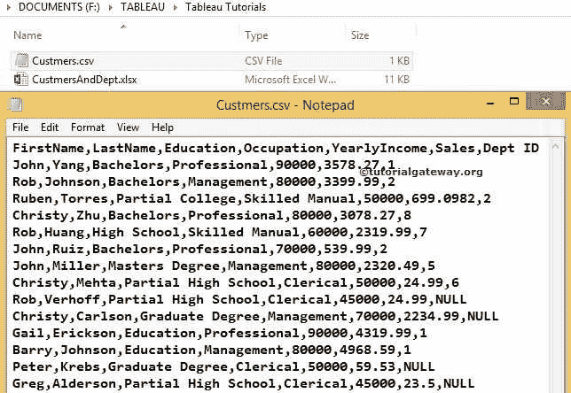
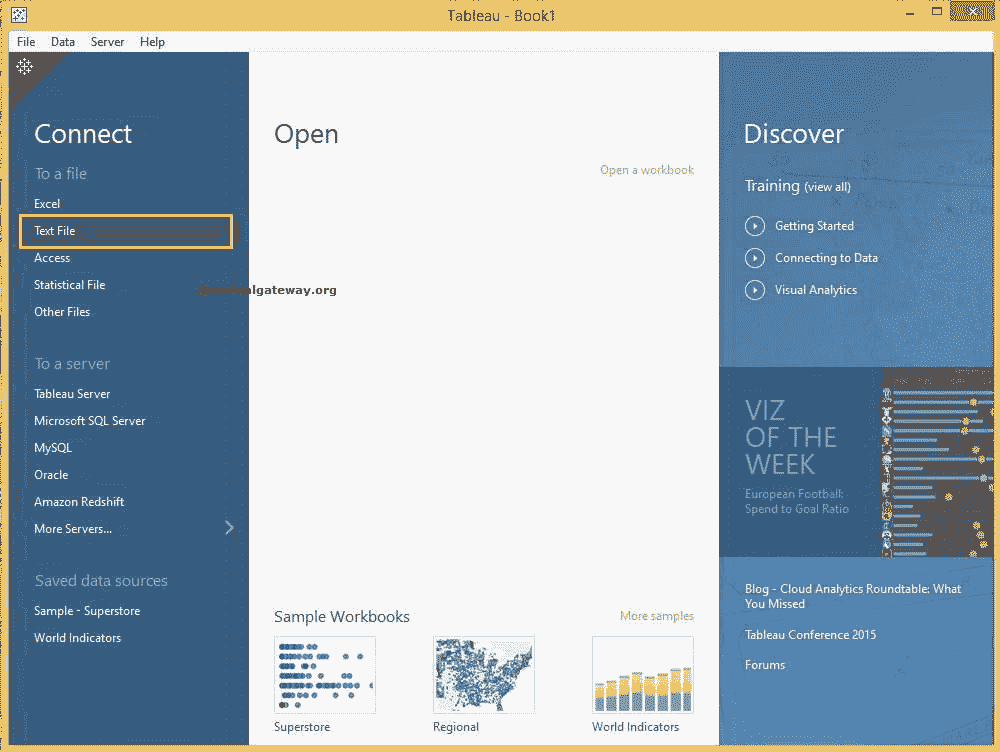
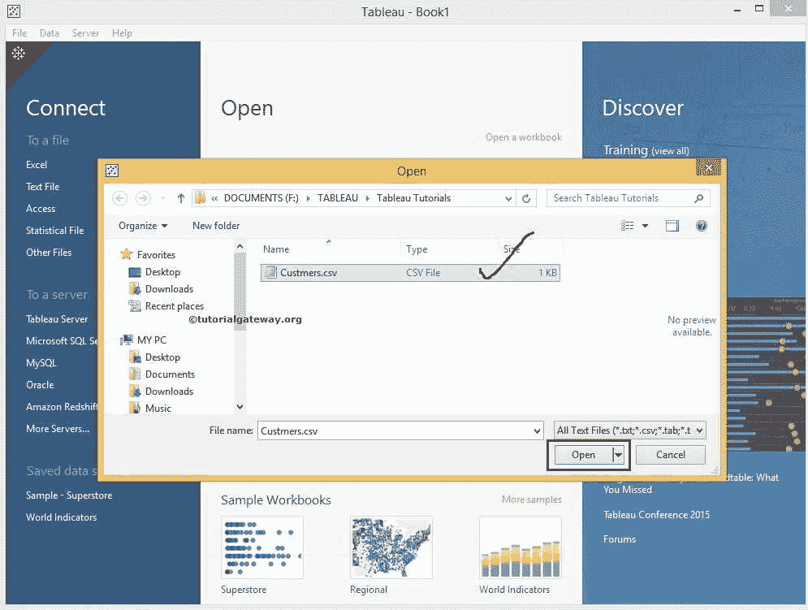
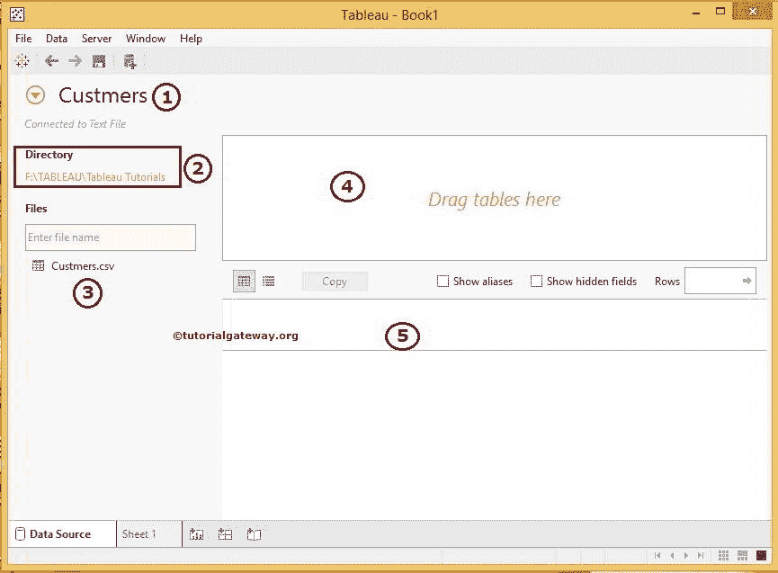
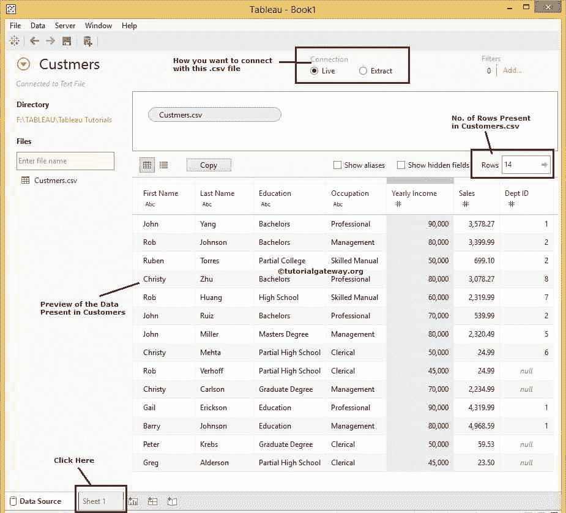
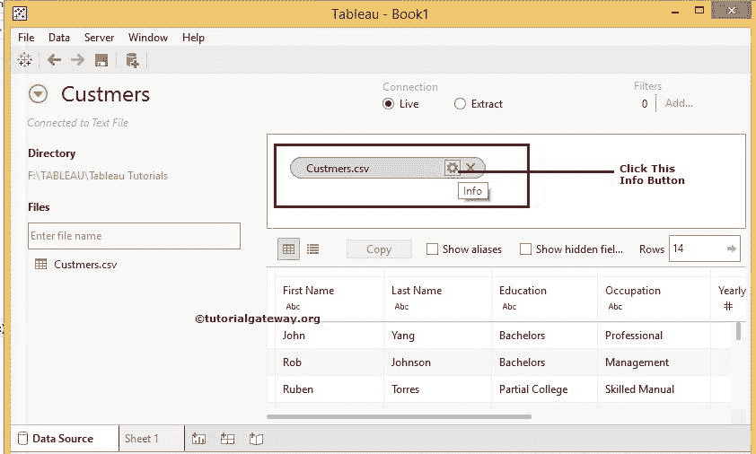
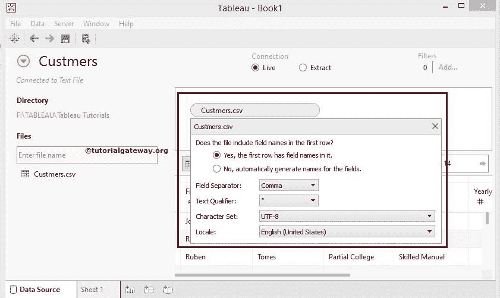
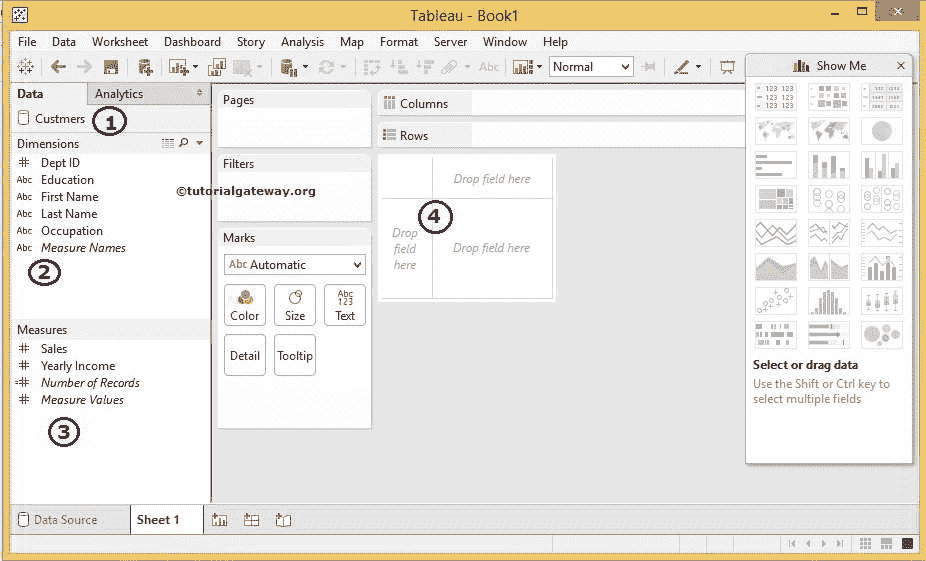

# 在 Tableau 中连接到文本文件

> 原文：<https://www.tutorialgateway.org/connecting-to-text-file-in-tableau/>

在本文中，我们将向您展示如何将 Tableau 连接到文本文件。此外，如何使用文本文件中的数据(如。txt，。csv，。选项卡，。tsv)作为 Tableau 数据源的示例。

## 在 Tableau 中连接到文本文件的步骤

在我们开始将 Tableau 连接到文本文件或 csv 之前，让我们看看文本文件中的数据。从下面的截图，它只是一个标准的文本文件。csv 扩展。如果你仔细观察，第一行有列名

如果你还没有启动 Tableau，双击 Tableau 桌面打开。打开后，如下图所示

首先，在[表](https://www.tutorialgateway.org/tableau/)连接部分下，请选择

文本文件选项

选择文本文件选项后，将打开一个新窗口，从我们的文件系统中选择文本文件。目前，我们选择的是

文件

完成后，将出现下面的截图。在开始创建报告之前，请了解以下选项

1.  客户是表分配的默认数据源名称(实际上是文本文件名)。请根据您的要求将此默认名称更改为更有意义的唯一名称
2.  目录:该部分将显示所选文本文件的目录地址。简而言之，它将显示文件路径。
3.  文件:这部分将显示我们在文本文件源中选择的文本文件的数量。在这个例子中，我们只选择了一个文件，所以它显示的是 Customers.csv，但是在实时情况下，您可能会使用更多的文件。我们在这部分有搜索栏，它对大量文件很有用。例如，如果您有 20 或 30 个文件，您可以使用它来搜索特定的文件名
4.  将工作表拖到此处:您必须将文件从文件拖到此部分。Tableau 将只使用这个区域中的文件，类似于数据集。
5.  该区域将显示数据集中的数据

我们可以通过多种方式将文本文件添加到区域 4:顾名思义，我们可以将 Customers.csv 文件从区域 3 拖动到第四个区域，或者只需双击所需的文件就会自动添加

提示:Tableau 允许我们使用连接添加多个表。

拖动客户文件后，预览区域将显示其中的数据。csv 文件。完成日期审核后，点击第 1 页设计 Tableau 报告

哎呀，我们忘了告诉你最重要的属性叫信息。

限定词将分隔每个文本文件中存在的数据(与扩展名无关)，并且它可能将列名作为第一行。要配置这些设置，请在第四个区域选择文本文件，点击【信息】按钮

单击信息按钮后，将打开一个新的下拉窗口来配置以下项目:

*   文件的第一行是否包含字段名？:我们必须指定所选文本文件的第一行是否包含列名。默认情况下，此选项设置为是，但会根据您的文件要求进行更改。
*   字段分隔符:请选择用于分隔文本文件中各列的字符。如果列表中没有字符，请选择“其他”并键入自定义字符。
*   文本限定符:请指定用于将值包含在所选文本文件中的文本限定符。
*   字符集:请选择描述文本文件编码的字符集。大多数情况下，Tableau 会为您检测到它。如果没有，请手动更改。
*   区域设置:用于解析文本文件的语言。Tableau 将使用这个来分隔数字

完成后，单击工作表 1 选项卡设计报告。

1.  数据:这将显示当前连接的数据源列表。我们现在只有一个。否则，它会显示所有可用的数据源。
2.  维度:可以将带有字符串数据的列放在维度部分下
3.  度量:您可以在“度量”部分下放置带有数值数据或度量值的列
4.  这是我们通过拖动度量和维度来设计 Tableau 报告的区域

