# 在 Tableau 中连接到服务器

> 原文：<https://www.tutorialgateway.org/connecting-tableau-to-sql-server/>

在本文中，我们将向您展示将 Tableau 连接到 SQL Server 所涉及的步骤。此外，还举例说明了如何将 SQL 表中的数据作为 Tableau 数据源。

## 将表连接到服务器的步骤

如果你还没有启动 Tableau，双击 Tableau 桌面打开。一旦打开，它看起来像下面的截图。

要将 Tableau 连接到 SQL Server，首先，在连接到服务器部分下，请选择微软 SQL Server 选项

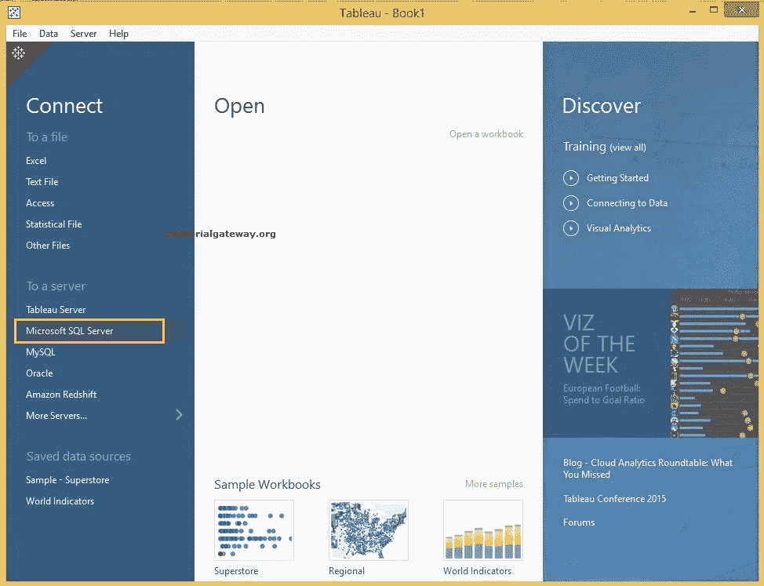

一旦您选择了 Microsoft SQL Server 选项，将会打开一个新窗口来配置服务器连接。

*   服务器:请指定 [SQL Server](https://www.tutorialgateway.org/sql/) 实例名称
*   输入登录到服务器的信息:使用此部分确定您希望如何连接到 SQL Server。如果要使用当前的 windows 登录凭据，请选择“使用 Windows 身份验证”选项。否则，选择使用特定用户名和密码选项&指定用户名和密码以访问 SQL Server。
*   需要 SSL:请在连接到 SQL Server 时选中此选项。它可以防止 SQL 注入。
*   读取未提交数据:勾选该选项，使用读取未提交 [ACID 属性](https://www.tutorialgateway.org/acid-properties-in-sql-server/)。

现在，我们使用本地的 SQL Server 实例连接到 [Tableau](https://www.tutorialgateway.org/tableau/) 。接下来，点击

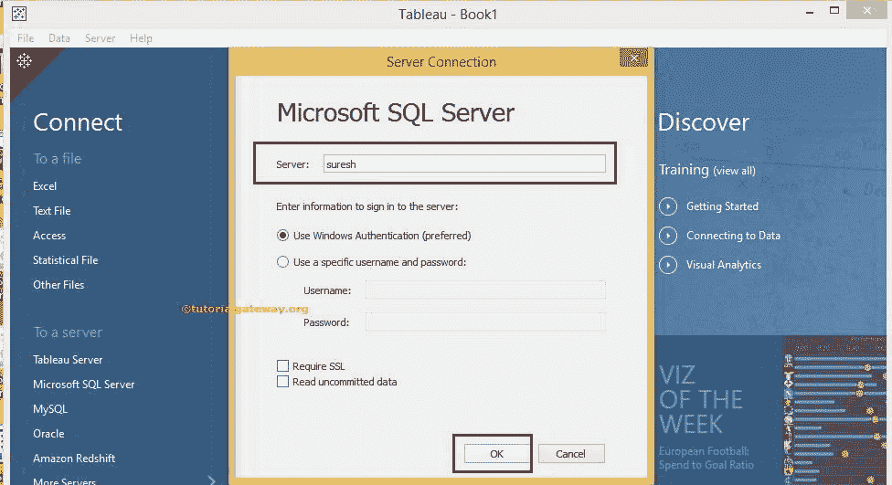

确定按钮

单击“确定”按钮后，将出现以下屏幕截图。在数据库部分下，有一个下拉菜单，用于选择该实例中可用的所需数据库。在这里，您必须选择要与 tableau 连接的数据库

在本例中，我们选择了从微软官方下载中心下载的 AdventureWorksDW2014 数据库。

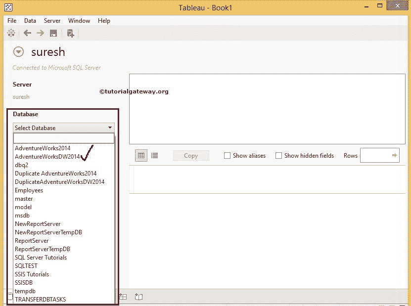

完成后，将出现以下截图。在开始创建报告之前，请了解接下来的选项

1.  AdventureWorksDW2014 是 Tableau 分配的默认数据源名称(实际上是选定的数据库名称)。请将此默认名称更改为更有意义的唯一名称。
2.  服务器:这个部分将展示我们用来连接到 SQL Server 的实例名。
3.  数据库:显示我们选择的数据库。
4.  表:此部分显示选定数据库中可用的表、视图和存储过程。我们在这个部分下有搜索栏，对于大量的表来说很方便。例如，如果您有 100 或 200 个表，您可以使用它来搜索特定的表名
5.  将工作表拖到此处:您必须将表从表拖到此部分。Tableau 将只使用该区域中的表。它有点像数据集。
6.  它显示了我们数据集中的数据

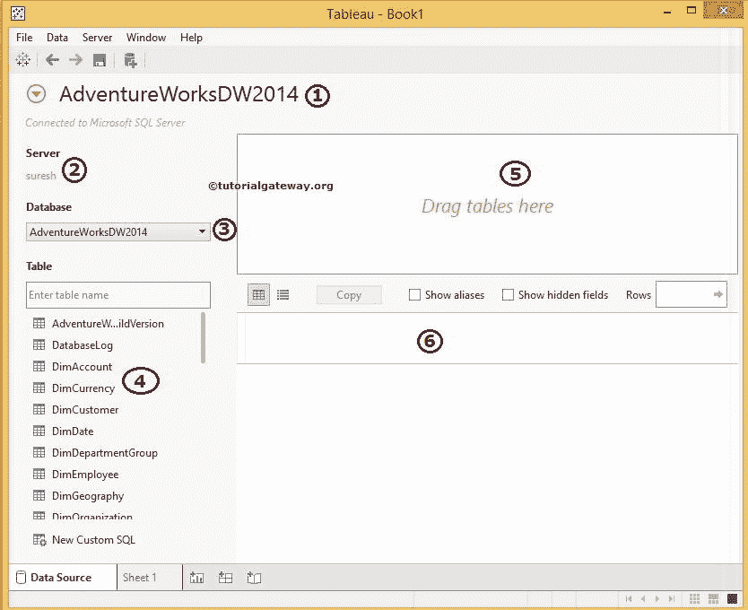

我们可以通过多种方式将表添加到区域 5:顾名思义，我们可以将表、存储过程从区域 4 拖到第 5 个区域，或者双击所需的表将自动添加。

提示:Tableau 允许我们使用[连接](https://www.tutorialgateway.org/how-to-join-data-in-tableau/)添加多个表

添加表后，“预览”区域会显示两个按钮，如“立即更新”和“自动更新”。

*   如果您单击立即更新，每次我们对数据集进行更改时，我们都必须单击此按钮
*   如果单击自动更新按钮，对数据集所做的修改将自动反映预览。在这个例子中，我们选择了这个选项

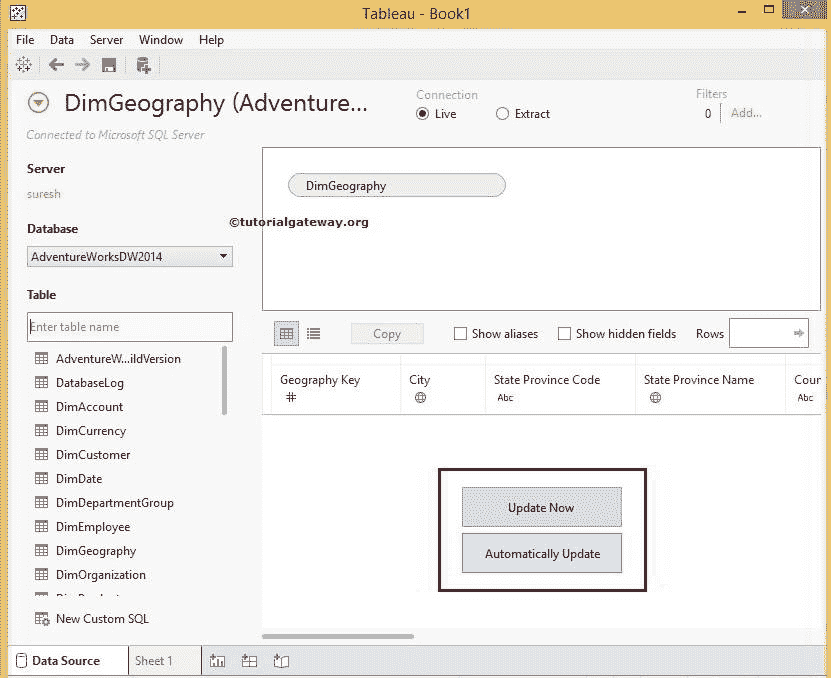

单击自动更新按钮后，预览区域将显示尺寸地理表中的数据。

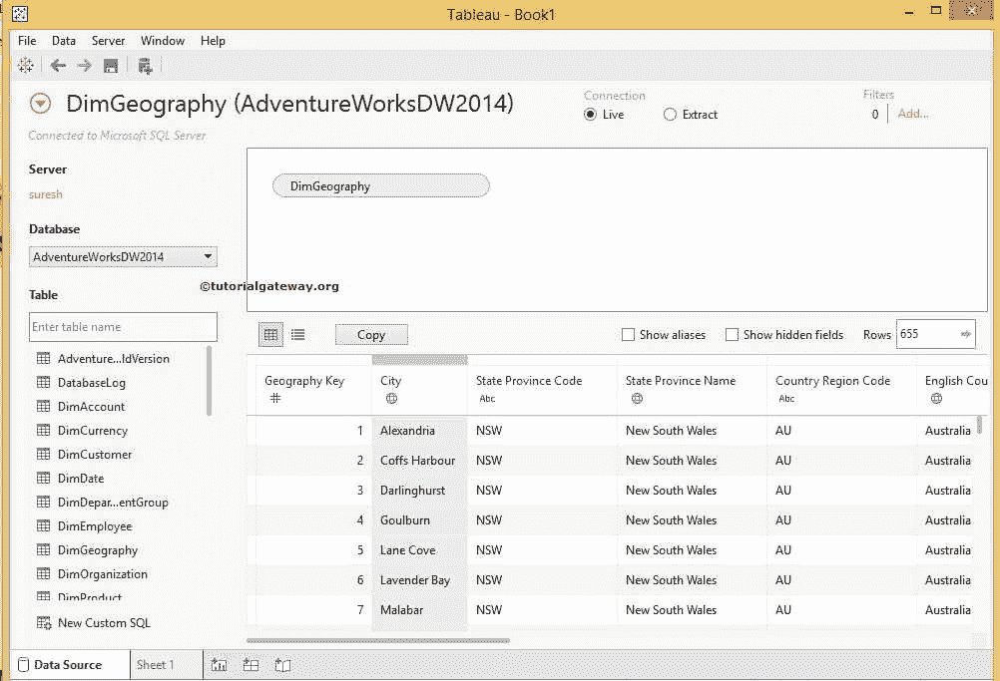

### 将数据从 Sql Server 添加到表中

上面指定的方法不是添加数据的唯一方法。您可以编写 SQL 查询来从选定的数据库或数据源中提取数据。为此，单击左下角的新建自定义 SQL 按钮，如下所示。

点击新建自定义 SQL 按钮后，将会打开一个名为编辑自定义 SQL 的新窗口，开始编写自己的 SQL 查询

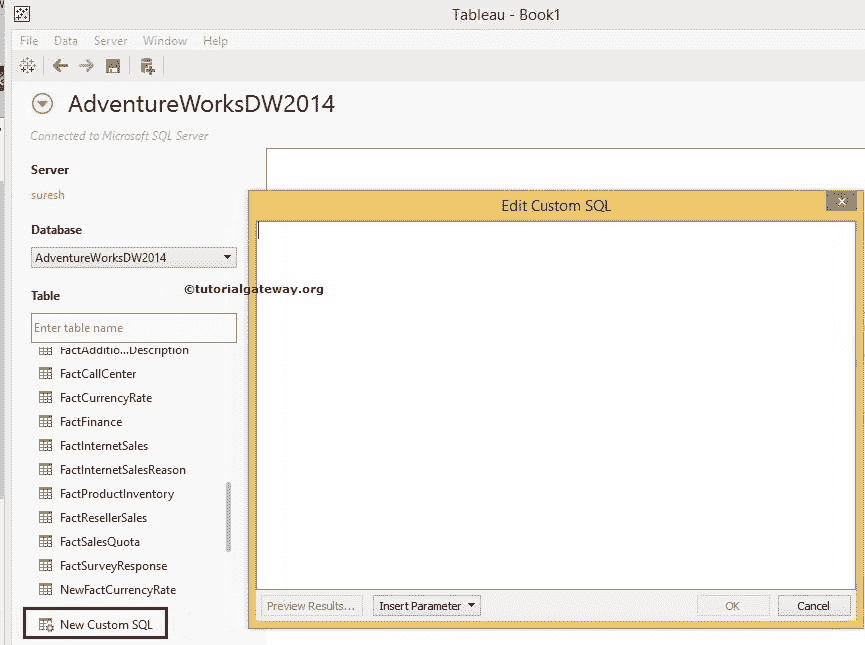

一旦你写完你的自定义 SQL，请点击预览结果..按钮查看查询结果。

提示:请使用 [SQL Server 管理工作室](https://www.tutorialgateway.org/sql-server-management-studio/)构建您的自定义查询，然后将其粘贴到此编辑自定义 SQL 窗口

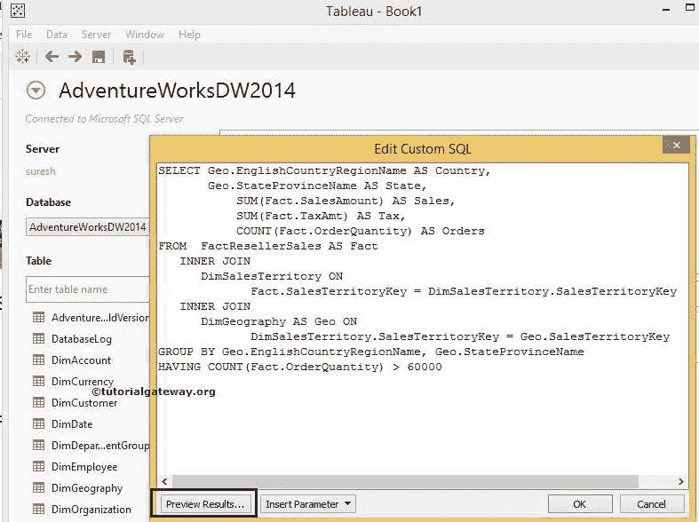

我们在上面截图中使用的自定义 SQL 查询是:

```
-- Custom SQL Query to retrieve Data from SQL Server in Tableau 
SELECT Geo.EnglishCountryRegionName AS Country, 
       Geo.StateProvinceName AS State, 
       SUM(Fact.SalesAmount) AS Sales, 
       SUM(Fact.TaxAmt) AS Tax, 
       COUNT(Fact.OrderQuantity) AS Orders
FROM FactResellerSales AS Fact
  INNER JOIN
     DimSalesTerritory ON 
        Fact.SalesTerritoryKey = DimSalesTerritory.SalesTerritoryKey 
  INNER JOIN
     DimGeography AS Geo ON 
        DimSalesTerritory.SalesTerritoryKey = Geo.SalesTerritoryKey
GROUP BY Geo.EnglishCountryRegionName, Geo.StateProvinceName
HAVING COUNT(Fact.OrderQuantity) > 60000

```

注意:不要担心上面的 SQL 查询，了解编写自定义查询的过程。但是，如果你想了解，请阅读我们的 [SQL Server](https://www.tutorialgateway.org/sql/) 教程

单击预览结果后..按钮，一个名为视图数据的新窗口将打开，以查看自定义 SQL 查询结果

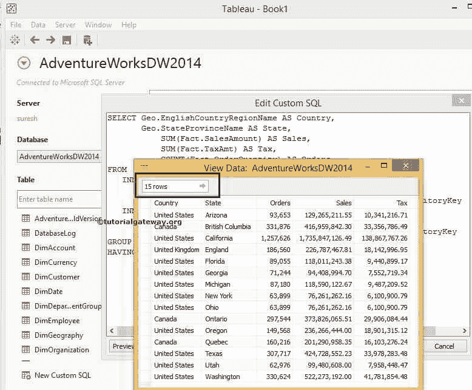

请参考下图截图，了解不同区域。我们将使用另一篇文章来讨论连接部分。

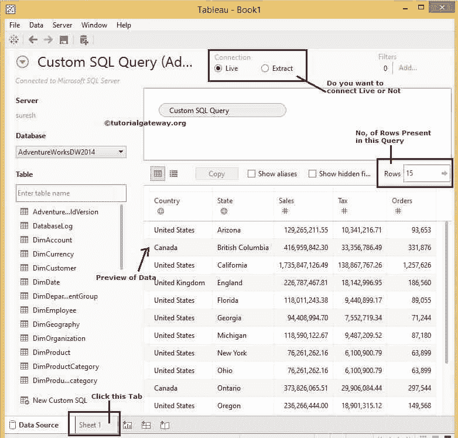

完成数据审查后，单击表 1 设计 Tableau 报告

1.  数据:这将显示当前连接的数据源列表。我们现在只有一个。否则，它会显示所有可用的数据源。
2.  维度:包含字符串数据的列将放在维度部分下
3.  度量:包含数字数据或度量值的列将放在度量部分下
4.  在这里，我们通过拖动度量和维度来设计 Tableau 报告

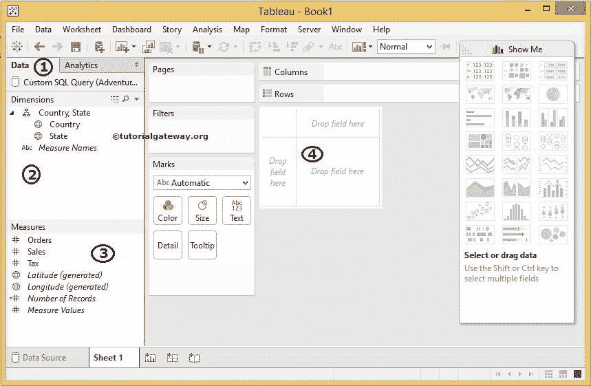