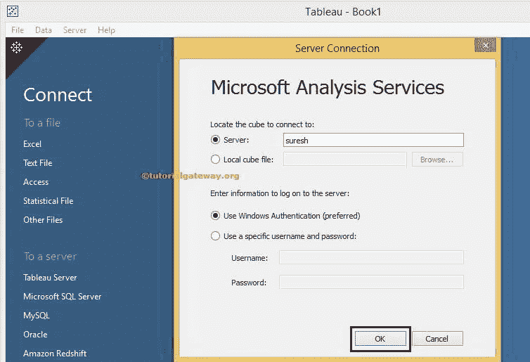
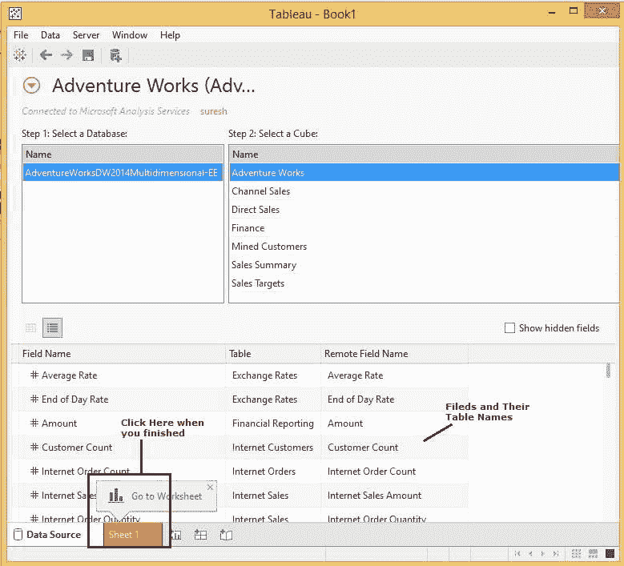

# 将 Tableau 连接到微软分析服务

> 原文：<https://www.tutorialgateway.org/connecting-tableau-to-microsoft-analysis-services/>

在本文中，我们将向您展示将 Tableau 连接到微软分析服务所涉及的步骤。此外，通过一个例子说明如何将多维数据集中的数据用作 Tableau 数据源。

## 将 Tableau 连接到微软分析服务所涉及的步骤

如果你还没有启动 Tableau，双击 Tableau 桌面打开。打开后，如下图所示

首先，在[表](https://www.tutorialgateway.org/tableau/)连接到服务器部分下，请选择微软分析服务选项

选择微软分析服务选项后，将打开一个新窗口来配置服务器连接。

*   服务器:请指定实例名以连接[微软分析服务](https://www.tutorialgateway.org/ssas/)。
*   本地立方体文件:如果[立方体](https://www.tutorialgateway.org/create-olap-cube-in-ssas/)文件在你的文件系统中，选择这个选项。
*   输入登录到服务器的信息:使用此部分决定如何连接到 Microsoft Analysis Services。如果要使用当前的 windows 登录凭据，请选择“使用 Windows 身份验证”选项。否则，请选择使用特定用户名和密码选项，并指定访问 SQL Server 的凭据(用户名和密码)。

现在，我们只使用我们自己的实例并点击确定按钮

如果要从本地硬盘中选择多维数据集文件，请选择“本地多维数据集文件”选项。选择此选项后，浏览按钮将使我们能够浏览整个文件系统，如下所示。你可以从微软官方下载中心下载这个立方体。

点击确定按钮后，会出现下面的截图。在开始创建报告之前，请了解以下选项

1.  此部分将显示我们用来连接微软分析服务的实例名。
2.  选择数据库:此部分将显示可用于该实例的 Microsoft Analysis Services 数据库列表。
3.  选择多维数据集:此部分将显示选定的 Microsoft 分析服务数据库中存在的多维数据集列表。
4.  此区域显示选定多维数据集中可用的度量和维度。

在数据库部分，我们必须选择该实例中可用的所需数据库。在本例中，我们只有一个数据库，因此我们选择了 AdventureWorksDW2014 多维数据库。

在“选择多维数据集”部分，我们必须选择所选数据库中可用的所需多维数据集。在这个例子中，我们选择了冒险作品立方体。选择所需的多维数据集后，区域 4 将显示该多维数据集中可用的度量和维度。

注意:不要担心立方体、维度等。尝试理解从 Tableau 连接微软分析服务的过程。但是，如果您对学习感到兴奋，请阅读我们的 [SQL Server 分析服务](https://www.tutorialgateway.org/ssas/)教程

完成数据审查后，单击表 1 设计表报告

1.  数据:这将显示当前连接的数据源列表。我们现在只有一个。否则，它将显示所有可用的数据源。
2.  维度:我们在 SQL Server Analysis Services 中创建的所有[维度](https://www.tutorialgateway.org/create-dimension-in-ssas/)、自然层次结构和用户层次结构都将放在维度部分下
3.  度量:您可以在“度量”部分下放置带有数值数据或度量值的列
4.  这是我们通过拖动度量和维度来设计 Tableau 报告的地方

