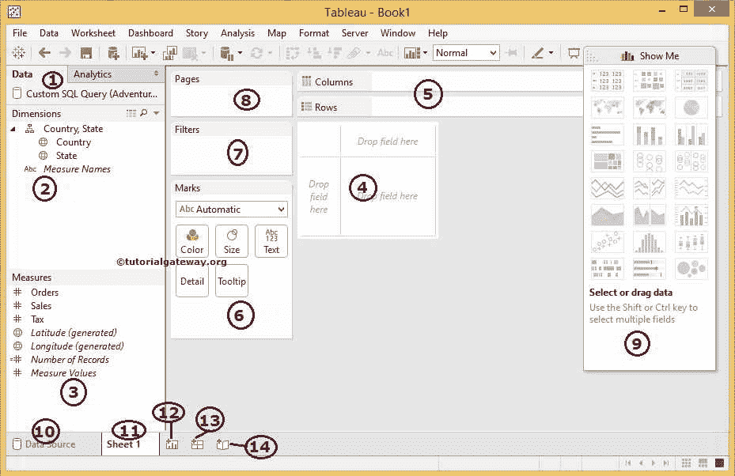
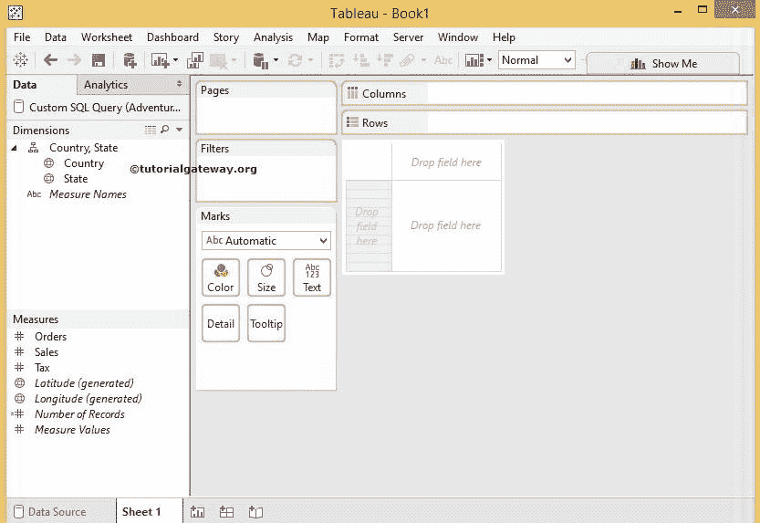
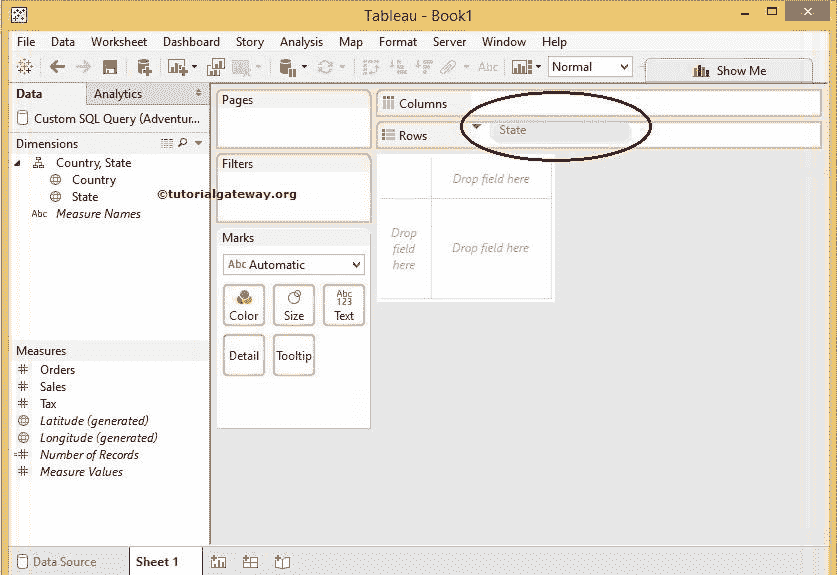
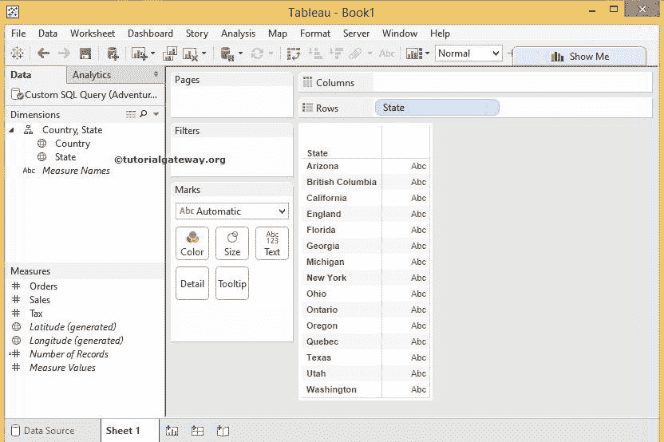
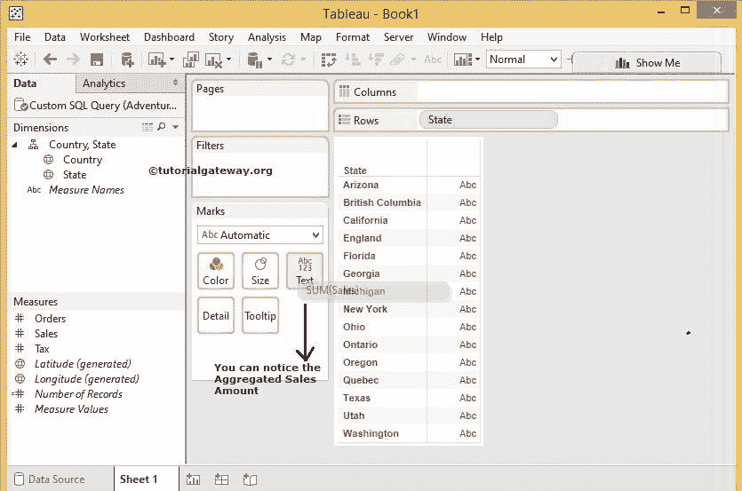
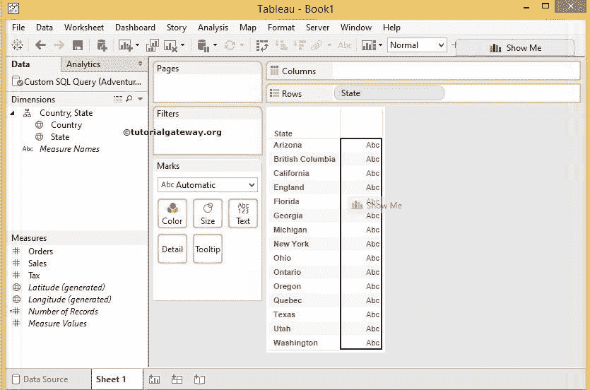
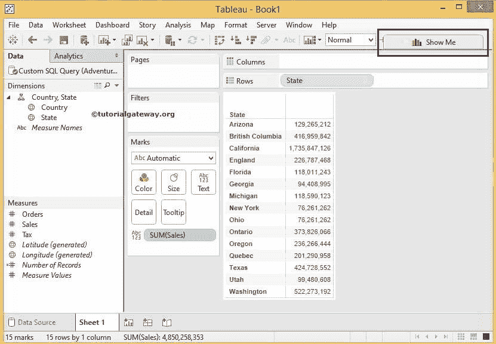
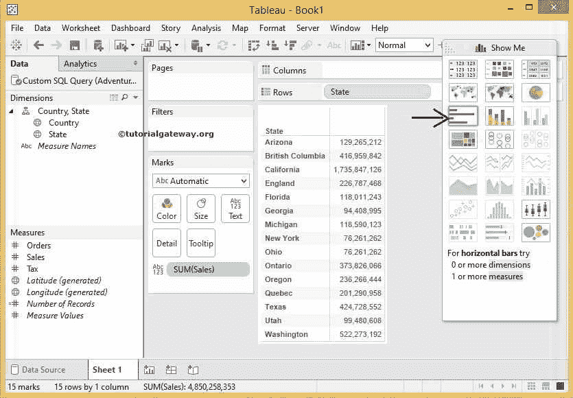
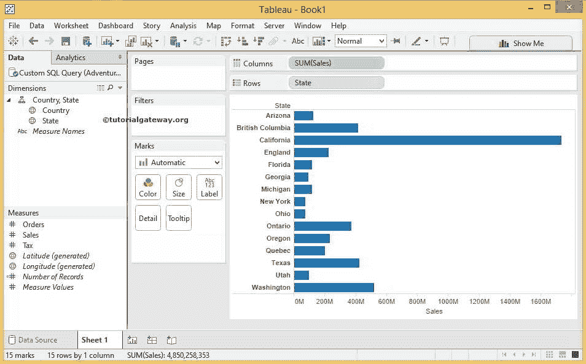

# 表报告

> 原文：<https://www.tutorialgateway.org/tableau-reports/>

在本文中，我们将展示如何使用微软 SQL Server 数据库作为数据源，在新版本的 Tableau 中创建 Tableau 报表。对于这个表报告，我们将使用我们在上一篇文章中创建的数据连接。

请参考[连接 Tableau 到 SQL Server](https://www.tutorialgateway.org/connecting-tableau-to-sql-server/) 文章了解数据源和 [Tableau](https://www.tutorialgateway.org/tableau/) 数据集。

在我们开始创建第一个 tableau 报表之前，让我们了解一下报表设计中存在的不同区域。

1.  数据:这将显示当前连接的数据源列表。我们现在只有一个。否则，它会显示所有可用的数据源。
2.  维度:在表报告中，将带有字符串数据的列放在维度部分下
3.  度量:将带有数字数据或度量值的列放在度量部分下
4.  这是我们通过拖动度量和维度来设计 Tableau 报告的地方
5.  列或行:这是我们根据要求放置度量和维度的区域。
6.  标记:使用此部分，我们可以更改颜色、大小、公制值。我们还可以为 tableau 报告添加工具提示。
7.  过滤器:在该区域放置一个字段来过滤表报告中的。
8.  页面:表报告预览将使用此页面卡中的字段分为不同的页面。
9.  演示:此区域将显示给定数据可用的可视化效果或图表
10.  数据源:此选项卡用于创建新数据源或编辑现有数据源
11.  表 1:这是我们目前正在制作的表
12.  此按钮用于创建新工作表
13.  该按钮将用于创建新的[仪表板](https://www.tutorialgateway.org/create-a-dashboard-in-tableau/)
14.  使用此按钮创建新的[故事](https://www.tutorialgateway.org/create-story-tableau/)

### 在表报告中放置列

当我们选择“州”列时，所有可用的区域都将高亮显示。这意味着我们可以在任何突出显示的区域中放置一个状态列。在这个 Tableau 报告示例中，我们将 State 列放在 Row 部分，我们可以通过两种方式实现:

方法 1:将“状态”列从“维度”区域拖到“表报表”区域。从下面的截图中，可以看到行字段用蓝色突出显示。

方法 2:将“状态”列从“维度”区域拖到“行”部分。请注意，蓝色向下箭头表示状态维度的位置。选择任何一种方法

一旦我们放置了状态列和销售指标值，报告区域就会显示表报告，如下所示。

### 将度量值放在表报告中

接下来，我们必须添加度量或数值来进行分析，我们可以通过两种方式来完成:

选项 1:将销售度量从度量区域拖到标记区域的文本区域。从下面的截图中，可以看到突出显示的文本区域。

选项 2:将销售度量从度量区域拖到表报告区域。在下面的屏幕截图中，Abc 行字段边框用纯黑色突出显示，并显示“演示”文本。选择任一选项

一旦我们放置了状态列和销售指标值，报表区域就会显示如下所示的表报表。

### 在表报告中显示

观察右上角，有一个 Show Me 按钮，这是 Tableau 中最导入最有用的一个。或者说，[显示给我看](https://www.tutorialgateway.org/tableau-show-me/)按钮让 Tableau 开发人员的生活变得轻松。我们将在接下来的文章中进行更多探索，但目前，请点击

按钮

单击“演示”按钮后，将显示一个下拉窗口，其中包含可用的图表。虽然有许多图表，但只有少数是活动的，其余的是灰色的，因为 Tableau Desktop 将分析我们的表报告并显示可能性。为了演示，我们选择[数据栏](https://www.tutorialgateway.org/bar-chart-in-tableau/)，如下图

一旦我们选择，我们的表报告将自动转换为表数据栏，如下所示。

