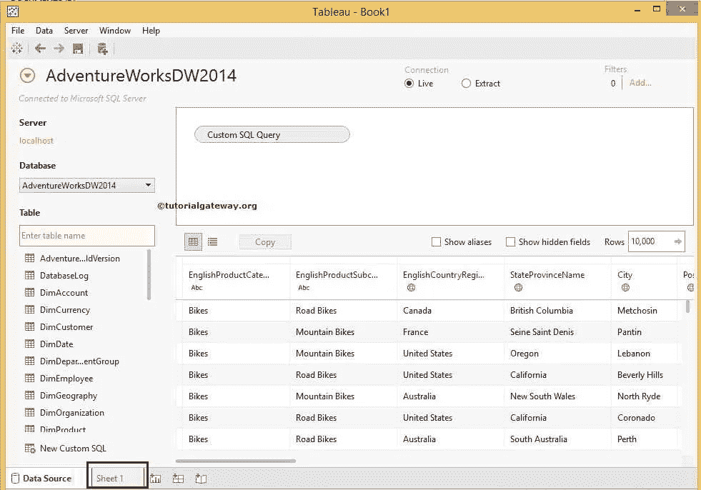
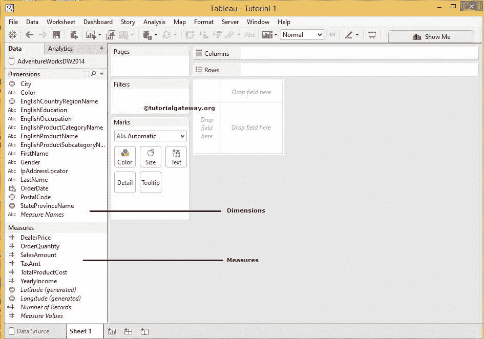
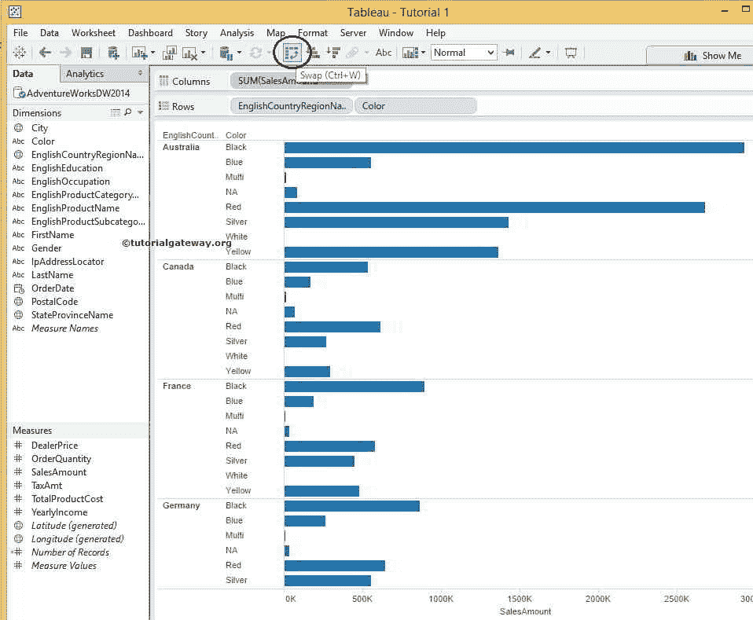
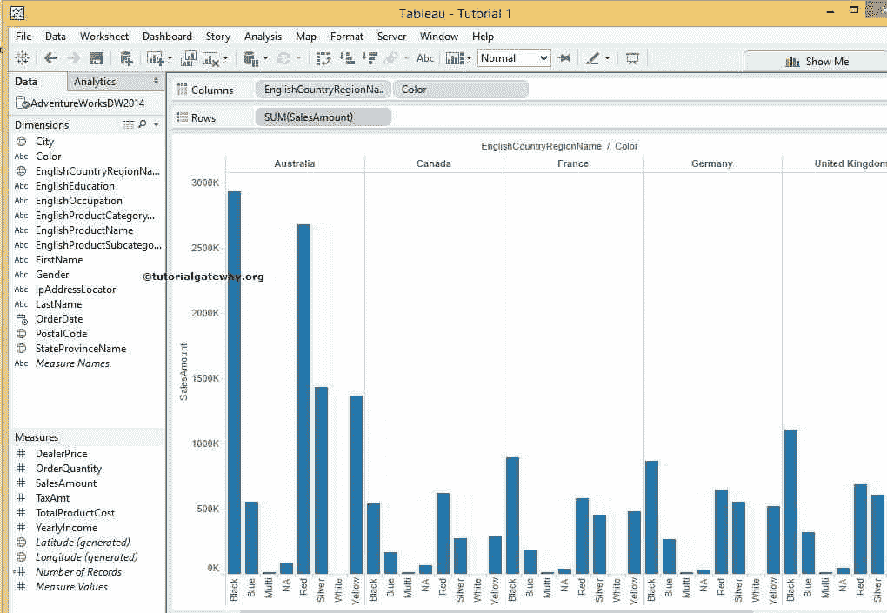
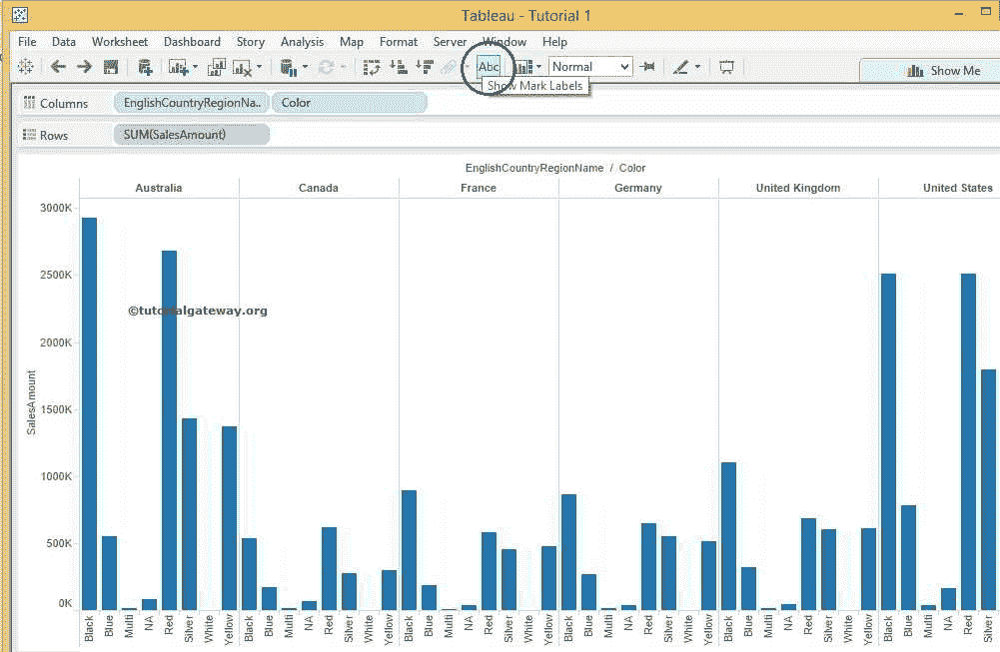
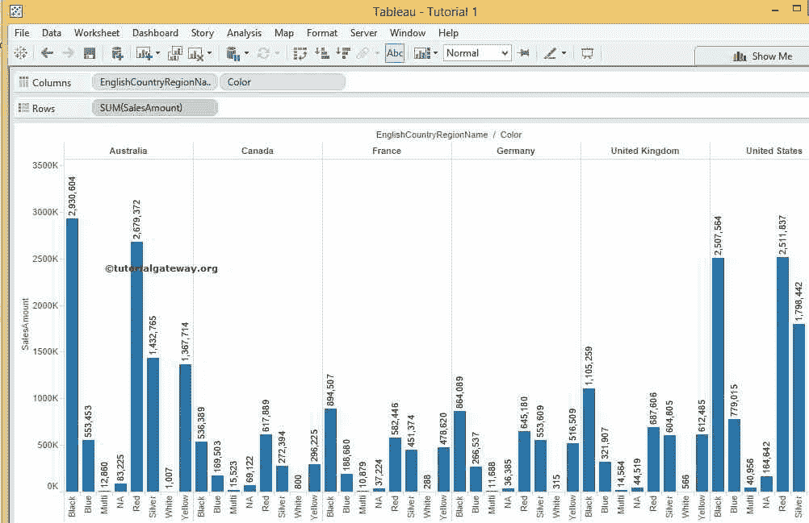
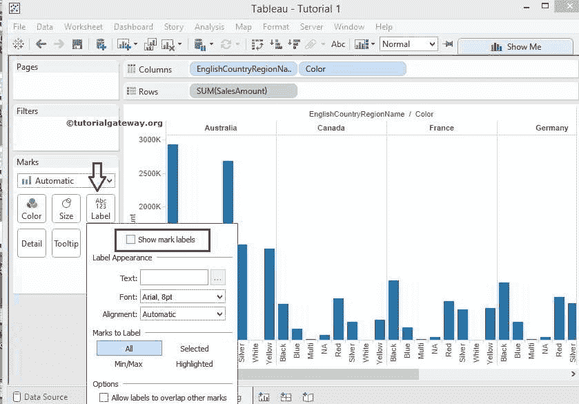
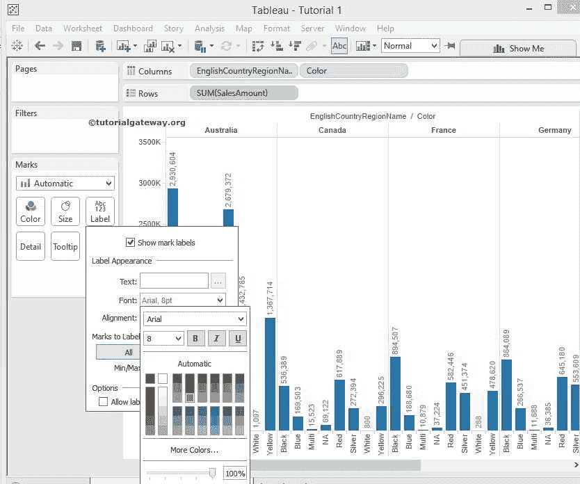

# Tableau 报告中的数据标签

> 原文：<https://www.tutorialgateway.org/data-labels-in-tableau-reports/>

Tableau 报表或任何其他商业智能报表中的数据标签在理解报表数据方面起着至关重要的作用。例如，通过查看条形图或饼图，我们可以轻松了解哪个国家的销售额高于另一个国家。然而，我们看不到每个国家做了多少销售(在数量上)。在这些情况下，我们可以在国家/地区启用数据标签。

在本文中，我们将通过示例展示如何在 tableau 报表中添加数据标签？。为此，我们将使用 SQL Server 数据源。所以，请访问[连接 Tableau 到 SQL Server](https://www.tutorialgateway.org/connecting-tableau-to-sql-server/) 文章了解连接过程。



我们在上面的数据源中使用的自定义 SQL 查询是:

```
SELECT ProdCat.EnglishProductCategoryName, 
       ProdSubCat.EnglishProductSubcategoryName, 
       Geo.EnglishCountryRegionName, 
       Geo.StateProvinceName, 
       Geo.City, 
       Geo.PostalCode, 
       Geo.IpAddressLocator, 
       Prod.EnglishProductName, 
       Prod.Color, 
       Prod.DealerPrice, 
       Cust.FirstName, 
       Cust.LastName, 
       Cust.Gender, 
       Cust.YearlyIncome, 
       Cust.EnglishEducation, 
       Cust.EnglishOccupation, 
       Fact.OrderQuantity, 
       Fact.TotalProductCost, 
       Fact.SalesAmount, 
       Fact.TaxAmt, 
       Fact.OrderDate
FROM DimProductSubcategory AS ProdSubCat
   INNER JOIN
     DimProduct AS Prod ON ProdSubCat.ProductSubcategoryKey = Prod.ProductSubcategoryKey 
   INNER JOIN
     DimProductCategory  AS ProdCat ON ProdSubCat.ProductCategoryKey = ProdCat.ProductCategoryKey 
   INNER JOIN
     FactInternetSales AS Fact ON Prod.ProductKey = Fact.ProductKey 
   INNER JOIN
     DimCustomer AS Cust ON Fact.CustomerKey = Cust.CustomerKey
   INNER JOIN
     DimGeography AS Geo ON Cust.GeographyKey = Geo.GeographyKey
```

注意:不要担心我们在上面的陈述中使用的代码和[连接](https://www.tutorialgateway.org/sql-joins/)。也许你应该专注于数据标签。但是，如果您有兴趣学习 SQL Server，请访问我们的 [SQL 教程](https://www.tutorialgateway.org/sql/)页面。

提示:这是查询，我们将用于其余的 [Tableau 教程](https://www.tutorialgateway.org/tableau/)

下面截图会显示，数据源



的度量和维度

在我们开始启用数据标签之前，我们将向您展示如何交换行和列，或者翻转图表。为此，请单击我们在下面标记的按钮。



点击该按钮后，您可以注意到图表被交换或翻转，如下图所示



## 在Tableau 报告中添加数据标签的方法 1

第一种方法，点击[表](https://www.tutorialgateway.org/tableau/)工具栏中的 Abc 按钮。从下面的截图可以观察到，当你悬停在 Abc 按钮上时，它会显示工具提示【显示标记标签】



点击 Abc 按钮后，数据标签将显示在报告中，如下图所示



## 在Tableau 报告中添加数据标签的方法 2

第二种方法，点击标记卡中的 Abc 标签按钮。从下面的截图中，观察当我们点击 Abc 标签按钮时，将显示一个下拉窗口。

从下拉窗口中，请选中以标记“显示标记标签”选项，从而在Tableau 报告中启用数据标签。



通过使用此下拉窗口，我们还可以设置Tableau 报告中数据标签的文本、颜色和对齐方式的格式。从下面的截图，看到我们改变了颜色。

